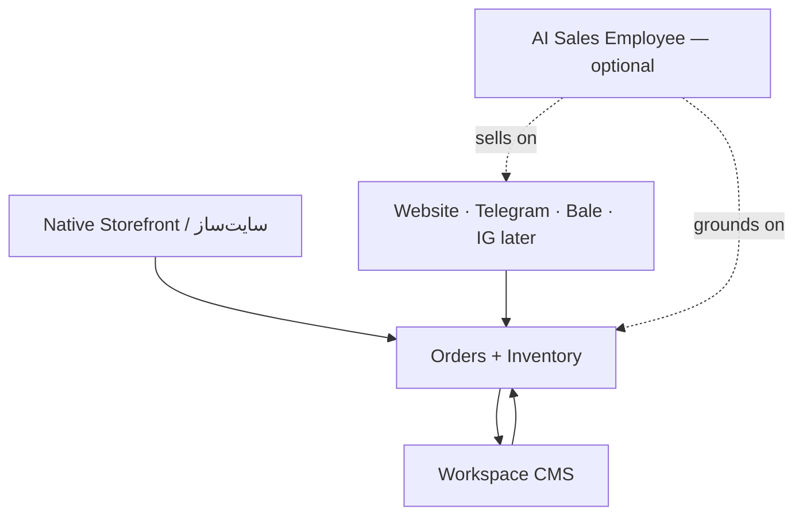

# Product Positioning Decision

## Metadata

| Field | Value |
|-------|-------|
| **Version** | 1.0 |
| **Status** | Active — supersedes prior “AI-first / not a website builder” identity statements |
| **Owner** | Founder / Product |
| **Last Updated** | August 10, 2026 |
| **Authority** | When other docs conflict with this file on *product identity*, this file wins until revised |

**Related:** [Product Vision](../02-product/product-vision.md) · [Product Scope](../02-product/product-scope.md) · [Vision (company)](./vision.md) · [Pricing Strategy](../01-business/pricing-strategy.md) · [Go-To-Market](../01-business/go-to-market.md)

---

## Decision (one sentence)

**Seloma is a unified online commerce platform for Iranian shops: one native storefront (سایت‌ساز / ویترین) plus multi-channel selling and one Workspace to manage catalog, orders, and conversations — so the shop manager is not lost across tools. The AI Sales Employee is an optional paid add-on for merchants who want automation on top of that same commerce truth.**

---

## Why this change

Previous docs framed Seloma primarily as an **AI Sales Employee / Commerce OS** and explicitly said we are **not** a website builder. Founder direction (Aug 2026):

1. **Primary commercial focus:** سایت‌ساز / ویترین بومی — the product a merchant buys first.
2. **Primary product job:** Unification — sale from website, Telegram, Bale, Instagram (when ready) is trackable and manageable in **one** product.
3. **AI Employee:** Sell inside the offer when the merchant needs it; do **not** make AI the only story or the only path to value.
4. **Avoid manager confusion:** One catalog, one order book, one inbox story — not “another AI tool beside their shop.”

---

## Product hierarchy

| Layer | Role | Merchant framing (FA) |
|-------|------|------------------------|
| **1. Native Storefront + CMS** | Primary product | سایت‌ساز / فروشگاه آنلاین Seloma |
| **2. Unified commerce ops** | Core value | سفارش، موجودی، کانال‌ها — همه در یک Workspace |
| **3. Channels** | Reach | وب، تلگرام، بله (+ اینستاگرام وقتی آماده) روی همان کاتالوگ و سفارش |
| **4. AI Sales Employee** | Optional add-on | کارمند فروش هوش مصنوعی — وقتی بخواهند، روی همان داده |

---

## What we still refuse

| Still out | Why |
|-----------|-----|
| Drag-drop page IDE / theme marketplace as identity | We ship an opinionated Digikala-like storefront + CMS, not Webflow |
| CRM / helpdesk as system of record | Escalation and inbox support commerce; we don’t become Zendesk |
| Chatbot builder blank canvas | AI add-on stays opinionated Skills + guardrails |
| Black-box autonomy | Guardrails and handoff remain required when AI is enabled |

---

## Doc update rule

- New PRDs, landing copy, pricing cards, and sprint goals must treat **storefront + unified order ops** as the default wedge.
- AI features ship as **add-on packages** with consultative pricing until list prices exist.
- Architecture docs that describe the AI Runtime remain valid for the add-on; they must not redefine company identity as “AI-only.”

---

## Landing / commercial packaging

| Offer | Pricing posture |
|-------|-----------------|
| سایت‌ساز (annual plans) | Published IRR list — primary SKU |
| کارمند فروش AI | Consultative / “هماهنگی” until validated |

See `apps/web/src/lib/api.ts` (`SITE_BUILDER_PLANS`, `AI_EMPLOYEE_PLANS`).
