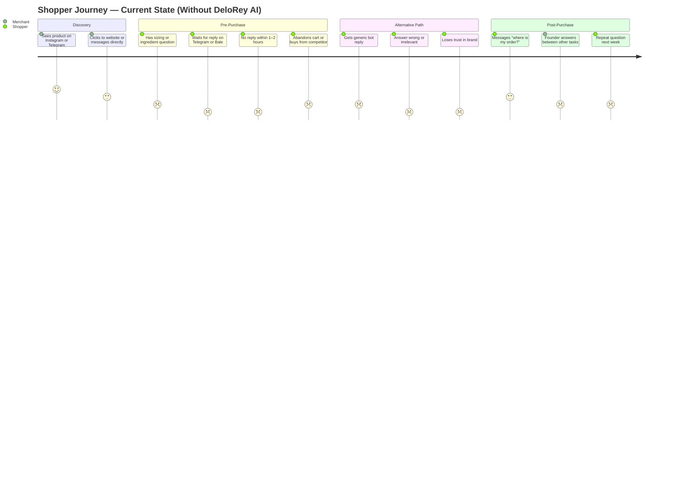
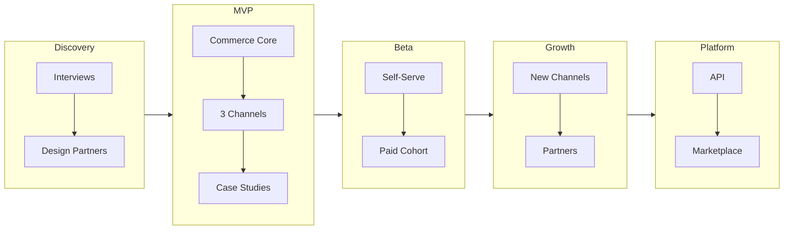
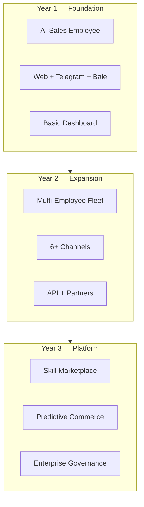

# Business Plan

---

## Metadata

| Field | Value |
|-------|-------|
| **Version** | 0.2 |
| **Status** | Draft — pending Founder, CTO, and Product review |
| **Owner** | Founder |
| **Last Updated** | August 10, 2026 |
| **Related Documents** | [Vision](../00-overview/vision.md) · [Product Positioning](../00-overview/product-positioning.md) · [Lean Canvas](../00-overview/lean-canvas.md) · [Roadmap](../00-overview/roadmap.md) · [Glossary](../00-overview/glossary.md) · [Product Moat](./product-moat.md) |

---

# Executive Summary

DeloRey is a **unified commerce platform** for Iranian online shops: a **native storefront (سایت‌ساز)** plus multi-channel selling and **one Workspace** so orders and catalog stay coherent whether the buyer came from the website, Telegram, Bale, or later Instagram. It is not a CRM, helpdesk, chatbot builder, or free-form page-builder IDE. The **AI Sales Employee** is an **optional add-on** sold to merchants who want automation on top of that same commerce truth — not the only path to product value.

**Why it exists:** SMB shop managers are lost across tools — site here, messaging elsewhere, orders in spreadsheets. They lose revenue to silence and fragmentation. DeloRey closes that gap with one shop + ops hub, and offers grounded AI when the merchant needs coverage without hiring a night shift.

**Who it serves:** SMB online merchants (fashion, cosmetics, accessories, electronics, home, gifts / D2C) who need a coherent place to sell online and via messaging. Buyer: founder or head of e-commerce. Daily users: store managers and support leads.

**Why now:** Messaging-first buying is already how Iranian shoppers behave; native storefront + channel adapters can meet them without five vendors. AI quality is good enough to *optionally* automate answers — but only when grounded in the same catalog the shop already runs in DeloRey. See [Product Positioning](../00-overview/product-positioning.md).

---

# Problem Statement

## Current Market Problems

Iranian online shops operate on a fragmented stack: storefront, Instagram presence, Telegram channel, Bale bot, and informal spreadsheets for inventory exceptions. Product knowledge lives in catalog listings, PDF size charts, and the founder's head. No single system connects "customer asked about shipping to Shiraz at 11 PM on Telegram" to "abandoned cart on the website two hours earlier."

Three structural failures repeat across verticals:

1. **Revenue lost to silence** — Shoppers abandon purchases when sizing, compatibility, payment, or delivery questions are not answered before intent cools. Industry-wide cart abandonment rates are commonly cited in the 60–70% range globally; we treat that as directional context, not a DeloRey-specific measurement. Our assumption — to be validated in merchant interviews — is that a meaningful share of abandonment in question-heavy categories (fashion, cosmetics, electronics) is driven by unanswered pre-purchase questions, not price alone.

2. **Support that does not scale** — The same 15–20 questions (return policy, authenticity, delivery time, size fit) are answered manually, repeatedly, across channels. Adding one human per channel is economically unrealistic for SMB merchants.

3. **Tools that solve the wrong job** — Live chat tools optimize for human agents and ticket closure. Chatbot builders optimize for conversation design, not catalog accuracy. CRMs optimize for pipeline stages, not same-session conversion. None treat every inbound message as a commerce event with measurable revenue potential.

## Current Customer Journey

A typical journey for a fashion or cosmetics shopper in the initial target market:



## Operational Pain

| Pain | Manifestation | Who feels it |
|------|---------------|--------------|
| **Channel switching** | Staff copy-paste policies between web widget, Telegram, and Bale | Support user, founder |
| **Founder bottleneck** | Only the founder knows exceptions (pre-order items, custom engraving, regional shipping) | Entire business |
| **No attribution** | Merchants cannot tie a Telegram conversation to a completed order | Founder, marketing |
| **Reactive-only mode** | No systematic follow-up on abandoned carts or stalled conversations | Revenue owner |
| **Insight buried in chat** | Objections about fit, battery life, or ingredients never reach product decisions | Product, founder |

## Lost Sales

Lost sales in this context are not primarily competitive losses — they are **latency and accuracy losses**. A shopper ready to buy asks whether the 128 GB variant is available; the message sits unread until the next morning. A chatbot replies with outdated stock information. A human answers correctly but only on one channel while the same customer asked on another. DeloRey AI targets recoverable revenue from faster, accurate, omnichannel responses and eventual proactive recovery workflows — with attribution built in so merchants see the impact.

## Support Challenges

Support is treated as a cost center because tools frame it that way. Merchants hire for coverage, not conversion. They measure tickets closed, not purchases assisted. Escalation paths are ad hoc — a angry customer on Bale gets a different experience than on web chat. Training new staff requires weeks of product knowledge transfer that the platform should already hold in a Knowledge Base synced to the storefront.

---

# Market Opportunity

## Why AI Commerce / Commerce OS Is Growing

Commerce conversations are shifting from email and phone to asynchronous messaging — a trend visible globally and acute in messaging-first markets. Large language models made fluent dialogue cheap, but **fluent wrong answers** are worse than silence for product-critical categories. The next wave is not "chatbots everywhere" — it is a **Commerce OS**: context-grounded AI Employees connected to catalog, cart, and orders, with Skills, Guardrails, and human handoff. Platforms that integrate deeply with commerce stacks and measure revenue outcomes will compound advantage through permissioned conversation data, objection patterns, and attribution graphs — not through model size alone.

## Digital Commerce Trends (Relevant to DeloRey AI)

| Trend | Relevance to DeloRey AI |
|-------|-------------------------|
| **Messaging-first shopping** | Telegram and Bale are primary sales and support surfaces for many Iranian D2C brands — not optional add-ons |
| **D2C brand proliferation** | More SMBs sell direct online with limited ops headcount |
| **AI expectations rising** | Shoppers expect instant answers; merchants fear brand damage from wrong AI |
| **Stack fragmentation** | Storefront, messaging, and analytics remain disconnected — a Commerce OS / integration layer has value |
| **ROI scrutiny on SaaS** | SMB buyers renew only when tools show measurable revenue or hours saved |

*Note: We do not cite specific market-size figures for the global AI customer service or chatbot markets here. Those numbers vary widely by source and are not necessary to justify our initial wedge. Our opportunity sizing starts from reachable SMB merchants in the initial geography, not top-down TAM slides.*

## Iranian Market Opportunity

**Assumption (to validate):** Thousands of active online shops in fashion, cosmetics, accessories, electronics, home goods, and gifts operate with Telegram and/or Bale as customer-facing channels, Shopify or WooCommerce (or local equivalents with exportable catalog data), and no 24/7 human coverage.

**Structural advantages for a regional-first entrant:**

- **Channel fit** — Global live chat vendors optimize for web widget and English-first support. Bale in particular has weak coverage from international SaaS incumbents.
- **Language** — Persian commerce dialogue requires accurate handling of colloquial questions, regional shipping terms, and product attributes; generic English-first bots fail when translated or bolted on.
- **Buyer behavior** — Customers already expect to complete purchase journeys inside messaging apps; an AI Employee that meets them there with catalog-grounded answers matches existing behavior.
- **SMB density** — Large number of small brands competing on service and trust, not only price — fast accurate answers differentiate.

**What we will not claim without evidence:** Total addressable market in USD, exact number of online shops, or national e-commerce GMV. Phase 0 merchant interviews and channel behavior audits will ground sizing.

## Future Expansion Opportunity

### Geographic and platform expansion

The same architecture — AI Employee Runtime, Context Engine, Commerce Core, Skills, omnichannel adapters — extends beyond Iran:

1. **MENA and diaspora** — WhatsApp and Instagram-heavy D2C brands with identical pain (slow DMs, no commerce grounding).
2. **Vertical editions** — Fashion sizing, electronics compatibility, cosmetics ingredients — pre-trained objection libraries per vertical.
3. **Platform layer** — APIs, Skill Marketplace, multi-brand enterprise — once MVP and Beta prove retention and unit economics.

Expansion follows proof: Persian-speaking SMB online commerce first, then adjacent markets where messaging-first workflows and integration depth are the differentiators, not localized UI alone.

### Market evolution — industry expansion

Online commerce is the **primary ICP and initial wedge**. The underlying AI Employee architecture is **industry-agnostic**: businesses in any vertical need roles that sell, support, schedule, fulfill, and operate — powered by shared Context, Memory, Skills, and Guardrails. Commerce proves the model; Services and Enterprise expand the TAM.

| Phase | Market | Focus | Examples |
|-------|--------|-------|----------|
| **Phase 1** | **Online Commerce** (primary) | Catalog-grounded selling and support on web + messaging | Fashion, cosmetics, electronics, accessories, gift shops, home products |
| **Phase 2** | **Service Businesses** | Appointment, inquiry, and policy-aware AI Employees | Clinics, dentists, law firms, real estate, education, gyms, beauty salons, insurance, travel agencies |
| **Phase 3** | **Enterprise Companies** | Multi-brand / multi-department AI Employee fleets with governance | Retail groups, multi-location operators, large service networks |


**Phase 1 — Online Commerce:** Prove that AI Employees recover revenue and reduce support load when grounded in live products, orders, and policies. This is the only market in MVP and Beta scope.

**Phase 2 — Service Businesses:** Reuse the same Runtime and Skills pattern for inquiry handling, booking, FAQ, and follow-up — swapping Commerce Core connectors for industry data (schedules, services, policies) rather than rebuilding the OS.

**Phase 3 — Enterprise Companies:** Multi-workspace governance, custom Skills, SSO, SLAs, and composed teams of AI Employees across departments. Enterprise is a later expansion, not an early distraction from the commerce wedge.

---

# Customer Segments

## Primary ICP (Ideal Customer Profile)

**Phase 1 — Online Commerce** remains the only ICP for MVP and Beta. Service businesses and enterprise are future expansion markets (see [Market evolution](#market-evolution--industry-expansion)).

| Attribute | Definition |
|-----------|------------|
| **Business type** | D2C or small multi-brand online shop |
| **Verticals** | Fashion, cosmetics, accessories, mobile & electronics, home products, gift shops |
| **GMV (assumption)** | Mid six-figures to low seven-figures USD equivalent annual online revenue — exact band validated in discovery |
| **Catalog** | 50–5,000 SKUs with non-trivial pre-purchase questions |
| **Channels** | Active website plus Telegram and/or Bale |
| **Team** | 2–20 people; no dedicated 24/7 support team |
| **Stack** | Shopify, WooCommerce, or comparable with extractable catalog and order data |
| **Pain signals** | Visible cart abandonment, multi-hour response times on messaging, founder as support bottleneck |

## Secondary ICP

| Attribute | Definition |
|-----------|------------|
| **Business type** | Small marketplace sellers or Instagram-first brands adding formal storefront |
| **Verticals** | Same as primary, plus specialty food/gift seasonal shops |
| **Stage** | Post-PMF on product; scaling traffic without scaling headcount linearly |
| **Trigger** | Failed experiment with generic chatbot; hiring first support hire feels too expensive |

## Early Adopters

- Growth-stage D2C brands already using Telegram/Bale for sales but drowning in message volume.
- Shop owners who tried a generic chatbot and disabled it due to wrong answers or zero sales impact.
- Operators who track revenue per channel and will pay if ROI is provable within 30 days.
- Design partners willing to run a 30-day concierge pilot with shared metrics.

## Non-Target Customers (MVP)

| Segment | Why not now |
|---------|-------------|
| **Enterprise retail chains** | Require SSO, custom SLAs, multi-brand governance — Phase 3 / Platform |
| **Service businesses** (clinics, law, real estate, etc.) | Valid Phase 2 expansion; Architecture supports them, but MVP proves commerce wedge first |
| **Pure marketplace operators** | Different workflow (multi-seller) — not MVP scope |
| **Businesses without online catalog** | Commerce Core requires syncable product and order data |
| **Merchants wanting arbitrary chatbot flows** | DeloRey AI is a Commerce OS with opinionated AI Employees, not a bot builder |
| **Shops with no messaging channel activity** | MVP value proposition is omnichannel; web-only with no chat volume is weak fit |
| **Agencies as primary buyer** | Partner channel comes after product stability |

## Persona Tables

### Buyer Persona — "Sara, Founder-CEO"

| Dimension | Detail |
|-----------|--------|
| **Role** | Founder / CEO of a 5–15 person online fashion or cosmetics brand |
| **Age** | 32–42 |
| **Goals** | Increase conversion, recover abandoned revenue, reduce founder time in Telegram without hurting brand trust |
| **Daily reality** | Checks Bale notifications between supplier calls; knows every product exception personally |
| **Fears** | AI stating wrong fabric content or return policy; paying for another tool with no ROI proof |
| **Decision criteria** | Time-to-value under 24 hours, revenue attribution, guardrails, WooCommerce/Shopify integration |
| **Budget authority** | Will pay monthly subscription if payback visible within 1–2 months — exact price point validated, not assumed |

### User Persona — "Reza, Operations Lead"

| Dimension | Detail |
|-----------|--------|
| **Role** | Store manager or support lead |
| **Goals** | Fewer repetitive tickets, faster first response, clear escalation when AI is unsure |
| **Daily workflow** | Monitors web widget, Telegram, Bale; answers sizing and shipping questions; escalates refunds |
| **Frustrations** | Switching apps, re-explaining policies, no visibility into which chats drove sales |
| **Success metric** | AI handles majority of routine questions accurately; human only sees exceptions |

### End Customer Persona — "Neda, Online Shopper"

| Dimension | Detail |
|-----------|--------|
| **Behavior** | Discovers products on Instagram, asks questions on Telegram, may complete purchase on website |
| **Expectation** | Instant accurate answers about size, delivery to her city, and return options |
| **Drop-off trigger** | Wrong bot answer or no reply within a few hours |
| **DeloRey AI value** | Consistent answers across channels without repeating herself |

---

# Customer Pain Points

Prioritized by revenue impact and validation status from discovery hypotheses:

| Rank | Pain | Severity (1–5) | Frequency | Business Impact |
|------|------|----------------|-----------|-----------------|
| 1 | Unanswered or delayed pre-purchase questions | 5 | Daily | Direct cart abandonment and lost GMV |
| 2 | Repetitive manual FAQ responses across channels | 4 | Daily | Founder/support hours not spent on high-value work |
| 3 | Generic chatbots giving wrong product or policy info | 4 | Weekly (when deployed) | Brand trust erosion, worse than no bot |
| 4 | No link between conversations and purchases | 4 | Ongoing | Cannot justify support spend or tool ROI |
| 5 | Fragmented inbox (web + Telegram + Bale) | 3 | Daily | Slow responses, missed messages, duplicate work |
| 6 | Objections and product confusion invisible in analytics | 3 | Weekly | Wrong inventory buys, weak product pages |
| 7 | Post-purchase "where is my order?" volume | 3 | Daily | Support load without upsell opportunity |
| 8 | No proactive cart recovery tied to conversation context | 3 | Daily | Recoverable revenue left on table (post-MVP automation) |

---

# Value Proposition

## Core Value Proposition

**DeloRey AI is the Commerce OS that gives online shops AI Employees that sell and support customers on web chat, Telegram, and Bale — grounded in live catalog and order data, with measurable revenue impact and merchant-controlled guardrails.**

## Supporting Benefits

| Benefit | Description |
|---------|-------------|
| **Commerce OS, not another chatbot** | Operating layer for AI Employees — not a flow builder or helpdesk |
| **Commerce-native answers** | Responses reflect synced inventory, pricing, shipping zones, and return policies |
| **One brain, many channels** | Unified Customer Profile and conversation memory across web, Telegram, and Bale |
| **Revenue attribution** | Conversations linked to conversions and recoveries — not just tickets closed |
| **Human handoff by design** | Low-confidence and high-stakes cases escalate with full context |
| **Insight from dialogue** | Product Intelligence surfaces objections and friction without a separate BI tool |

## Emotional Value

- **Founder relief** — Stop being the 24/7 bottleneck on every channel.
- **Confidence** — Deploy AI without fear of brand damage through visible guardrails and audit logs.
- **Professional pride** — Offer enterprise-grade responsiveness as a small brand.

## Business Value

- Recover revenue currently lost to slow or missing replies.
- Increase conversion on assisted sessions versus unassisted browsing (hypothesis to measure in pilot).
- Reduce need to hire per-channel support as traffic grows.

## Time Value

- First live agent within 24 hours of store connection (MVP target).
- Support staff focus on exceptions, refunds, and relationship-building — not the 20th sizing question of the day.

## Financial Value

- Subscription cost justified when attributed recoveries and support hours saved exceed fee within 1–2 months (payback hypothesis — validated per cohort, not asserted as fact today).

---

# Product Strategy

## Why AI Employees Instead of Chatbots

Chatbots are built around conversation trees and generic intents. **AI Employees** are opinionated business roles with goals, Skills, and success metrics tied to outcomes. A Sales Employee recommends from live catalog, applies discount limits, and escalates refunds — it does not "handle intents." This matches how merchants think ("I need someone to sell on Telegram") rather than ("I need to design a flowchart"). Differentiation is specialization plus Commerce Core integration plus a reusable Skill layer — not a prettier widget.

### AI Employee roster — near term and long term

MVP focuses on a combined **Sales + Support** Employee for online commerce. Over time, businesses compose **teams of AI Employees** on the same Runtime:

| AI Employee | Role | Horizon |
|-------------|------|---------|
| **Sales Employee** | Pre-purchase Q&A, recommendations, upsell / cross-sell, order creation | MVP |
| **Support Employee** | Post-purchase status, policies, refunds, escalation | MVP / Growth |
| **Marketing Employee** | Campaigns, follow-ups, win-back, review requests | Growth |
| **Analytics Employee** | Objection taxonomy, demand signals, conversation intelligence | Growth |
| **Inventory Employee** | Stock awareness, low-stock alerts, availability answers | Platform |
| **Order Employee** | Order lifecycle actions, status orchestration, fulfillment updates | Platform |
| **Finance Employee** | Invoices, payment follow-ups, basic reconciliation queries | Platform |
| **Knowledge Employee** | Curates and serves business Knowledge Base across other Employees | Platform |
| **Operations Employee** | Cross-workflow routing, business-hours rules, internal ops | Platform |
| **HR Employee** | Internal Q&A on policies and onboarding (enterprise expansion) | Platform |
| **Custom Employees** | Partner- or merchant-defined roles built from Skills | Platform |

Businesses will eventually hire and compose these Employees like a virtual org chart — one control plane, shared Memory and Context, specialized Skills per role.

## Why Omnichannel

Iranian shoppers do not stay on one surface. They discover on Instagram, ask on Telegram, and checkout on the website — sometimes the reverse. Without omnichannel memory, every channel restart wastes time and kills conversion. DeloRey AI deploys one AI Employee Runtime with channel adapters; formatting adapts, business logic and Customer Profile do not. MVP focuses on web, Telegram, and Bale — the channels where initial ICP already operates.

## Why Context Engine

Clever prompts cannot substitute for knowing that the blue hoodie is out of stock in size M, that shipping to Isfahan takes three days, or that this customer ordered twice last month. The Context Engine assembles catalog, orders, policies, Knowledge Base retrieval, and conversation history before each reply. This is a core layer of the Commerce OS: integration depth and retrieval quality, not model brand.

## Why the AI Employee Runtime

Every AI Employee runs on the same conceptual **AI Employee Runtime**. RAG (retrieval into the Knowledge Base) is one grounding mechanism inside this stack — not the whole product. At a conceptual level:

```
LLM
 ↓
Prompt Builder
 ↓
Context Engine
 ↓
Memory
 ↓
Skill Engine
 ↓
Workflow Engine
 ↓
Guardrails
 ↓
Response Formatter
```

| Layer | Purpose (conceptual) |
|-------|----------------------|
| **LLM** | Language understanding and generation |
| **Prompt Builder** | Assembles role, tone, and task instructions for the Employee |
| **Context Engine** | Pulls live business data relevant to the current request |
| **Memory** | Conversation and Customer Profile continuity across turns and channels |
| **Skill Engine** | Invokes reusable Skills (search, recommend, refund, escalate, …) |
| **Workflow Engine** | Enforces multi-step policies and routing rules |
| **Guardrails** | Discount limits, blocked topics, confidence thresholds, approval gates |
| **Response Formatter** | Adapts output to channel (web widget, Telegram, Bale) |

This Runtime is what makes DeloRey AI an **operating system for AI Employees** rather than another chatbot wrapper. New industries and roles plug into the same pipeline by adding Skills and connectors — not by rebuilding conversation trees.

## Why Skills

Every AI Employee is powered by reusable **Skills** — capability units the Skill Engine can invoke under Guardrails.

**Sales Employee — example Skills:**

| Skill | What it does |
|-------|--------------|
| Product Search Skill | Finds products in live catalog |
| Recommendation Skill | Suggests items from grounded inventory |
| Discount Skill | Applies merchant-limited discounts |
| Coupon Skill | Issues or validates coupons within policy |
| Upsell Skill | Offers higher-value alternatives |
| Cross Sell Skill | Suggests complementary products |
| Order Creation Skill | Helps start or complete an order path |

**Support Employee — example Skills:**

| Skill | What it does |
|-------|--------------|
| Knowledge Search Skill | Retrieves policies and FAQs from the Knowledge Base |
| Refund Skill | Initiates or explains refunds within rules |
| Shipping Skill | Answers delivery zones, ETAs, and tracking |
| Escalation Skill | Hands off to humans with full context |

Skills make the platform **extensible**: partners and merchants can add Skills without redesigning Employees; the same Skill (e.g., Escalation) can be shared across Sales, Support, and future Operations Employees; and a Skill Marketplace becomes a natural Platform-phase growth engine. Extensibility comes from composing Skills — not from shipping a drag-and-drop chatbot builder.

## Why Knowledge Base

Store sync alone may not capture sizing PDFs, brand story, engraving rules, or seasonal exceptions. The Knowledge Base combines auto-synced commerce data with merchant overrides and document upload (PDF, text). Retrieval grounds answers in citable sources inside the Runtime; merchants audit what the Employee knows. Reduces hallucination on factual commerce questions — target under 5% on audited samples at MVP, tightening to 2% before full autonomy.

## Why Human Handoff

Autonomy is earned, not assumed. Merchants must override AI, approve high-value discounts, and handle emotional complaints. Handoff preserves context — order details, prior recommendations, confidence scores — so customers never repeat themselves. Trust is the product; black-box autopilot is a non-goal per our vision document.

---

# Competitive Landscape

DeloRey AI competes for **merchant budget and attention** against the status quo, local tools, live chat, helpdesk, bot builders, CRMs, and human teams — not always against a single SaaS SKU.

**Doing nothing is often the biggest competitor.** Most Iranian SMB shops already "solve" customer communication with Excel, manual Telegram replies, Instagram DMs, and the founder's phone. Switching costs are psychological and operational — not contractual. Winning means proving ROI against the status quo, not only against Intercom.

## Status Quo and Local Alternatives

| Alternative | Strengths | Weaknesses | DeloRey differentiation |
|-------------|-----------|------------|-------------------------|
| **Doing nothing / Excel + informal notes** | Free; familiar | No scale; knowledge siloed; zero attribution | Measurable revenue and hours saved; shared Knowledge Base |
| **Manual Telegram / Bale replies** | Personal; trusted | Hours of latency; founder bottleneck; no nights/weekends | 24/7 AI Employees with human handoff |
| **Instagram DM as primary inbox** | Where discovery happens | Fragmented; hard to ground in catalog; easy to miss messages | Omnichannel Memory + catalog-grounded Skills |
| **Human-only support** | Nuance and trust | Linear cost; inconsistent coverage; knowledge walks out | Handles routine volume; humans keep high-stakes cases |
| **Local CRM software** | Familiar language/pricing; contact records | Weak real-time messaging selling; rarely commerce-grounded | Conversation-as-commerce-event on live channels |
| **Local Telegram bots** | Cheap; channel-native | Brittle scripts; wrong answers; no Commerce Core | Skill-based Employees with live inventory and orders |
| **Persian chatbot providers** | Language fit; local sales | Often FAQ wrappers; thin product/order integration | Commerce OS Runtime, Skills, and revenue attribution |
| **Website agencies** | Build custom experiences | One-off projects; expensive to maintain; not a product | Subscription Commerce OS that improves with Skills and data |

## SaaS Competitor Summary Positioning

| Competitor | Primary job | DeloRey AI difference |
|------------|-------------|------------------------|
| **Intercom** | Conversational support + product tours | Commerce grounding, Bale/Telegram-first, revenue attribution |
| **Zendesk** | Ticket management | Conversation-as-commerce-event, not ticket closure |
| **Tidio** | SMB live chat + light bots | Deep catalog/order context, AI Employees not flow builder |
| **ManyChat** | Social/messaging automation | Live commerce data, not broadcast-first flows |
| **Botpress** | Custom bot development | Opinionated commerce agents, faster TTV for non-developers |
| **Crisp** | Lightweight live chat | Omnichannel memory + Commerce Core |
| **Traditional CRM** | Pipeline and contact records | Real-time conversational selling on messaging channels |
| **Human support teams** | Flexible, trusted | 24/7 coverage at linear cost; DeloRey augments, then reduces load |

## Detailed Comparison

### Intercom

| Dimension | Assessment |
|-----------|------------|
| **Strengths** | Mature inbox, workflows, brand recognition, Fin AI for support |
| **Weaknesses** | Weak Bale/Telegram commerce workflows; not built for Iranian messaging stack; commerce integration secondary |
| **Positioning** | Premium support suite for product-led SaaS |
| **DeloRey differentiation** | Commerce Core, regional channels, conversion attribution, Persian commerce context |

### Zendesk

| Dimension | Assessment |
|-----------|------------|
| **Strengths** | Ticketing scale, enterprise trust, integrations marketplace |
| **Weaknesses** | Ticket-centric UX; slow for same-session selling; heavy for SMB D2C |
| **Positioning** | Helpdesk system of record |
| **DeloRey differentiation** | Pre-purchase conversion focus, agent recommends products, unified messaging inbox |

### Tidio

| Dimension | Assessment |
|-----------|------------|
| **Strengths** | Easy SMB onboarding, affordable entry, Shopify familiarity |
| **Weaknesses** | AI often FAQ-level; limited order-aware dialogue; bot builder mindset |
| **Positioning** | SMB chat widget + marketing |
| **DeloRey differentiation** | AI Employee model, order lookup, escalation discipline, Bale/Telegram |

### ManyChat

| Dimension | Assessment |
|-----------|------------|
| **Strengths** | Strong Instagram/Facebook automation, visual flows |
| **Weaknesses** | Broadcast and funnel automation, not live catalog-grounded Q&A; wrong mental model for accurate product answers |
| **Positioning** | Social marketing automation |
| **DeloRey differentiation** | Two-way commerce conversations grounded in sync'd catalog and inventory |

### Botpress

| Dimension | Assessment |
|-----------|------------|
| **Strengths** | Flexible, developer-friendly, self-host option |
| **Weaknesses** | Requires build effort; no commerce opinion; time-to-value weeks not hours |
| **Positioning** | Bot development platform |
| **DeloRey differentiation** | Pre-built Sales Employee, Commerce Core connectors, merchant control plane out of box |

### Crisp

| Dimension | Assessment |
|-----------|------------|
| **Strengths** | Simple, affordable chat, good for early-stage |
| **Weaknesses** | Limited AI commerce depth; human-chat centric |
| **Positioning** | Lightweight team inbox |
| **DeloRey differentiation** | AI-first with guardrails, revenue metrics, regional messaging |

### Traditional CRM (HubSpot, etc.)

| Dimension | Assessment |
|-----------|------------|
| **Strengths** | Customer record, marketing automation, reporting |
| **Weaknesses** | Not real-time conversational layer on Telegram/Bale; migration-heavy |
| **Positioning** | System of record for marketing/sales |
| **DeloRey differentiation** | Operates in the conversation; syncs insights to CRM later — does not replace it |

### Human Support Teams

| Dimension | Assessment |
|-----------|------------|
| **Strengths** | Trust, nuance, complex exceptions |
| **Weaknesses** | Linear cost, inconsistent coverage, knowledge walks out the door |
| **Positioning** | Default alternative for quality-conscious merchants |
| **DeloRey differentiation** | Handles routine 60–70%+ of volume (target); humans focus on high-stakes cases |

## Feature Matrix (Qualitative)

| Capability | DeloRey AI | Intercom | Zendesk | Tidio | ManyChat | Botpress |
|------------|:----------:|:--------:|:-------:|:-----:|:--------:|:--------:|
| Live catalog grounding | ● | ○ | ○ | ○ | ○ | ○ |
| Order status lookup | ● | ○ | ○ | ○ | ○ | ○ |
| Telegram + Bale native | ● | ○ | ○ | ○ | ○ | ○ |
| Revenue attribution | ● | ○ | ○ | ○ | ○ | ○ |
| AI Employee (role-based) | ● | ○ | ○ | ○ | ○ | ○ |
| Reusable Skills | ● | ○ | ○ | ○ | ○ | ○ |
| Human handoff + audit | ● | ● | ● | ○ | ○ | ○ |
| Arbitrary bot builder | ○ | ○ | ○ | ● | ● | ● |
| Ticket-centric workflow | ○ | ● | ● | ○ | ○ | ○ |

*● = core strength / native · ○ = partial, add-on, or not primary focus*

**Competitive moat (to earn):** Commerce Context Graph, Conversation Memory, AI Employee Runtime, Skills, attribution graph, and regional channel reliability — not "we use GPT." See [Strategic Defensibility](#strategic-defensibility) and [Product Moat](./product-moat.md).

---

# Business Model

## Subscription Model

Primary revenue is **monthly SaaS subscription** per Workspace (one online business), with limits on connected channels, AI conversation volume, and feature tiers. Pricing aligns with merchant value (conversations handled, revenue attributed) and our cost structure (LLM inference, infrastructure, channel APIs).

## Possible Pricing Strategy

| Approach | Description | When |
|----------|-------------|------|
| **Tiered plans** | Starter → Professional → Business → Enterprise by channels and volume | MVP/Beta |
| **Usage overage** | Per-conversation fee above plan limit | Beta onward |
| **Channel add-ons** | Additional channel beyond plan inclusion | Growth |
| **GMV-attached (experimental)** | Fee tied to attributed recovered revenue | Only after attribution proven trustworthy |
| **Annual prepay discount** | Cash flow and retention incentive | Post-PMF |

We explicitly reject **per-seat pricing** as primary model — value scales with conversations and revenue influenced, not human agent seats.

## Enterprise Offering

Post-Growth phase: multi-brand governance, SSO, custom SLAs, dedicated model routing, priority support, custom guardrails, and contractual data residency. Enterprise is not MVP scope; requirements appear after 200+ SMB references exist.

## Professional Services

| Service | Purpose |
|---------|---------|
| **Assisted onboarding** | First 10–20 customers — founder-led setup |
| **Agent tuning workshop** | Knowledge Base curation, policy configuration |
| **Custom integration** | Non-standard storefront or ERP — high margin, low volume |

Services decrease as self-serve onboarding matures; they are not the long-term margin engine.

## Future Marketplace

Platform phase: partner-built **Skills**, Employee templates, vertical packs, and channel connectors — revenue share on certified listings. Extends the Commerce OS without diluting core AI Employee quality.

---

# Revenue Streams

| Stream | Type | Timeline |
|--------|------|----------|
| **SaaS subscriptions** | Primary | MVP |
| **Usage overage (conversations)** | Primary adjunct | Beta |
| **Channel add-ons** | Secondary | Growth |
| **Professional services / onboarding** | Secondary | MVP (early cohorts) |
| **Enterprise contracts** | Secondary | Growth–Platform |
| **Marketplace revenue share** | Future | Platform (Skill Marketplace) |
| **API / platform fees** | Future | Platform |

---

# Go-To-Market Strategy

## Phase 1 — Design Partners (Weeks 1–14, aligns with Discovery + MVP)

**Goal:** 5–10 live merchants, founder-led onboarding, documented case studies.

| Motion | Detail |
|--------|--------|
| **Founder outbound** | Identify D2C shops with visible Telegram/Bale presence and slow response patterns |
| **Concierge MVP** | Manually configure agents; weekly quality reviews |
| **Proof packages** | Before/after response time, resolution rate, attributed conversions |
| **No scaled marketing** | Learning over volume |

## Phase 2 — Closed Beta (Weeks 15–26)

**Goal:** 50 paying merchants, self-serve onboarding ≥70% success within 48 hours.

| Motion | Detail |
|--------|--------|
| **Invite-only beta** | Referrals from design partners and merchant communities |
| **E-commerce communities** | Telegram groups, founder networks, shop owner forums |
| **Content** | Case studies only after 3–5 real deployments with numbers |
| **Assisted onboarding optional** | Product replaces founder touch |

## Phase 3 — Public Launch (Months 7–18)

**Goal:** 200+ merchants, scaled acquisition, partner channel.

| Motion | Detail |
|--------|--------|
| **Product-led trial** | Free tier or time-limited trial with conversation cap (LLM cost constrained) |
| **App directory listings** | Shopify / WooCommerce once integration stable |
| **Agency partnerships** | Referral fees for implementers |
| **WhatsApp / Instagram expansion** | Unlock brands blocked on MVP channels |

## Customer Acquisition Strategy

| Channel | Role | CAC expectation |
|---------|------|-----------------|
| Founder-led outbound | Primary in Phase 1 | High touch, low volume |
| Referrals from merchants | Primary in Phase 2+ | Lowest CAC if ROI proven |
| Community presence | Trust building | Medium, slow |
| App stores / integrations | Scaled inbound | Lower per lead, longer setup |
| Paid ads | Deferred | Only after LTV:CAC modeled |

## Referral Strategy

Merchants refer peers when ROI is visible. Build referral into product: exportable ROI report, referral credit toward subscription after 60 days paid tenure. Target: 20%+ of new beta merchants from referral by end of Phase 2.

## Content Strategy

- **Problem-first** — "Why your Telegram shop loses sales at night" not "AI is the future."
- **Evidence-based** — Publish metrics only from real deployments.
- **Vertical snippets** — Fashion sizing, cosmetics ingredients — SEO for ICP queries.
- **Persian and English** — Match merchant and investor audiences.

## Partnership Strategy

| Partner type | Value exchange |
|--------------|----------------|
| **Shopify/Woo agencies** | Implementation fee + recurring referral |
| **Payment / logistics providers** | Co-marketing to shared SMB base (exploratory) |
| **Regional SaaS ecosystems** | Bale/Telegram developer communities |

---

# Sales Strategy

## Inbound

- Website with clear ICP qualification ("online shop with Telegram or Bale").
- Self-serve signup with integration wizard — sales assists only when onboarding stalls.
- Trial-to-paid conversion tracked as primary inbound KPI post-Beta.

## Outbound

- Founder direct outreach in Phase 1: personalized audit of public response times.
- Structured pipeline in CRM (lightweight) — not enterprise SDR motion until Growth.

## Founder-Led Sales

Mandatory for first 50 merchants. Founder closes, learns objections, feeds product. Every sales call produces Knowledge Base and escalation pattern insights.

## Partner Sales

Agencies and integrators sell setup + DeloRey subscription from Growth phase. Partner certification: integration health check, guardrail setup, ROI reporting.

---

# Pricing Hypothesis

**Important:** Specific price points are hypotheses to validate in discovery and Beta — not commitments. We do not assign final numbers in this document. Validation methods: price anchoring in interviews, cohort tests across two tiers, gross margin analysis per conversation.

## Tier Structure

| Tier | Target Customer | Included (hypothesis) |
|------|-----------------|------------------------|
| **Free** | Evaluation / micro shops | 1 channel, very low monthly conversation cap, DeloRey branding, no attribution export — **cost-bounded by LLM spend** |
| **Starter** | Small shop, single primary channel | 1 store, 1 channel (web OR Telegram OR Bale), baseline conversation allowance, basic analytics |
| **Professional** | Active shop, omnichannel | 1 store, up to 3 channels, higher conversation allowance, unified inbox, conversion attribution |
| **Business** | Higher GMV, small team | Multiple operators, priority support, advanced guardrails, higher limits |
| **Enterprise** | Multi-brand, custom needs | Custom SLAs, SSO, dedicated support, contractual terms — price by quote |

## Pricing Assumptions to Test

1. Merchants will pay at **Professional tier or above** if ROI is demonstrated within 30 days — exact floor to be discovered (Lean Canvas anchors interviews at roughly low hundreds USD/month; treat as test range, not list price).
2. **Conversation-based limits** are understandable if dashboard shows usage and value per conversation.
3. **Free tier** drives signup but must not destroy unit economics — strict caps required.
4. **Usage overage** must cover marginal LLM + infra cost with margin.
5. **Channel add-ons** drive expansion revenue without forcing jump to Enterprise.

## What We Will Measure Before Setting Prices

- Cost per resolved conversation (internal).
- Willingness-to-pay from ≥30% of interviewed ICP at stated anchors.
- Paid conversion rate at two test price points during Beta.
- Gross margin ≥55% on representative Professional merchant.

---

# Success Metrics

## Business KPIs

| Metric | Definition | Early milestone |
|--------|------------|-----------------|
| **MRR** | Monthly recurring revenue | First $10K MRR |
| **Paid merchants** | Active paying workspaces | 10 design partners → 50 → 200 |
| **Logo retention (monthly)** | % merchants renewing | ≥85% month 3; ≥90% at Growth |
| **Net revenue retention** | Expansion minus churn | >100% after upsell proven |
| **CAC payback** | Months to recover acquisition cost | <6 months at Growth |
| **LTV:CAC** | Lifetime value vs. acquisition | Target 3:1 post-PMF |

## Product KPIs

| Metric | MVP target | GA target |
|--------|------------|-----------|
| Time to first live conversation | <24 hours | <12 hours |
| Agent resolution rate | ≥50% | ≥70% |
| Answer accuracy (audited) | ≥90% | ≥95% |
| Multi-channel activation | ≥1 channel | ≥2 channels in 50% of accounts |
| Self-serve onboarding completion | N/A (MVP) | ≥70% within 48 hours |

## AI KPIs

| Metric | Target |
|--------|--------|
| Grounded response rate | Majority of factual answers cite synced sources |
| Hallucination rate (audited) | <5% MVP; <2% before full autonomy |
| Conversion lift (assisted vs. unassisted) | Measurable positive lift in pilot cohort |
| Cost per resolved conversation | Within margin envelope for tier pricing |
| Human override rate | Track; declining as Knowledge Base matures |

## Customer KPIs

| Metric | Definition |
|--------|------------|
| **Merchant NPS** | ≥40 design partners; ≥50 at Growth |
| **Attributed revenue per merchant** | Non-zero for majority of paying cohort |
| **Support hours saved** | Self-reported + inbox volume delta |
| **CSAT (end shopper)** | Optional post-conversation survey on escalated threads |

## Operational KPIs

| Metric | Target |
|--------|--------|
| Uptime (customer-facing) | 99.5% Beta; 99.9% Enterprise |
| p95 response latency | <3 seconds |
| Store sync freshness | Defined SLA; graceful stale-data behavior |
| P0 incident count | Zero for 30 days before public launch |

---

# Risks

| Risk | Category | Impact | Probability | Mitigation |
|------|----------|--------|-------------|------------|
| Agent hallucination damages merchant brand | AI | High | Medium | Context Engine + Knowledge retrieval, conservative Guardrails, human review mode, audit logs |
| Low conversion lift — chats without sales | Business | High | Medium | Revenue-focused agent design; A/B measurement from day one |
| Integration fragility (store API changes, sync delays) | Technical | High | Medium | Robust sync, stale-data handling, clear "I don't know" behavior |
| LLM costs erode gross margin | Business | High | Medium | Conversation limits, model routing, cost-per-resolution monitoring |
| Telegram/Bale policy or API changes | Market | Medium | Medium | Abstract channel adapter layer; diversify channels |
| Shopify/platform native AI commoditizes entry | Market | Medium | Medium | Depth on omnichannel, attribution, regional channels |
| SMB long sales cycle despite low price | Business | Medium | Medium | PLG trial, ROI calculator, case studies |
| Data privacy / PII in conversations | Legal | Medium | Medium | Clear data policy, tenant isolation, regional compliance roadmap |
| Overbuilding before PMF | Operational | High | High | Strict MVP scope; phase exit criteria before expansion |
| Sanctions / payment infrastructure constraints for Iran | Legal/Market | High | Context-dependent | Legal counsel on billing and data routing; architecture for regional deployment |
| Merchant distrust of AI with customers | Market | Medium | High | Guardrails, transparency, handoff, merchant override UX |

---

# Assumptions to Validate

1. ≥60% of interviewed ICP confirm lost sales from slow or missing replies (Phase 0).
2. Store integration alone provides sufficient context for ≥85% accuracy on factual product/policy questions without manual FAQ for every SKU.
3. Merchants trust AI with customers when escalation and audit are visible.
4. Revenue attribution from conversation to purchase is feasible and convincing for renewal.
5. SMB merchants pay subscription at validated price anchors when ROI shown within 30 days.
6. Telegram and Bale are sufficient to prove value before Instagram/WhatsApp investment.
7. Time-to-value under 24 hours achievable with guided self-serve onboarding.
8. Agent resolves ≥50% of routine questions without human escalation in MVP cohort.
9. LLM inference cost allows ≥55% gross margin at chosen price points.
10. Referral becomes meaningful acquisition channel after 10 successful deployments.

---

# Roadmap Alignment

| Business Phase | Product Phase | Strategic Focus |
|----------------|---------------|-----------------|
| **Validation** | Phase 0 Discovery | Problem and WTP proof; design partner commitments |
| **MVP** | Phase 1 MVP | Sales + Support AI Employee on web + Telegram + Bale; Commerce Core; Knowledge Base; Runtime + core Skills |
| **Beta** | Phase 2 Beta | Self-serve, billing, attribution analytics, paid conversion |
| **Growth** | Phase 3 Growth | WhatsApp, Instagram, automation, agency channel, 200+ merchants |
| **Platform** | Phase 4 Platform | API, marketplace, multi-agent, enterprise |

Business strategy and product roadmap share one rule: **no phase transition without exit criteria met.** Calendar dates are directional; metrics govern.



---

# SWOT Analysis

## Strengths

- Commerce OS architecture (AI Employee Runtime, Skills, Context Engine, Commerce Core).
- Regional channel focus (Telegram, Bale) underserved by global incumbents.
- Clear non-goals prevent scope creep into CRM, helpdesk, or bot builder.
- Industry-agnostic Runtime with Online Commerce as a proven wedge path.
- Alignment across vision, lean canvas, and roadmap documents.

## Weaknesses

- Pre-PMF; no production proof at scale yet.
- LLM variable costs require disciplined pricing and model routing.
- Brand recognition zero; founder-led sales limited in throughput.
- Dependence on third-party storefront and messaging APIs.

## Opportunities

- Messaging-first commerce in Iran and adjacent markets.
- Industry expansion: Service Businesses (Phase 2) and Enterprise (Phase 3) on the same Runtime.
- Vertical editions (fashion sizing, electronics specs) after general Employee works.
- Skill Marketplace and agency ecosystem at Platform phase.
- International expansion with the same omnichannel Commerce OS.

## Threats

- Global platforms adding AI support features to storefronts.
- Generic "GPT wrapper" competitors undercutting on price.
- Merchant fatigue from overpromised AI tools.
- Regulatory and payment complexity for regional operations.

---

# Exit Criteria for MVP

MVP is successful when **all** conditions below are met — not when features ship.

| Criterion | Objective threshold |
|-----------|----------------------|
| **Active workspaces** | ≥5 design partners live on production ≥30 days |
| **Conversation volume** | Sustained real customer traffic on ≥2 channels per partner (target) |
| **Retention** | ≥75% of design partners still active at day 30 |
| **Resolution rate** | Agent resolves ≥50% of routine product/policy questions without human |
| **Response quality** | ≥90% factual accuracy on audited sample; hallucination <5% |
| **Revenue impact** | ≥3 partners with documented conversion or cart recovery attributed to agent |
| **Time to value** | Store connected to first live conversation <24 hours for majority of partners |
| **Operational stability** | Core integrations stable 2+ weeks without P0 incidents |
| **Merchant satisfaction** | NPS ≥40 among design partners |
| **Case studies** | ≥3 publishable (with merchant permission) before Beta invite expansion |

**Kill signals (pivot or stop):** Accuracy cannot reach 85%+ with store integration alone; <25% of partners report meaningful value at day 30; zero attributable conversions across 5+ merchants over 60 days; merchants refuse to pay despite documented support hours saved.

---

# Long-Term Vision

In 3–5 years, DeloRey AI becomes the **Commerce OS** businesses install alongside their payment processor — essential infrastructure for AI-native operations, not a chat widget. Online commerce remains the beachhead; Services and Enterprise expand on the same Runtime.

## Beyond Chat

Conversations become structured commerce signals: objection taxonomies, demand forecasts, and product feedback loops feed merchant decisions automatically. The OS initiates **proactive** revenue actions — cart recovery, replenishment, win-back — triggered by Analytics Employee signals, not static email blasts.

## Platform, Not Point Solution

- **Composed AI Employee teams** — Sales, Support, Marketing, Analytics, Inventory, Order, Finance, Knowledge, Operations, HR, and Custom Employees share one context graph and hand off without customer repetition.
- **AI Employee Runtime + Skills** — reusable Skills and Workflows make new roles and industries extensible without rebuilding chatbots.
- **Developer ecosystem** — REST API, webhooks, SDKs, sandbox for agencies building on the DeloRey Runtime.
- **Skill Marketplace** — Partner-certified Skills and Employee templates (returns specialist, B2B quoting, subscription retention) with revenue share.
- **Vertical editions** — Pre-trained packs for fashion, electronics, cosmetics — then service verticals — with domain objection libraries.
- **Enterprise governance** — Multi-brand Employee fleets, SSO, regional data residency, SLA tiers.

## AI Employees as the Abstraction

Merchants do not configure "intents." They hire roles, attach Skills, set Guardrails, and review performance in the control plane — the same way they think about team building. Voice, IVR, and in-store associate tools connect to the same Runtime as Telegram and web chat.

## Geographic and Market Arc

**Year 1:** Commerce OS for Persian-speaking SMB online shops on web, Telegram, and Bale (Sales + Support Employees).

**Year 2:** Omnichannel expansion (WhatsApp, Instagram, email); multi-Employee fleet; agency and API channels; early Service Business pilots; 200–500 merchants.

**Year 3:** Platform scale — Skill Marketplace, Enterprise multi-brand, predictive commerce, localized Employees for international markets; 1,000+ merchants; net revenue retention ≥120%.



DeloRey AI wins if removing it would **visibly hurt revenue and operations** — not because AI is trendy, but because the business runs on AI Employees that know products, customers, orders, and rules better than any generic alternative.

---

# Strategic Defensibility

DeloRey AI's long-term competitive advantage is not a single model or a chat widget. It compounds from the Commerce OS layers that competitors must rebuild end-to-end:

| Moat layer | Why it defends |
|------------|----------------|
| **Commerce Context Graph** | Live products, orders, customers, and policies wired into every Employee action |
| **Conversation Memory** | Cross-channel Customer Profile continuity that raises switching cost |
| **Business Knowledge Engine** | Merchant-specific Knowledge Base that improves with use and curation |
| **AI Employee Runtime** | Shared LLM → Context → Memory → Skills → Workflows → Guardrails pipeline |
| **Skill Marketplace** | Ecosystem extensibility; partners deepen the OS without fragmenting the product |
| **Channel Adapters** | Reliable Telegram, Bale, and future messaging connectors as distribution surface |
| **Revenue Intelligence** | Attribution from conversation → intervention → purchase that justifies renewal |

A deeper treatment of these moats — and how they compound — lives in [Product Moat](./product-moat.md).

---

## Document Notes

This Business Plan v0.2 is a **living strategy document**. It translates [Vision](../00-overview/vision.md), [Lean Canvas](../00-overview/lean-canvas.md), and [Roadmap](../00-overview/roadmap.md) into investor- and team-ready narrative. Numeric claims are hypotheses unless sourced from validated experiments. Version 0.2 repositions DeloRey AI as a Commerce OS, expands market phases and AI Employees, and introduces Runtime, Skills, and Strategic Defensibility.

**Next review:** After Phase 0 merchant interviews — update Market Opportunity, Pricing Hypothesis, and Assumptions sections with evidence.

**Approval:** Founder · CTO · Product Manager sign-off before external distribution to investors.
