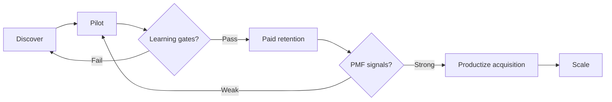
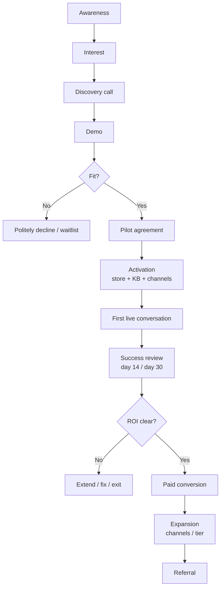
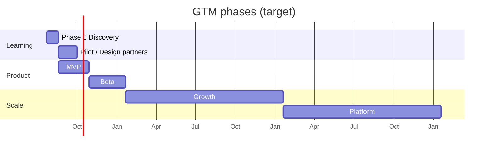
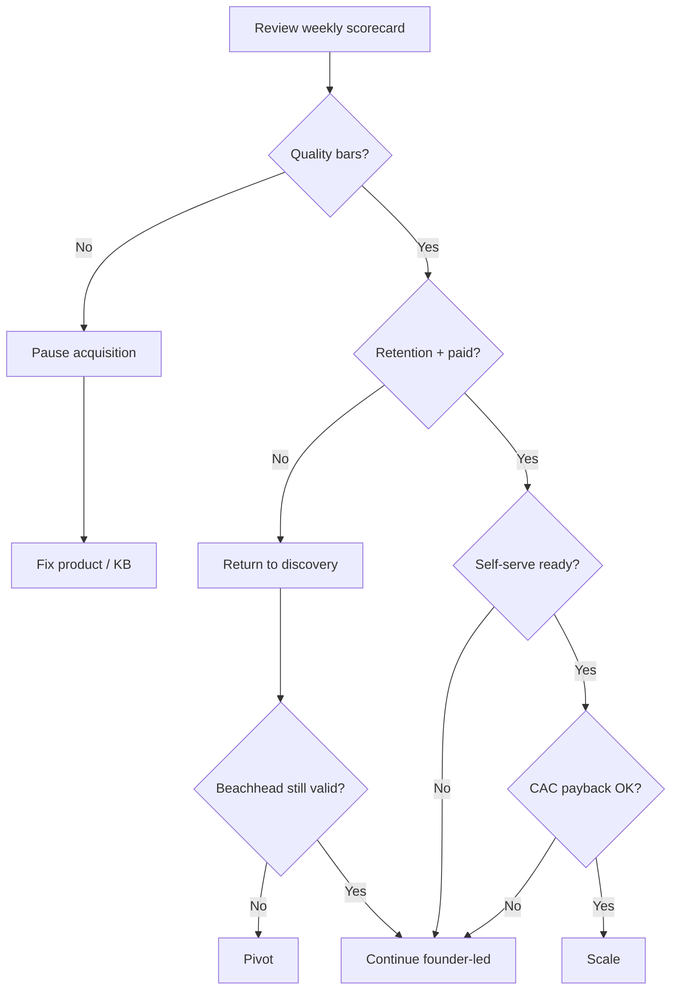

# Go-To-Market Strategy

## Metadata

| Field | Value |
|-------|-------|
| **Version** | 0.1 |
| **Status** | Draft — execution handbook for reaching Product-Market Fit; not a marketing plan and not a sales playbook |
| **Owner** | Founder / Growth |
| **Last Updated** | July 22, 2026 |
| **Related Documents** | [Market Research](./market-research.md) · [Pricing Strategy](./pricing-strategy.md) · [Business Plan](./business-plan.md) · [Product Moat](./product-moat.md) · [Lean Canvas](../00-overview/lean-canvas.md) · [Vision](../00-overview/vision.md) · [Roadmap](../00-overview/roadmap.md) · [Product Principles](../02-product/product-principles.md) |

**Purpose of this document:** Define exactly how DeloRey AI finds its first customers, validates Product-Market Fit (PMF), converts pilots into paying merchants, and only then scales. Every recommendation prioritizes **learning over growth**. Where evidence does not yet exist, claims are marked **Hypothesis**.

**Product under study:** DeloRey AI — AI Commerce Platform (SaaS), primary product **AI Sales Employee**. Deployment: Cloud SaaS. Primary geography: Iran. Target: small and medium online shops. Verticals: Fashion, Cosmetics, Accessories, Electronics, Home Products, Gift Shops. Primary channels: Website, Telegram, Bale. Current stage: **Pre-MVP**.

**Evidence discipline (same taxonomy as Market Research):**

| Label | Meaning |
|-------|---------|
| **Validated Fact** | Public data or documented observation we treat as true for planning |
| **Industry Observation** | Practitioner pattern; directional only |
| **Founder Assumption** | Belief from proximity; must be tested |
| **Hypothesis** | Falsifiable claim with success/fail criteria |
| **Unknown** | Explicit gap; do not invent numbers to fill it |

---

# Executive Summary

DeloRey AI will not “launch and grow.” It will **discover, pilot, prove, then expand**. At Pre-MVP, the company has a coherent product thesis and favorable macro conditions in Iranian e-commerce, but **problem urgency, willingness to pay, and solution efficacy are not validated** ([Market Research](./market-research.md)). Product-Market Fit is therefore a gate, not a slogan.

**GTM philosophy:** Founder-led sales, manual onboarding, tight feedback loops, and ruthless ICP discipline. Paid acquisition, partner scale, and self-serve growth are deferred until pilots convert, retain, and refer.

**Current stage:** Pre-MVP / Phase 0 Discovery. Primary job: talk to merchants, audit real inboxes, and commit design partners — not ship features for an imaginary market.

**Objectives (in order):**

1. Validate that ICP merchants lose measurable revenue or time from slow, inaccurate, or fragmented conversations on Website / Telegram / Bale.
2. Prove an AI Sales Employee grounded in catalog and order data can handle routine commerce questions safely enough to earn trust.
3. Convert design partners into paying customers at founding prices that teach willingness to pay (WTP).
4. Only after retention and referral signals appear, productize acquisition and onboarding.

**Success definition (early PMF signal — Hypothesis until measured):**

| Signal | Provisional bar |
|--------|-----------------|
| Design partners live ≥30 days | ≥5 |
| Pilot → paid conversion | ≥40% of active pilots within 30 days of offer |
| Month-2 logo retention (paid) | ≥75% |
| Merchant can state ROI in one sentence | ≥3 written case studies |
| Organic / referral inbound | First unpaid referrals appear without paid ads |
| Founder would rebuild the same product for the same ICP | Qualitative “hell yes” from ≥3 paying merchants |

**Realistic early SOM reminder:** Tens to low hundreds of paying SMB merchants in Iran within 18–24 months *after* PMF — not thousands in year one ([Market Research](./market-research.md)). This GTM is designed for that reality.

---

# GTM Philosophy

## Founder-led sales

At Pre-MVP, every sales conversation is a research instrument. The founder (or founding team) runs discovery, demo, pilot setup, and close. This is not because sales is glamorous; it is because **only the people who can change the product should hear the objections**.

Outbound volume is capped by founder hours on purpose. If a channel cannot be sold and onboarded by hand, DeloRey is not ready to advertise it.

## Learning over growth

Growth metrics (MRR, CAC, funnel volume) are secondary until learning metrics stabilize:

| Learning metric | Why it matters more than vanity growth |
|-----------------|----------------------------------------|
| Interview → pilot conversion | Are we talking to the right people? |
| Time-to-first-conversation | Is the product usable in the real stack? |
| Resolution rate + hallucination rate | Is the AI Employee safe enough to keep on? |
| Pilot → paid | Will they pay when the discount ends? |
| Correction / escalation patterns | What must the product learn next? |

**Rule:** Do not scale a funnel that cannot explain *why* merchants stay.

## Manual onboarding

Concierge onboarding (founder builds Knowledge Base, connects store, stands up Telegram/Bale, watches first live chats) is the default until ≥70% of new merchants can go live without founder setup ([Roadmap](../00-overview/roadmap.md) Beta gate). Manual work feels inefficient. It is the cheapest way to discover which steps must become product.

## Fast feedback loops

| Loop | Cadence | Owner |
|------|---------|-------|
| Bad-response review | Daily during pilots | Founder + product |
| Merchant check-in | 2×/week weeks 1–2; weekly thereafter | Founder |
| Cohort synthesis | End of each pilot cohort | Founder |
| Kill / continue decision | End of each GTM phase | Founder |

Feedback that does not change product, messaging, or ICP definition within one week is wasted feedback.

## Why scaling comes after PMF

Scaling before PMF amplifies the wrong ICP, the wrong message, and the wrong onboarding friction. In Iran, financing constraints already suppress SaaS budgets ([Market Research](./market-research.md) — financing ranked #1 merchant challenge). Paid acquisition into that environment without ROI proof burns cash and reputation.

**Scale only when:** pilots convert, retain, and produce referrals; unit economics are instrumented; and onboarding no longer requires founder heroics for the modal merchant.

---

# Target Market

## Primary ICP

Aligned with [Lean Canvas](../00-overview/lean-canvas.md) and [Market Research](./market-research.md):

| Attribute | Definition | Status |
|-----------|------------|--------|
| Business type | D2C / small–mid online shop | Assumed |
| Verticals | Fashion, cosmetics, accessories, electronics, home, gifts | Category mix supported |
| Channels | Website + Telegram and/or Bale with real inbound volume | Assumed prevalence |
| Catalog | 50–5,000 SKUs; non-trivial pre-purchase questions | Assumed |
| Team | 2–20 people; no dedicated 24/7 support | Assumed |
| Stack | Shopify, WooCommerce, or syncable storefront | Assumed |
| Pain | Slow replies, founder bottleneck, lost intent | **Unvalidated** |
| GMV | Mid six-figures to low seven-figures USD-equivalent | **Unvalidated band** |
| Buyer | Founder / CEO or Head of E-commerce / Ops | Assumed |

**Early adopter profile (highest priority within ICP):**

- Already sells and supports on Telegram/Bale and drowning in volume.
- Tried a generic chatbot and turned it off.
- Can name a recent lost sale or weekend inbox panic.
- Willing to share catalog access and review AI answers weekly for 30 days.
- Will pay if a before/after ROI report is credible within ~30 days (**Hypothesis**).

## Secondary ICP

| Segment | Why secondary | When to engage |
|---------|---------------|----------------|
| Instagram-first brands adding a formal storefront | Strong discovery channel; weak MVP fit without IG | After MVP channels prove value, or with CSV catalog path |
| Seasonal gift shops | Bursty load; good urgency spikes | Campaign windows (Yalda, Nowruz) as timed pilots |
| Chatbot-scarred merchants | High intent if trust rebuilt | Prioritize in pilot selection |
| Multi-province sellers outside Tehran | Thin staff, messaging volume | Same motion as primary; not Tehran-only |

## Who should NOT buy (MVP)

| Segment | Why exclude now |
|---------|-----------------|
| Enterprise multi-brand retail | Governance, SSO, multi-workspace not ready |
| Pure marketplace operators | Multi-seller workflows out of scope |
| Merchants wanting a bot builder | Wrong category |
| No catalog and no messaging volume | Cannot prove value |
| Pure Instagram sellers refusing any storefront sync | Weak MVP fit until IG + alternate catalog mature |
| Service businesses (clinics, education, etc.) | Architecture later; not MVP focus |
| Agencies as primary buyer | Partner channel after product stability |

Saying no is a GTM skill. Every out-of-ICP pilot dilutes learning.

## Buying maturity

**Hypothesis:** Most ICP merchants are **problem-aware, solution-skeptical**. They feel inbox pain daily. They do not rank “AI Sales Employee” as a strategic purchase until ROI is shown. Public challenge rankings prioritize financing and market conditions over inbox latency — so DeloRey’s wedge may be **real but latent** ([Market Research](./market-research.md)).

GTM implication: sell **recovered conversations and hours**, not “AI platform.”

## Digital maturity

| Level | Characteristics | Fit |
|-------|-----------------|-----|
| High | Live storefront sync, active Telegram/Bale, some analytics | Primary |
| Medium | Website + messaging; spreadsheet inventory exceptions | Primary with concierge KB |
| Low | Instagram-only, no extractable catalog | Exclude from MVP |

## Urgency

| Trigger | Evidence class | GTM use |
|---------|----------------|---------|
| Message volume exceeds founder capacity | Hypothesis | Lead with discovery question |
| Hiring first support person feels expensive | Hypothesis | Anchor vs part-time hire |
| Failed chatbot experiment | Hypothesis | Concierge accuracy SLA |
| Campaign spikes (Yalda, Nowruz) | Industry Observation | Timed pilot cohorts |
| Gen Z demand for pre-purchase contact (~43.6%) | Validated Fact (تتا summary) | Context in pitch; not proof of WTP |

## Budget

| Item | Status |
|------|--------|
| Planning band $99–499/mo Starter→Professional (IRR equivalent) | **Hypothesis** ([Pricing Strategy](./pricing-strategy.md)) |
| Buyer authority $200–$2,000/mo if payback ≤60 days | **Hypothesis** ([Lean Canvas](../00-overview/lean-canvas.md)) |
| Actual Iranian SMB CX/AI SaaS budgets in IRR | **Unknown** — tear down local competitor price cards |
| Financing scarcity compresses budgets | Validated Fact (تتا challenges: financing 28.4%) |

**GTM rule:** Payback ≤60 days is a requirement, not a nice-to-have. Price tests teach WTP; they do not invent it.

---

# Beachhead Market

DeloRey starts narrow on purpose: **Iran × (Website + Telegram + Bale) × Fashion/Cosmetics-first**, then expands.

## Why Iran first

Iran offers structural e-commerce growth (+73% YoY transaction value in 1403 vs ~32.5% inflation — **Validated Fact**), messaging-heavy commerce (54.1% foreign platforms vs 21.2% domestic — **Validated Fact**), ICP-aligned category mix, and denser learning in one language/payment/logistics stack. Global CX tools under-invest in Bale and Persian commerce grounding (**Industry Observation** / Founder Assumption). International expansion before Iranian PMF is a distraction.

## Why Telegram + Bale + Website Chat

| Channel | Role in beachhead |
|---------|-------------------|
| **Telegram** | High merchant/consumer usage; sales + support surface |
| **Bale** | Domestic messenger hedge; Telegram filtering is a structural risk (**Validated Fact historically**) |
| **Website chat** | Catalog/cart context; attribution path; less platform-policy risk |

**Honest constraint:** Many local tools optimize for Instagram DM, where discovery often starts. Whether ICP pain on web/Telegram/Bale is sufficient *without* Instagram in v1 is a **P1 open question** ([Market Research](./market-research.md)). Beachhead GTM must measure refusal rate for “no Instagram in MVP.” Kill or adapt if ≥50% of qualified ICP refuse to proceed without IG.

## Why Fashion and Cosmetics first (among target verticals)

| Vertical | Why prioritize | Question density (hypothesis) |
|----------|----------------|-------------------------------|
| **Fashion** | Size/fit/return questions; high conversation-assisted GMV | Very high |
| **Cosmetics** | Ingredients, authenticity, shade/skin questions | High |
| Accessories | Moderate questions; good secondary | Medium |
| Electronics | Specs/compatibility; higher hallucination risk | High — later once grounding proven |
| Home | Shipping/dimensions | Medium |
| Gifts | Seasonal bursts | Medium — timed cohorts |

**Hypothesis:** Fashion and cosmetics produce the densest FAQ libraries and the clearest before/after ROI stories for case studies. Electronics waits until factual accuracy SLAs are proven.

## Why not expand immediately

Breadth (more countries, Instagram, every vertical, paid ads) before depth (one ICP, three channels, accurate answers, paid retention) creates the illusion of traction. Beachhead success is **5–15 deeply understood merchants**, not 500 shallow signups.

---

# Positioning

## Current positioning

**DeloRey AI is an AI Sales Employee for online shops** — a commerce-grounded agent that sells and supports on Website, Telegram, and Bale using live catalog, inventory, pricing, and policy data, with measurable revenue impact.

**Explicit non-positioning:** Not a CRM. Not a website builder. Not a helpdesk. Not a chatbot builder.

## Category

| Preferred category language | Avoid |
|----------------------------|-------|
| AI Commerce Platform / AI Sales Employee | Chatbot, GPT wrapper, inbox tool |
| Commerce operating layer (internal / later) | Marketing automation suite |

Category creation is expensive. Early GTM uses language merchants already understand: **“AI employee that answers customers and helps close sales.”**

## Differentiation

| Dimension | DeloRey thesis | Competitor default |
|-----------|----------------|--------------------|
| Grounding | Live commerce data | FAQ / prompt only |
| Channels | Web + Telegram + Bale unified | Single-channel or IG-only |
| Outcome | Attribution / ROI report | Message counts |
| Control | Guardrails + escalation on all paid tiers | Autonomy theater |
| Language / market | Persian commerce context, Iran-first | Global templates |

Doing nothing (human founder inbox) remains the **primary competitor**.

## Alternative solutions

| Alternative | Gap DeloRey exploits |
|-------------|----------------------|
| Human-only Telegram/Bale replies | Does not scale nights/weekends |
| Live chat / helpdesk | Ticket-centric; weak commerce + Bale |
| Generic AI chatbots | Hallucination; no sales attribution |
| Local Instagram DM tools | Often IG-first; catalog depth **Unknown** |
| Hire another support person | Linear cost; still fragmented channels |

## Value proposition

| Stakeholder | Value |
|-------------|-------|
| Founder / buyer | Recover conversations that currently die in silence; delay the next hire |
| Ops / support | Stop answering the same 15 questions; handle exceptions only |
| End customer | Instant, accurate answers where they already chat |

## Unique positioning statement

> For Iranian online shops in question-heavy categories, DeloRey AI is the **AI Sales Employee** that answers customers on Website, Telegram, and Bale using your real catalog and orders — so you recover sales after hours without risking a wrong answer that damages the brand.

---

# Messaging

Messaging is role-specific. Same product; different job-to-be-done.

| Audience | Problem | Pain | Value | Outcome |
|----------|---------|------|-------|---------|
| **Founders** | Sales die when you sleep | Anxiety about unread chats; weekend losses | AI Employee grounded in your store data | Measurable recovered conversations in 30 days |
| **Operations Managers** | Channels and SOPs fragmented | Context switching; inconsistent answers | One brain across web/Telegram/Bale | Fewer fires; clearer handoffs |
| **Support Teams** | Same FAQ forever | Burnout; copy-paste across apps | AI handles routine; you own exceptions | Focus on high-value / emotional cases |
| **Marketing Managers** | Campaigns create inbox chaos | Spike volume kills response quality | Coverage that scales with campaigns | Campaign ROI not destroyed by silence |
| **Small Shop Owners** | Cannot hire per channel | You *are* support | Concierge setup + simple ROI | More sales without another salary |

**Messaging rules:**

1. Lead with a concrete lost-sale or night/weekend story — not model names.
2. Address chatbot scar tissue in the first minute: grounding, escalation, audit.
3. Never promise “replace your team.” Promise “cover the repetitive layer.”
4. Instagram absence: be honest. Do not hide the roadmap; do not apologize into scope creep.

---

# Customer Journey

| Stage | Merchant experience | DeloRey action | Exit to next stage |
|-------|---------------------|----------------|--------------------|
| **Awareness** | Hears “AI Sales Employee” from founder, community, or peer | Targeted outreach; no broad ads | Books discovery call |
| **Interest** | Suspects inbox is costing sales | Send 5-question prep + channel audit ask | Shows up prepared |
| **Demo** | Sees grounded answers on *their* FAQ sample | Use merchant’s products, not toy catalog | Agrees to pilot criteria |
| **Pilot** | Live on ≥1 channel with weekly review | Concierge onboard; accuracy SLA | Hits success metrics or exits |
| **Activation** | First real customer conversation handled correctly | Founder watches first 20 chats | Merchant trusts leaving AI on overnight |
| **Success** | Can cite a recovery or hours saved | Deliver written ROI one-pager | Signs paid plan |
| **Expansion** | Adds second channel / higher allowance | In-product + founder nudge | Professional / Business |
| **Referral** | Introduces a peer shop | Ask only after success | Warm intro closed |

**Hypothesis:** SMB cycle is days–weeks if sold as outcomes; weeks–months if sold as “AI platform.” Keep the journey short by forcing ROI instrumentation from day one.

---

# Customer Acquisition

Priority order for Pre-MVP → Pilot: **founder outreach → communities/Telegram groups → referrals → content → partnerships → organic SEO → paid ads (future).**

| Channel | Priority | Expected CAC | Pros | Cons | When to use |
|---------|----------|--------------|------|------|-------------|
| **Founder outreach** | P0 | Very low cash; high founder time (**Hypothesis:** effective CAC ≈ founder hours × opportunity cost) | Highest learning density; ICP control | Does not scale; bottleneck | Now through paid retention |
| **Communities / Telegram groups** | P0 | Low–medium | Where merchants already talk ops | Noise; spam risk; trust required | Soft participation; help first; soft CTA |
| **Warm referrals** | P0 once 3+ successes | Lowest | Highest close rate | Needs case studies first | After first ROI proofs |
| **LinkedIn** | P1 | Low cash | Reach ops/founders | Iran SMB density uncertain | Secondary; test message variants |
| **Content (Persian)** | P1 | Medium (time) | Compounds; educates skeptics | Slow; weak before proof | Case studies > thought leadership |
| **Partnerships (agencies, freelancers)** | P2 | Medium + rev share | Distribution leverage | Premature before product stable | After Beta self-serve |
| **Organic (SEO / site)** | P2 | Medium–high time | Credibility | Slow in Persian commerce niches | Landing + waitlist from Phase 0 |
| **Paid ads** | P3 | **Unknown**; likely high until creative/ROI proven | Volume | Burns cash; attracts wrong ICP | Only after PMF + unit economics |

## Founder outreach

1. List 50–80 ICP shops (fashion/cosmetics first).
2. Offer a free **48-hour channel audit** (response-time + FAQ themes).
3. Convert audits → 15–20 interviews → 5–10 design-partner pilots.

Do not blast chatbot pitches into groups — that attracts the wrong buyers.

## Paid ads (future gate)

Enable only after ≥40% pilot→paid, ≥75% month-2 retention, CAC payback hypothesis ≤3 months, and a self-serve path for the modal signup. Until then, ads are vanity.

---

# Sales Strategy

This is founder-led motion, optimized for learning — not a scaled SDR/AE machine.

| Stage | Goal | Duration (hypothesis) | Artifacts |
|-------|------|----------------------|-----------|
| **Discovery** | Confirm ICP fit, pain, channels, stack, budget reality | 30–45 min | Interview notes; fit score |
| **Demo** | Prove grounding on *their* SKUs / policies | 20–30 min | Recorded demo; objection log |
| **Pilot** | Live proof with shared metrics | 14–30 days | Pilot agreement; weekly scorecard |
| **ROI presentation** | Translate metrics to IRR payback | 30 min | One-pager before/after |
| **Close** | Convert to founding / list price | Same week as ROI | Invoice; founding terms |
| **Expansion** | Second channel / higher tier | Day 30–90 | Usage fence + narrative |
| **Renewal** | Retain on evidence | Day 25 of cycle | Monthly ROI digest |

## Discovery / demo / close

**Discovery (30–45 min):** channels and hours; night/weekend breakage; prior bots/hires; catalog source of truth; budget in IRR; fit decision (pilot / nurture / no).

**Demo:** use their catalog; show escalation and “I don’t know”; show control plane; do not demo Instagram if it is not shipping.

**Close:** sell the **30-day ROI report**, not perpetual discounts. Founding prices expire ([Pricing Strategy](./pricing-strategy.md)). Free-forever demanders are not ICP for paid PMF.

---

# Pilot Strategy

Pilots are the core GTM mechanism before MVP/Beta scale.

## Number of pilot customers

| Cohort | Target | Rationale |
|--------|--------|-----------|
| Design partners (Phase 0–1) | **5–10 committed**; ≥5 live ≥30 days | Enough for patterns; few enough for concierge |
| Concurrent active concierge | Cap at **8** | Founder quality degrades above this (**Hypothesis**) |

Do not run 30 shallow pilots. Run fewer deep ones.

## Selection criteria (must pass all)

| Criterion | Bar |
|-----------|-----|
| Vertical | Prefer fashion or cosmetics for first cohort |
| Channels | Active Website + Telegram and/or Bale |
| Catalog | Extractable; ≥50 SKUs with real questions |
| Volume | Enough inbound to learn within 14 days (**Hypothesis:** ≥20 commerce conversations/week) |
| Champion | Founder or ops owner available 2×/week |
| Mindset | Accepts hybrid AI + human; will review wrong answers |
| Honesty | Agrees Instagram may be out of MVP scope |

## Duration

| Phase | Length |
|-------|--------|
| Setup | ≤3 days (target <24h to first conversation) |
| Live pilot | **14–30 days** |
| Decision | End of pilot week: convert / extend 14 days / exit |

## Success metrics (shared with merchant)

| Metric | Pilot bar |
|--------|-----------|
| Time to first live conversation | <24 hours |
| Resolution without human | ≥50% routine product/policy |
| Audited factual accuracy | ≥90% |
| Hallucination on commerce facts | <5% |
| Attributed conversion or clear recovery | ≥1 within 14 days |
| Merchant still wants AI on overnight | Qualitative yes by day 14 |

## Merchant responsibilities

- Provide store access / catalog export and accurate policies.
- Appoint a single champion.
- Review flagged conversations within 48 hours.
- Keep AI live (do not silently turn off without feedback).
- Share baseline: typical response time, FAQ list, support hours.

## Founder responsibilities

- Concierge Knowledge Base and channel setup.
- Daily response audit for week 1.
- Weekly scorecard and Friday synthesis.
- Fix grounding issues within 48 hours when possible.
- Deliver ROI one-pager at day 14 and day 30.

## Exit criteria

| Outcome | Action |
|---------|--------|
| Metrics met + WTP signal | Convert to founding paid plan |
| Metrics met, budget delay | Time-boxed extension; written commit date |
| Accuracy fail | Pause AI on risky intents; fix; or exit gracefully |
| No usage | Exit; interview for root cause |
| Wrong ICP discovered | Document learning; update ICP; do not discount into fit |

---

# Onboarding Strategy

Onboarding is the product until self-serve exists.

## Merchant onboarding sequence

| Step | Target time | Done when |
|------|-------------|-----------|
| Kickoff | Day 0 | Champion named; success metrics agreed |
| Store integration | Day 0–1 | Catalog/orders syncing or CSV loaded |
| Knowledge Base | Day 0–1 | Top 20 FAQs + policies + edge cases captured |
| Telegram / Bale | Day 1 | Bot live; escalation path tested |
| Website chat | Day 1 | Widget live on staging then production |
| First conversation | <24h | Real or consented test thread succeeded |
| First success | ≤14 days | Documented win (sale assist or hours saved) |

## Knowledge Base creation (manual first)

1. Export catalog; verify stock/price fields merchants care about.
2. Interview champion for “answers only I know” (size charts, authenticity, COD rules).
3. Encode escalation rules (refunds, complaints, medical/skin claims in cosmetics).
4. Seed objection library: shipping, fit, authenticity, price, availability.

**Hypothesis:** KB quality predicts retention more than model choice. Invest founder hours here.

## Time-to-value

| Milestone | Target |
|-----------|--------|
| First live conversation | <24 hours |
| First overnight coverage without panic | ≤7 days |
| First attributed assist | ≤14 days |
| Merchant can operate without founder in Slack | Beta exit criterion — not MVP |

---

# Product-Led Growth Strategy

PLG is a **destination**, not the starting motion.

| Capability | Remain manual (now) | Automate when | Why wait |
|------------|---------------------|---------------|----------|
| ICP qualification | Founder discovery | Self-serve quiz + hard disqualifiers | Wrong ICP pollutes learning |
| KB bootstrap | Concierge interview | Guided wizard + catalog sync QA | Accuracy risk |
| Channel setup | Founder / screenshare | OAuth + health checks | API footguns |
| First-week QA | Human review | Sampling + anomaly alerts | Trust formation |
| Billing | Manual founding invoices | Self-serve Starter/Professional | After WTP known |
| Expansion prompts | Founder email | In-product limit warnings | Needs metering |
| Acquisition | Outreach | Waitlist → trial → paid | After retention |

**Rule:** Automate a step only after the same step has been done manually ≥10 times with a stable playbook and ≤1 critical failure mode.

PLG without PMF produces signups that churn silently. DeloRey cannot afford silent churn in a trust-sensitive category.

---

# Referral Strategy

## When referrals begin

Ask only after:

1. ≥14 days live usage, and
2. At least one documented success the merchant will vouch for, and
3. Merchant NPS ≥9 or unsolicited praise.

Asking earlier trains merchants to ignore you.

## Referral incentives (**Hypothesis** — validate locally)

| Incentive | Notes |
|-----------|-------|
| One free month or conversation pack for referrer | Simple; IRR-friendly |
| Same for referee first month | Reduces adoption friction |
| Avoid cash payouts early | Accounting/trust complexity |
| Avoid “unlimited discount forever” | Destroys price learning |

## Referral process

1. Founder asks in success call: “Which two shops have the same inbox problem?”
2. Warm intro on Telegram preferred over cold form.
3. Track source on every pilot.
4. Close loop: thank referrer when referee goes live.

## Merchant advocacy and case studies

| Asset | When | Rule |
|-------|------|------|
| Private reference call | After first 3 paid | Opt-in only |
| Written case study | After 30 days paid | Numbers merchant approves |
| Short Persian video | After emotional win | Optional; high trust |

Three honest case studies beat fifty blog posts.

---

# Partnership Strategy

Partners are **amplifiers after product stability**, not a substitute for founder sales.

| Partner type | Role | Timing | Risk if early |
|--------------|------|--------|---------------|
| **Agencies** | Implementation / upsell to client shops | Post-Beta | Support load; brand damage from bad setups |
| **Freelancers** (store builders) | Referrals at launch projects | Late Beta | Inconsistent quality |
| **Developers** | Custom sync / local platforms | Growth | Scope sprawl |
| **WooCommerce ecosystem** | Plugin distribution, freelancers | Growth | Premature listing without support docs |
| **Shopify ecosystem** | App store / partners | Growth / regional constraints apply | Listing before retention |
| **Future regional partners** | MENA / adjacent markets | After Iran PMF | Split focus |

**Partner rule:** No revenue-share program until self-serve onboarding works and a partner enablement kit (setup checklist, accuracy SLA, escalation path) exists.

---

# Success Metrics

Instrument from day one of pilots. Separate **learning metrics** from **scale metrics**.

| Metric | Definition | Early target | Type |
|--------|------------|--------------|------|
| **Pilot Conversion** | Active pilots → paid ≤30 days | ≥40% | Learning |
| **Activation Rate** | Signups/partners reaching first live conversation ≤24–48h | ≥80% of accepted pilots | Learning |
| **Time To Value** | Days to first attributed assist or clear hours saved | ≤14 | Learning |
| **Retention** | Month-2 logo retention (paid) | ≥75% | Learning / PMF |
| **Expansion** | % paying on ≥2 channels | ≥50% by late Beta | Scale-ready |
| **Referral Rate** | % new pilots from warm intro | Rising after case studies | PMF |
| **MRR** | Monthly recurring revenue | First meaningful band post-Beta (**Hypothesis:** first $10K MRR is Beta ambition in roadmap — treat as stretch, not entitlement) | Scale |
| **CAC** | Fully loaded acquisition cost | Unknown until channels mature; founder-led CAC is time-dominant | Scale |
| **LTV** | Expected gross profit over life | Unknown; do not invent; require ≥3 months paid data | Scale |
| **NPS** | Merchant promoters | Design partners ≥40 (roadmap); paid cohort track separately | Learning |

**Internal quality metrics (non-negotiable for GTM credibility):**

| Metric | Bar |
|--------|-----|
| Resolution rate | ≥50% MVP → ≥60% Beta |
| Accuracy (audited) | ≥90% → ≥93% |
| Hallucination (commerce facts) | <5% |

If quality bars fail, pause acquisition even if leads are plentiful.

---

# Risks

| Risk | Symptom | Mitigation | Severity |
|------|---------|------------|----------|
| **Wrong ICP** | Pilots don’t use product; “interesting but later” | Strict selection; weekly fit review | Critical |
| **Low willingness to pay** | Love product, refuse >free / <$50 | ROI reports; IRR packaging; kill if persistent | Critical |
| **Poor onboarding** | Never reaches first conversation | Concierge; then productize bottlenecks | High |
| **Weak positioning** | Sold as chatbot; compared only on price | Category language discipline; demo grounding | High |
| **Low activation** | Connected but AI left off | Founder watches week 1; overnight coverage ritual | High |
| **Founder bottleneck** | Pipeline waits on one person | Cap concurrent pilots; hire success only after playbook exists | High |
| **Competition** | Local IG tools win default | Differentiate Telegram/Bale/web + store sync; teardown competitors | High |
| **Economic conditions** | Financing stress kills SaaS | Payback ≤60 days; annual option; founding windows | High |
| **Instagram scope gap** | ICP refuses without IG | Measure refusal rate; decide IG timing with evidence | High |
| **Telegram platform risk** | Filtering / access friction | Bale + website hedge; thin adapters | High |
| **Brand-damaging AI error** | Public wrong answer | Guardrails; escalation; pause intents | Critical |

---

# GTM Timeline

Aligned with [Roadmap](../00-overview/roadmap.md); GTM owns customer learning gates.

| Phase | Objectives | Activities | KPIs | Exit criteria |
|-------|------------|------------|------|---------------|
| **Phase 0 — Discovery** | Validate problem & WTP signals | 15–20 interviews; 10 channel audits; landing waitlist; design-partner shortlist | ≥60% rank slow replies as top-3 pain; ≥40% rejected generic bots; ≥30% likely buy at $199+/mo with ROI (**Roadmap gates**) | ≥5 design partners committed; or kill if pain/WTP fail |
| **Discovery → Pilot bridge** | Concierge proof | Select 5–10; setup; shared scorecards | <24h TTV; weekly reviews | ≥5 live |
| **MVP** | Product works on real revenue | Ship web + Telegram + Bale; founder sales only | Resolution ≥50%; accuracy ≥90%; ≥1 assist/partner ≤14d | ≥5 partners ≥30 days; ≥3 case studies; stable integrations |
| **Beta** | Willingness to pay + assisted self-serve | Invited cohort; founding→list prices; feedback loops | ≥40% paid conversion; ≥75% m2 retention; ≥70% self-serve live ≤48h | PMF signals; first durable MRR cohort |
| **Growth** | Scale what works | Referrals, partners, cautious paid; channel expansion with evidence | CAC payback discipline; NRR; multi-channel activation | Repeatable acquisition without founder on every deal |
| **Platform** | Ecosystem | API, multi-workspace, regional partners | Partner-sourced revenue; Enterprise motion | Platform readiness — out of early GTM scope |

**Kill signals (any phase):** Pain ranked below ads/logistics/inventory with no urgency; WTP only free/<$50; accuracy cannot clear bars; ≥50% ICP refuse without Instagram and no viable alternative path.

---

# Decision Framework

Use this when emotions push for “just grow.”

| Decision | Trigger to act | Required evidence |
|----------|----------------|-------------------|
| **Scale** | Acquisition spend / partner program / hiring GTM roles | Pilot→paid ≥40%; m2 retention ≥75%; self-serve ≥70%; CAC hypothesis with payback ≤3 months; quality bars green |
| **Double down** | One channel, vertical, or message clearly outperforms | ≥2 cohorts show same pattern; unit economics not worse |
| **Pause** | Quality or trust regression | Hallucination spike; public incident; onboarding collapse |
| **Return to discovery** | Conversion healthy but retention poor, or vice versa | Churn interviews; ICP rewrite; new interview round |
| **Pivot** | Beachhead falsified | Persistent no-WTP; IG-only market with no storefront path; problem not real vs financing/ads |

**Bias for action:** When uncertain between scale and learning, choose learning. Capital and reputation are harder to recover than a delayed launch.

---

# Final Recommendations

## Recommended GTM strategy

Run a **founder-led, beachhead GTM** in Iran focused on Fashion and Cosmetics merchants with active Website + Telegram/Bale. Use concierge pilots as the primary validation engine. Price as a learning instrument (founding → list). Convert only on ROI evidence. Productize onboarding and acquisition only after retention and referral appear. Treat Instagram, paid ads, agencies, and international expansion as **explicitly gated** workstreams.

## Top priorities (now)

1. Complete Phase 0 interviews and channel audits — do not skip to feature building as a substitute for customer truth.
2. Lock 5–10 design partners under written pilot terms and shared metrics.
3. Instrument accuracy, resolution, activation, and ROI from day one.
4. Produce three honest case studies before any growth narrative.
5. Tear down local competitor IRR pricing to ground WTP (**Unknown** today).

## Critical risks to watch weekly

Wrong ICP · chatbot distrust · financing-constrained WTP · Instagram scope gap · Telegram platform risk · founder bottleneck · brand-damaging hallucination.

## First 90-day execution plan

| Days | Focus | Concrete outputs |
|------|-------|------------------|
| **1–30** | Discovery | 15–20 ICP interviews; 10 response-time audits; ICP refinement memo; waitlist live; ≥5 design partners verbally committed |
| **31–60** | Pilot launch | ≥5 merchants live; KB playbook v1; weekly scorecards; first accuracy audit pack; first attributed assists |
| **61–90** | Convert & decide | ROI one-pagers; founding paid offers; ≥40% conversion attempt on ready pilots; go / pause / pivot memo against Phase 0–1 gates |

**Cadence:** daily bad-answer review; 2×/week merchant check-ins in pilot weeks 1–2; weekly GTM scorecard; day-90 written continue / pause / rediscover decision.

---

**Document rule:** Update after each phase exit. Do not let GTM claims drift ahead of [Market Research](./market-research.md). PMF is earned in merchant inboxes, not in strategy decks.
