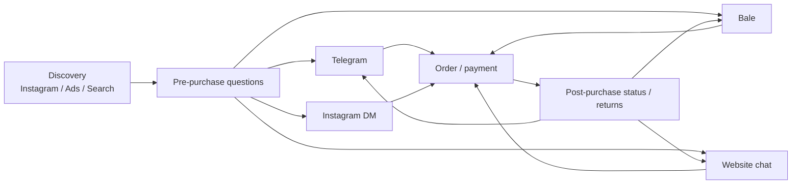
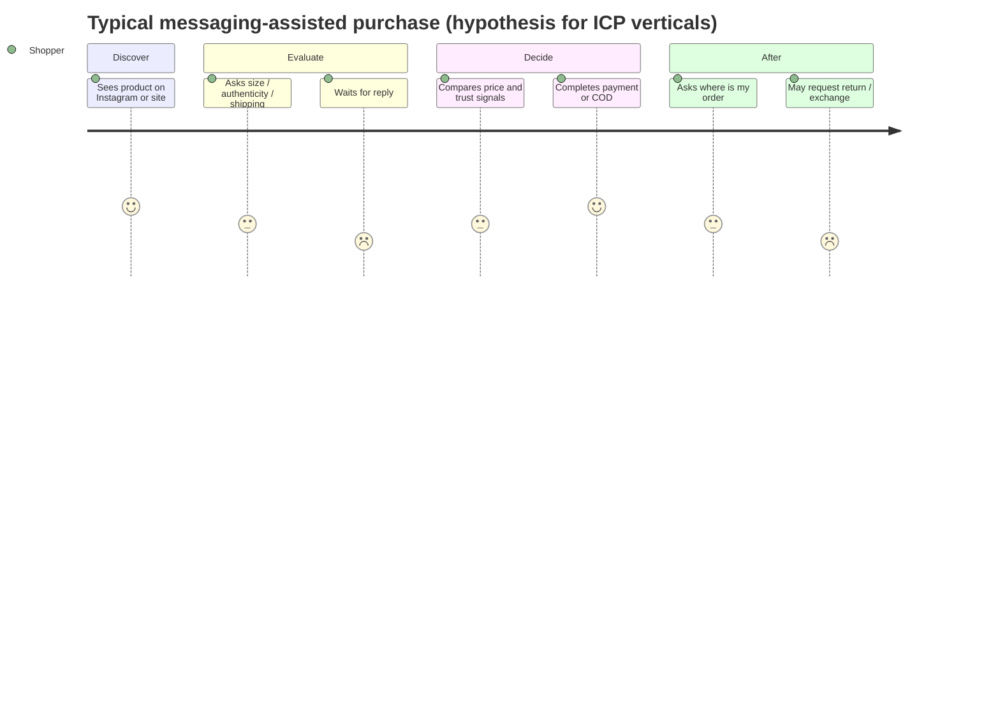
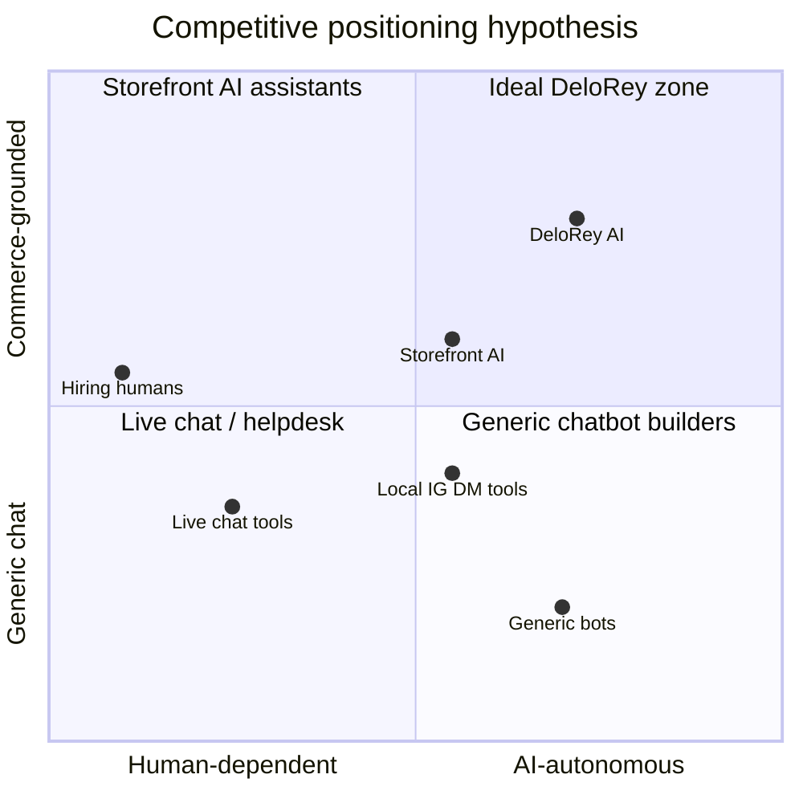

# Market Research

## Metadata

| Field | Value |
|-------|-------|
| **Version** | 0.2 |
| **Status** | Draft — problem validation document; not a go-to-market plan |
| **Owner** | Founder / Strategy |
| **Last Updated** | July 22, 2026 |
| **Related Documents** | [Vision](../00-overview/vision.md) · [Lean Canvas](../00-overview/lean-canvas.md) · [Business Plan](./business-plan.md) · [Product Moat](./product-moat.md) · [Product Principles](../02-product/product-principles.md) · [Roadmap](../00-overview/roadmap.md) · [Glossary](../00-overview/glossary.md) |

**Purpose of this document:** Validate whether DeloRey AI is solving a real market problem. This is not a marketing article and not a business plan. Every claim is either evidence-backed, explicitly marked as a hypothesis, or paired with a validation idea.

**Product under study:** DeloRey AI — an AI Commerce Platform (SaaS) positioned as an **AI Sales Employee** for online merchants. Explicit non-positioning: not CRM, not website builder, not helpdesk, not chatbot builder.

**Initial geography:** Iran. **Primary channels (MVP):** Website, Telegram, Bale. **Target industries:** Fashion, Cosmetics, Accessories, Electronics, Home Products, Gift Shops.

---

# Executive Summary

## Current market

Iran e-commerce transaction value reached **5,500 هزار میلیارد تومان** in 1403 (تتا via Zoomit), **+73%** YoY vs ~**32.5%** inflation — real structural growth. ~**4.7B** online purchase transactions (+~21% YoY). E-commerce ~**7%** of the economy; ~**32%** of Shaparak activity in reported summaries. Globally, conversational commerce *software* estimates sit roughly **~$9–15B** (2025–2026); channel *spend* forecasts are hundreds of billions and must not be confused with SaaS TAM.

## Problem

Online merchants in question-heavy categories (fashion, cosmetics, electronics, home, gifts) lose sales and burn staff time because customer conversations are slow, fragmented across website / Telegram / Bale (and often Instagram), and disconnected from live catalog, inventory, and order data. Generic chatbots scale fluency without commerce truth. Human-only coverage does not scale to nights, weekends, and multi-channel volume.

**Critical nuance:** Global cart abandonment averages ~**70.22%** (Baymard Institute meta-analysis of 50 studies, updated September 2025). That number is real but multi-causal (shipping fees, checkout friction, browsing). The share attributable to *unanswered pre-purchase questions in Iran* is **Unknown – requires validation.** Treating all abandonment as DeloRey’s addressable problem would overstate the opportunity.

**Second critical nuance (Validated Fact from تتا challenge rankings via Zoomit):** Iranian online businesses rank **financing (28.4%)**, **market/sales conditions (25.3%)**, and **infrastructure quality (18.1%)** as top challenges — ahead of talent, culture, and governance. “Unanswered chats” does not appear as a named top challenge in that survey. DeloRey’s wedge may be **real but latent** (operators feel inbox pain daily without ranking it as a strategic bottleneck). That is a research risk, not a marketing inconvenience.

## Opportunity

If a meaningful share of lost or delayed conversions in messaging-first Iranian D2C is caused by latency and inaccurate answers — and if merchants will pay for measurable recovery — then an **AI Sales Employee** grounded in commerce data sits at a real wedge. Structural market conditions (messaging commerce, SMB density, Gen Z preference for pre-purchase contact, weak global coverage of Bale/Telegram + Persian commerce grounding) are favorable. Product-market fit is **not yet proven**.

## Key findings

| Finding | Evidence class |
|---------|----------------|
| Iranian e-commerce volume and transaction counts are large and growing | Validated Fact (تتا via Zoomit / secondary) |
| Foreign social/messaging platforms dominate merchant usage vs domestic messengers (54.1% vs 21.2% in 1403 report summaries) | Validated Fact |
| Goods-heavy online businesses dominate; wearables/personal/home and cosmetics are large vertical shares | Validated Fact |
| Gen Z shoppers cite “contact before purchase” as a major priority (~43.6%) | Validated Fact (تتا Gen Z behavior summary) |
| Global cart abandonment is structurally high (~70%) | Validated Fact (Baymard) |
| Top stated merchant challenges are financing and market access — not inbox latency | Validated Fact (تتا challenges) |
| Unanswered questions are a primary abandonment driver *for DeloRey’s ICP in Iran* | Hypothesis |
| Merchants will pay $99–499/month for AI Sales Employee ROI | Hypothesis (from Lean Canvas; unvalidated) |
| Persian + Telegram/Bale commerce OS has weak *global* incumbent coverage; local Instagram-DM tools are active | Industry Observation |
| Accuracy without commerce context is unacceptable for product/policy answers | Industry Observation |

## Business opportunity (directional)

A realistic early SOM is **tens to low hundreds of paying SMB merchants** in Iran within 18–24 months of PMF — not thousands — if design partners convert and retention holds. Dollar TAM slides are secondary; **reachable paying merchants with messaging + catalog sync** are the decision metric. Exact SAM/SOM figures in this document are **estimations with wide bands**.

## Validation status

| Area | Status |
|------|--------|
| Macro e-commerce growth (Iran) | Supported by public data |
| Problem urgency among ICP | **Not validated** — needs interviews + channel audits |
| Willingness to pay | **Not validated** |
| Solution efficacy (conversion lift, accuracy) | **Not validated** — needs pilots |
| Competitive whitespace vs Instagram-first local tools | **Partially observed** — needs structured competitor teardown |
| MVP continue recommendation | **Conditional continue** — proceed only under Validation Plan gates |

---

# Research Methodology

This report separates evidence types deliberately. Mixing them is a decision-making failure mode.

## Evidence taxonomy

| Label | Meaning | How used |
|-------|---------|----------|
| **Validated Fact** | Public data, named methodology, or primary observation that can be cited | Treated as true for planning |
| **Industry Observation** | Pattern widely reported by practitioners/analysts but not DeloRey-primary research | Directional; cite carefully |
| **Founder Assumption** | Belief from founder proximity to market, not yet tested | Must be validated before capital commitment |
| **Hypothesis** | Falsifiable claim about customers, willingness to pay, or product impact | Pair with success/fail criteria |
| **Future Validation** | Planned experiment or data collection | Gates MVP continuation |

## Sources used in this version

| Source type | Examples | Limitation |
|-------------|----------|------------|
| Official Iran e-commerce reporting | تتا / مرکز توسعه تجارت الکترونیکی year 1403 summaries via Zoomit, Nour News, ecomotive PDF mirror | Secondary reporting; USD conversion unstable |
| Global UX / e-commerce research | Baymard cart abandonment meta-analysis (50 studies; ~70.22%) | Not Iran-specific; not messaging-specific |
| Analyst market sizing | Future Market Insights, Fortune Business Insights, Research and Markets, Mordor, Juniper (via secondary) | Definitions inconsistent; vendor bias common |
| Public product sites (regional competitors) | InstaCRM, Yektabot, Roboclick, Gofta, Mercon-class tools | Marketing claims; feature depth unverified |
| Internal strategy docs | Lean Canvas, Business Plan, Product Moat, Product Principles | Contain hypotheses; not market proof |
| Historical / qualitative Iran messaging commerce | Atlantic Council, regional social commerce writeups | Often dated; platform policy changes frequently |

## What this research does **not** include yet

- Primary merchant interview transcripts (n = 0 as of this draft)
- Measured Telegram/Bale response-time audits for named shops
- Paid conversion or retention data for DeloRey AI
- Statistically valid willingness-to-pay study
- Blind mystery-shop of local AI/DM tools on accuracy for fashion/cosmetics SKUs

**Therefore:** Conclusions are provisional. Update this document after Phase 0 interviews.

---

# Current Commerce Landscape

## How online shops currently operate

**Validated Fact (Iran 1403):** ~**66%** of online businesses sell goods, **34%** services. Within goods: wearables/personal & home **>40%**; equipment/machinery ~**16.8%**; cosmetics/hygiene ~**13.1%**; cultural/sports ~**7.9%** — aligned with DeloRey verticals.

**Validated Fact:** ~**35.4%** had a strong physical base before going digital; ~**27%** opened physical after online success. Omnichannel is structural.

**Industry Observation + Founder Assumption:** Typical growth-stage D2C hybrid: Instagram discovery → conversation on Telegram/Bale/WhatsApp/IG DM → checkout via IPG, card-to-card, or COD → courier fulfillment → post-purchase status back in messaging. Formal storefronts coexist with “Instagram shop + messaging checkout.” Enamad issuance **110,680** in 1403 (+281% YoY), partly from “starless” enamad for micro-sellers. Tehran ~**24%** of active enamads (share declining) — GTM is not Tehran-only.

## Typical technology stack

| Layer | Common tools (Iran / ICP) | Notes |
|-------|---------------------------|-------|
| Storefront | Shopify, WooCommerce, local store builders | Syncability varies; MVP needs extractable catalog/orders |
| Payments | IPG gateways, card-to-card, COD | COD increases post-order messaging load |
| Messaging | Telegram, Bale, Instagram DM, WhatsApp | **Validated Fact:** foreign platforms used by **54.1%** of businesses vs **21.2%** domestic messengers (تتا via Zoomit) |
| Ops | Spreadsheets, notes apps, founder memory | Inventory exceptions often off-platform |
| Support | Manual replies; occasional live chat widgets; Instagram DM automation tools | Helpdesk adoption thinner than in US/EU SMBs |
| Analytics | Storefront dashboards + ads platforms | Conversation→revenue link usually missing |

## Typical communication channels

**Platform risk note (Validated Fact historically):** Telegram has faced filtering/blocks in Iran; merchants and consumers adapt via VPNs and alternate apps. That makes **channel concentration a structural risk** for any Telegram-dependent product. Bale and website presence partially hedge; they do not eliminate platform risk.

**Competitive implication:** Many local SaaS tools optimize for **Instagram DM** (where discovery happens). DeloRey’s MVP bets on **website + Telegram + Bale**. Whether ICP merchants experience enough pain on those three channels *without* Instagram in v1 is a P1 open question.

## How sales happen today

| Mode | Description | Evidence class |
|------|-------------|----------------|
| Website self-serve | Customer browses, pays, ships | Common for catalog-mature shops |
| Assisted messaging sale | Customer asks size/stock/shipping; human closes sale | Core ICP pattern — **Founder Assumption** on prevalence |
| Social DM order | Order placed entirely in chat; payment offline/COD | Common in social commerce — **Industry Observation** |
| Hybrid | Discover social → ask chat → pay on site | Frequent — **Industry Observation** |

**Hypothesis:** For DeloRey’s ICP verticals, a material share of GMV is *conversation-assisted* even when final payment occurs on the website.

**Validation idea:** For 15 shops, sample 2 weeks of Telegram/Bale threads; classify % of threads that contain purchase intent vs pure support; estimate closed-won rate by response-time bucket.

## How support happens today

- Founder or 1–3 staff monitor phones and messaging apps throughout the day.
- FAQs (shipping time, return window, authenticity, sizing) are answered by copy-paste.
- Order-status questions spike after campaigns and peak shopping days.
- Escalations (refunds, damaged goods, COD refusals) consume disproportionate time.
- Night/weekend coverage is sparse unless the founder lives in the inbox.
- Some merchants adopt Instagram auto-reply / funnel tools; many later disable or constrain them after wrong answers (**Industry Observation** — needs primary confirmation).

## Problems with existing workflows

| Workflow failure | Effect |
|------------------|--------|
| Multi-inbox fragmentation | Slow first response; inconsistent answers |
| Knowledge in founder’s head | Quality drops when founder is offline; training new staff is slow |
| No live inventory in chat | Overselling or wrong availability promises |
| No conversation→order attribution | Cannot justify SaaS spend; marketing learns little |
| Generic bots tried and disabled | Trust scar; raises bar for next AI vendor |
| Tool sprawl (DM CRM + storefront + spreadsheets) | Staff time spent on system switching, not selling |

---

# Customer Behavior

## Buying journey (shopper)

## Decision making

**Validated Fact (buyer age mix, تتا summaries):** Young buyers (15–29) account for ~**45%** of e-commerce purchases; ages 30–49 ~**35%**. Social network penetration is reported near **56.7%** (~48M active users) — a large social-commerce surface.

**Validated Fact (Gen Z priorities in تتا summaries):** Gen Z emphasizes product variety (~**46.4%**), **contact before purchase (~43.6%)**, after-purchase support (~**33%**), and gift purchasing (~**25.5%**). The “contact before purchase” finding is one of the strongest public-data supports for conversational commerce demand on the *buyer* side.

**Industry Observation:** In fashion, cosmetics, and electronics, purchase decisions are blocked by fit, authenticity, compatibility, warranty, and delivery certainty more than by “chat novelty.” Trust is built through fast accurate answers, clear return policy, and social proof — not through chatbot persona.

**Hypothesis (Iran-specific):** COD and payment-friction environments increase the need for pre-purchase reassurance and post-order confirmation messaging relative to card-dominant markets.

## Pre-purchase questions (high frequency — hypothesis)

| Category | Example questions | Vertical relevance |
|----------|-------------------|-------------------|
| Fit / size | “Is this true to size?” | Fashion |
| Ingredients / skin | “Is this for sensitive skin?” | Cosmetics |
| Compatibility | “Does this work with X phone?” | Electronics |
| Availability | “Is color Y in stock?” | All |
| Shipping | “How long to Mashhad / COD?” | All |
| Authenticity | “Is this original?” | Cosmetics, electronics |
| Price / discount | “Any discount if I buy two?” | All |
| Returns | “Can I exchange if it doesn’t fit?” | Fashion, gifts |

## Post-purchase questions

| Type | Example | Operational load |
|------|---------|------------------|
| Tracking | “Where is my order?” | Very high after campaigns |
| Delivery change | “Change address / delay COD” | Medium |
| Defect / wrong item | Photos + refund request | High stakes; needs human |
| Return eligibility | “Am I still in return window?” | Medium; policy-bound |
| How to use | Care / setup instructions | Medium; knowledge-base friendly |

## Messaging behavior

**Validated Fact (infrastructure):** Broadband penetration ~**152.7%** and mobile penetration ~**189.6%** reported in 1403 تتا summaries — always-on messaging is supported by infrastructure even when quality/disruption varies.

**Industry Observation:** Shoppers expect near-instant replies on messaging apps; email is secondary for SMB D2C in this market.

**Founder Assumption:** Median first-response time for many ICP shops exceeds **1–2 hours** during business hours and is much worse nights/weekends.

**Validation idea:** Silent observation of 10 public Telegram/Bale business accounts — time first human reply to sample inbound messages (ethics: use only public business bots/channels or consented partners).

## Trust factors

| Factor | Why it matters |
|--------|----------------|
| Correct product facts | Wrong size/stock destroys trust faster than silence |
| Consistent policy across channels | Conflicting return answers feel like fraud |
| Human escalation path | Shoppers tolerate AI if a human can take over |
| Payment and delivery clarity | COD / shipping uncertainty is a primary friction |
| Brand presence continuity | Same “employee” remembering prior chat builds confidence |
| Pre-purchase contact availability | Gen Z data supports demand for reachable merchants |

## Reasons customers abandon purchases

| Reason | Evidence | Relevance to DeloRey |
|--------|----------|----------------------|
| Extra costs (shipping, fees) | Baymard: leading fixable reason in global studies (~39% of fixable abandonments) | Indirect — Employee can explain shipping early; cannot invent free shipping |
| Checkout / account friction | Baymard / UX research | Mostly storefront problem |
| Browsing / not ready | Large share of “abandonment” | Not addressable |
| Slow / missing answer to a blocking question | **Hypothesis for ICP**; Gen Z contact preference is supporting context | Core wedge |
| Wrong bot answer | **Industry Observation** | Trust risk for AI vendors |
| Competitor found while waiting | **Hypothesis** | Latency-sensitive |

**Honest research position:** DeloRey should claim addressable abandonment only after measuring *question-blocked* sessions in pilots — not by citing 70% as if it were DeloRey’s TAM.

---

# Merchant Pain Analysis

Severity scale: **1–5** (5 = existential / high revenue impact). Frequency: how often the pain appears in weekly ops. Priority: recommended product focus for MVP.

| # | Pain | Severity | Freq. | Current workaround | Cost of doing nothing | AI solution | Priority |
|---|------|----------|-------|--------------------|----------------------|-------------|----------|
| 1 | Lost sales from slow replies | 5 | Daily | Founder lives in inbox | Unmeasured lost GMV | Grounded instant replies | P0 |
| 2 | Night/weekend coverage gap | 4 | Daily | Delayed / no reply | Lost peak-intent sales | Always-on Employee | P0 |
| 3 | Repetitive FAQ load | 4 | Cont. | Copy-paste macros | Burnout; hiring pressure | Knowledge-grounded Skills | P0 |
| 4 | Inconsistent answers across channels | 4 | Weekly | Manual alignment | Brand distrust | One Runtime + Knowledge | P0 |
| 5 | No live inventory in chat | 5 | Weekly | Check admin manually | Refunds / stockouts | Context Engine stock check | P0 |
| 6 | Order-status volume | 3 | Spikes | Manual order lookup | Crowds out sales chats | Order-status Skill | P1 |
| 7 | Founder bottleneck | 5 | Cont. | Founder answers all | Cannot scale | Knowledge + guardrails | P0 |
| 8 | Failed chatbot trauma | 4 | Scar | Human-only forever | Under-automation | Grounding + escalation | P0 |
| 9 | No conversation→sale attribution | 3 | Monthly | Guesswork | Wrong tool spend | Honest Revenue Intelligence | P1 |
| 10 | COD confirmation burden | 4 | Daily | Manual call/message | High RTO costs | Confirmation workflows | P1–P2 |
| 11 | Multi-app switching | 3 | Cont. | Browser tabs | Latency + errors | Unified inbox | P1 |
| 12 | Insight buried in chat | 3 | Cont. | Anecdotes | Wrong assortment | Objection analytics | P2 |
| 13 | Training new staff | 3 | Hiring | Shadow founder | Slow ramp | Shared Knowledge | P2 |
| 14 | Discount leakage | 3 | Weekly | Verbal rules | Margin erosion | Guardrailed discounts | P2 |
| 15 | Platform outages / filtering | 5* | Episodic | VPN + alternate apps | Revenue shock | Multi-channel adapters | P0 |
| 16 | Financing / capital constraint | 4 | Struct. | Bootstrapping | Caps SaaS budgets | Fast ROI + IRR pricing | P0 GTM |
| 17 | Instagram tooling gap (MVP excludes IG) | 4 | Daily† | Separate IG tools | Split-brain ops | Later channel / partner | P1 |

\*Severity when disruption hits. †For Instagram-first merchants.

**Cost of doing nothing:** Unknown in IRR/USD. **Validation idea:** For each design partner, estimate messages/day, % purchase-intent, conversion by response-time cohort, and FAQ hours/week — then annualize.

**Pain vs stated challenges:** Pains #1–#8 are operationally vivid, but تتا ranks financing and market conditions highest. Interviews must force-rank unread messages against ads, logistics, and inventory — or DeloRey risks solving a felt pain merchants will not budget for.

---

# Market Trends

| Trend | Why it matters | Evidence class |
|-------|----------------|----------------|
| **AI adoption** | Demand *and* skepticism; trust bar rises after bad bots | Industry Observation |
| **Conversational / messaging commerce** | Journeys move into chat; MVP channels are strategic | Validated Fact (Iran platform mix) + Observation |
| **Automation pressure** | SMBs buy hours saved + revenue, not “AI” branding | Industry Observation |
| **Omnichannel** | One-brain Memory differentiates vs single-channel bots | Founder Assumption |
| **Customer expectations** | Instant answers normalized; Gen Z wants pre-purchase contact | Validated Fact (Gen Z) |
| **Persian language AI** | Timing window; still needs commerce grounding | Industry Observation |
| **SMB digitalization** | Enamad surge; women ownership ~28% — more formal sellers | Validated Fact |
| **Local Instagram automation** | Category awareness exists; DeloRey must win on grounding + channel set | Industry Observation |

AI hype does not help: merchants who disabled dumb bots are harder to win without accuracy and ROI. Local IG tools can become the mental default “AI employee” even if shallow on catalog truth — positioning discipline matters.

---

# TAM / SAM / SOM

> **Every number below is an estimation.** Assumptions are explicit. Precision is intentionally avoided. Do not use these figures as investor-grade certainty.

## Definitions used here

| Term | Definition in this document |
|------|-----------------------------|
| **TAM** | Global spend on software that enables AI/conversational selling & support for commerce (platform revenue), *or* alternatively the economic activity in conversational channels — **stated separately** |
| **SAM** | Iran online commerce merchants who could rationally buy an AI Sales/Support Employee (reachable language, channels, catalog) |
| **SOM** | Share DeloRey can capture in 24 months under realistic GTM constraints |

## Global TAM (software layer)

Public 2025–2026 estimates for conversational commerce *software* cluster roughly **~$9–15B** (FMI / Fortune / R&M / Mordor), with definition-dependent CAGRs (~7–15%). Broader “conversational AI” figures are often higher and include non-commerce verticals. Separately, Juniper-style forecasts of ~**$290B** conversational *channel spend* by 2025 are **not SaaS revenue**.

**Working statement:** Global commerce-relevant conversational software is on the order of **low tens of billions USD**. DeloRey needs a dense regional wedge, not global share early.

## Regional TAM (MENA / messaging-first commerce software)

**Unknown – requires validation.** WhatsApp-centric MENA social commerce is large qualitatively; reliable public SaaS spend figures for “AI sales employee for D2C” are scarce. Treat MENA as **expansion optionality**, not year-1 revenue.

## Iran SAM

### Bottom-up sketch (estimation)

| Step | Assumption | Rough figure | Confidence |
|------|------------|--------------|------------|
| Formal online businesses with enamad activity | 1403 enamad issuance ~110k (flow, not stock of active shops) | Stock of *active* commerce merchants unknown | Low |
| Goods sellers | ~66% of online businesses | — | Medium (category mix reported) |
| Target verticals with pre-purchase questions | Fashion, cosmetics, accessories, electronics, home, gifts | Assume **20–40%** of goods sellers | Low |
| Have website + messaging channel + enough volume to care | Unknown | Assume **5,000–25,000** shops | Very low |
| Can sync catalog (Shopify/Woo/comparable) | Unknown subset | Assume **20–50%** of above | Very low |
| **Iran SAM (reachable buyers)** | — | **Order of 1,000–10,000** merchants | **Hypothesis band** |

**Iran e-commerce GMV context (Validated Fact as reported):** 5,500 هزار میلیارد تومان transaction value in 1403. USD conversion is unstable and should not be treated as a fixed TAM input without a stated FX methodology. Use IRR for Iran planning; convert only for international comparison with wide bands.

### SAM revenue potential (software)

If **3,000** reachable merchants (mid of uncertain band) × average willingness to pay **$150–300/month**:

| Scenario | Paying merchants | ARPU / month | ARR |
|----------|------------------|--------------|-----|
| Conservative | 3,000 × 10% = 300 | $150 | ~$0.5M |
| Base | 3,000 × 25% = 750 | $220 | ~$2.0M |
| Optimistic | 8,000 × 30% = 2,400 | $280 | ~$8.1M |

These are **illustrative**, not forecasts. They exist to show that Iran alone can support a meaningful seed/Series A business **if** WTP and conversion assumptions hold — and that Iran alone is unlikely to create a global mega-outcome without expansion.

**Constraint from تتا challenges:** Financing is the #1 stated challenge. Even a correct product can fail if pricing/payment rails ignore capital scarcity. Local IRR pricing and fast payback are not optional GTM details.

## Realistic SOM (24 months post-MVP)

| Horizon | SOM hypothesis | Rationale |
|---------|----------------|-----------|
| Design partners | 5–15 | High-touch; learning |
| 12 months after PMF signal | 50–150 paying | Founder-led + referrals |
| 24 months | 150–400 paying | Still constrained by onboarding, trust, and LLM ops |

**SOM ARR band (hypothesis):** ~$0.2M–$1.5M ARR at 24 months if ARPU lands $150–400 and retention ≥75% month-2+.

**Failure mode:** If only free users accumulate, SAM was vanity and WTP failed.

---

# ICP Validation

## Primary ICP

| Attribute | Definition | Validation status |
|-----------|------------|-------------------|
| Business | D2C / small online shop | Assumed |
| Verticals | Fashion, cosmetics, accessories, electronics, home, gifts | Supported by Iran category mix |
| Channels | Website + Telegram and/or Bale | Assumed prevalence |
| Catalog | 50–5,000 SKUs; non-trivial questions | Assumed |
| Team | 2–20 people; no 24/7 team | Assumed |
| Stack | Syncable storefront | Assumed |
| Pain | Slow replies, founder bottleneck, abandoned intent | **Unvalidated** |
| GMV | Mid six-figures to low seven-figures USD-equivalent | **Unvalidated band** |
| Buyer age | Founder often 20–40 (تتا: ~65% of owners in 20–40) | Contextual support |

## Secondary ICP

- Instagram-first brands adding a formal storefront
- Seasonal gift shops with bursty messaging load
- Merchants who tried and disabled a generic chatbot (high intent if trust can be rebuilt)
- Multi-province sellers outside Tehran with messaging volume but thin staff

## Who should NOT buy (MVP)

| Segment | Why |
|---------|-----|
| Enterprise multi-brand retail | Needs governance DeloRey lacks |
| Pure marketplace operators | Multi-seller workflows out of scope |
| Merchants wanting bot builders | Wrong product |
| No catalog / no messaging volume | Weak value proof |
| Pure Instagram sellers refusing any storefront sync | Weak MVP fit until IG channel + alternate catalog import mature |
| Service businesses (clinics, etc.) | Phase 2 — architecture later, not MVP focus |
| Agencies as primary buyer | Partner channel after product stability |

## Buying triggers

| Trigger | Evidence class |
|---------|----------------|
| Message volume exceeds founder capacity | Hypothesis |
| Hiring first support person feels expensive | Hypothesis |
| Failed chatbot experiment | Hypothesis |
| Campaign spike (Yalda, Nowruz, Black Friday analogs) creates inbox chaos | Industry Observation |
| Visible lost sales anecdotes | Hypothesis |
| Gen Z customers demanding instant contact | Supported by public Gen Z data; merchant response unknown |

## Buying objections

| Objection | Likely severity | Mitigation direction |
|----------|-----------------|----------------------|
| “AI will say something wrong” | Critical | Grounding, escalation, audit |
| “We tried a bot; useless” | High | Concierge pilot with accuracy SLAs |
| “Too expensive” / “we have no budget” | High (financing is #1 stated challenge) | ROI in 30 days or kill; IRR pricing |
| “Setup is hard” | Medium | <24h time-to-first-conversation |
| “Customers want humans” | Medium | Hybrid handoff; disclose AI thoughtfully |
| “Data privacy / where data lives” | Medium–High regionally | Clear data policy; regional architecture options |
| “Telegram might get blocked” | Medium | Multi-channel (web + Bale) |
| “You don’t do Instagram” | High for IG-first ICP | Scope honesty; roadmap or partner |

## Budget expectations

**Hypothesis (from Lean Canvas):** $99–499/month for Starter/Growth; buyers with authority $200–$2,000/month if payback visible in 1–2 months.

**Unknown – requires validation:** Actual Iranian SMB SaaS budgets for CX/AI tools in IRR terms under inflation and payment constraints. Local Instagram tools’ published price cards are a proxy — **Future Validation:** tear down 5 local competitors’ pricing in IRR and map feature depth.

## Buying process & decision makers

| Role | Influence |
|------|-----------|
| Founder / CEO | Primary economic buyer |
| Head of e-commerce / ops | Champion / daily owner |
| Support lead | User; can block if UX fails |
| Developer / agency | Technical gate for storefront connect |
| Accountant | Payment/FX friction in some setups |

**Hypothesis:** Sales cycle for SMB is short (days–weeks) **if** ROI is visible; long **if** product is sold as “AI platform.” Sell outcomes, not architecture.

---

# Competitive Landscape

**Doing nothing is the primary competitor.** Most ICP merchants already “solve” communication with human Telegram/Instagram replies and founder attention. Switching cost is psychological, not contractual.

## Competitor categories

| Category | Examples (illustrative) | Gap vs DeloRey thesis |
|----------|-------------------------|------------------------|
| **Global live chat / CX** | Intercom, Crisp, Zendesk, Gorgias | Ticket-centric; weak Bale; access friction in Iran |
| **Global bots / wrappers** | GPT wrappers, ManyChat-class | Hallucination risk; not commerce OS |
| **Storefront-native AI** | Shopify Sidekick / inbox AI | Weak messaging-first Iran stack |
| **Regional IG / DM tools** | InstaCRM, Yektabot, Roboclick, Gofta | Instagram-first; catalog grounding depth **Unknown – teardown needed** |
| **Messaging AI (other markets)** | Mercon-class Telegram/IG agents | Different rails; proves category demand elsewhere |
| **Indirect / human / OSS** | Hiring, agencies, n8n+LLM glue | Linear cost or unoperable by SMBs |
| **Platform AI** | Meta / Telegram surface AI | No merchant-owned Context Graph + ROI graph |

## Positioning map (conceptual)

## Business positioning (not feature checklist)

Inbox tools win on familiarity and lose on conversation→GMV proof. Bot builders sell DIY trees; merchants want employees. Instagram DM CRMs meet discovery but often lack multi-channel Memory and storefront truth. Storefront AI has distribution but incomplete Iran messaging reality. Status quo has zero SaaS cost and high hidden GMV loss. Platform AI is ubiquitous but not merchant-owned.

**Provisional conclusion:** Crowded at chat/Instagram admin; still relatively sparse at commerce-grounded AI Sales Employee for Persian + Telegram/Bale + website with attribution. Local competitors threaten early ICP more than Intercom. **Future Validation:** Score competitors on catalog sync, order lookup, hallucination handling, channels, IRR pricing, ROI claims; mystery-shop three with identical product questions.

---

# Jobs To Be Done

## Functional / Purchase / Support / Merchant Jobs

| Actor | Job | Success |
|-------|-----|---------|
| Shopper | Accurate product/policy answers fast | Decide or escalate clearly |
| Shopper | Order status without calling | Delivery trust |
| Merchant | Cover chats without linear hiring | Off-hours SLA met |
| Merchant | Convert messaging intent | Higher assisted conversion |
| Merchant | Consistent policy everywhere | Same answer on all channels |
| Employee (Sales) | Recommend in-stock options; explain shipping/COD; share payment path; discount only within limits | — |
| Employee (Support) | FAQ from Knowledge; order lookup; return eligibility; escalate refunds/defects | — |
| Operator | Connect store; set guardrails; review escalations; see revenue/hours impact | — |

## Emotional & Social Jobs

Founders want less anxiety about unread messages and brand mistakes. Staff want to stop being FAQ machines. Shoppers want a professional, trustworthy brand. Socially, founders want to look like a “real brand,” not an amateur Instagram seller — without awkward public delays.

---

# Switching Cost Analysis

| Dimension | Current state | Migration difficulty | Implication |
|-----------|---------------|----------------------|-------------|
| **Current solutions** | Humans + multi-app + occasional widget / IG tool | Low contractual lock-in | Must win on ROI, not lock-in initially |
| **Migration** | Connect store + bots; no CRM rip-replace | Medium technical; low data migration | Good for SMB adoption |
| **Integration concerns** | API keys, sync lag, wrong catalog mapping | Medium | Sync health is product, not ops afterthought |
| **Training effort** | Staff learn inbox + escalation | Low–medium | UX must beat “just reply on Telegram” |
| **Risk perception** | Brand damage from AI | High | Biggest switching barrier |
| **Competing IG tools** | Merchants may already pay for DM automation | Medium | Switching *away* from IG tool to DeloRey requires channel overlap or dual-run |
| **Over time** | Knowledge + Memory + attribution accumulate | Switching cost rises if product works | Moat thesis — **unearned today** |

**Hypothesis:** Early buyers switch *to* DeloRey easily; they switch *away* easily until Knowledge investment and proven ROI create dependency.

---

# Pricing Expectations

All figures are **hypotheses** unless marked otherwise.

## Willingness to pay (hypothesis)

| Segment | Monthly WTP band | Condition |
|---------|------------------|-----------|
| Small shop, 1 channel | $99–149 | Clear hours saved |
| Omnichannel active shop | $299–499 | Attributed conversion or recovery |
| Higher GMV | $799+ | SLA + custom guardrails |

## Price sensitivity

**Hypothesis:** Sharp drop above ~$150 **without** ROI proof; willingness expands materially **with** a 30-day before/after report.

**Hypothesis (Iran):** Financing constraints push buyers toward monthly IRR plans, low commit, and cancel-anytime. Annual prepay discounts may underperform Western SaaS norms.

**Validation ideas:** Van Westendorp in interviews; fake-door pricing page; A/B tier offers in beta; compare to local IG-tool price cards.

## Subscription expectations

- Monthly billing preferred for SMBs under inflation uncertainty (**Hypothesis**)
- Conversation overage must be predictable; surprise LLM bills kill trust
- Per-seat pricing misaligned with value (**Product thesis**)

## ROI expectations

| Merchant expectation (hypothesis) | Bar |
|-----------------------------------|-----|
| Payback | ≤ 30–60 days |
| Proof | ≥1 attributed recovery or measurable hours saved |
| Accuracy | No brand-damaging hallucination in pilot |

## Budget ranges (Iran operational reality)

**Unknown – requires validation.** Inflation, FX, and payment rails may force IRR pricing, annual discounts, or local billing partners. Global USD price cards may not transfer 1:1.

---

# Validation Plan

Ordered by kill-or-continue decisiveness. Aligns with Lean Canvas Phase 0–3; expanded for research rigor.

## Phase 0 — Problem validation (Weeks 1–4)

| Method | n / scope | Success | Failure |
|--------|-----------|---------|---------|
| Merchant interviews | 15–20 ICP founders | ≥60% rank lost sales from slow replies as top-3 pain; ≥40% tried and rejected generic bots | Pain ranked below ads/logistics/inventory; no urgency |
| Forced rank vs تتا challenges | Same interviews | Inbox pain ranks above “nice to have” even when financing dominates | Merchants say “interesting” but will not divert budget from ads/logistics |
| Channel behavior audit | 10 shops | Median first response >2 hours; repeated FAQ patterns | Sub-15-minute median replies with high conversion |
| WTP probe | In interviews | ≥30% “likely buy” at ≥$199 with ROI proof | Interest only if free / <$50 |
| Landing page waitlist | 1 page, clear AI Sales Employee pitch | Qualified signups from ICP verticals | Only students/curious; no merchant emails |
| Competitor mystery shop | 3 local tools | Document accuracy failures on product facts | Local tools already accurate + multi-channel enough |

## Phase 1 — Solution validation (Weeks 5–10)

| Method | Success | Failure |
|--------|---------|---------|
| Concierge MVP for 3–5 design partners | ≥3 report hours saved/week; ≥2 attribute ≥1 sale/recovery | Disable agent; revert human-only |
| Accuracy audit (100 convos/partner) | ≥85% factual correctness | <75% or brand-damaging errors |
| Resolution rate | ≥40% closed without human | Escalation >80% or customer complaints |

## Phase 2 — Product validation (Weeks 11–18)

| Method | Success | Failure |
|--------|---------|---------|
| Self-serve onboarding (10 merchants) | ≥70% live in 48h | Stall at integration |
| Multi-channel | ≥50% activate ≥2 channels in 30 days | Single channel only |
| Paid conversion | ≥40% active beta → paid in 30 days | Usage without payment |
| Month-2 retention | ≥75% | Churn “no ROI” / “AI not good enough” |

## Phase 3 — Business model validation (Weeks 19–26)

| Method | Success | Failure |
|--------|---------|---------|
| Price cohort test | Similar conversion $199 vs $299 with healthy LTV | Cliff above $149 |
| Unit economics | Gross margin ≥55% representative | LLM >40% of revenue |
| ROI report package | ≥60% merchants show attributed revenue or hours saved | Metrics too noisy to believe |

## Fake door / prototype tests

| Test | What it validates |
|------|-------------------|
| “Connect Telegram — AI Sales Employee” signup | Channel interest |
| Pricing page with tiers, no product | WTP / plan preference |
| Wizard mock: connect store → sync → test chat | Onboarding comprehension |
| Sample conversation demo with *wrong* answer deliberately shown + escalation | Whether merchants value guardrails |
| “Instagram coming later” disclosure on landing page | Whether IG absence kills conversion |

## Design partners & pilot customers

| Criterion | Bar |
|-----------|-----|
| Vertical fit | Prefer fashion or cosmetics first (high question density) |
| Channel fit | Active Telegram and/or Bale + website with catalog |
| Commitment | Weekly feedback; allow accuracy audits |
| Honesty | Willing to report failures, not only success stories |

## Metrics to instrument from day one of pilots

| Metric | Purpose |
|--------|---------|
| First response time (AI vs human baseline) | Latency value |
| Grounded response rate | Differentiation |
| Hallucination rate (audited) | Trust |
| Escalation rate | Autonomy quality |
| Assisted conversion / attributed GMV | Revenue story |
| Hours saved (merchant diary) | Cost story |
| Willingness to renew | Business truth |

## Success criteria (continue MVP → full build)

- ≥5 paying merchants, ≥75% month-2 retention
- ≥3 case studies with conversion lift or recovery
- Resolution ≥50%, hallucination <5% on audited sample
- Path to ≥60% gross margin at Growth tier

## Failure criteria (pivot or stop)

- Accuracy cannot reach 85%+ with store sync alone
- <25% design partners report meaningful value at 30 days
- Zero attributable conversions across ≥5 active merchants / 60 days
- Merchants refuse to pay even when hours saved are documented (vitamin, not painkiller)
- ≥50% of qualified ICP refuse to proceed without Instagram in MVP (scope failure)

---

# Research Risks

| Risk class | Specific risk | Sev. | Mitigation |
|------------|---------------|------|------------|
| **Market** | Pain real but not budgeted (ads/logistics/financing win) | High | Force-rank interviews; WTP tests |
| **Market** | IG-first sellers refuse website sync | Med–High | CSV import, earlier IG, or secondary ICP |
| **Market** | Latent pain never becomes purchase urgency | High | Kill if “nice AI” only |
| **Technology** | Persian commerce hallucinations | Critical | Context Engine; conservative autonomy |
| **Technology** | Sync drift / stale inventory | High | Sync health UX; escalate on uncertainty |
| **Competition** | Local IG tools become default “AI admin” | High | Grounding + Telegram/Bale/web; teardown |
| **Competition** | Storefront/Meta “good enough” AI | High | Omnichannel Memory + ROI proof |
| **Economic** | Inflation/FX + financing scarcity | High | IRR pricing; payback ≤60 days |
| **Regional** | Sanctions / payment / hosting | High | Legal + architecture options early |
| **Platform** | Telegram filtering / Bale API limits | High | Thin adapters; web + Bale hedge |
| **Research** | Confirmation bias in interviews | High | Disconfirming scripts |

---

# Opportunities

**Short-term (0–12 mo):** Prove AI Sales Employee on web + Telegram + Bale for fashion/cosmetics; sizing/authenticity/COD objection libraries; three honest case studies; transparency-led pilots for chatbot-scarred merchants; teardown local IG tools and decide IG timing with evidence.

**Mid-term (12–24 mo):** Deeper connectors; Instagram/WhatsApp after quality proven; vertical packs; agency playbooks; IRR-native packaging.

**Long-term (24+ mo):** MENA WhatsApp-heavy expansion; earned Skill ecosystem; services verticals; enterprise multi-brand governance.

---

# Research Conclusions

## Is the market real?

**Yes, at the macro level.** Iranian e-commerce transaction value and count growth in 1403, high messaging/social usage among businesses, goods-heavy vertical mix consistent with DeloRey’s ICP, and Gen Z demand for pre-purchase contact are **Validated Facts** (via public reporting). Global conversational software markets are also real as categories.

**Partially unknown at the micro level:** Whether *DeloRey’s specific* problem — question latency and ungrounded answers as a top revenue leak for reachable SMBs who will pay SaaS prices — is large enough remains **Hypothesis**.

## Is the pain urgent?

**Unknown – requires validation.** Macro growth does not imply urgency for an AI Sales Employee. Public challenge rankings prioritize financing and market conditions. Urgency for DeloRey is supported by **Industry Observations** (inbox overload, messaging commerce, Gen Z contact preference) and **Founder Assumptions**, not by DeloRey primary research yet.

## Will merchants pay?

**Unknown – requires validation.** Pricing bands in internal docs are hypotheses. Financing constraints and historical chatbot disappointment may suppress WTP until ROI is undeniable.

## Why now?

| Force | Assessment |
|-------|------------|
| LLM Persian fluency | Better than prior decade — **Industry Observation** |
| Commerce APIs + bot APIs | Buildable — **Industry Observation** |
| Messaging-first buyer behavior | Structural in target market — **Validated Fact** on platform usage mix + Gen Z contact preference |
| Incumbent under-investment in Bale/Telegram commerce OS | **Founder Assumption** — time-bounded; local IG tools are investing elsewhere |
| AI trust scar | Makes “now” harder, not easier — honesty required |
| SMB digitalization / enamad surge | More formal sellers — **Validated Fact**; quality of buyers uneven |

## Should MVP continue?

**Conditional yes.** Continue MVP development **only while** Phase 0–1 validation gates are actively executed. Do not interpret this research document as product-market fit.

| Decision | Condition |
|----------|-----------|
| **Continue** | Interviews + audits confirm urgency; concierge pilots hit accuracy/value bars |
| **Narrow** | Pain real only in one vertical or one channel — cut scope |
| **Add Instagram earlier** | If ≥50% of qualified ICP refuse without it |
| **Pause / pivot** | Failure criteria in Validation Plan hit |

---

# Open Questions

Prioritized for founder decision-making (P0 = block capital allocation).

| Priority | Question |
|----------|----------|
| P0 | What % of ICP merchants cite unanswered questions as a top-3 revenue problem *when forced to rank against ads, logistics, inventory, and financing*? |
| P0 | What is median first-response time on Telegram/Bale for ICP shops? |
| P0 | What monthly price clears WTP with and without ROI proof (IRR and USD)? |
| P0 | Can store sync alone reach ≥85% factual accuracy in fashion/cosmetics? |
| P0 | Will design partners pay and renew after 30–60 days? |
| P1 | What share of abandonment is question-blocked vs price/shipping/checkout? |
| P1 | How many reachable merchants have syncable catalogs *and* active messaging? |
| P1 | COD confirmation: is it a must-have Skill for Iran MVP? |
| P1 | Instagram DM: is excluding it from MVP a deal-breaker for ICP? |
| P1 | How do local IG tools score on accuracy, pricing, and multi-channel depth? |
| P1 | Gross margin at proposed prices with Persian multi-turn chats? |
| P2 | Bale API completeness vs Telegram for commerce bots? |
| P2 | Optimal billing currency and collection method in Iran? |
| P2 | Agency channel timing — before or after 50 paying logos? |
| P2 | Cross-merchant learning: any privacy-safe path that merchants accept? |
| P2 | When do storefront-native AI features neutralize the wedge? |

---

# Appendix

## A. Interview questions (merchant founders)

1. Walk through a typical purchase last month — channels for questions vs revenue.
2. Estimate conversation-assisted vs self-serve revenue share.
3. What happens when a sizing question arrives at 11 PM?
4. Hours/week on repetitive FAQs? Any late-reply lost-sale story?
5. Tried chatbot / IG DM automation / AI? Outcome?
6. Force-rank by revenue impact: ads / logistics / unanswered chats / returns / inventory / financing.
7. Storefront, payments, stock-check method in chat, conversation→order attribution?
8. Messaging/CRM tools already paid for?
9. Monthly IRR WTP for accurate 24/7 AI with escalation — recovered revenue vs hours saved?
10. Buy website + Telegram + Bale *without* Instagram yet? Why / why not?
11. Instant turn-off criteria?
12. Disconfirming: bigger problem than faster replies? Why AI messaging might be wrong for the brand? What keeps it in budget for 6 months if cash is tight?

## B. Survey questions (short form)

1. Primary vertical (fashion / cosmetics / electronics / home / gifts / other)
2. Avg daily customer messages (0–20 / 21–50 / 51–100 / 100+)
3. Median reply time (minutes / <1h / 1–4h / next day)
4. Channels used (web / Telegram / Bale / Instagram / WhatsApp)
5. Tried chatbot or DM automation? (never / tried & kept / tried & disabled)
6. Top operational pain (rank): ads cost / logistics / unanswered chats / returns / inventory / financing
7. Max monthly spend for tool that cuts reply time and recovers sales (IRR brackets)
8. Must-have: website chat / Telegram / Bale / Instagram / order status / COD confirm
9. Would you connect your storefront catalog to an AI sales employee? (yes / maybe / no)

## C. Useful public sources

| Source | Use |
|--------|-----|
| مرکز توسعه تجارت الکترونیکی (تتا) — گزارش تجارت الکترونیکی ۱۴۰۳ | Iran e-commerce volume, transactions, platform usage, category mix, Gen Z, challenges |
| Zoomit summary of ۱۴۰۳ e-commerce report | Accessible secondary synthesis |
| ecomotive / PDF mirrors of تتا report | Primary-ish access to tables |
| Baymard Institute cart abandonment research | Global abandonment benchmarks (not Iran-specific) |
| Future Market Insights / Fortune / Research and Markets / Mordor | Conversational commerce software sizing (definition-sensitive) |
| Juniper Research conversational commerce forecasts (via secondary) | Channel spend vs software distinction |
| Public sites: InstaCRM, Yektabot, Roboclick, Gofta, Mercon-class tools | Competitive positioning (marketing claims only) |
| Atlantic Council / historical Telegram-Instagram Iran pieces | Qualitative messaging commerce context (often dated) |
| DeloRey internal: Lean Canvas, Business Plan, Product Moat, Product Principles | Hypothesis register and positioning constraints |

## D. Research notes

- **Do not equate** Iran e-commerce GMV with DeloRey TAM. DeloRey sells software, not retail.
- **Do not equate** ~70% cart abandonment with addressable market. Measure question-blocked intent separately.
- **Do not treat** analyst SaaS TAM figures as additive across overlapping categories (conversational AI ∩ customer service AI ∩ chatbot platforms).
- **Enamad issuance** is a flow metric; active merchant stock requires separate estimation.
- **FX:** Prefer IRR unit economics for Iran; any USD conversion must state rate date and methodology.
- **تتا challenge rankings** are a disconfirming signal for urgency. Treat inbox pain as latent until interviews prove budget priority.
- **Gen Z contact-before-purchase** is a confirming signal for buyer-side demand — not proof merchants will pay for AI.
- **Update cadence:** Revise this document after Phase 0 (interviews) and Phase 1 (design partners). Version bump required when evidence class of key claims changes.
- **Positioning guardrail:** Research that tempts the company toward chatbot builder, CRM, helpdesk, or website builder features should be rejected unless it directly validates the AI Sales Employee wedge (see Product Principles).

---

## Document control

| Item | Value |
|------|-------|
| Word count target | 5,000–8,000 |
| Primary audience | Founders making continue / kill / pivot decisions |
| Explicit non-audience | Marketing launch copy; fundraising narrative without validation |
| Next mandatory update | After ≥15 merchant interviews or equivalent Phase 0 completion |
| Changes in v0.2 | Added Gen Z / challenge ranking evidence; named regional competitors; Instagram scope risk; financing constraint on WTP; expanded validation gates |

*End of Market Research v0.2*
