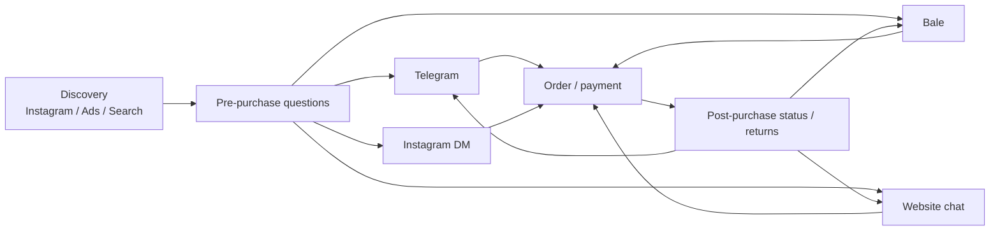
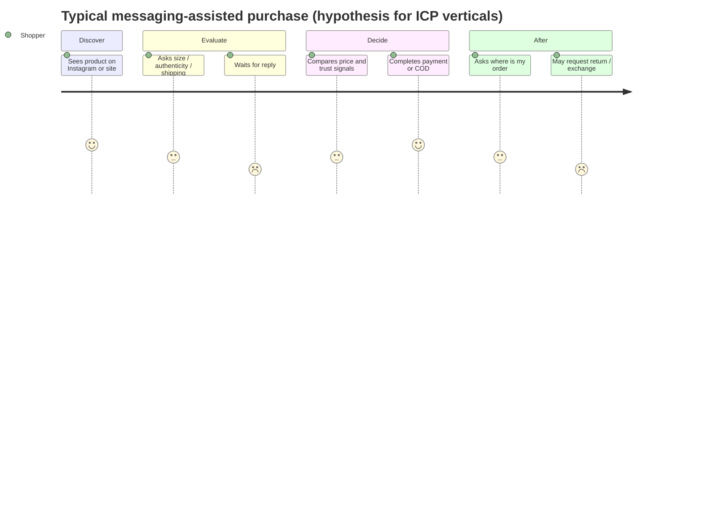
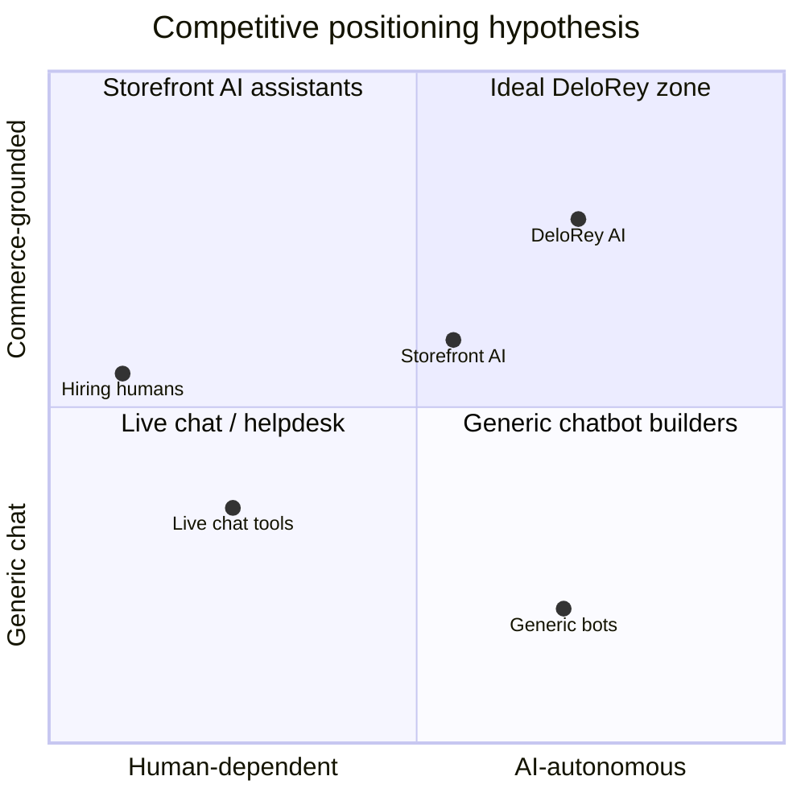

# Market Research

## Metadata

| Field | Value |
|-------|-------|
| **Version** | 0.1 |
| **Status** | Draft — problem validation document; not a go-to-market plan |
| **Owner** | Founder / Strategy |
| **Last Updated** | July 20, 2026 |
| **Related Documents** | [Vision](../00-overview/vision.md) · [Lean Canvas](../00-overview/lean-canvas.md) · [Business Plan](./business-plan.md) · [Product Moat](./product-moat.md) · [Product Principles](../02-product/product-principles.md) · [Roadmap](../00-overview/roadmap.md) · [Glossary](../00-overview/glossary.md) |

**Purpose of this document:** Validate whether DeloRey AI is solving a real market problem. This is not a marketing article and not a business plan. Every claim is either evidence-backed, explicitly marked as a hypothesis, or paired with a validation idea.

---

# Executive Summary

## Current market

Iran’s formal e-commerce transaction value reached **5,500 هزار میلیارد تومان** in Iranian calendar year 1403 (roughly 2024–2025), according to the country’s E-Commerce Development Center (مرکز توسعه تجارت الکترونیکی / تتا), as reported by Zoomit and other secondary sources. That figure grew approximately **73%** year over year while annual inflation was reported near **32.5%**, which implies real structural growth in digital commerce, not inflation alone. Iranians completed about **4.7 billion** online purchase transactions (+~21% YoY). E-commerce is still estimated at roughly **7%** of the broader economy — large absolute volume, early relative penetration.

Globally, conversational commerce and conversational AI are growing software categories. Public analyst estimates for **software/platform revenue** (not GMV) typically sit in the **~$9–18B** range for 2025–2026 depending on definition, with higher CAGRs for “conversational AI” than for narrow “conversational commerce platforms.” Separately, research firms have forecast **hundreds of billions of dollars** of *consumer spend flowing through conversational channels* — a different metric that must not be confused with SaaS TAM.

## Problem

Online merchants in question-heavy categories (fashion, cosmetics, electronics, home, gifts) lose sales and burn staff time because customer conversations are slow, fragmented across website / Telegram / Bale (and often Instagram), and disconnected from live catalog, inventory, and order data. Generic chatbots scale fluency without commerce truth. Human-only coverage does not scale to nights, weekends, and multi-channel volume.

**Critical nuance:** Global cart abandonment averages ~**70%** (Baymard Institute meta-analysis). That number is real but multi-causal (shipping fees, checkout friction, browsing). The share attributable to *unanswered pre-purchase questions in Iran* is **Unknown – requires validation.** Treating all abandonment as DeloRey’s addressable problem would overstate the opportunity.

## Opportunity

If a meaningful share of lost or delayed conversions in messaging-first Iranian D2C is caused by latency and inaccurate answers — and if merchants will pay for measurable recovery — then an **AI Sales Employee** grounded in commerce data sits at a real wedge. Structural market conditions (messaging commerce, SMB density, weak global coverage of Bale/Telegram + Persian commerce grounding) are favorable. Product-market fit is **not yet proven**.

## Key findings

| Finding | Evidence class |
|---------|----------------|
| Iranian e-commerce volume and transaction counts are large and growing | Validated Fact (public official report via secondary sources) |
| Foreign social/messaging platforms dominate merchant usage vs domestic messengers (54.1% vs 21.2% in 1403 report summaries) | Validated Fact (reported from تتا via Zoomit) |
| Goods-heavy online businesses dominate; wearables/personal/home and cosmetics are large vertical shares | Validated Fact (reported category mix) |
| Global cart abandonment is structurally high (~70%) | Validated Fact (Baymard) |
| Unanswered questions are a primary abandonment driver *for DeloRey’s ICP in Iran* | Hypothesis |
| Merchants will pay $99–499/month for AI Sales Employee ROI | Hypothesis (from Lean Canvas; unvalidated) |
| Persian + Telegram/Bale commerce OS has weak incumbent coverage | Industry Observation + Founder Assumption |
| Accuracy without commerce context is unacceptable for product/policy answers | Industry Observation (widely reported chatbot failure pattern) |

## Business opportunity (directional)

A realistic early SOM is **tens to low hundreds of paying SMB merchants** in Iran within 18–24 months of PMF — not thousands — if design partners convert and retention holds. Dollar TAM slides are secondary; **reachable paying merchants with messaging + catalog sync** are the decision metric. Exact SAM/SOM figures in this document are **estimations with wide bands**.

## Validation status

| Area | Status |
|------|--------|
| Macro e-commerce growth (Iran) | Supported by public data |
| Problem urgency among ICP | **Not validated** — needs interviews + channel audits |
| Willingness to pay | **Not validated** |
| Solution efficacy (conversion lift, accuracy) | **Not validated** — needs pilots |
| MVP continue recommendation | **Conditional continue** — proceed only under Validation Plan gates |

---

# Research Methodology

This report separates evidence types deliberately. Mixing them is a decision-making failure mode.

## Evidence taxonomy

| Label | Meaning | How used |
|-------|---------|----------|
| **Validated Fact** | Public data, named methodology, or primary observation that can be cited | Treated as true for planning |
| **Industry Observation** | Pattern widely reported by practitioners/analysts but not DeloRey-primary research | Directional; cite carefully |
| **Founder Assumption** | Belief from founder proximity to market, not yet tested | Must be validated before capital commitment |
| **Hypothesis** | Falsifiable claim about customers, willingness to pay, or product impact | Pair with success/fail criteria |
| **Future Validation** | Planned experiment or data collection | Gates MVP continuation |

## Sources used in this version

| Source type | Examples | Limitation |
|-------------|----------|------------|
| Official Iran e-commerce reporting | تتا / مرکز توسعه تجارت الکترونیکی year 1403 summaries via Zoomit, Nour News, WORLDEF | Secondary reporting; USD conversion unstable |
| Global UX / e-commerce research | Baymard cart abandonment meta-analysis | Not Iran-specific; not messaging-specific |
| Analyst market sizing | Future Market Insights, Fortune Business Insights, Research and Markets, Juniper (via secondary) | Definitions inconsistent; vendor bias common |
| Internal strategy docs | Lean Canvas, Business Plan, Product Moat, Product Principles | Contain hypotheses; not market proof |
| Historical / qualitative Iran messaging commerce | Atlantic Council, NCRI, regional social commerce writeups | Often dated; platform policy changes frequently |

## What this research does **not** include yet

- Primary merchant interview transcripts (n = 0 as of this draft)
- Measured Telegram/Bale response-time audits for named shops
- Paid conversion or retention data for DeloRey AI
- Statistically valid willingness-to-pay study

**Therefore:** Conclusions are provisional. Update this document after Phase 0 interviews.

---

# Current Commerce Landscape

## How online shops currently operate

**Validated Fact (Iran 1403 reporting):** Among online businesses, roughly **66% sell goods** and **34% provide services**. Within goods, wearables / personal & home necessities account for **over 40%** of shops; equipment/machinery ~**16.8%**; chemical & cosmetics/hygiene ~**13.1%**; cultural/sports ~**7.9%** (category shares as summarized from تتا reporting). This aligns with DeloRey’s target vertical list (fashion, cosmetics, home, gifts, accessories, electronics).

**Industry Observation + Founder Assumption:** Many growth-stage Iranian D2C brands operate a hybrid model:

1. Discovery on Instagram (visual catalog / social proof)
2. Conversation and order confirmation on Telegram, Bale, WhatsApp, or Instagram DM
3. Checkout via website payment gateway, card-to-card, or cash-on-delivery (COD)
4. Fulfillment via courier; post-purchase status handled again in messaging

Formal storefronts (Shopify, WooCommerce, local builders) coexist with “Instagram shop + messaging checkout” operations. Enamad issuance grew sharply in 1403 (**110,680** enamads issued; +281% YoY in reported summaries), partly due to simplified “starless” enamad for micro-businesses — signaling rapid formalization of small online sellers, not only large marketplaces.

## Typical technology stack

| Layer | Common tools (Iran / ICP) | Notes |
|-------|---------------------------|-------|
| Storefront | Shopify, WooCommerce, local store builders | Syncability varies; MVP needs extractable catalog/orders |
| Payments | IPG gateways, card-to-card, COD | COD increases post-order messaging load |
| Messaging | Telegram, Bale, Instagram DM, WhatsApp | **Validated Fact:** foreign platforms used by **54.1%** of businesses vs **21.2%** domestic messengers (تتا via Zoomit) |
| Ops | Spreadsheets, notes apps, founder memory | Inventory exceptions often off-platform |
| Support | Manual replies; occasional live chat widgets | Helpdesk adoption thinner than in US/EU SMBs |
| Analytics | Storefront dashboards + ads platforms | Conversation→revenue link usually missing |

## Typical communication channels

**Platform risk note (Validated Fact historically):** Telegram has faced filtering/blocks in Iran; merchants and consumers adapt via VPNs and alternate apps. That makes **channel concentration a structural risk** for any Telegram-dependent product. Bale and website presence partially hedge; they do not eliminate platform risk.

## How sales happen today

| Mode | Description | Evidence class |
|------|-------------|----------------|
| Website self-serve | Customer browses, pays, ships | Common for catalog-mature shops |
| Assisted messaging sale | Customer asks size/stock/shipping; human closes sale | Core ICP pattern — **Founder Assumption** on prevalence |
| Social DM order | Order placed entirely in chat; payment offline/COD | Common in social commerce — **Industry Observation** |
| Hybrid | Discover social → ask chat → pay on site | Frequent — **Industry Observation** |

**Hypothesis:** For DeloRey’s ICP verticals, a material share of GMV is *conversation-assisted* even when final payment occurs on the website.

**Validation idea:** For 15 shops, sample 2 weeks of Telegram/Bale threads; classify % of threads that contain purchase intent vs pure support; estimate closed-won rate by response-time bucket.

## How support happens today

- Founder or 1–3 staff monitor phones and messaging apps throughout the day.
- FAQs (shipping time, return window, authenticity, sizing) are answered by copy-paste.
- Order-status questions spike after campaigns and peak shopping days.
- Escalations (refunds, damaged goods, COD refusals) consume disproportionate time.
- Night/weekend coverage is sparse unless the founder lives in the inbox.

## Problems with existing workflows

| Workflow failure | Effect |
|------------------|--------|
| Multi-inbox fragmentation | Slow first response; inconsistent answers |
| Knowledge in founder’s head | Quality drops when founder is offline; training new staff is slow |
| No live inventory in chat | Overselling or wrong availability promises |
| No conversation→order attribution | Cannot justify SaaS spend; marketing learns little |
| Generic bots tried and disabled | Trust scar; raises bar for next AI vendor |

---

# Customer Behavior

## Buying journey (shopper)

## Decision making

**Industry Observation:** In fashion, cosmetics, and electronics, purchase decisions are blocked by fit, authenticity, compatibility, warranty, and delivery certainty more than by “chat novelty.” Trust is built through fast accurate answers, clear return policy, and social proof — not through chatbot persona.

**Hypothesis (Iran-specific):** COD and payment-friction environments increase the need for pre-purchase reassurance and post-order confirmation messaging relative to card-dominant markets.

## Pre-purchase questions (high frequency — hypothesis)

| Category | Example questions | Vertical relevance |
|----------|-------------------|-------------------|
| Fit / size | “Is this true to size?” | Fashion |
| Ingredients / skin | “Is this for sensitive skin?” | Cosmetics |
| Compatibility | “Does this work with X phone?” | Electronics |
| Availability | “Is color Y in stock?” | All |
| Shipping | “How long to Mashhad / COD?” | All |
| Authenticity | “Is this original?” | Cosmetics, electronics |
| Price / discount | “Any discount if I buy two?” | All |
| Returns | “Can I exchange if it doesn’t fit?” | Fashion, gifts |

## Post-purchase questions

| Type | Example | Operational load |
|------|---------|------------------|
| Tracking | “Where is my order?” | Very high after campaigns |
| Delivery change | “Change address / delay COD” | Medium |
| Defect / wrong item | Photos + refund request | High stakes; needs human |
| Return eligibility | “Am I still in return window?” | Medium; policy-bound |
| How to use | Care / setup instructions | Medium; knowledge-base friendly |

## Messaging behavior

**Validated Fact (infrastructure):** High broadband and mobile penetration reported in 1403 (e.g., broadband penetration figures cited above global averages in تتا summaries) support always-on messaging as a default consumer behavior surface.

**Industry Observation:** Shoppers expect near-instant replies on messaging apps; email is secondary for SMB D2C in this market.

**Founder Assumption:** Median first-response time for many ICP shops exceeds **1–2 hours** during business hours and is much worse nights/weekends.

**Validation idea:** Silent observation of 10 public Telegram/Bale business accounts — time first human reply to sample inbound messages (ethics: use only public business bots/channels or consented partners).

## Trust factors

| Factor | Why it matters |
|--------|----------------|
| Correct product facts | Wrong size/stock destroys trust faster than silence |
| Consistent policy across channels | Conflicting return answers feel like fraud |
| Human escalation path | Shoppers tolerate AI if a human can take over |
| Payment and delivery clarity | COD / shipping uncertainty is a primary friction |
| Brand presence continuity | Same “employee” remembering prior chat builds confidence |

## Reasons customers abandon purchases

| Reason | Evidence | Relevance to DeloRey |
|--------|----------|----------------------|
| Extra costs (shipping, fees) | Baymard: leading fixable reason in global studies (~39% of fixable abandonments) | Indirect — Employee can explain shipping early; cannot invent free shipping |
| Checkout / account friction | Baymard / UX research | Mostly storefront problem |
| Browsing / not ready | Large share of “abandonment” | Not addressable |
| Slow / missing answer to a blocking question | **Hypothesis for ICP** | Core wedge |
| Wrong bot answer | **Industry Observation** | Trust risk for AI vendors |
| Competitor found while waiting | **Hypothesis** | Latency-sensitive |

**Honest research position:** DeloRey should claim addressable abandonment only after measuring *question-blocked* sessions in pilots — not by citing 70% as if it were DeloRey’s TAM.

---

# Merchant Pain Analysis

Severity scale: **1–5** (5 = existential / high revenue impact). Frequency: how often the pain appears in weekly ops. Priority: recommended product focus for MVP.

| # | Pain | Description | Severity | Frequency | Current workaround | Current tools | Cost of doing nothing | Potential AI solution | Priority |
|---|------|-------------|----------|-----------|--------------------|---------------|----------------------|----------------------|----------|
| 1 | Lost sales from slow replies | Purchase-intent messages sit unread; intent cools | 5 | Daily | Founder lives in inbox | Phone + Telegram | Unmeasured lost GMV | AI Sales Employee with instant grounded replies | P0 |
| 2 | Night/weekend coverage gap | Demand continues when staff offline | 4 | Daily | Ignore or delayed reply | None | Lost peak-intent sales | Always-on Employee + morning human queue | P0 |
| 3 | Repetitive FAQ load | Same size/shipping/authenticity answers | 4 | Continuous | Copy-paste macros | Notes / memory | Staff burnout; hiring pressure | Knowledge-grounded Support + Sales Skills | P0 |
| 4 | Inconsistent answers across channels | Different reply on web vs Telegram | 4 | Weekly | Manual alignment | Multi-app | Brand distrust; returns disputes | One Runtime + shared Knowledge | P0 |
| 5 | No live inventory in chat | Oversell or miss sales | 5 | Weekly | Check admin panel manually | Storefront admin | Refunds, anger, stockouts | Context Engine inventory check | P0 |
| 6 | Order-status volume | “Where is my order?” floods inbox | 3 | Daily spikes | Manual order lookup | Storefront | Crowds out sales conversations | Order-status Skill | P1 |
| 7 | Founder bottleneck | Only founder knows exceptions | 5 | Continuous | Founder answers everything | Brain | Business cannot scale | Knowledge Base + guardrails | P0 |
| 8 | Failed chatbot trauma | Prior bots hallucinated; disabled | 4 | One-time scar | Human-only forever | Legacy bots | Permanent under-automation | Transparent grounding + escalation | P0 (trust) |
| 9 | No attribution | Cannot see which chats drove sales | 3 | Monthly review | Guesswork | Spreadsheets | Wrong tool spend; weak learning | Revenue Intelligence (honest) | P1 |
| 10 | COD confirmation burden | Confirm orders to reduce RTO | 4 | Daily | Manual call/message | Phone | High return-to-origin costs | Guided confirmation workflows | P1–P2 |
| 11 | Multi-app switching | Staff jump between Telegram/Bale/web | 3 | Continuous | Browser tabs | Native apps | Latency + errors | Unified inbox (control plane) | P1 |
| 12 | Insight buried in chat | Objections never reach product/merch | 3 | Continuous | Anecdotes | Chat history | Wrong assortment decisions | Objection taxonomy analytics | P2 |
| 13 | Training new staff | Weeks to learn catalog quirks | 3 | Hiring cycles | Shadowing founder | Docs/PDFs | Slow ramp; quality variance | Shared Knowledge + Memory | P2 |
| 14 | Discount leakage | Staff over-discount to close | 3 | Weekly | Verbal rules | None | Margin erosion | Guardrailed discount Skill | P2 |
| 15 | Platform outages / filtering | Messaging app blocked or degraded | 5 (episodic) | Irregular | VPN + alternate channel | Multiple apps | Revenue shock | Multi-channel adapters | P0 (architecture) |

**Cost of doing nothing (quantification status):** Unknown in IRR/USD for the average ICP merchant. **Validation idea:** For each design partner, estimate (a) messages/day, (b) % purchase-intent, (c) conversion by response-time cohort, (d) hours/week on repetitive FAQ — then annualize.

---

# Market Trends

| Trend | What is happening | Why it matters for DeloRey | Evidence class |
|-------|-------------------|----------------------------|----------------|
| **AI adoption** | Merchants experiment with ChatGPT-like tools and bots | Creates demand *and* skepticism; trust bar rises | Industry Observation |
| **Conversational commerce** | Buying journeys move into chat/messaging | Aligns with AI Sales Employee positioning | Industry Observation + analyst category growth |
| **Messaging commerce** | Telegram/Instagram/WhatsApp as sales floors | MVP channel choice is strategic, not cosmetic | Validated Fact (Iran platform usage mix) + Observation |
| **Automation** | Labor cost and 24/7 expectation pressure SMBs | Buyers want hours saved + revenue, not “AI” | Industry Observation |
| **Omnichannel** | Same customer crosses web and messengers | One-brain Memory is differentiation vs single-channel bots | Founder Assumption on prevalence |
| **Customer expectations** | Instant answers normalized by consumer apps | Slow human-only shops feel broken | Industry Observation |
| **Persian language AI** | LLMs handle Persian dialogue better than prior generations | Timing window; still need commerce grounding | Industry Observation |
| **SMB digitalization** | Enamad growth; more formal online shops | Expanding top-of-funnel of potential SaaS buyers | Validated Fact (enamad issuance growth) |

**Trend that does *not* automatically help DeloRey:** “AI hype.” Merchants who bought a dumb bot and turned it off are harder to win — unless DeloRey demonstrates accuracy and ROI.

---

# TAM / SAM / SOM

> **Every number below is an estimation.** Assumptions are explicit. Precision is intentionally avoided. Do not use these figures as investor-grade certainty.

## Definitions used here

| Term | Definition in this document |
|------|-----------------------------|
| **TAM** | Global spend on software that enables AI/conversational selling & support for commerce (platform revenue), *or* alternatively the economic activity in conversational channels — **stated separately** |
| **SAM** | Iran online commerce merchants who could rationally buy an AI Sales/Support Employee (reachable language, channels, catalog) |
| **SOM** | Share DeloRey can capture in 24 months under realistic GTM constraints |

## Global TAM (software layer)

Public estimates for related software markets (2025–2026) cluster roughly as follows:

| Market label | Approximate size cited | CAGR / notes | Caveat |
|--------------|------------------------|--------------|--------|
| Conversational commerce platforms | ~$9–14B (2025–2026 across FMI / Research and Markets) | Mid-single to mid-teens % depending on source | Definition varies (software vs services) |
| Conversational AI (broader) | ~$15–18B (2026 estimates in Fortune / TBRC-style reports) | Often 20%+ | Includes non-commerce verticals |

**Separate metric — channel spend:** Juniper Research (widely cited via secondary sources) forecast conversational commerce *channel spend* near **~$290B** by 2025. That is **not SaaS revenue**. DeloRey captures a thin software slice of enabling that activity.

**Working TAM statement for founders:** Global software opportunity for commerce-relevant conversational AI is on the order of **low tens of billions USD**, growing. DeloRey does not need a large global share early; it needs a dense regional wedge.

## Regional TAM (MENA / messaging-first commerce software)

**Unknown – requires validation.** WhatsApp-centric MENA social commerce is large qualitatively; reliable public SaaS spend figures for “AI sales employee for D2C” are scarce. Treat MENA as **expansion optionality**, not year-1 revenue.

## Iran SAM

### Bottom-up sketch (estimation)

| Step | Assumption | Rough figure | Confidence |
|------|------------|--------------|------------|
| Formal online businesses with enamad activity | 1403 enamad issuance ~110k (flow, not stock of active shops) | Stock of *active* commerce merchants unknown | Low |
| Goods sellers | ~66% of online businesses | — | Medium (category mix reported) |
| Target verticals with pre-purchase questions | Fashion, cosmetics, accessories, electronics, home, gifts | Assume **20–40%** of goods sellers | Low |
| Have website + messaging channel + enough volume to care | Unknown | Assume **5,000–25,000** shops | Very low |
| Can sync catalog (Shopify/Woo/comparable) | Unknown subset | Assume **20–50%** of above | Very low |
| **Iran SAM (reachable buyers)** | — | **Order of 1,000–10,000** merchants | **Hypothesis band** |

**Iran e-commerce GMV context (Validated Fact as reported):** 5,500 هزار میلیارد تومان transaction value in 1403. USD conversion is unstable and should not be treated as a fixed TAM input without a stated FX methodology. Use IRR for Iran planning; convert only for international comparison with wide bands.

### SAM revenue potential (software)

If **3,000** reachable merchants (mid of uncertain band) × average willingness to pay **$150–300/month**:

| Scenario | Paying merchants | ARPU / month | ARR |
|----------|------------------|--------------|-----|
| Conservative | 3,000 × 10% = 300 | $150 | ~$0.5M |
| Base | 3,000 × 25% = 750 | $220 | ~$2.0M |
| Optimistic | 8,000 × 30% = 2,400 | $280 | ~$8.1M |

These are **illustrative**, not forecasts. They exist to show that Iran alone can support a meaningful seed/Series A business **if** WTP and conversion assumptions hold — and that Iran alone is unlikely to create a global mega-outcome without expansion.

## Realistic SOM (24 months post-MVP)

| Horizon | SOM hypothesis | Rationale |
|---------|----------------|-----------|
| Design partners | 5–15 | High-touch; learning |
| 12 months after PMF signal | 50–150 paying | Founder-led + referrals |
| 24 months | 150–400 paying | Still constrained by onboarding, trust, and LLM ops |

**SOM ARR band (hypothesis):** ~$0.2M–$1.5M ARR at 24 months if ARPU lands $150–400 and retention ≥75% month-2+.

**Failure mode:** If only free users accumulate, SAM was vanity and WTP failed.

---

# ICP Validation

## Primary ICP

| Attribute | Definition | Validation status |
|-----------|------------|-------------------|
| Business | D2C / small online shop | Assumed |
| Verticals | Fashion, cosmetics, accessories, electronics, home, gifts | Supported by Iran category mix |
| Channels | Website + Telegram and/or Bale | Assumed prevalence |
| Catalog | 50–5,000 SKUs; non-trivial questions | Assumed |
| Team | 2–20 people; no 24/7 team | Assumed |
| Stack | Syncable storefront | Assumed |
| Pain | Slow replies, founder bottleneck, abandoned intent | **Unvalidated** |
| GMV | Mid six-figures to low seven-figures USD-equivalent | **Unvalidated band** |

## Secondary ICP

- Instagram-first brands adding a formal storefront
- Seasonal gift shops with bursty messaging load
- Merchants who tried and disabled a generic chatbot (high intent if trust can be rebuilt)

## Who should NOT buy (MVP)

| Segment | Why |
|---------|-----|
| Enterprise multi-brand retail | Needs governance DeloRey lacks |
| Pure marketplace operators | Multi-seller workflows out of scope |
| Merchants wanting bot builders | Wrong product |
| No catalog / no messaging volume | Weak value proof |
| Service businesses (clinics, etc.) | Phase 2 — architecture later, not MVP focus |
| Agencies as primary buyer | Partner channel after product stability |

## Buying triggers

| Trigger | Evidence class |
|---------|----------------|
| Message volume exceeds founder capacity | Hypothesis |
| Hiring first support person feels expensive | Hypothesis |
| Failed chatbot experiment | Hypothesis |
| Campaign spike (Yalda, Nowruz, Black Friday analogs) creates inbox chaos | Industry Observation |
| Visible lost sales anecdotes | Hypothesis |

## Buying objections

| Objection | Likely severity | Mitigation direction |
|----------|-----------------|----------------------|
| “AI will say something wrong” | Critical | Grounding, escalation, audit |
| “We tried a bot; useless” | High | Concierge pilot with accuracy SLAs |
| “Too expensive” | High | ROI in 30 days or kill |
| “Setup is hard” | Medium | <24h time-to-first-conversation |
| “Customers want humans” | Medium | Hybrid handoff; disclose AI thoughtfully |
| “Data privacy / where data lives” | Medium–High regionally | Clear data policy; regional architecture options |
| “Telegram might get blocked” | Medium | Multi-channel (web + Bale) |

## Budget expectations

**Hypothesis (from Lean Canvas):** $99–499/month for Starter/Growth; buyers with authority $200–$2,000/month if payback visible in 1–2 months.

**Unknown – requires validation:** Actual Iranian SMB SaaS budgets for CX/AI tools in IRR terms under inflation and payment constraints.

## Buying process & decision makers

| Role | Influence |
|------|-----------|
| Founder / CEO | Primary economic buyer |
| Head of e-commerce / ops | Champion / daily owner |
| Support lead | User; can block if UX fails |
| Developer / agency | Technical gate for storefront connect |
| Accountant | Payment/FX friction in some setups |

**Hypothesis:** Sales cycle for SMB is short (days–weeks) **if** ROI is visible; long **if** product is sold as “AI platform.” Sell outcomes, not architecture.

---

# Competitive Landscape

**Doing nothing is the primary competitor.** Most ICP merchants already “solve” communication with human Telegram replies and founder attention. Switching cost is psychological, not contractual.

## Competitor categories

| Category | Examples (illustrative) | Positioning | Gap vs DeloRey thesis |
|----------|-------------------------|-------------|------------------------|
| **Global live chat / CX** | Intercom, Crisp, Zendesk, Gorgias | Human inbox + automation | Ticket/inbox-centric; weak Bale; commerce grounding uneven |
| **Global conversational AI / bots** | Many GPT wrappers, ManyChat-class tools | Fast chat automation | Hallucination risk; not commerce OS |
| **Storefront-native AI** | Shopify Sidekick / inbox AI trends | Distribution inside admin | Weak omnichannel messaging in Iran stack |
| **Regional / local tools** | Local CRM, enamad-adjacent SaaS, messaging helpers | Language/pricing fit | Rarely deep AI Employee + live catalog |
| **Indirect** | Hiring humans; Excel; Instagram DM only | Status quo | Scales linearly; no insight |
| **Open source** | Bot frameworks, n8n + LLM glue | Cheap / flexible | Merchant cannot operate; no opinionated commerce runtime |
| **Human alternatives** | Freelancers, call centers | Trusted when quality high | Costly 24/7; inconsistent knowledge |
| **Platform AI** | Meta AI in WhatsApp/IG; Telegram bots | Surface ownership | Will not run merchant-specific Context Graph for every SMB |

## Positioning map (conceptual)

## Business positioning (not feature checklist)

| Player type | How they win | How they lose to a Commerce OS |
|-------------|--------------|--------------------------------|
| Inbox tools | Familiar workflow; seats | Do not prove conversation→GMV; expensive as headcount grows |
| Bot builders | DIY flexibility | Merchants want employees, not trees |
| Storefront AI | Default distribution | Incomplete messaging-first Iran reality |
| Status quo | Zero SaaS cost | Hidden GMV and founder burnout |
| Platform AI | Ubiquity | Merchant cannot own knowledge/memory/ROI graph |

**Competitive conclusion (provisional):** Category is crowded at the *chat* layer and sparse at the *commerce-grounded AI Employee* layer for Persian + Telegram/Bale. Crowding at chat means **positioning discipline** matters as much as model quality.

---

# Jobs To Be Done

## Functional Jobs

| Actor | Job | Success looks like |
|-------|-----|--------------------|
| Shopper | Get accurate product/policy answers fast | Decide or escalate with clarity |
| Shopper | Know order status | Trust delivery without calling |
| Merchant | Cover conversations without hiring linearly | Response SLA met off-hours |
| Merchant | Convert intent in messaging | Higher assisted conversion |
| Merchant | Keep answers consistent | Same policy everywhere |

## Emotional Jobs

| Actor | Job |
|-------|-----|
| Founder | Reduce anxiety about unread messages and brand mistakes |
| Support staff | Stop feeling like a FAQ machine |
| Shopper | Feel the brand is professional and trustworthy |

## Social Jobs

| Actor | Job |
|-------|-----|
| Founder | Appear as a “real brand” vs amateur Instagram seller |
| Brand | Maintain face in public channels without awkward delays |

## Purchase Jobs

- Recommend in-stock alternatives
- Explain shipping/COD
- Share cart/payment path
- Apply allowed discounts only

## Support Jobs

- Answer FAQs from Knowledge
- Order lookup
- Return eligibility
- Escalate refunds/defects

## Merchant Jobs (operator)

- Connect store
- Set guardrails
- Review escalations
- See whether the Employee made money or saved time

---

# Switching Cost Analysis

| Dimension | Current state | Migration difficulty | Implication |
|-----------|---------------|----------------------|-------------|
| **Current solutions** | Humans + multi-app + occasional widget | Low contractual lock-in | Must win on ROI, not lock-in initially |
| **Migration** | Connect store + bots; no CRM rip-replace | Medium technical; low data migration | Good for SMB adoption |
| **Integration concerns** | API keys, sync lag, wrong catalog mapping | Medium | Sync health is product, not ops afterthought |
| **Training effort** | Staff learn inbox + escalation | Low–medium | UX must beat “just reply on Telegram” |
| **Risk perception** | Brand damage from AI | High | Biggest switching barrier |
| **Over time** | Knowledge + Memory + attribution accumulate | Switching cost rises if product works | Moat thesis — **unearned today** |

**Hypothesis:** Early buyers switch *to* DeloRey easily; they switch *away* easily until Knowledge investment and proven ROI create dependency.

---

# Pricing Expectations

All figures are **hypotheses** unless marked otherwise.

## Willingness to pay (hypothesis)

| Segment | Monthly WTP band | Condition |
|---------|------------------|-----------|
| Small shop, 1 channel | $99–149 | Clear hours saved |
| Omnichannel active shop | $299–499 | Attributed conversion or recovery |
| Higher GMV | $799+ | SLA + custom guardrails |

## Price sensitivity

**Hypothesis:** Sharp drop above ~$150 **without** ROI proof; willingness expands materially **with** a 30-day before/after report.

**Validation ideas:** Van Westendorp in interviews; fake-door pricing page; A/B tier offers in beta.

## Subscription expectations

- Monthly billing preferred for SMBs under inflation uncertainty (**Hypothesis**)
- Conversation overage must be predictable; surprise LLM bills kill trust
- Per-seat pricing misaligned with value (**Product thesis**)

## ROI expectations

| Merchant expectation (hypothesis) | Bar |
|-----------------------------------|-----|
| Payback | ≤ 30–60 days |
| Proof | ≥1 attributed recovery or measurable hours saved |
| Accuracy | No brand-damaging hallucination in pilot |

## Budget ranges (Iran operational reality)

**Unknown – requires validation.** Inflation, FX, and payment rails may force IRR pricing, annual discounts, or local billing partners. Global USD price cards may not transfer 1:1.

---

# Validation Plan

Ordered by kill-or-continue decisiveness. Aligns with Lean Canvas Phase 0–3; expanded for research rigor.

## Phase 0 — Problem validation (Weeks 1–4)

| Method | n / scope | Success | Failure |
|--------|-----------|---------|---------|
| Merchant interviews | 15–20 ICP founders | ≥60% rank lost sales from slow replies as top-3 pain; ≥40% tried and rejected generic bots | Pain ranked below ads/logistics/inventory; no urgency |
| Channel behavior audit | 10 shops | Median first response >2 hours; repeated FAQ patterns | Sub-15-minute median replies with high conversion |
| WTP probe | In interviews | ≥30% “likely buy” at ≥$199 with ROI proof | Interest only if free / <$50 |
| Landing page waitlist | 1 page, clear AI Sales Employee pitch | Qualified signups from ICP verticals | Only students/curious; no merchant emails |

## Phase 1 — Solution validation (Weeks 5–10)

| Method | Success | Failure |
|--------|---------|---------|
| Concierge MVP for 3–5 design partners | ≥3 report hours saved/week; ≥2 attribute ≥1 sale/recovery | Disable agent; revert human-only |
| Accuracy audit (100 convos/partner) | ≥85% factual correctness | <75% or brand-damaging errors |
| Resolution rate | ≥40% closed without human | Escalation >80% or customer complaints |

## Phase 2 — Product validation (Weeks 11–18)

| Method | Success | Failure |
|--------|---------|---------|
| Self-serve onboarding (10 merchants) | ≥70% live in 48h | Stall at integration |
| Multi-channel | ≥50% activate ≥2 channels in 30 days | Single channel only |
| Paid conversion | ≥40% active beta → paid in 30 days | Usage without payment |
| Month-2 retention | ≥75% | Churn “no ROI” / “AI not good enough” |

## Phase 3 — Business model validation (Weeks 19–26)

| Method | Success | Failure |
|--------|---------|---------|
| Price cohort test | Similar conversion $199 vs $299 with healthy LTV | Cliff above $149 |
| Unit economics | Gross margin ≥55% representative | LLM >40% of revenue |
| ROI report package | ≥60% merchants show attributed revenue or hours saved | Metrics too noisy to believe |

## Fake door / prototype tests

| Test | What it validates |
|------|-------------------|
| “Connect Telegram — AI Sales Employee” signup | Channel interest |
| Pricing page with tiers, no product | WTP / plan preference |
| Wizard mock: connect store → sync → test chat | Onboarding comprehension |
| Sample conversation demo with *wrong* answer deliberately shown + escalation | Whether merchants value guardrails |

## Metrics to instrument from day one of pilots

| Metric | Purpose |
|--------|---------|
| First response time (AI vs human baseline) | Latency value |
| Grounded response rate | Differentiation |
| Hallucination rate (audited) | Trust |
| Escalation rate | Autonomy quality |
| Assisted conversion / attributed GMV | Revenue story |
| Hours saved (merchant diary) | Cost story |
| Willingness to renew | Business truth |

## Success criteria (continue MVP → full build)

- ≥5 paying merchants, ≥75% month-2 retention
- ≥3 case studies with conversion lift or recovery
- Resolution ≥50%, hallucination <5% on audited sample
- Path to ≥60% gross margin at Growth tier

## Failure criteria (pivot or stop)

- Accuracy cannot reach 85%+ with store sync alone
- <25% design partners report meaningful value at 30 days
- Zero attributable conversions across ≥5 active merchants / 60 days
- Merchants refuse to pay even when hours saved are documented (vitamin, not painkiller)

---

# Research Risks

| Risk class | Specific risk | Severity | Mitigation direction |
|------------|---------------|----------|----------------------|
| **Market** | Pain is real but not budgeted (ads/logistics dominate spend) | High | Interview ranking; WTP tests |
| **Market** | Instagram-first sellers never adopt website sync | Medium | Secondary ICP path or connector strategy |
| **Technology** | Hallucinations on Persian commerce edge cases | Critical | Context Engine; conservative autonomy |
| **Technology** | Sync drift / stale inventory | High | Sync health UX; fail-safe escalate |
| **Competition** | Storefront or Meta ships “good enough” AI | High | Omnichannel Memory + regional channels + ROI proof |
| **Competition** | Race to free wrappers | Medium | Refuse wrapper positioning; sell outcomes |
| **Economic** | Inflation / FX destroys USD price architecture | High | Local pricing experiments |
| **Economic** | SMB SaaS fatigue | Medium | Payback ≤60 days |
| **Regional** | Sanctions / payment / hosting constraints | High | Legal + architecture options early |
| **Regional** | Internet disruption periods | Medium | Degraded-mode behavior; multi-channel |
| **Platform** | Telegram filtering or API policy change | High | Thin adapters; web + Bale diversification |
| **Platform** | Bale API limitations | Medium | Validate API capabilities in Phase 0 |
| **Research** | Confirmation bias in founder interviews | High | Structured scripts; disconfirming questions |

---

# Opportunities

## Short-term (0–12 months)

- Prove AI Sales Employee on web + Telegram + Bale for fashion/cosmetics design partners
- Build objection libraries for sizing, authenticity, shipping/COD
- Publish 3 honest case studies (including limitations)
- Convert chatbot-scarred merchants with transparency-led pilots

## Mid-term (12–24 months)

- Expand storefront connectors depth-before-breadth
- Instagram/WhatsApp after messaging quality proven
- Vertical packs (fashion, electronics)
- Agency onboarding playbooks

## Long-term (24+ months)

- MENA messaging-first expansion (WhatsApp-heavy)
- Skill ecosystem (earned, not premature)
- Services verticals reusing Runtime
- Enterprise multi-brand governance

---

# Research Conclusions

## Is the market real?

**Yes, at the macro level.** Iranian e-commerce transaction value and count growth in 1403, high messaging/social usage among businesses, and goods-heavy vertical mix consistent with DeloRey’s ICP are **Validated Facts** (via public reporting). Global conversational software markets are also real as categories.

**Partially unknown at the micro level:** Whether *DeloRey’s specific* problem — question latency and ungrounded answers as a top revenue leak for reachable SMBs who will pay SaaS prices — is large enough remains **Hypothesis**.

## Is the pain urgent?

**Unknown – requires validation.** Macro growth does not imply urgency for an AI Sales Employee. Urgency is supported by **Industry Observations** (inbox overload, messaging commerce) and **Founder Assumptions**, not by DeloRey primary research yet.

## Will merchants pay?

**Unknown – requires validation.** Pricing bands in internal docs are hypotheses. Historical chatbot disappointment may suppress WTP until ROI is undeniable.

## Why now?

| Force | Assessment |
|-------|------------|
| LLM Persian fluency | Better than prior decade — **Industry Observation** |
| Commerce APIs + bot APIs | Buildable — **Industry Observation** |
| Messaging-first buyer behavior | Structural in target market — **Validated Fact** on platform usage mix |
| Incumbent under-investment in Bale/Telegram commerce OS | **Founder Assumption** — time-bounded |
| AI trust scar | Makes “now” harder, not easier — honesty required |

## Should MVP continue?

**Conditional yes.** Continue MVP development **only while** Phase 0–1 validation gates are actively executed. Do not interpret this research document as product-market fit.

| Decision | Condition |
|----------|-----------|
| **Continue** | Interviews + audits confirm urgency; concierge pilots hit accuracy/value bars |
| **Narrow** | Pain real only in one vertical or one channel — cut scope |
| **Pause / pivot** | Failure criteria in Validation Plan hit |

---

# Open Questions

Prioritized for founder decision-making (P0 = block capital allocation).

| Priority | Question |
|----------|----------|
| P0 | What % of ICP merchants cite unanswered questions as a top-3 revenue problem? |
| P0 | What is median first-response time on Telegram/Bale for ICP shops? |
| P0 | What monthly price clears WTP with and without ROI proof? |
| P0 | Can store sync alone reach ≥85% factual accuracy in fashion/cosmetics? |
| P0 | Will design partners pay and renew after 30–60 days? |
| P1 | What share of abandonment is question-blocked vs price/shipping/checkout? |
| P1 | How many reachable merchants have syncable catalogs *and* active messaging? |
| P1 | COD confirmation: is it a must-have Skill for Iran MVP? |
| P1 | Instagram DM: is excluding it from MVP a deal-breaker for ICP? |
| P1 | Gross margin at proposed prices with Persian multi-turn chats? |
| P2 | Bale API completeness vs Telegram for commerce bots? |
| P2 | Optimal billing currency and collection method in Iran? |
| P2 | Agency channel timing — before or after 50 paying logos? |
| P2 | Cross-merchant learning: any privacy-safe path that merchants accept? |
| P2 | When do storefront-native AI features neutralize the wedge? |

---

# Appendix

## A. Interview questions (merchant founders)

**Context**

1. Walk me through how a customer typically buys from you last month.
2. Which channels generate the most questions? The most revenue?

**Pain**

3. What happens when a customer messages at 11 PM with a sizing question?
4. Estimate hours/week your team spends answering the same questions.
5. Have you lost a sale because you replied too late? Tell the story.
6. Have you used a chatbot or AI tool? What happened?

**Current stack**

7. What storefront and payment methods do you use?
8. How do you check stock when answering chat?
9. How do you know if a Telegram conversation led to an order?

**Value & WTP**

10. If an AI employee answered accurately 24/7 and escalated edge cases, what would that be worth monthly?
11. Would you pay more for proven recovered revenue vs hours saved?
12. What would make you turn it off immediately?

**Disconfirming**

13. What problem, if solved tomorrow, would help more than faster replies?
14. Why might AI sales messaging be a bad idea for your brand?

## B. Survey questions (short form)

1. Primary vertical (fashion / cosmetics / electronics / home / gifts / other)
2. Avg daily customer messages (0–20 / 21–50 / 51–100 / 100+)
3. Median reply time (minutes / <1h / 1–4h / next day)
4. Channels used (web / Telegram / Bale / Instagram / WhatsApp)
5. Tried chatbot? (never / tried & kept / tried & disabled)
6. Top operational pain (rank): ads cost / logistics / unanswered chats / returns / inventory
7. Max monthly spend for tool that cuts reply time and recovers sales (IRR brackets)
8. Must-have: website chat / Telegram / Bale / Instagram / order status / COD confirm

## C. Useful public sources

| Source | Use |
|--------|-----|
| مرکز توسعه تجارت الکترونیکی (تتا) — گزارش تجارت الکترونیکی ۱۴۰۳ | Iran e-commerce volume, transactions, platform usage, category mix |
| Zoomit summary of ۱۴۰۳ e-commerce report | Accessible secondary synthesis |
| Baymard Institute cart abandonment research | Global abandonment benchmarks (not Iran-specific) |
| Future Market Insights / Fortune Business Insights / Research and Markets | Conversational commerce / AI software sizing (definition-sensitive) |
| Juniper Research conversational commerce forecasts (via secondary) | Channel spend vs software distinction |
| Atlantic Council / historical Telegram-Instagram Iran pieces | Qualitative messaging commerce context (often dated) |
| DeloRey internal: Lean Canvas, Business Plan, Product Moat, Product Principles | Hypothesis register and positioning constraints |

## D. Research notes

- **Do not equate** Iran e-commerce GMV with DeloRey TAM. DeloRey sells software, not retail.
- **Do not equate** ~70% cart abandonment with addressable market. Measure question-blocked intent separately.
- **Do not treat** analyst SaaS TAM figures as additive across overlapping categories (conversational AI ∩ customer service AI ∩ chatbot platforms).
- **Enamad issuance** is a flow metric; active merchant stock requires separate estimation.
- **FX:** Prefer IRR unit economics for Iran; any USD conversion must state rate date and methodology.
- **Update cadence:** Revise this document after Phase 0 (interviews) and Phase 1 (design partners). Version bump required when evidence class of key claims changes.
- **Positioning guardrail:** Research that tempts the company toward chatbot builder, CRM, helpdesk, or website builder features should be rejected unless it directly validates the AI Sales Employee wedge (see Product Principles).

---

## Document control

| Item | Value |
|------|-------|
| Word count target | 5,000–8,000 |
| Primary audience | Founders making continue / kill / pivot decisions |
| Explicit non-audience | Marketing launch copy; fundraising narrative without validation |
| Next mandatory update | After ≥15 merchant interviews or equivalent Phase 0 completion |

*End of Market Research v0.1*
