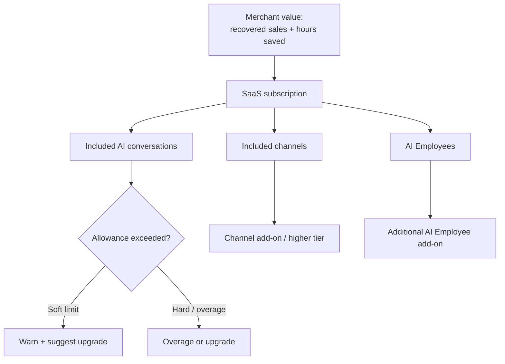
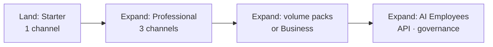
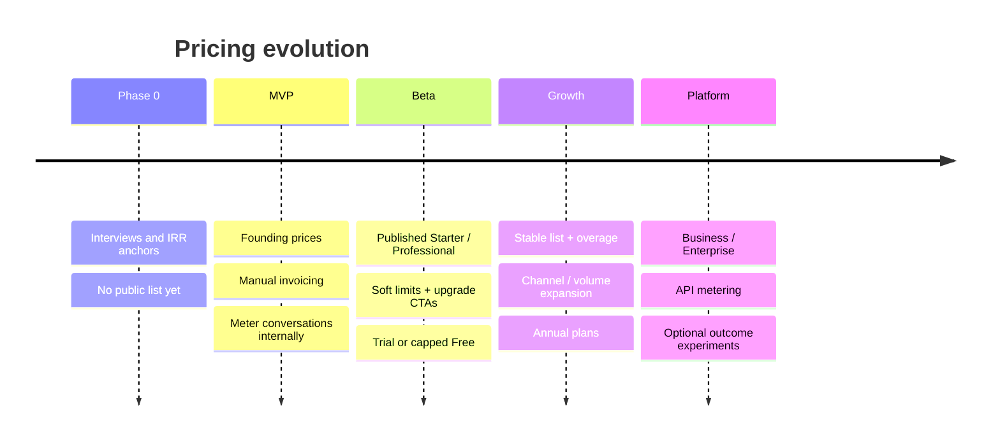

# Pricing Strategy

## Metadata

| Field | Value |
|-------|-------|
| **Version** | 0.1 |
| **Status** | Draft — pricing handbook; not a finance model and not an investor deck |
| **Owner** | Founder / Strategy |
| **Last Updated** | July 22, 2026 |
| **Related Documents** | [Market Research](./market-research.md) · [Business Plan](./business-plan.md) · [Lean Canvas](../00-overview/lean-canvas.md) · [Product Moat](./product-moat.md) · [Vision](../00-overview/vision.md) · [Roadmap](../00-overview/roadmap.md) · [Product Principles](../02-product/product-principles.md) |

**Purpose of this document:** Define how DeloRey AI creates, captures, and expands value through pricing. Every recommendation is justified. Where exact prices, costs, or willingness-to-pay cannot be known, claims are marked **Hypothesis**.

**Product under study:** DeloRey AI — AI Commerce Platform (SaaS), primary product **AI Sales Employee**. Deployment: Cloud SaaS. Initial market: Iranian online shops (Fashion, Cosmetics, Electronics, Accessories, Home Products, Gift Shops). Primary channels: Website, Telegram, Bale.

---

# Executive Summary

DeloRey AI should price on **merchant outcomes**, not on feature checklists. Merchants do not buy “AI chat.” They buy recovered conversations, hours not spent answering the same fifteen questions, and a second shift that does not quit. Pricing that fails to map to that story will either leave money on the table or fail to clear Iranian SMB capital constraints.

**Pricing philosophy (recommended):** Value-based SaaS subscription with a **conversation allowance** as the primary usage fence, **connected channels** as the primary expansion lever, and soft→hard limits that protect margins without surprising merchants. Price cards publish in **IRR for Iran** (and optional USD for international comparison). Global dollar bands in this document are planning hypotheses, not published list prices.

**Business objectives pricing must serve:**

| Objective | Pricing implication |
|-----------|---------------------|
| Easy to understand | ≤5 named tiers; one primary meter; no token jargon on the sales page |
| Easy to sell | ROI frame in 30 days; seat count is not the pitch |
| Easy to scale | Self-serve Starter/Professional; sales-assisted Business/Enterprise |
| Healthy SaaS margins | Conversation caps + overage floor must cover LLM + infra with target gross margin |
| Reflect business value | Package outcomes (channels live, attribution, AI Employees), not widget features |
| Support future expansion | Add-ons and higher tiers for channels, AI Employees, API, governance |

**Expected pricing evolution:** Phase 0–Beta uses founding / pilot prices to learn WTP. Growth introduces stable list prices and overage. Platform adds Enterprise governance, API, and multi-workspace packaging. Early prices should be treated as **learning instruments**, not sacred contracts with the market.

**Current assumptions (all Hypothesis until Phase 0–2 validation):**

1. Merchants will pay roughly **$99–499/month** (IRR equivalent) for Starter→Professional when ROI is visible within ~30 days ([Lean Canvas](../00-overview/lean-canvas.md), [Market Research](./market-research.md)).
2. Conversation-based allowances are understandable enough for SMB buyers if framed as “monthly AI conversations,” not tokens.
3. Financing scarcity in Iran compresses budgets; payback ≤60 days is a GTM requirement, not a nice-to-have.
4. Gross margin of **60–70%** at scale is achievable if conversation economics are instrumented and overage floors are enforced.
5. A limited Free plan or time-boxed trial is useful for discovery; unlimited freemium is not.

---

# Pricing Philosophy

## Why value, not features

Feature-priced AI products race to the bottom. Competitors can copy “website widget + Telegram bot + FAQ upload” in months. Merchants already tried generic bots and turned many of them off. DeloRey’s differentiation is **commerce-grounded answers + omnichannel continuity + revenue attribution**. Pricing must sell that differentiation.

**Value-based pricing** means: the list price sits below the merchant’s expected economic benefit (recovered GMV + avoided headcount + founder time) and above our fully loaded cost of delivering resolved conversations at target margin.

**ROI pricing** means: every sales conversation and every in-product upgrade moment answers “what did this pay for itself with?” Prefer before/after: median first-response time, resolution rate, attributed orders, support hours displaced. Do not lead with model names or message counts alone.

**Outcome pricing** (pure revenue share on attributed GMV) is attractive in theory and dangerous in practice for MVP: attribution disputes, COD/card-to-card ambiguity, and merchant distrust of “we take a cut of your sales.” **Hypothesis:** Outcome framing belongs in marketing and success reports; outcome *billing* belongs later, if at all, as an Enterprise option.

**Subscription psychology:** Recurring SaaS is familiar to Iranian merchants who already pay for storefronts, IPG fees, and Instagram tools. Predictable monthly cost beats surprise usage bills — especially under inflation and financing stress. Usage should **fence** the plan, not redefine the invoice every week.

**Merchant expectations in this market:**

| Expectation | Pricing response |
|-------------|------------------|
| “Show me it works before I pay much” | Trial or Free with hard caps; design-partner pilots |
| “I already pay too many tools” | One AI Employee product, not a suite of add-on SKUs early |
| “Wrong AI damages my brand” | Price includes guardrails and escalation — do not sell autonomy as a paid upsell that implies cheaper tiers are unsafe |
| “Budget is IRR and tight” | Local currency billing; annual discount for cash-flow predictability |

---

# Pricing Principles

| Principle | Rule | Rationale |
|-----------|------|-----------|
| **Simple** | Five tiers max on the public page | SMB buyers abandon complex matrices |
| **Predictable** | Base subscription dominates the bill; overage is exceptional | Financing-constrained buyers hate bill shock |
| **Transparent** | Publish included conversations, channels, users, AI Employees | Hidden limits destroy trust after chatbot disappointment |
| **No hidden costs** | Setup fees only for Enterprise custom work, disclosed in SOW | Early GTM must feel fair |
| **Upgrade naturally** | Limits and channel needs pull upgrades; do not trap merchants | Expansion revenue > coercive gating |
| **No lock-in** | Monthly available; data export; cancel without hostage features | Long-term NRR depends on voluntary retention |
| **Fair usage** | Soft warnings before hard stops; clear abuse policy | Protects margins and neighbor merchants on shared infra |
| **High perceived value** | Anchor against a part-time hire or lost night/weekend sales, not against a $20 chatbot | Value frame must match “AI Sales Employee” positioning |
| **Separate safety from luxury** | Core accuracy/guardrails on all paid tiers | Never monetize “don’t hallucinate” as Premium-only |

---

# Pricing Model

## Core model: SaaS subscription + conversation allowance

**Recommendation:** Primary commercial model is a **monthly (or annual) SaaS subscription** that includes:

- One workspace / store (higher tiers may expand)
- A defined set of connected channels
- A monthly **AI conversation** allowance
- Included human users for the control plane
- One or more **AI Employees** (Sales primary; Support/others later)

Overage and add-ons sit on top. This matches how merchants already buy SaaS, maps to our variable LLM cost, and stays sellable without a finance degree.

## Alternatives evaluated

| Model | Verdict | Why |
|-------|---------|-----|
| **Per-seat (human users)** | Reject as primary | Value is not “more staff logins”; AI replaces / amplifies seats. Seat caps can be secondary for Business/Enterprise collaboration. |
| **Per-agent / per–AI Employee** | Accept as secondary expansion | Extra specialized Employees (Returns, Wholesale) are natural upsells later; do not make “one bot = one SKU” the only meter at MVP. |
| **Per-message / per-token** | Reject for public pricing | Opaque to merchants; correlates poorly with value; creates anxiety. Useful internally for cost accounting only. |
| **Per-conversation** | Accept as **meter / fence**, not sole invoice | Closest proxy to cost and to work done; package into allowances so the default bill is flat. |
| **Per-order / % of assisted GMV** | Defer | Highest theoretical capture; weakest early measurement and trust. Revisit at Platform/Enterprise. |
| **Revenue sharing** | Reject for MVP | Attribution fights + financing optics (“taking sales cut”) hurt close rates. |
| **Hybrid (sub + overage)** | Accept | Best balance of predictability and margin protection. |
| **One-time license** | Reject | Misaligned with continuous LLM/infra cost and product improvement. |

---

# Pricing Metrics

## Metric evaluation

| Metric | Pros | Cons | Role |
|--------|------|------|------|
| **Workspace** | Simple account boundary | Weak value signal alone | Packaging boundary |
| **Store** | Aligns with Commerce Core sync | Multi-store merchants need clear rules early | Primary packaging unit (1 store default) |
| **Connected Channel** | Maps to real expansion (web → Telegram → Bale → later IG/WA) | Channel ≠ volume; quiet channel still costs support | **Primary expansion metric** |
| **AI Conversation** | Correlates with LLM cost and work done; explainable | Definition disputes (what ends a conversation?) | **Primary usage metric** |
| **AI Resolution** | Outcome-flavored | Harder to bill fairly; invites gaming | Success KPI, not billable meter |
| **Orders Assisted** | Strong value story | Attribution noise (COD, multi-touch) | Dashboard / ROI, not early billing |
| **Revenue Generated** | Best capture in theory | Dispute risk; sales friction | Enterprise experiment only |
| **Knowledge Base size** | Easy to meter | Punishes good documentation; weak value link | Avoid as price driver |
| **API usage** | Standard for platform | Irrelevant until Platform phase | Later add-on |
| **Storage** | Cost-linked | Commodity; bad primary story | Fair-use / Enterprise only |

## Choices

| Role | Metric | Justification |
|------|--------|---------------|
| **Primary packaging / expansion** | Connected channels + tier features (analytics, attribution, support) | Channels are how merchants feel growth; omnichannel is core UVP |
| **Primary usage fence** | AI conversations / month | Protects unit economics; understandable |
| **Secondary meters** | AI Employees; human seats (Business+); API calls (Platform) | Expansion without rewriting the core story |
| **Never primary** | Tokens, KB articles, storage | Commodity or hostile to good product behavior |

**Definition (operational — to productize):** An **AI Conversation** is a continuous customer thread on one channel where the AI Employee produces ≥1 grounded reply within a rolling inactivity window (e.g., 24 hours). Exact window is an implementation decision; publish the definition next to pricing. **Hypothesis:** 24h window is acceptable to merchants if escalations and human replies in the same thread do not double-count unfairly.

---

# Packaging Strategy

Recommended public structure: **Free → Starter → Professional → Business → Enterprise**.

Dollar figures below are **Hypothesis** planning anchors from Lean Canvas / Market Research, to be converted to IRR list prices after WTP interviews. Do not treat them as committed list prices.

| Tier | Hypothesis price (USD/mo) | Target customer | Positioning |
|------|---------------------------|-----------------|-------------|
| **Free** | $0 | Curious merchants; product education | Prove connect + one channel; force upgrade for real volume |
| **Starter** | $99–149 | Small shop, mostly one inbox | First paid AI Sales Employee |
| **Professional** | $299–499 | Active omnichannel D2C | Default ICP plan (“Growth” in Lean Canvas) |
| **Business** | $799–1,499 | Higher volume / multi-operator | Scale ops + stronger analytics + priority support |
| **Enterprise** | Custom | Multi-brand, governance, API, SLA | Platform phase; not MVP distraction |

## Tier detail

### Free

| Dimension | Spec (Hypothesis) |
|-----------|-------------------|
| **Target** | Evaluation only — not a forever home for active shops |
| **Channels** | 1 (Website **or** Telegram **or** Bale) |
| **Conversations** | ~50–100 / month hard cap |
| **Users** | 1 |
| **AI Employees** | 1 (Sales) with watermark / “Powered by DeloRey” optional |
| **Analytics** | Basic counts only |
| **Knowledge Base** | Store sync + limited manual notes |
| **Support** | Docs / community only |
| **Upgrade trigger** | Cap hit; need second channel; need attribution; remove limits |

### Starter

| Dimension | Spec (Hypothesis) |
|-----------|-------------------|
| **Target** | Small shop validating ROI on one primary channel |
| **Channels** | 1 included |
| **Conversations** | ~500 / month |
| **Users** | 2 |
| **AI Employees** | 1 |
| **Analytics** | Conversations, resolution, escalations |
| **Knowledge Base** | Full store sync + policies |
| **Support** | Email, standard SLA |
| **Upgrade trigger** | Second channel needed; approaching cap; want conversion attribution |

### Professional

| Dimension | Spec (Hypothesis) |
|-----------|-------------------|
| **Target** | Primary ICP — website + messaging, meaningful volume |
| **Channels** | Up to 3 (Website, Telegram, Bale) |
| **Conversations** | ~2,000 / month |
| **Users** | 5 |
| **AI Employees** | 1–2 (e.g., Sales + light Support skills) |
| **Analytics** | Unified inbox metrics + **conversion / assisted-order attribution** |
| **Knowledge Base** | Sync + richer policy / FAQ controls |
| **Support** | Priority email + onboarding playbooks |
| **Upgrade trigger** | Volume; more seats; custom guardrails; SLA; extra Employees |

### Business

| Dimension | Spec (Hypothesis) |
|-----------|-------------------|
| **Target** | Higher GMV, multiple operators, serious ops |
| **Channels** | 3+; path to future channels as add-ons when launched |
| **Conversations** | ~5,000–10,000 / month (band TBD with cost data) |
| **Users** | 15+ |
| **AI Employees** | Multiple; advanced Skills |
| **Analytics** | Advanced objection taxonomy, cohort ROI reports |
| **Knowledge Base** | Multi-source; approval workflows |
| **Support** | Priority + success check-ins |
| **Upgrade trigger** | Multi-store, SSO, MSA, API, custom models |

### Enterprise

| Dimension | Spec |
|-----------|------|
| **Target** | Multi-brand / multi-workspace; procurement-driven |
| **Includes** | Custom limits, SSO/SAML, audit exports, contractual SLA, dedicated success, optional API, custom Skills, security review |
| **Pricing** | Quote; annual commit preferred |
| **Note** | Do not build Enterprise packaging before Professional retention is real |

**Justification for this ladder:** Free educates; Starter monetizes single-channel proof; Professional captures the omnichannel ICP where DeloRey’s wedge is strongest; Business monetizes intensity; Enterprise waits for platform readiness. Mapping to Lean Canvas: Starter ≈ Starter; Professional ≈ Growth; Business ≈ Scale.

---

# Expansion Revenue

Healthy SaaS companies grow **within** accounts. DeloRey’s expansion map:

| Expansion lever | When | How priced |
|-----------------|------|------------|
| **More channels** | Immediately after MVP channels prove value | Included in higher tiers; or channel add-on (**Hypothesis:** ~20–30% of Starter list per extra channel on Starter) |
| **Higher conversation limits** | When soft caps hit | Upgrade tier or prepaid conversation packs |
| **More AI Employees** | Post-MVP Skills maturity | Per–AI Employee add-on or Business+ inclusion |
| **Advanced analytics / ROI packs** | Growth | Feature of Professional+; deeper packs on Business |
| **API access** | Platform | Metered or Business/Enterprise entitlement |
| **Automation / proactive recovery** | Growth+ | Tier gate or add-on (cart recovery workflows) |
| **Enterprise governance** | Platform | Enterprise SKU |
| **Additional stores / workspaces** | When multi-brand appears | Per-store fee or Enterprise bundle |

**Principle:** Land on value proof (one live channel, measurable resolutions). Expand on **channel coverage** and **conversation intensity** before selling abstract “platform.”

---

# Free Plan Strategy

## Should a Free plan exist?

**Recommendation: Yes, but hostile to freeloading.**

| Argument for Free | Argument against unlimited Free |
|-------------------|----------------------------------|
| Lowers fear after bot failures | LLM cost makes “forever free” toxic |
| Lets merchants complete store connect | Free users consume support and model spend |
| Creates upgrade triggers from real usage | Financing-scarce market may park on Free indefinitely |

**Preferred shape:** Free with **hard** conversation and channel caps, or a **14–30 day full-featured trial** on Professional limits, then collapse to Free or paid. **Hypothesis:** Time-boxed trial converts better than generous freemium for AI products with variable COGS; validate in beta.

## Limits, risks, cost control, upgrade path

| Topic | Guidance |
|-------|----------|
| **Limits** | 1 channel; ~50–100 conversations; 1 user; no attribution; no remove-branding if branding exists |
| **Risks** | Support load; scraped abuse; merchants running production on Free |
| **Cost control** | Hard stop (not soft) on Free; rate limits; abuse detection; no overage on Free — upgrade required |
| **Upgrade path** | In-product: “You hit 80% of Free conversations” → Starter CTA; second channel requires Starter/Professional |

---

# Usage Limits

| Type | Behavior | Use when |
|------|----------|----------|
| **Soft limit** | Warn at 80% / 100% of allowance; suggest upgrade or packs | Paid tiers — preserve goodwill |
| **Hard limit** | Block new AI replies (human inbox still works) after grace | Free; unpaid overage; abuse |
| **Fair usage** | Abnormal multi-store scraping, bot farming, non-commerce spam | All tiers — AUP |
| **Overage** | Per-conversation fee above plan | Paid tiers that opt in |

**Overage pricing (Hypothesis from Lean Canvas):** **$0.05–$0.15** per additional AI conversation, set so that overage gross margin ≥ plan blended margin after LLM + infra. Final number requires measured **cost per conversation** in Persian multi-turn chats — Unknown until instrumentation exists.

**Abuse protection:** Per-IP/workspace rate limits; anomaly alerts; manual suspension; Free hard caps; require store connection before high volume.

**Merchant UX rule:** Never silently throttle quality (cheaper model) to “save cost” without disclosure. If a cheaper model route is used, it must meet the same groundedness bar or escalate.

---

# Unit Economics

This section defines **methodology**, not fabricated P&L. Exact unit costs are **Unknown** until production metering exists.

## Cost stack to measure

| Cost component | How to measure | Pricing implication |
|----------------|----------------|---------------------|
| **LLM inference** | $ / AI conversation and $ / resolved conversation; by model route | Sets overage floor and Free caps |
| **Infrastructure** | Hosting, queues, DB, observability allocated per active merchant and per conversation | Included in subscription floor |
| **Storage / bandwidth** | Media, embeddings, logs retention | Fair use; Enterprise retention SKUs later |
| **Channel costs** | Bot infra; future WhatsApp fees | Channel add-on must cover channel COGS |
| **Support / success** | Hours per merchant tier | Higher tiers price for touch; self-serve must reduce CAC payback |

## Targets (Hypothesis — align with Lean Canvas)

| Metric | Target | Notes |
|--------|--------|-------|
| **Gross margin** | 60–70% at scale; ≥55% acceptable in early Growth | Kill signal if LLM > ~40% of revenue on representative cohort |
| **CAC** | Track manually early; no vanity blended CAC | Founder-led outbound CAC is time-denominated |
| **LTV** | Logo retention × ARPU × gross margin | Unreliable until ≥6 months paid data |
| **Payback** | <6 months on Professional | Financing climate argues for even faster merchant-perceived payback (≤60 days ROI) |

**Method:** For each design partner, log: conversations, tokens, model, infra allocation proxy, support minutes, invoice amount. Build a simple cohort sheet. Do not set list prices below measured P80 cost per conversation × allowance × (1 / target margin).

**Iran FX note:** Plan and report unit economics in **IRR** for local billing; keep a USD shadow ledger for investors. Do not mix FX assumptions into “proven” margins.

---

# Willingness To Pay

## What we know vs. what we guess

| Claim | Class |
|-------|-------|
| Iranian online businesses rank financing as a top challenge (~28.4% in تتا challenge summaries) | Validated Fact (via Market Research) |
| Lean Canvas WTP bands $99–499 / buyer authority $200–2,000 with ROI | Hypothesis |
| Sharp drop above ~$150 without ROI proof | Hypothesis |
| Merchants renew only with visible revenue or hours saved | Industry Observation + Founder Assumption |

## Merchant psychology

Buyers fear: (1) another SaaS fee, (2) brand damage from wrong AI, (3) paying for “chat volume” that does not sell. Pricing and packaging must reduce all three: predictable subscription, safety on all paid tiers, ROI dashboard on Professional+.

## Value anchors (use in sales, not as formula invoices)

| Anchor | Logic |
|--------|-------|
| **Replacement cost** | Part-time support hire or evening coverage — often multiples of Starter/Professional |
| **Alternative cost** | Local Instagram DM tools + generic bots + human overtime; compare outcomes, not feature lists |
| **Time savings** | Founder hours returned weekly — high salience for 2–20 person teams |
| **Revenue generation** | Attributed assisted orders and recovered carts — strongest renewal story |
| **Risk reduction** | Consistent policy answers; escalation instead of confident hallucination |

**Hypothesis:** WTP expands when the pitch is “AI Sales Employee with 30-day report,” and collapses when the pitch is “AI chatbot with X messages.”

---

# Pricing Experiments

Run experiments in order of decisiveness. Failures are useful.

| Experiment | Method | Success signal | Fail signal |
|------------|--------|----------------|-------------|
| **Interview pricing** | 15–20 ICP interviews; anchors $99 / $299 / $499 (IRR equivalents) | ≥30% “likely buy” at ≥$199 with ROI proof | Interest only if free / <$50 |
| **Landing page pricing** | Public tiers, waitlist CTA | Tier mix preference; Professional as modal choice | Everyone clicks Free only |
| **Fake-door / fake pricing** | Checkout CTA before billing live | Click-through to paid intent | High bounce at price reveal |
| **Pilot pricing** | Design partners at founding discount | Paid conversion ≥40% of active pilots in 30 days | Usage without pay |
| **A/B pricing** | Cohort $199 vs $299 Professional | Similar conversion with better LTV at higher price | Cliff above $149 |
| **Annual discount** | Offer ~1.5–2 months free equivalent | ≥25% of paid choose annual when offered | Cash constraint → monthly only |
| **Founding customer** | First N logos locked price 12 months | Fast learning + case studies | Discount expectation forever |

**Rule:** Change one variable per cohort. Instrument conversation COGS in parallel or price tests are meaningless.

---

# Discount Strategy

| Program | Guidance |
|---------|----------|
| **Early adopters / founding** | 30–50% off list for 12 months, then step to list; cap logos; require case study rights | Creates learning, not a permanent underclass |
| **Annual plans** | ~15–20% vs monthly (**Hypothesis**) | Improves cash and retention; do not force under FX volatility without IRR clarity |
| **Enterprise negotiation** | Discount on commit length and prepay, not on safety features | Keep floor above COGS |
| **Partner / agency** | Referral credit or limited partner SKU after product stability | Avoid channel conflict early |
| **Referral credits** | Account credit, not endless free months | Protect margin |
| **What not to discount** | Accuracy, escalation, audit logs | Those are trust, not luxury |

**Discipline:** Every discount has an owner, an expiry, and a reason code in billing. Undocumented discounts become the real price list.

---

# Billing Strategy

| Topic | Recommendation |
|-------|----------------|
| **Monthly** | Default for SMB; required under capital scarcity |
| **Annual** | Encouraged with modest discount; invoiceable |
| **Trials** | 14–30 days Professional-class trial **or** Free forever-caps — pick one primary PLG path in beta |
| **Grace periods** | 3–7 days after failed payment; AI may soft-limit after grace |
| **Failed payments** | Dunning emails; pause AI replies before deleting data; retain data ≥30 days |
| **Invoices** | Self-serve receipts; formal invoices for Business/Enterprise |
| **Taxes** | Follow local tax rules when billing entity is set; do not improvise on the pricing page |
| **Currency** | **IRR list for Iran**; document FX policy if USD charged |
| **Refunds** | Time-boxed for onboarding failure; not for “we didn’t check the dashboard” |

---

# Competitive Pricing

Do not win by being the cheapest chatbot. Compare **job-to-be-done and value capture**.

| Competitor class | Examples | How they monetize | DeloRey posture |
|------------------|----------|-------------------|-----------------|
| **Live chat / inbox** | Intercom, Zendesk | Seats + tiers; messaging add-ons | We are not a helpdesk; avoid seat-led packaging that invites Intercom comparison on their terms |
| **SMB chatbots** | Tidio | Freemium + conversation tiers | Compete on commerce grounding + attribution, not on cheapest conversation |
| **Messaging automation** | ManyChat | Contacts / automation | They optimize broadcasts; we optimize sales dialogue + catalog truth |
| **Bot platforms** | Botpress | Self-hosted / platform usage | We sell outcomes to merchants, not frameworks to builders |
| **CRM suites** | HubSpot | Seat + CRM hub | Adjacent; different buyer motion; do not price like a CRM |
| **Local IG/DM tools** | InstaCRM, Yektabot, Roboclick, Gofta-class | Often IRR subscriptions / chat limits (**tear down required**) | Closest price anchors for Iran; differentiate on Telegram/Bale/web + store sync + ROI |

**Value comparison lens:**

| Dimension | Typical chatbot / inbox | DeloRey AI (intended) |
|-----------|-------------------------|------------------------|
| Grounding | FAQ / docs | Live catalog, inventory, orders |
| Channel focus | Web / IG / WA | Website + Telegram + Bale (MVP) |
| Success metric | Messages, tickets | Assisted revenue + hours saved |
| Risk | Fluent wrong answers | Guardrails + escalation as default |
| Price story | Cheap automation | Paid employee substitute with ROI |

**Future Validation:** Tear down five local competitors’ IRR price cards and feature depth; mystery-shop accuracy. Until then, global USD competitor prices are weak anchors for Iranian SMB WTP.

---

# Risks

| Risk | Symptom | Mitigation |
|------|---------|------------|
| **Pricing too low** | High usage, thin margin, “AI employee” undervalued | Raise with ROI proof; enforce overage; kill Free abuse |
| **Pricing too high** | Trials without conversion; “no budget” dominates | IRR packaging; Starter land; 30-day ROI reports |
| **Wrong metric** | Merchants feel punished for documenting KB or adding seats | Stick to conversations + channels |
| **Feature gating** | Safety or core sync locked behind Enterprise | Gate intensity and collaboration, not truthfulness |
| **Complex pricing** | Sales calls spent explaining matrices | Five tiers; one meter; add-ons later |
| **Unsustainable margins** | Persian multi-turn chats blow token budgets | Model routing; caching; resolution-focused prompts; hard Free caps |
| **Discount culture** | Every deal is custom | Founding window only; then list discipline |
| **Outcome-billing premature** | Attribution disputes | Keep GMV share off the invoice until measurement is trusted |

---

# Success Metrics

Track pricing health separately from vanity signups.

| Metric | Definition | Why it matters |
|--------|------------|----------------|
| **MRR** | Monthly recurring revenue (IRR and USD shadow) | Top-line SaaS health |
| **ARPU** | MRR / paying merchants | Packaging mix quality |
| **Expansion Revenue** | Upsells, add-ons, overage | Multi-product motion without new logos |
| **NRR** | Net revenue retention | Long-term pricing correctness |
| **Gross Margin** | (Revenue − COGS) / Revenue | Survival under LLM costs |
| **Trial → Paid** | Conversion within window | PLG / Free design quality |
| **Upgrade Rate** | Free→Starter; Starter→Professional | Fence placement |
| **Logo Churn** | Non-renewal | Value delivery vs price |
| **Overage incidence** | % accounts hitting overage | Cap calibration |
| **Cost / resolved conversation** | Internal | Sets floors |

**Early targets (Hypothesis, from Lean Canvas / Roadmap):** First **$10K MRR** milestone; ≥75% month-2 retention on first paid cohort; path to ≥55–60% gross margin on Professional.

---

# Pricing Roadmap

| Phase | Pricing posture |
|-------|-----------------|
| **Phase 0** | Validate WTP; gather local competitor IRR cards; choose trial vs Free primary path |
| **MVP** | Concierge pilots; founding discounts; instrument COGS; do not over-automate billing |
| **Beta** | Self-serve Starter/Professional; clear allowances; upgrade triggers in-product |
| **Growth** | Business tier; packs; annual; partner referrals; margin governance |
| **Platform** | Enterprise; API; multi-workspace; revisit GMV-share only with trusted attribution |

Pricing evolves from **learning instrument → list discipline → expansion architecture**. Skipping straight to Enterprise complexity before Professional retention is a common failure mode — avoid it.

---

# Final Recommendations

| Decision | Recommendation |
|----------|----------------|
| **Philosophy** | Value / ROI based; outcomes in the story; subscription on the invoice |
| **Model** | SaaS subscription + AI conversation allowance + channel-led expansion; hybrid overage on paid tiers |
| **Packaging** | Free (hostile caps) · Starter · Professional · Business · Enterprise |
| **Primary meters** | Channels (expansion) + AI conversations (usage fence) |
| **Price bands** | **Hypothesis:** Starter $99–149 · Professional $299–499 · Business $799+ · Enterprise custom — publish in IRR after validation |
| **Experiments** | Interview anchors → pilot conversion → $199 vs $299 cohort → annual take-rate |
| **Biggest risks** | Underpricing into LLM insolvency; overpricing without ROI proof under financing scarcity; seat-led packaging that mis-positions the product |

**Operating rule:** No list price ships without (1) a written definition of AI Conversation, (2) a measured or bounded cost-per-conversation assumption, and (3) an in-product upgrade path that does not surprise the merchant.

**Next update trigger:** After Phase 0 WTP interviews and the first instrumented design-partner cohort — replace Hypothesis bands with evidence-backed IRR list prices and confirmed allowance sizes.

---

## Document Notes

This is an **internal pricing handbook**, not a spreadsheet forecast and not a pitch deck. Numbers labeled Hypothesis are directional. Update alongside [Market Research](./market-research.md) and [Lean Canvas](../00-overview/lean-canvas.md) when validation gates pass or fail.
