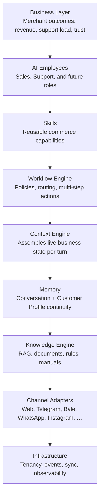

# Product Moat

## Metadata

| Field | Value |
|-------|-------|
| **Version** | 1.0 |
| **Status** | Active — strategy reference for founders, investors, and architecture |
| **Owner** | Founder / Strategy |
| **Last Updated** | July 20, 2026 |
| **Related Documents** | [Vision](../00-overview/vision.md) · [Lean Canvas](../00-overview/lean-canvas.md) · [Business Plan](./business-plan.md) · [Glossary](../00-overview/glossary.md) · [Roadmap](../00-overview/roadmap.md) |

---

## Executive Summary

### What is a Product Moat?

A product moat is the set of structural advantages that make a business harder to displace as it grows. It is not a feature list, a brand slogan, or a temporary lead in model quality. A moat is what remains after a well-funded competitor copies the visible product: switching costs, proprietary data loops, integration depth, ecosystem lock-in, and trust that compounds with usage.

In software, durable moats usually come from one or more of the following: data that improves with every customer interaction; workflows that become embedded in daily operations; networks of developers or partners who extend the platform; and measurement systems that prove economic value so renewal becomes rational, not emotional.

### Why does it matter?

Without a moat, growth is rented. Customer acquisition can look healthy while retention stays fragile. Competitors with distribution advantages — storefront platforms, messaging giants, or global SaaS incumbents — can absorb a thin product layer overnight. Investors correctly discount companies whose differentiation rests on prompting a frontier model behind a polished interface. Founders who ignore this end up in a race on model APIs, pricing, and UI polish — races they rarely win.

A moat matters operationally as well. It tells the product and engineering organizations what to deepen, what to leave commoditized, and where not to chase fashion. It separates work that compounds from work that only looks impressive in a demo.

### Why does Seloma AI need one?

Seloma AI sits in a category that is already crowded with wrappers: chat widgets, helpdesk AI add-ons, and “AI for Instagram DMs.” The company will not win by claiming smarter language generation. Language generation is becoming a utility. Seloma AI must win by becoming the **operating layer** that connects commerce reality — products, customers, orders, policies, inventory — to AI Employees that sell and support across channels, and by proving revenue outcomes merchants can measure.

This document explains the strategic stack that can create that moat, the mechanisms by which each layer compounds, the honest limits of our network effects today, the risks that can erode advantage, and the continuous practices required to strengthen defensibility over time. The thesis is simple: **Seloma AI becomes defensible when removing it would visibly hurt revenue, knowledge continuity, and operational coverage** — not when it merely answers questions faster than a human for a week.

---

## Why AI Wrappers Fail

### Calling GPT APIs is not a business

A product that routes user text to a large language model and returns a reply is a thin client on someone else’s intelligence. Margins compress as model providers improve their own APIs and as competitors gain the same access. Differentiation collapses to prompt quality, latency, and UI — all of which are easy to copy. When OpenAI, Anthropic, Google, or Meta ship a better base model, every wrapper improves at once; none of them owns the improvement.

Worse, wrappers inherit the model’s failure modes. Without business context, they invent product specs, invent policies, and invent promises. In commerce, a confident wrong answer is more damaging than silence. Merchants who try wrappers often disable them after brand damage. That pattern is already visible in our target market: founders who “tried a chatbot” and turned it off.

A durable business in this category must own the **system around the model**: live data, memory, tools, workflows, guardrails, and outcome measurement. The model is a component. The operating system is the product.

### UI alone is not enough

A beautiful chat widget or inbox does not create switching costs. Live chat vendors have competed on interface for a decade; merchants still churn when ROI is unclear. UI can accelerate adoption and reduce training friction, but it does not protect against a competitor who ships a similar surface with deeper integrations or better distribution.

For Seloma AI, interface quality is table stakes for trust — merchants must see conversations, escalations, and attribution clearly — but the moat lives underneath the glass: Commerce Context Graph, Memory, Knowledge Engine, Skill Runtime, and Revenue Intelligence.

### Prompts are not a moat

Prompt engineering can improve demos. It cannot survive as a competitive barrier. Prompts leak through employees, agencies, screenshots, and reverse engineering. They do not accumulate customer-specific truth. A prompt that says “be helpful and sell more” does not know that size M of the blue hoodie is out of stock, that this customer already asked about COD on Telegram yesterday, or that refunds over a threshold require manager approval.

In Seloma AI’s product philosophy, **context beats clever prompts**. Prompts remain necessary as control surfaces for tone and role. They are not the asset. The asset is the grounded business state the AI Employee operates on, and the Skills and Workflows that turn language into commerce actions.

| Thin layer (fails as moat) | Structural layer (can compound) |
|----------------------------|----------------------------------|
| Model API access | Commerce Context Graph + live sync |
| Chat UI | AI Employee Runtime with tools and guardrails |
| Prompt library | Knowledge Engine + Memory across channels |
| “AI support” branding | Revenue attribution merchants renew against |
| Single-channel bot | Channel Adapters with replaceable surfaces |

---

## Seloma AI Strategic Layers

Seloma AI is designed as a layered Commerce Operating System. Each layer has a job. Upper layers create merchant value; lower layers create durability. Competitors can copy a single layer. Copying the stacked system — and the data that fills it over years — is a different problem.



| Layer | Strategic role | Why it matters for the moat |
|-------|----------------|------------------------------|
| **Business Layer** | Defines success in merchant terms | Forces product decisions toward ROI, not vanity AI metrics |
| **AI Employees** | Opinionated roles with goals and metrics | Matches how merchants buy (“hire sales coverage”), not how engineers design bots |
| **Skills** | Capability units under guardrails | Extensibility without becoming a generic bot builder |
| **Workflow Engine** | Encodes operational policy | Switching cost: policies live in the system, not in people’s heads |
| **Context Engine** | Grounds every reply in live truth | Differentiates accuracy from fluent hallucination |
| **Memory** | Continuity across time and channels | Makes omnichannel feel like one employee, not three bots |
| **Knowledge Engine** | Captures what sync cannot | Deepens merchant-specific intelligence |
| **Channel Adapters** | Delivery abstraction | Protects the brain when surfaces change |
| **Infrastructure** | Isolation, reliability, scale | Prerequisite for trust and enterprise expansion |

The rest of this memo unpacks the seven moats that sit across these layers. They are interdependent. Strengthening one without the others produces a feature. Strengthening them together produces an operating system merchants depend on.

---

## Moat 1 — Commerce Context Graph

### What it is

The Commerce Context Graph is the living model of a merchant’s business as it relates to customer conversations: products, variants, prices, inventory signals, customers, orders, policies, and the relationships among them. It is not a CRM dump or a nightly CSV. It is the structured state the Context Engine consults before an AI Employee speaks or acts.

| Entity | What the graph holds | Why conversations need it |
|--------|----------------------|---------------------------|
| **Products** | Titles, attributes, variants, media, categories | Accurate recommendations and fit answers |
| **Customers** | Identity links, preferences, prior objections | Personalization without re-asking |
| **Orders** | Status, line items, fulfillment, returns eligibility | Post-purchase truth instead of guesswork |
| **Policies** | Shipping zones, returns, COD rules, discount limits | Consistent promises across channels |
| **Inventory** | Availability and stock constraints | Prevents selling what cannot ship |
| **Relationships** | Product↔policy, customer↔orders, SKU↔objections | Enables multi-hop reasoning (“this order + this return window”) |

### Why it becomes unique over time

On day one, the graph looks like any integration: Shopify or WooCommerce sync plus policy text. That is table stakes, not a moat. Uniqueness appears as the graph accumulates **conversation-linked edges**: which products generate which objections; which policy edges cause escalations; which customer identities resolve across Telegram and web; which inventory states correlate with abandoned intent.

Those edges are permissioned, merchant-specific, and expensive to recreate. A competitor can connect to the same storefront API. They cannot instantly recreate months of grounded interventions, correction loops, and relationship density. The graph also creates switching cost: AI Employees trained on edge cases (engraving rules, regional COD exceptions, size chart quirks) degrade when the merchant leaves — and the merchant feels that degradation in conversion and support quality.

**Architectural implication:** Commerce Core and Context Engine are not “integration work.” They are the foundation of the company’s claim to be a Commerce OS rather than a chatbot.

---

## Moat 2 — Conversation Memory

### What it is

Conversation Memory is the continuity layer that makes an AI Employee behave like a colleague who was present for prior interactions — not a goldfish that resets every session and every channel.

| Memory dimension | Description | Merchant / customer value |
|------------------|-------------|---------------------------|
| **Long-term memory** | Durable facts and preferences beyond a single thread | Fewer repetitive questions; better recommendations |
| **Customer history** | Prior conversations, purchases, escalations | Trust and speed for returning buyers |
| **Business history** | How this merchant’s edge cases were resolved | Institutional knowledge that does not quit |
| **Personalization** | Tone, product interest, objection patterns per customer | Higher conversion without creepy overreach |
| **Cross-channel memory** | One Customer Profile across web, Telegram, Bale, and future channels | Shoppers never restart the story |

### Why memory is a moat

Memory is easy to demo and hard to operationalize. It requires identity resolution across channels (often imperfect), careful retention and privacy controls, and retrieval that stays relevant without drowning the model in noise. Merchants who rely on Seloma AI for omnichannel continuity face a real cost to switch: their customer history and intervention patterns live in our Workspace. Competitors offering “memory” as a feature flag without commerce linkage produce sticky chat logs, not sticky revenue systems.

Memory also feeds Revenue Intelligence and the Knowledge Engine: repeated objections become structured insight; corrected answers become better grounding. Memory that is only a transcript store is weak. Memory that is linked to products, orders, and outcomes compounds.

**Honest limit:** Memory moats are tenant-local first. Cross-merchant learning, if ever pursued, must be privacy-preserving and opt-in. We do not claim a Facebook-scale social graph. We claim operational continuity that becomes painful to rip out.

---

## Moat 3 — Business Knowledge Engine

### What it is

Store sync captures catalog and orders. It does not capture everything a human seller knows: sizing PDFs, authenticity statements, seasonal exceptions, brand voice constraints, warranty nuances, or “we never discount this line.” The Business Knowledge Engine is the system that stores, retrieves, and governs that knowledge so AI Employees can cite it.

| Component | Role |
|-----------|------|
| **Knowledge Base** | Structured FAQs, policies, synced facts, merchant overrides |
| **RAG** | Retrieve relevant chunks before generation; ground answers in sources |
| **Business Rules** | Machine-enforceable constraints (discount caps, blocked topics, handoff triggers) |
| **Documents** | Uploaded manuals, size charts, brand guides |
| **Policies** | Shipping, returns, payment, regional rules |
| **Product Manuals** | Specs and care instructions beyond short product descriptions |

### Why it strengthens defensibility

Knowledge quality is a retention engine. Merchants who invest hours uploading documents, correcting answers, and refining rules are building **private training signal** into Seloma AI. That investment is the merchant’s asset, but it is also Seloma’s switching cost — similar to how companies stay on Salesforce after years of process encoding.

RAG alone is not a moat; every vendor claims RAG. The moat is the combination of RAG with Commerce Context Graph, Memory, Skills, and auditability: merchants can see what the Employee knew, why it answered, and when it escalated. Trust compounds when wrong answers are rare and recoverable. Trust collapses when the system is a black box.

**Product rule:** Features that improve knowledge coverage, freshness, and citability outrank features that add conversational flair without grounding.

---

## Moat 4 — AI Employee Runtime

### What it is

The AI Employee Runtime is the execution environment for opinionated business roles. An AI Employee is not a chatbot with a persona. It is a role with goals, Skills, Workflows, Memory access, and Guardrails — measured against commerce outcomes.

| Runtime element | Meaning |
|-----------------|---------|
| **AI Employees** | Sales, Support, and later Marketing, Analytics, Operations, custom roles |
| **Goals** | Convert assisted sessions; resolve routine support; escalate correctly |
| **Tools** | Catalog lookup, order status, discount application, handoff |
| **Skills** | Reusable capability units invoked under policy |
| **Workflows** | Multi-step routing and approval sequences |
| **Memory** | Thread and Customer Profile continuity |
| **Guardrails** | Confidence thresholds, discount limits, blocked actions, human approval |

Conceptual flow (aligned with the Business Plan):

```
LLM → Prompt Builder → Context Engine → Memory → Skill Engine → Workflow Engine → Guardrails → Response Formatter
```

### Why this is more powerful than a chatbot

Chatbots optimize for conversation trees and intent coverage. AI Employees optimize for **job completion inside a business**. A Sales Employee that cannot check inventory is not a sales employee. A Support Employee that cannot see order status is a FAQ page with manners.

The Runtime creates three strategic advantages:

1. **Composition** — New roles reuse Skills, Memory, and Knowledge instead of rebuilding trees.
2. **Control** — Merchants buy autonomy gradually; handoff and audit are first-class.
3. **Expandability** — Services and enterprise industries can plug into the same Runtime with different Skills and connectors — protecting the long-term architecture thesis without diluting the commerce wedge.

A chatbot competitor can add an LLM tomorrow. Rebuilding a reliable Runtime with commerce tools, guardrails, and multi-channel formatting is multi-year product work. That gap is where Seloma AI must live.

---

## Moat 5 — Skill Marketplace

### What it is

Skills are the unit of extensibility. Product Search, Recommendation, Refund, Escalation, Shipping, Coupon — each is a capability the Skill Engine can invoke under Guardrails. Over time, Skills become a marketplace: reusable packages built by Seloma, partners, and third-party developers, distributed through a Skill Store.

| Stage | Skill ecosystem state | Monetization |
|-------|----------------------|--------------|
| **MVP / Growth** | First-party Skills for Sales + Support | Included in subscription |
| **Platform** | Partner Skills (loyalty, B2B quoting, vertical packs) | Revenue share / listing fees |
| **Scale** | Certified Skill Store with governance | Platform take rate + enterprise custom Skills |

### Why a marketplace can become a moat

Marketplaces create **developer ecosystem effects**: more Skills attract more merchants; more merchants attract more developers. They also create switching costs — workflows composed from Skills do not port cleanly to a rival runtime.

This moat is **aspirational until earned**. Shipping a marketplace too early produces empty shelves and support burden. The correct sequence is: prove first-party Skills on real GMV → open APIs for agencies → certify partner Skills → Skill Store. The architectural investment (Skill Engine, permissions, sandboxing, billing hooks) must start early so the marketplace is possible later. The business claim of “ecosystem moat” should wait until third parties generate meaningful merchant value.

**Strategic caution:** A Skill Marketplace must not turn Seloma AI into a generic bot builder. Opinionated Employees remain the product; Skills extend them. We stay a Commerce OS, not an IFTTT for chat.

---

## Moat 6 — Channel Adapters

### What it is

Channel Adapters translate between Seloma AI’s internal Conversation model and each surface’s API, formatting rules, and authentication: website widget, Telegram, Bale, Instagram, WhatsApp, and future channels (email, SMS, voice).

| Channel | Role in strategy |
|---------|------------------|
| **Website** | High-intent storefront conversations; easiest attribution |
| **Telegram** | Primary messaging surface in initial market |
| **Bale** | Regional channel where global incumbents under-invest |
| **Instagram** | Discovery-to-DM path (post-MVP expansion) |
| **WhatsApp** | MENA / international messaging expansion |
| **Future channels** | Email, SMS, voice — same brain, new adapters |

### Why channels become replaceable

If business logic lives inside a Telegram bot, Telegram policy changes become existential. If business logic lives in the Runtime — Context, Memory, Skills, Workflows — then Telegram is a delivery pipe. Adapters are valuable and non-trivial (especially regional ones), but they are **strategically fungible**. The moat is not “we have a Bale bot.” The moat is “the Employee brain keeps working when the customer moves channels or when a channel API changes.”

Regional adapters (Bale + Telegram commerce workflows) are an **early distribution and execution advantage**, particularly while global suites under-serve Persian-language, messaging-first merchants. That advantage is real and time-bounded. It must be converted into deeper Context Graph, Memory, and Revenue Intelligence before global platforms catch up on those surfaces.

---

## Moat 7 — Revenue Intelligence

### What it is

Revenue Intelligence turns conversations into economic signal. Without it, Seloma AI is another inbox with AI. With it, merchants renew because they can see money and time.

| Capability | What it surfaces |
|------------|------------------|
| **Conversation analytics** | Volume, resolution, escalation, response latency |
| **Revenue attribution** | Links between conversation → intervention → purchase / recovery |
| **Customer objections** | Taxonomy of blockers (size, shipping, authenticity, price) |
| **Conversion insights** | Assisted vs. unassisted conversion patterns |
| **Sales recommendations** | Product page fixes, policy clarity, inventory alerts from dialogue |

### Why this is strategically decisive

ROI proof is the sales motion and the retention motion. Attribution graphs that connect messaging events to commerce outcomes are difficult to assemble without deep integrations and longitudinal data. They also create a data asset competitors cannot scrape: **permissioned intervention outcomes**.

Revenue Intelligence feeds the flywheel: better insight → better Skills and Knowledge → higher ROI → more customers and more channels per customer. It also disciplines product: features that do not move a measurable metric should not ship.

**Honest limit:** Attribution in messaging-heavy funnels is noisy. We must be rigorous — directional confidence intervals and merchant-visible methodology — or we become another vendor that “claims ROI.” Credibility is part of the moat.

---

## Flywheel

The compounding loop Seloma AI must build and protect:


| Stage | What improves | What breaks the loop |
|-------|---------------|----------------------|
| **More Customers** | Coverage across SKUs, verticals, edge cases | Poor onboarding; weak ICP fit |
| **More Conversations** | Training signal and objection diversity | Hallucinations that cause disablement |
| **Better Knowledge** | Fresher policies, richer manuals, corrected answers | Stale sync; no merchant correction UX |
| **Smarter AI Employees** | Higher resolution, better recommendations | Skills without guardrails; unsafe autonomy |
| **Higher ROI** | Renewals, expansion to more channels/Employees | Attribution theater; unproven lift |

This flywheel is **not automatic**. It requires product quality gates (accuracy, handoff, sync health) so volume improves the system instead of amplifying errors. A broken flywheel with high volume is a liability.

Secondary loops sit inside the primary one:

- **Channel expansion loop:** ROI on web → enable Telegram/Bale → denser Memory → higher conversion → expand further.
- **Skill expansion loop:** Proven Sales Skills → Support Skills → partner Skills → marketplace.
- **Vertical loop:** Fashion objections → fashion Knowledge packs → faster time-to-value for next fashion merchant.

---

## Network Effects

Honest assessment — what we have, what we might earn, and what we should not claim.

| Effect type | Status for Seloma AI | Explanation |
|-------------|----------------------|-------------|
| **Data network effects** | **Weak → potential medium (tenant-local strong)** | Each merchant’s data strongly improves *that* merchant’s Employees. Cross-merchant learning is limited by privacy and heterogeneity. Aggregated, anonymized objection patterns *may* improve vertical packs later — not a classic two-sided data flywheel today. |
| **Product network effects** | **Low today; medium if marketplace lands** | Users do not become more valuable to each other merely by chatting. Value is B2B SaaS utility, not social network density. |
| **Developer ecosystem effects** | **Latent** | Appear only when Skill Store / APIs have real third-party supply. Until then, treat as roadmap optionality, not current moat. |
| **Partner effects** | **Emerging** | Agencies and storefront implementers can create distribution. Strong if onboarding and Skill packaging make Seloma the default “AI Employee layer” they install. |
| **Brand effects** | **Early / fragile** | Brand can help in a regional niche (“the Commerce OS for messaging-first shops”), but brand alone will not stop Shopify AI or Meta. Brand follows retained ROI case studies. |

**Investor-grade summary:** Seloma AI’s near-term defensibility is primarily **integration depth + switching cost + ROI measurement**, not classical network effects. Claiming “AI network effects” without cross-tenant mechanisms would be dishonest. Building toward privacy-safe vertical intelligence and a Skill ecosystem is the path to stronger network dynamics later.

---

## Why This Is Difficult To Copy

Difficulty to copy is not impossibility. Well-funded teams can rebuild pieces. The barrier is **rebuilding the stacked system with production trust under real merchant load**.

| Factor | Why copying is hard |
|--------|---------------------|
| **Architecture** | Runtime + Context + Memory + Skills + Workflows + Adapters is multi-year systems work; demos hide the hard parts (sync drift, identity, guardrails, formatting). |
| **Knowledge** | Merchant-specific Knowledge Bases and correction histories do not transfer to a new vendor overnight. |
| **Execution** | Omnichannel commerce quality in Persian + regional channels requires sustained operational excellence, not a weekend integration. |
| **Customer integrations** | Deep store + messaging connections, failure modes, and edge-case handling create implementation debt competitors must re-pay. |
| **Data quality** | Clean Context Graphs and reliable attribution require discipline; most wrappers skip this and fail on accuracy. |
| **Experience** | Human handoff, audit logs, and merchant control plane build trust that takes repeated successful interventions. |
| **Trust** | Once merchants depend on Seloma for night/weekend revenue coverage, rip-and-replace risk rises — but only if accuracy stays high. |

Copying the **idea** of AI Employees is trivial. Copying a merchant’s operational dependency is not. The strategy is to convert early channel advantages into dependency before better-distributed competitors arrive with “good enough” AI.

---

## Strategic Risks

Moats erode. The following risks can weaken Seloma AI’s defensibility if ignored.

| Risk | How it weakens the moat | Response direction |
|------|-------------------------|--------------------|
| **OpenAI / frontier model improvements** | Better base models shrink the gap for thin wrappers; buyers may try “ChatGPT + Shopify” first | Own context, tools, workflows, and attribution — not model brand |
| **Shopify AI / storefront copilots** | Distribution advantage inside the checkout and admin | Go deeper on omnichannel messaging, regional channels, and cross-storefront abstraction; become the conversation OS storefront AI does not fully cover |
| **Meta AI on WhatsApp / Instagram** | Platform can insert AI into DMs at the source | Keep adapters thin; deepen merchant-owned Memory, Knowledge, and Skills that Meta will not operate for every SMB catalog |
| **Channel policy / API changes** | Telegram, Bale, or WhatsApp rules can break bots | Channel abstraction; multi-channel diversification; never bury logic in one adapter |
| **Commoditized LLMs** | Price competition on “chat AI” intensifies | Compete on Commerce OS outcomes and switching costs; price on value tiers, not tokens |
| **Accuracy failures at scale** | One public hallucination cluster destroys trust moat | Conservative autonomy, escalation, evaluation harnesses, sync health SLOs |
| **Attribution skepticism** | If ROI dashboards look like marketing theater, renewals die | Transparent methodology; conservative credit; case studies with merchant verification |
| **Premature marketplace** | Empty Skill Store damages brand | Sequence: first-party excellence → partner pilots → open store |
| **Over-expansion beyond commerce wedge** | Dilutes Context Graph quality and ICP focus | Prove online commerce ROI before services/enterprise breadth |

**Governing principle:** Treat platform incumbents as inevitable competitors on *surfaces*, and refuse to compete with them on *generic language*. Compete on merchant-owned commerce operations across surfaces.

---

## How We Continuously Strengthen The Moat

Defensibility is a practice, not a press release. The long-term strategy:

1. **Deepen Commerce Context Graph every quarter** — More entities, fresher sync, better relationship edges, explicit handling of stale data. Prefer one deeper storefront integration over five shallow ones until quality is proven.

2. **Make Memory operationally indispensable** — Cross-channel Customer Profiles, durable preferences, and handoff summaries that humans also rely on. If humans use Seloma as the system of record for conversation context, switching costs rise.

3. **Invest in Knowledge tooling merchants love** — Upload, cite, correct, audit. Every merchant correction should improve future answers. Measure grounded response rate and hallucination rate as board-level metrics.

4. **Expand the Runtime through Skills, not prompt sprawl** — New capabilities ship as Skills with guardrails and tests. Prepare marketplace plumbing early; open the store late.

5. **Keep Channel Adapters thin and numerous** — Win early with Telegram/Bale/web; expand to WhatsApp/Instagram without rewriting the brain. Monitor platform risk as a first-class risk register item.

6. **Instrument Revenue Intelligence ruthlessly** — Conversation → intervention → conversion graphs; objection taxonomies; assisted conversion lifts. Use these both to sell and to decide what to build.

7. **Earn trust as a product surface** — Guardrails, audit logs, approval workflows, and human handoff remain non-negotiable. Autonomy is a privilege the system earns per merchant.

8. **Sequence ecosystem carefully** — Agencies and partners after playbooks exist; Skill Store after Skills are proven; vertical packs after objection patterns stabilize.

9. **Protect privacy while exploring vertical intelligence** — Any cross-merchant learning must be aggregated, permissioned, and clearly valuable — or it should not ship.

10. **Measure moat health** — Leading indicators: multi-channel activation, knowledge coverage, resolution rate, attributed revenue share of GMV, logo retention, net revenue retention via Employee/channel expansion. If these stall while top-of-funnel grows, the moat is not forming.

---

## Final Strategic Statement

Seloma AI can become a defensible long-term business if — and only if — it becomes the system merchants rely on to connect **what they sell** to **how they converse** and **what they earn from those conversations**. That is an operating system problem, not a chatbot problem.

The moat will not come from access to large language models. It will come from a Commerce Context Graph that grows denser with use; Conversation Memory that makes omnichannel continuity real; a Knowledge Engine merchants continuously enrich; an AI Employee Runtime that turns goals into guarded actions; Channel Adapters that keep the brain portable; and Revenue Intelligence that makes renewal an economic decision. A Skill Marketplace may amplify that stack later. Classical network effects are limited today and should not be oversold.

Competitors will ship AI replies. Storefront platforms will ship AI inside the admin. Messaging platforms will ship AI inside the inbox. Seloma AI’s path is narrower and more durable: **own the merchant’s commerce conversation operations end to end**, prove measurable ROI, and make removal costly because knowledge, memory, workflows, and attribution live in one place.

If we execute that stack with discipline — accuracy before autonomy, depth before breadth, outcomes before theater — Seloma AI earns the right to be infrastructure. If we chase wrapper features and marketing narratives instead, we will be replaced by whoever has better distribution. The strategy is not to look like the future of AI. The strategy is to become difficult to remove from the businesses that grow with us.

---

*This document is a strategy memo. Claims about market size, conversion lift, and retention remain hypotheses until validated in merchant cohorts. Related operating detail lives in the Business Plan, Lean Canvas, Vision, and Roadmap.*
