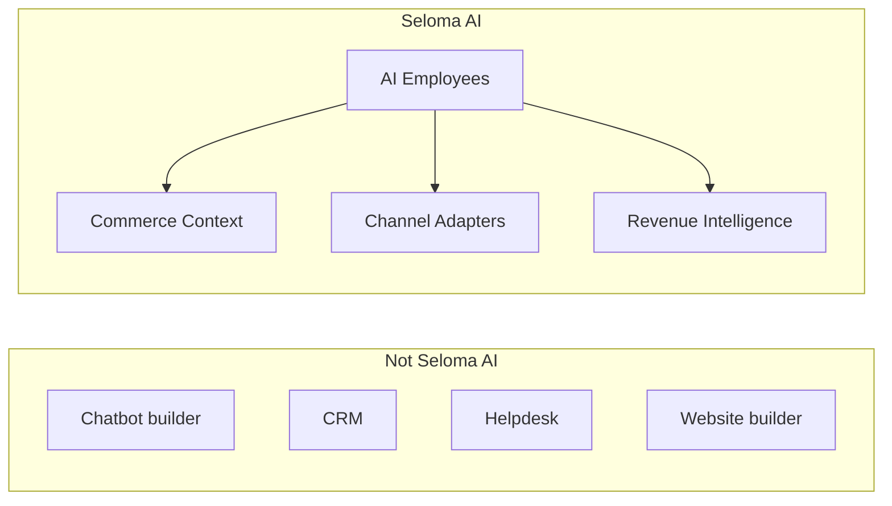
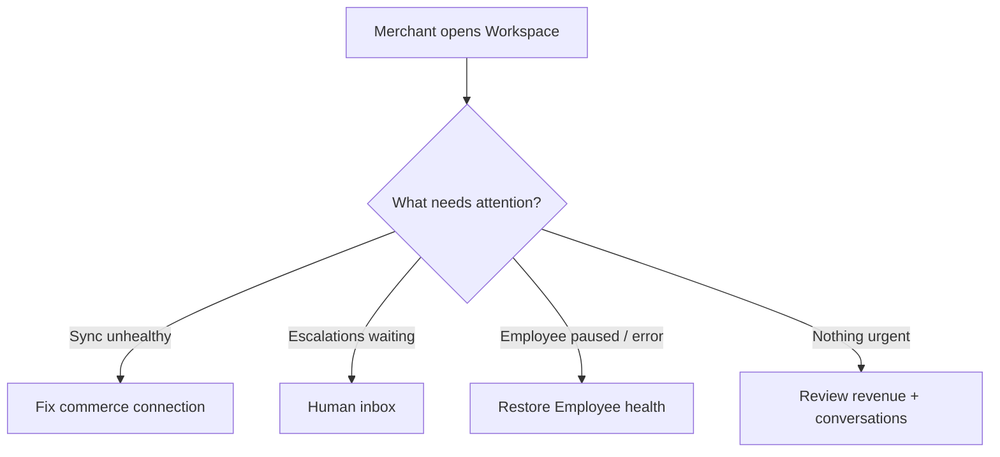
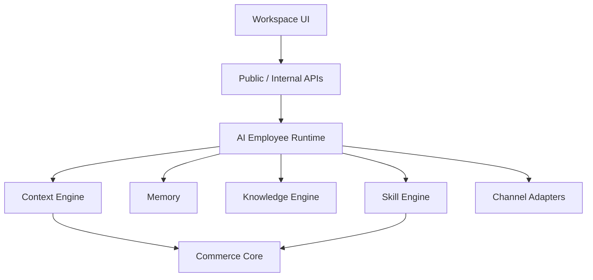
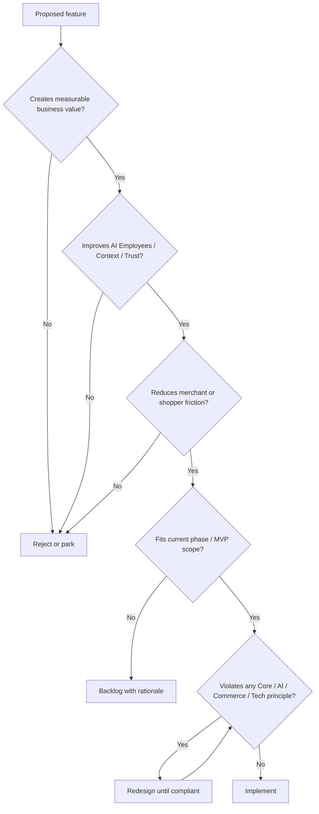

# Product Principles

## Metadata

| Field | Value |
|-------|-------|
| **Version** | 0.1 |
| **Status** | Active — mandatory reference for all product decisions |
| **Owner** | Founder / Product |
| **Last Updated** | August 10, 2026 |
| **Related Documents** | [Vision](../00-overview/vision.md) · [Product Positioning](../00-overview/product-positioning.md) · [Lean Canvas](../00-overview/lean-canvas.md) · [Roadmap](../00-overview/roadmap.md) · [Glossary](../00-overview/glossary.md) · [Product Moat](../01-business/product-moat.md) · [Business Plan](../01-business/business-plan.md) |

---

## Executive Summary

Product Principles are the constitution of Seloma. They define what the product is allowed to become, what it must refuse to become, and how Product, Design, and Engineering decide when those two collide.

**Identity reminder:** Primary product is **native storefront + unified ops**; **AI Sales Employee is an optional add-on**. See [Product Positioning](../00-overview/product-positioning.md).

This document is **not** a PRD. A PRD describes a specific feature: problem, scope, acceptance criteria, edge cases. Principles sit above PRDs. They are the filter every PRD must pass before work starts. If a feature violates a principle, the feature is redesigned or rejected — even if it looks impressive in a demo, even if a competitor ships it, even if a merchant asks for it once.

This document is **not** a roadmap. A roadmap sequences delivery. Principles do not care about quarter. They care about integrity: whether the next change strengthens a coherent commerce platform for online shops (with optional AI), or dilutes it into something else.

### How they guide the organization

| Function | How principles apply |
|----------|----------------------|
| **Product** | Every PRD, epic, and backlog item is validated against Core, UX, AI, Commerce, and Technical Principles before prioritization. |
| **Design** | UX flows, copy, empty states, and AI disclosure patterns follow UX and AI Principles. Beauty without clarity is a failure. |
| **Engineering** | Architecture, APIs, tenancy, observability, and security choices follow Technical Principles. Clever code that breaks isolation or trust is rejected. |
| **Go-to-market** | Positioning and sales claims must match what the product actually does under these principles — especially transparency and revenue attribution. |

Principles are immutable by default. Changing them requires an explicit decision by Product ownership, documented as a version bump, with a written rationale. Silent drift is not allowed.

---

# Product Philosophy

Seloma AI is an **AI Commerce Operating System**: a multi-tenant, API-first, AI-native SaaS platform where merchants hire **AI Employees** to sell and support across channels, grounded in live commerce data.

### The platform is NOT

| Category | Why we refuse it |
|----------|------------------|
| **Chatbot builder** | Generic bot trees and prompt playgrounds optimize for “conversation coverage,” not commerce outcomes. Merchants who need a toy can find one elsewhere. |
| **CRM** | We store customer context required for conversations and attribution. We do not become the system of record for pipelines, deals, and sales stages. |
| **Helpdesk** | Tickets are a failure mode and an escalation surface — not the product center of gravity. Conversations are commerce events, not queue items. |
| **Website builder (drag-drop page IDE)** | Free-form page builders and theme marketplaces are out. We **do** ship a **native Digikala-like storefront (سایت‌ساز)** with CMS — that is the primary product. Shopify/Woo remain optional connectors. |
| **Marketing automation monster** | Campaign blasts, drip sequences, and audience builders are out of scope until they are clearly subordinate to AI Employee outcomes. |
| **Everything app** | Breadth without depth produces a wrapper. We deepen commerce conversation operations before we expand category. |

### The platform IS

An **AI Employee platform for online businesses**.

Merchants do not “configure a bot.” They hire specialized roles — starting with Sales and Support — that operate on catalog, inventory, orders, policies, knowledge, and memory. Those Employees work across channels (website, Telegram, Bale, and later WhatsApp, Instagram, and more) with one brain, merchant-defined guardrails, and measurable revenue impact.

**Operating belief:** Context beats clever prompts. Merchants stay in control. Conversations are revenue events. Features that do not move a measurable commerce metric do not ship.

---

# Product Mission

**Give online businesses specialized AI Employees that sell products, resolve customer questions, and surface actionable insights — grounded in real catalog, order, and customer data, not generic chat.**

Operationally, that means:

1. Connect AI Employees to the merchant’s commerce stack on day one.
2. Ground every reply and action in business context.
3. Keep humans in control through guardrails, escalation, and audit.
4. Prove impact in revenue recovered, conversions gained, and support hours saved within the first billing cycle.

If a proposed feature does not advance this mission, it does not belong in Seloma AI.

---

# Product Vision

In three to five years, Seloma AI becomes the commerce conversation operating layer merchants install alongside their storefront and payment stack — essential when it works, painful to remove once revenue and knowledge depend on it.

| Horizon | What success looks like |
|---------|-------------------------|
| **Near term (MVP → Beta)** | Sales and Support Employees on web + messaging, accurate on live catalog/orders, trusted handoff, attributable revenue. |
| **Medium term (Growth)** | Multi-channel continuity, stronger Knowledge and Memory, deeper storefront coverage, self-serve onboarding, clear ROI dashboards. |
| **Long term (Platform)** | Composable Employees and Skills, developer APIs, partner extensions — still opinionated around commerce, never a generic agent IDE. |

The long-term vision does **not** include becoming a CRM, a marketing suite, or a no-code automation platform. Expansion happens by deepening the AI Employee Runtime and Commerce Context Graph, not by absorbing adjacent product categories.

---

# Core Principles

These fifteen principles govern every product decision. Each includes why it matters, a concrete example, and an engineering implication.

---

### 1. AI Assists, Humans Control

| | |
|--|--|
| **Description** | AI Employees act within merchant-defined guardrails. High-stakes actions require approval or escalation. Autonomy is earned through accuracy, not granted at signup. |
| **Why it matters** | Merchants fear brand damage more than they fear slow replies. Trust dies faster than conversion improves. |
| **Real-world example** | The Sales Employee may recommend products and share cart links. Applying a 40% discount above the merchant’s 15% cap requires human approval. |
| **Engineering implication** | Guardrails, approval workflows, and Human Handoff are first-class runtime features — not enterprise add-ons. |

---

### 2. Business First

| | |
|--|--|
| **Description** | Product decisions start from merchant business outcomes: revenue, conversion, resolution, cost avoided. Technology is a means. |
| **Why it matters** | Teams that optimize for model cleverness ship demos. Teams that optimize for merchant P&L ship renewals. |
| **Real-world example** | Prefer inventory-aware recommendations over a witty reply that invents a product variant. |
| **Engineering implication** | Feature specs must name the business metric moved. “Feels smarter” is not a metric. |

---

### 3. Revenue Before Features

| | |
|--|--|
| **Description** | Ship the smallest set of capabilities that create measurable commerce value. Feature volume is not progress. |
| **Why it matters** | Merchants renew on ROI. Feature checklists without attribution create churn theater. |
| **Real-world example** | A working product search Skill with live stock beats five half-built “smart” Skills. |
| **Engineering implication** | Prioritize Context Graph, Skills that close sales/support loops, and Revenue Intelligence over peripheral UI chrome. |

---

### 4. Context Before Intelligence

| | |
|--|--|
| **Description** | Ground every AI turn in live business state before generation. A weaker model with correct context beats a stronger model with none. |
| **Why it matters** | Hallucinated SKUs, policies, and promises destroy merchant trust permanently. |
| **Real-world example** | Before answering “Is the blue hoodie in size M available?”, the Context Engine checks catalog + inventory — not the model’s prior knowledge. |
| **Engineering implication** | Context Engine, Commerce Core sync health, and Knowledge retrieval are critical path — not “integration backlog.” |

---

### 5. One Brain, Multiple Channels

| | |
|--|--|
| **Description** | Business logic, Memory, Knowledge, and Skills live in the Runtime. Channels are delivery adapters. |
| **Why it matters** | Logic buried in a Telegram bot dies when the channel API changes. Omnichannel without one brain is three disconnected bots. |
| **Real-world example** | A customer starts on web chat and continues on Telegram; the Employee remembers the product discussion without restart. |
| **Engineering implication** | Keep Channel Adapters thin. Never encode discount policy, catalog rules, or escalation logic inside an adapter. |

---

### 6. API First

| | |
|--|--|
| **Description** | Every capability that matters is exposeable via stable APIs. The UI is a client, not the source of truth. |
| **Why it matters** | Agencies, storefronts, and future Skills need programmatic access. UI-only products do not become platforms. |
| **Real-world example** | Creating an Employee, syncing a product, or fetching conversation attribution works via API the same way it works in the Workspace. |
| **Engineering implication** | Design public contracts before building dashboard-only shortcuts. Version APIs deliberately. |

---

### 7. Multi Tenant by Design

| | |
|--|--|
| **Description** | Tenant isolation is structural: data, configuration, Knowledge, Memory, and analytics never leak across merchants. |
| **Why it matters** | One cross-tenant incident ends the company. SaaS trust is binary. |
| **Real-world example** | Shop A’s return policy and Shop B’s catalog never appear in each other’s Context Engine results. |
| **Engineering implication** | Tenant ID on every query path, storage boundary, cache key, and job. Isolation tests are mandatory. |

---

### 8. Composable Architecture

| | |
|--|--|
| **Description** | Capabilities ship as Skills, Workflows, and adapters that compose — not as one-off prompt forks per merchant. |
| **Why it matters** | Prompt sprawl does not scale. Composition creates reuse and a path to a Skill ecosystem without becoming a bot builder. |
| **Real-world example** | Product Search, Order Status, and Escalation are Skills reused by Sales and Support Employees under different goals. |
| **Engineering implication** | New behavior prefers a Skill with guardrails and tests over a custom prompt branch. |

---

### 9. Transparent AI

| | |
|--|--|
| **Description** | Merchants can see what the Employee knew, what it did, why it escalated, and when it was uncertain. |
| **Why it matters** | Black-box AI cannot be managed. Merchants disable what they cannot audit. |
| **Real-world example** | Conversation detail shows retrieved Knowledge sources, tools called, confidence/escalation reason, and human handoff summary. |
| **Engineering implication** | Persist audit trails for context used, tool calls, and guardrail decisions. Expose them in the control plane. |

---

### 10. Fast Time To Value

| | |
|--|--|
| **Description** | A merchant should connect a store and handle a real conversation the same day. Value before configuration theater. |
| **Why it matters** | Long onboarding kills SMB adoption. Delayed value kills conviction. |
| **Real-world example** | Connect Shopify → sync catalog → enable web widget → first grounded reply in under a day (target: under 24 hours). |
| **Engineering implication** | Opinionated defaults, healthy sync status, and a guided “first conversation” path over empty configuration screens. |

---

### 11. Opinionated Product

| | |
|--|--|
| **Description** | Seloma AI has a point of view: AI Employees for commerce, not infinite customization. Defaults should be correct for the ICP. |
| **Why it matters** | Infinite flexibility produces incoherent products and support hell. Opinion creates speed and quality. |
| **Real-world example** | Sales Employee ships with catalog lookup, recommendation, and escalation — not a blank canvas of “any tools you want.” |
| **Engineering implication** | Resist configuration surfaces that encode product indecision. Prefer strong defaults with few, sharp overrides. |

---

### 12. Consistency Over Flexibility

| | |
|--|--|
| **Description** | Prefer one clear behavior across channels and Employees over per-channel special cases that confuse merchants and customers. |
| **Why it matters** | Inconsistent policy answers across web and Telegram feel like a broken brand, not a smart system. |
| **Real-world example** | Return window is identical whether asked on Bale or website; only message formatting differs. |
| **Engineering implication** | Policy and Knowledge are Runtime concerns. Adapters format; they do not reinterpret business rules. |

---

### 13. Measure Everything

| | |
|--|--|
| **Description** | Instrument conversations, resolutions, escalations, accuracy signals, sync health, and revenue attribution. Unmeasured features are guesses. |
| **Why it matters** | Without measurement, product debates become taste contests and sales claims become theater. |
| **Real-world example** | Dashboard shows assisted conversion, escalation rate, grounded answer rate, and sync lag — not only “messages sent.” |
| **Engineering implication** | Emit structured events for key Runtime steps. Revenue Intelligence is product infrastructure, not a later report. |

---

### 14. Security By Default

| | |
|--|--|
| **Description** | Authentication, authorization, encryption, least privilege, and safe tool execution are defaults — not checklist items before enterprise. |
| **Why it matters** | Commerce data is sensitive. AI tools that can act on orders amplify blast radius. |
| **Real-world example** | Tools that mutate commerce state require scoped permissions; secrets never appear in prompts or logs. |
| **Engineering implication** | Threat-model Skills and adapters. Redact PII in logs. Enforce auth on every API. |

---

### 15. Simple First

| | |
|--|--|
| **Description** | Prefer the simplest design that solves the merchant problem correctly. Complexity must pay rent in outcomes. |
| **Why it matters** | Premature abstraction and “platform” features delay learning and hide bugs. |
| **Real-world example** | Ship one excellent storefront connector before five shallow ones. Ship Sales + Support before Marketing Employee. |
| **Engineering implication** | Depth before breadth. Reject speculative framework work that does not unlock a near-term Employee capability. |

---

# UX Principles

Seloma AI’s UX philosophy: merchants are operators under time pressure. The Workspace must make AI Employees legible, controllable, and useful within minutes — not after a training course.

### UX doctrine

| Principle | Requirement |
|-----------|-------------|
| **Low cognitive load** | One primary job per screen. Avoid competing panels of metrics, settings, and chat. |
| **Few clicks** | Common tasks (review escalation, edit policy, enable channel) complete in the shortest honest path. |
| **Fast onboarding** | Connect store → see sync health → enable a channel → watch a test conversation. No empty “build your bot” labyrinth. |
| **Clear AI state** | Always show whether the Employee is active, paused, syncing, degraded, or awaiting human takeover. |
| **Always explain AI actions** | When the Employee recommends, discounts, or escalates, show why in merchant language. |
| **Never hide uncertainty** | Low confidence and missing knowledge are visible. Silence about risk is a product bug. |
| **Progressive disclosure** | Advanced Skills, workflow rules, and API keys stay behind clear advanced paths. Defaults stay simple. |
| **Responsive design** | Workspace usable on laptop and mobile for founders who manage shops from phones. |
| **Accessibility** | Keyboard operable flows, readable contrast, meaningful labels — trust includes inclusivity. |

### UX anti-goals

- Decorating uncertainty with confident copy.
- Hiding escalations so dashboards look “automated.”
- Configuration UIs that feel like a developer IDE for SMBs.
- Card-heavy dashboards that bury the next action.

---

# AI Principles

AI Employees are colleagues with tools and limits — not oracles. Their behavior must be predictable to merchants and safe for customers.

| Principle | Rule |
|-----------|------|
| **LLMs are the last resort, not the first step** | Every request should be answered using deterministic systems (Rules, Commerce Core, Tools, Cache, Knowledge Retrieval) before invoking an LLM. The model is responsible for reasoning and natural language generation — not for data lookup, business logic, or information retrieval. |
| **Model Independence** | Seloma AI must never depend on a specific AI provider. Every AI capability must be routed through an internal AI Gateway that supports provider abstraction, intelligent model selection, cost optimization, fallback strategies, caching, observability, and future self-hosted models. Business logic must remain completely independent of the underlying LLM provider. |
| **Never hallucinate confidently** | If the system lacks grounded context, it must not invent product facts, prices, stock, or policies. |
| **Prefer “I don’t know”** | Uncertainty + escalation beats a fluent wrong answer. Merchants would rather lose a turn than lose trust. |
| **Always use business context** | Every reply consults Context Engine outputs relevant to the turn. |
| **Ground answers in Knowledge** | Policy and FAQ answers should cite or rely on Knowledge / synced facts — not model prior knowledge. |
| **Escalate when confidence is low** | Confidence thresholds and handoff triggers are product requirements, not optional tuning. |
| **Remember previous conversations** | Memory and Customer Profile continuity are part of Employee quality, not a premium add-on. |
| **Be transparent** | Merchants see tools used, sources considered, and escalation reasons. |
| **Stay in role** | Sales sells; Support resolves. Employees do not wander into unrelated “assistant” behavior. |
| **Respect guardrails** | Blocked topics, discount caps, and forbidden actions are hard stops — not soft suggestions. |
| **Improve from correction** | Merchant corrections should feed Knowledge / evaluation loops so the same mistake does not repeat. |

### AI quality bar (operational)

| Signal | Expectation |
|--------|-------------|
| **Grounded response rate** | Majority of factual commerce answers tied to Context / Knowledge |
| **Hallucination incidents** | Treated as P0/P1 product failures when they affect price, stock, or policy |
| **Escalation appropriateness** | Low-confidence and high-stakes cases reach humans; trivial FAQs do not |
| **Cross-channel continuity** | Returning customers are not forced to restart the story when identity can be resolved |

---

# Commerce Principles

Seloma AI exists to help online businesses sell and support — not to chat for its own sake.

| Principle | Rule |
|-----------|------|
| **Revenue first** | Optimize for conversion, recovery, AOV where appropriate, and retention signals — not message volume. |
| **Support sales** | Support Employees resolve blockers that prevent purchase or repurchase; they are not a separate “ticket culture.” |
| **Upsell naturally** | Recommendations must fit customer intent and catalog truth. No spammy cross-sell scripts. |
| **Never push irrelevant products** | If context does not support a recommendation, do not recommend. |
| **Respect inventory** | Do not sell what cannot ship. Stale inventory is a sync/product failure. |
| **Respect pricing** | Prices and discounts come from commerce systems and merchant rules — never invented. |
| **Respect policies** | Shipping, returns, COD, warranty, and regional rules are binding constraints. |
| **Respect brand voice** | Tone follows merchant configuration within safety bounds; do not overwrite brand with a generic persona. |
| **Attribute honestly** | Revenue Intelligence must use conservative, explainable methodology — not vanity attribution. |

### Commerce decision test

Before shipping a commerce-facing behavior, answer:

1. Does it help a customer buy or get a truthful post-purchase answer?
2. Does it use live catalog / order / policy state?
3. Can a merchant audit and override it?
4. Can we measure its effect without lying?

If any answer is no, redesign.

---

# Technical Principles

Architecture choices are product choices. Seloma AI is API-first, multi-tenant, and AI-native by design.

| Principle | Requirement |
|-----------|-------------|
| **API First** | Stable, versioned APIs for Workspace capabilities; UI consumes the same contracts. |
| **Event Driven where appropriate** | Sync, conversation lifecycle, and attribution pipelines use events for reliability and decoupling — not everywhere by fashion. |
| **Stateless APIs** | Request handlers remain horizontally scalable; durable state lives in tenant-scoped stores. |
| **Tenant Isolation** | Hard boundaries for data, jobs, caches, search indexes, and logs. |
| **Observability** | Traces, metrics, and structured logs for Runtime steps: context build, retrieval, tool calls, guardrails, channel delivery. |
| **Scalability** | Design for many tenants and bursty messaging traffic without special-casing demo load. |
| **Security** | Authn/z, secret hygiene, least-privilege tools, PII minimization, auditability. |
| **Extensibility** | Skills, Workflows, and Channel Adapters are the extension points — not random forks of the core Runtime. |
| **Sync health as product** | Stale commerce data is a user-visible health problem, not a silent background detail. |
| **Fail safe** | Prefer degrade + escalate over confident wrong automation when dependencies fail. |

---

# Product Decision Framework

Use this framework for every feature request, PRD, and architecture proposal. The burden of proof is on the proposal, not on the principles.

### Decision checklist (required in PRDs)

| Question | Pass criterion |
|----------|----------------|
| Business value | Named metric and hypothesis |
| AI Employee impact | Clear effect on Sales/Support (or future role) quality |
| Friction | Removes steps, errors, or wait time for merchant or shopper |
| Scope fit | Allowed in current roadmap phase |
| Principle compliance | No unresolved violations |
| Measurement | Events / dashboards defined before build |
| Kill criteria | What evidence would stop or reverse the feature |

### Priority heuristics

When two compliant features compete:

1. Accuracy / trust / sync health over novelty.
2. Revenue attribution and conversion over vanity engagement.
3. Depth of existing Employees/channels over new surfaces.
4. Time-to-value improvements over power-user complexity.

---

# Product Anti-Patterns

Seloma AI should **never** become the following. Treat these as organizational stop signs.

| Anti-pattern | Why it is forbidden |
|--------------|---------------------|
| **Generic chatbot builder** | Competes on prompts and widgets; no durable commerce moat. |
| **Bloated CRM** | Dilutes focus; loses conversation→revenue identity. |
| **Marketing automation monster** | Pulls roadmap into campaigns and lists instead of Employee excellence. |
| **No-code platform for everything** | Configuration replaces product judgment; quality collapses. |
| **Website builder** | Wrong problem; wrong buyer journey. |
| **Everything app** | Breadth without Context Graph depth = wrapper death. |
| **Black-box AI** | Merchants cannot trust what they cannot inspect. |
| **Autonomy theater** | High automation rates with high hallucination rates. |
| **Channel-native logic** | Business rules trapped in Telegram/WhatsApp adapters. |
| **Attribution theater** | Claiming ROI without methodology merchants can believe. |
| **Premature marketplace** | Empty Skill Store damages brand before first-party Skills prove value. |
| **Demo-driven architecture** | Shipping for investor screenshots instead of merchant production truth. |

If a roadmap item smells like an anti-pattern, write down which one and force a redesign — or kill it.

---

# MVP Principles

MVP exists to prove one thesis: **grounded AI Employees can create measurable commerce value on real channels without destroying trust.**

### What belongs in MVP

| Capability | Why it is in |
|------------|--------------|
| Workspace + tenant isolation | Foundation of SaaS trust |
| Commerce sync (catalog, inventory signals, orders) for primary storefront | Context Before Intelligence |
| Knowledge Base for policies / FAQs | Grounded answers |
| Sales + Support AI Employees | Opinionated product wedge |
| Skills: product search, recommendation, order status, escalation | Job completion, not chat |
| Channels: website + Telegram + Bale (per roadmap) | One brain, early market surfaces |
| Guardrails, human handoff, audit visibility | Humans Control |
| Basic Revenue Intelligence / conversation metrics | Measure Everything |
| Fast path to first live conversation | Fast Time To Value |

### What explicitly does NOT belong in MVP

| Capability | Why it is out |
|------------|---------------|
| Generic bot builder / arbitrary tool IDE | Anti-pattern |
| Full CRM / pipeline management | Wrong product |
| Marketing automation suites | Premature breadth |
| Website / theme builder | Out of category |
| Instagram / WhatsApp / email / SMS (until web + messaging quality is proven) | Depth before breadth |
| Skill Marketplace / third-party store | Earn later |
| Multi-agent orchestration theater | Prove single Employee excellence first |
| Perfect attribution science | Directional, honest metrics first — not vanity graphs |
| Endless customization for edge verticals | Opinionated defaults for ICP |

**MVP rule:** If it does not improve grounded replies, safe actions, channel delivery, or measurable merchant value for Sales/Support, it waits.

---

# Success Criteria

Principles are only real if they are enforced. Enforcement is procedural, not aspirational.

| Gate | What happens |
|------|--------------|
| **Product Reviews** | Epics and major features reviewed against Core, UX, AI, and Commerce Principles. Violations block prioritization. |
| **PRD Validation** | PRD template includes principle checklist, metrics, and kill criteria. Incomplete PRDs do not enter engineering. |
| **Engineering Reviews** | Design docs reviewed for API-first contracts, tenant isolation, observability, and fail-safe behavior. |
| **Architecture Reviews** | Cross-cutting changes (Runtime, Context, Channels, Skills) require explicit principle alignment and anti-pattern check. |
| **Design Reviews** | UX must show AI state, uncertainty, and action explanations — not only happy-path mockups. |
| **Launch Reviews** | Shipping checklist includes measurement wiring and merchant-visible failure modes. |
| **Incident Reviews** | Hallucinations, cross-tenant risks, and sync failures trigger principle-linked postmortems and product fixes. |

### Organizational expectation

- Saying “the competitor has it” is not a rationale.
- Saying “a merchant asked once” is not a rationale.
- Saying “it demos well” is not a rationale.
- Saying “it strengthens grounded AI Employees and measurable commerce outcomes without violating principles” is a rationale.

---

# Final Statement

**Product Principles are mandatory for every future product decision at Seloma AI.**

They are the constitution of the product: higher than taste, higher than competitor checklists, higher than a single customer request. PRDs describe *how* we build something. These principles decide *whether* we should build it, and *what shape* it must take if we do.

Seloma AI will succeed as an AI Commerce Operating System — AI Employees, commerce context, channel adapters, and revenue truth — or it will fail as another chatbot wrapper. There is no stable middle.

Every feature either reinforces that constitution or erodes it. Choose accordingly.

---

*This document is the product constitution for Seloma AI v0.1. Changes require an explicit version bump and written rationale from Product ownership. Related strategy and sequencing live in Vision, Product Moat, Lean Canvas, and Roadmap.*
