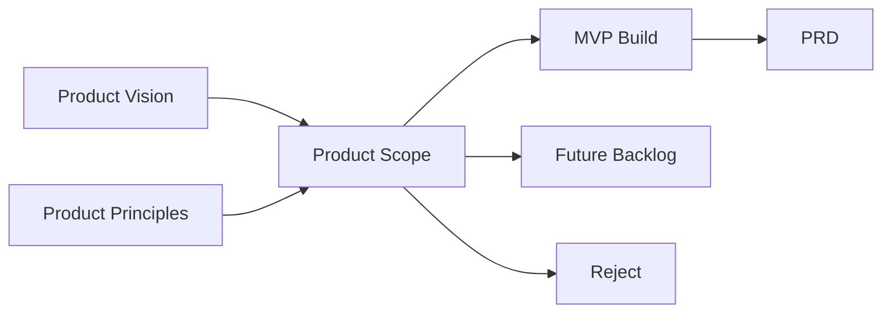
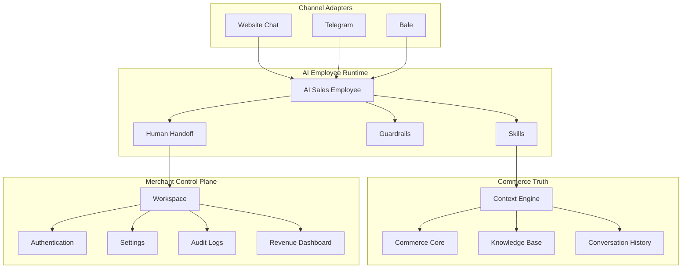
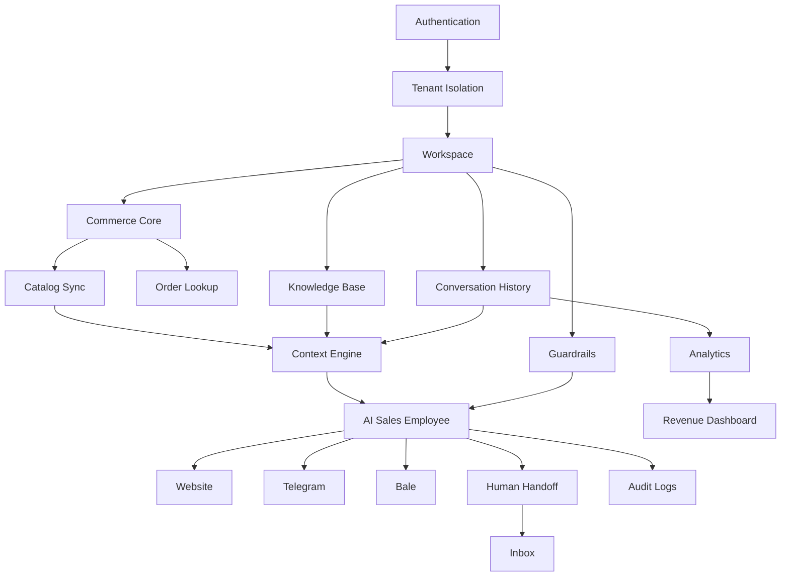
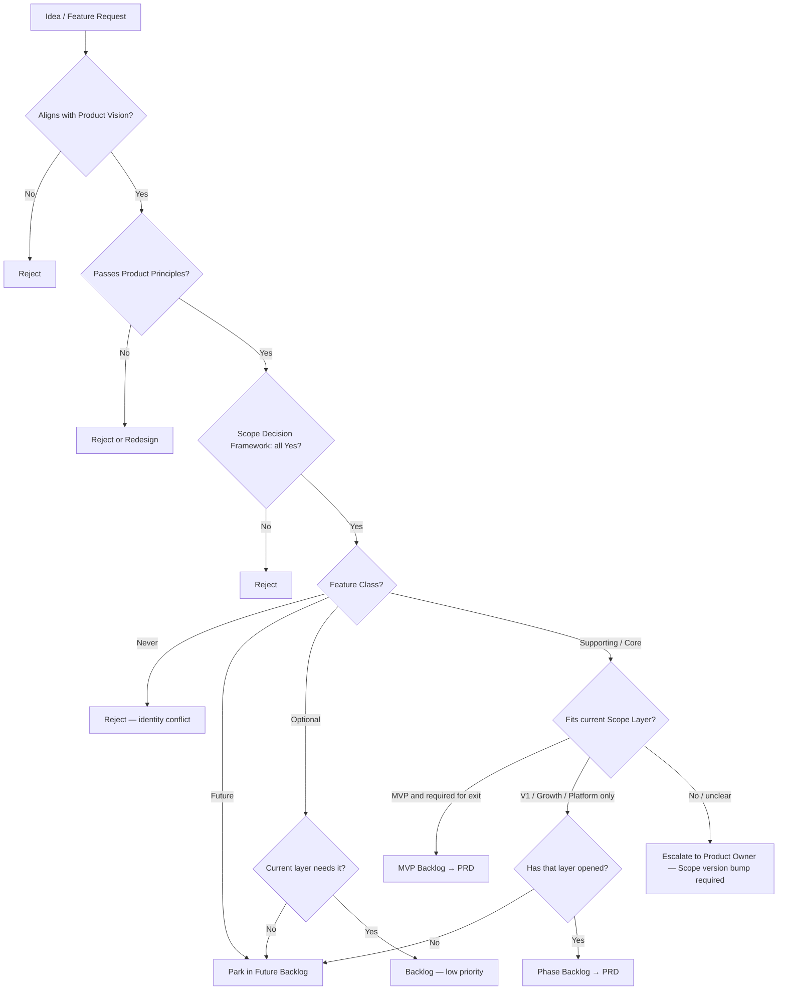

# Product Scope

## Metadata

| Field | Value |
|-------|-------|
| **Version** | 0.2 |
| **Status** | Active — mandatory scope gate for all product and engineering work |
| **Owner** | Founder / Product |
| **Last Updated** | August 10, 2026 |
| **Related Documents** | [Product Positioning](../00-overview/product-positioning.md) · [Product Vision](./product-vision.md) · [Product Principles](./product-principles.md) · [Roadmap](../00-overview/roadmap.md) · [Lean Canvas](../00-overview/lean-canvas.md) · [Glossary](../00-overview/glossary.md) · [Vision (company)](../00-overview/vision.md) · [Business Plan](../01-business/business-plan.md) · [Market Research](../01-business/market-research.md) · [Pricing Strategy](../01-business/pricing-strategy.md) · [Go-To-Market](../01-business/go-to-market.md) · [Product Moat](../01-business/product-moat.md) |

**Audience:** Product, Engineering, Design, Founders, and anyone proposing a feature, epic, or PRD.

**Authority:** If a request conflicts with this document, this document wins until Product ownership revises it with an explicit version bump and written rationale.

---

# Purpose of this Document

This document exists to answer one operational question with no ambiguity:

**What will DeloRey AI build, and what will it refuse to build?**

It is not a product description. [Product Vision](./product-vision.md) already defines identity, users, goals, and long-term direction. This document converts that identity into an executable boundary: included capabilities, excluded capabilities, phase placement, and decision rules.

| Document | Question it answers | Role |
|----------|---------------------|------|
| **Product Vision** | *Why* does this product exist, and what is it? | Definition |
| **Product Scope** (this file) | *What* is in / out, and in which phase? | Boundary |
| **Product Principles** | *What rules* govern every decision? | Constitution |
| **PRD** | *How* does a specific feature work? | Specification |
| **Roadmap** | *When* do phases sequence? | Sequencing |

Every future feature request, design exploration, sprint commitment, and partner promise must be validated against this document. If a capability is outside current scope, it belongs in the **Future Backlog** — not in the active board, not in “quick wins,” and not in verbal commitments to merchants.

This document is the primary protection against scope creep. Engineering velocity without scope discipline produces a wrapper. Scope discipline without Vision produces a checklist. Both are required; this file owns the checklist and the refusals.

---

# Scope Philosophy

DeloRey is Pre-MVP / early build. Scope is therefore deliberately narrow. The following rules are not preferences; they are operating constraints.

**Identity gate:** [Product Positioning](../00-overview/product-positioning.md) — native storefront + unified ops first; AI Sales Employee as optional add-on.

### Depth before Breadth

We deepen the **native storefront + CMS**, order lifecycle, and Website + Telegram + Bale channel hooks before adding Instagram, WhatsApp, email, voice, marketplaces, or multi-agent theater. A shallow product on six channels is worse than a reliable shop on three surfaces.

### Opinionated commerce platform

Merchants **run a DeloRey shop**. They do not assemble a bot from a blank canvas. Default CMS, COD checkout, and channel adapters ship ready. When they enable AI, default Skills and guardrails ship ready. Infinite configurability is not a goal for MVP or V1.

### Unification before features

A feature ships only if it improves **one coherent shop experience** (catalog, order, channel, manager clarity) or optional AI sell/support outcomes. Feature volume is not progress. See [Product Principles](./product-principles.md) — *Revenue Before Features*.

### Fast Time To Value

MVP scope must support: create shop → publish products → take a COD order on the storefront → see it in Workspace — in under 24 hours. Enabling AI on a channel is an optional same-day path, not a requirement to get value.

### One brain, multiple channels

Website, Telegram, and Bale are **Channel Adapters**. Catalog, orders, and policies live once. We do not fork product rules per channel.

### No Scope Creep

Saying “a competitor has it,” “one merchant asked once,” “it demos well,” or “it would be easy” does not admit a feature. Scope changes require Phase exit criteria, Vision alignment, and Principles compliance — not enthusiasm.

---

# Product Scope Layers

Scope is layered. Work may only move forward when the previous layer’s exit criteria are met (see [Roadmap](../00-overview/roadmap.md)). Building Growth features during MVP is a process failure, not ambition.

| Layer | Name | Intent | When it opens |
|-------|------|--------|---------------|
| **MVP** | Prove the wedge | Smallest product that creates measurable shop value: native storefront + orders + Website/Telegram/Bale hooks; AI add-on optional | Pre-MVP → Phase 1 |
| **V1** | Validate PMF path | Self-serve readiness, stronger storefront completeness, billing, operator UX — still one shop SoR | After MVP exit (≈ Beta) |
| **Growth** | Expand within category | Additional channels, Support Employee add-on, subordinate automation, deeper integrations | After public-launch readiness |
| **Platform** | Ecosystem & scale | APIs, extensions, multi-brand governance, certified marketplace | After Growth quality and NRR justify it |
| **Future** | Captured, not scheduled | Ideas that fit Vision but fail the current phase gate | Always — backlog only |

### Layer definitions

**MVP** is the contract with design partners: **native storefront + CMS**, catalog/orders in Workspace, three channel surfaces, optional AI Sales Employee with trust mechanics, tenant isolation. A merchant who never enables AI must still get a coherent shop.

**V1** (aligned with Roadmap Beta) hardens what MVP proved: onboarding, storefront completeness (variants, discounts, inventory decrement, payment path), attribution clarity, team inbox basics, self-serve billing. It does not reopen excluded MVP categories.

**Growth** expands reach and automation *after* retention and ROI are real. Channels and workflows remain adapters and Skills — not a new product category.

**Platform** makes DeloRey extensible without becoming a generic agent IDE. Marketplace and multi-agent orchestration arrive only when first-party Skills and Runtime are stable.

**Future** holds Vision-aligned ideas without granting them sprint seats. Future is not a promise; it is a parking lot with priorities.

---

# MVP Scope

**Objective:** Ship the minimum system that proves: *a merchant can sell and manage an online shop in one DeloRey product (storefront + orders + channels), and optionally add a grounded AI Sales Employee without destroying trust.*

**Primary product:** Native Storefront + CMS (سایت‌ساز) + unified order ops  
**Optional add-on:** AI Sales Employee  
**Primary geography:** Iran (Persian language quality, COD/messaging commerce patterns)  
**Primary channels:** Website storefront + Telegram + Bale (Instagram when adapter is ready)  
**Primary customers:** Small & medium online shops that need one coherent place to sell and operate  

Everything below **MUST** exist for MVP to be complete unless marked **add-on**. “Exists” means production-usable with design partners — not a mock.

## MVP capability map

| Capability | What ships | Why it is mandatory |
|------------|------------|---------------------|
| **Authentication** | Merchant signup/login, session security, password reset (or equivalent) | No Workspace without identity |
| **Merchant Workspace** | Control plane for shop CMS, orders, channels, settings; AI config when enabled | Daily operations home — reduce manager confusion |
| **Tenant Isolation** | Hard separation of data, Knowledge, Memory, analytics, jobs, indexes | Non-negotiable SaaS foundation |
| **Native Storefront + CMS** | Digikala-like public shop (`apps/storefront`) + Workspace CMS (products, categories, COD orders, banners, appearance) | **Primary product** |
| **Commerce Core** | Catalog, inventory signals, pricing, policies, orders from native CMS (**and** optional external connectors) | Single commerce truth |
| **Order lifecycle** | Cart → COD checkout → merchant order management → customer track | Core shop value |
| **Catalog Sync** | Reliable ingest + visible sync health when external store connected | Optional connector path |
| **Website Chat** | Embeddable widget on native storefront; session; handoff state | Channel surface on the shop |
| **Telegram** | Bot adapter; product/link flows; order-aware paths as available | Messaging-first channel |
| **Bale** | Bot adapter; parity where API allows | Iran reality |
| **Conversation History / Inbox** | Persisted threads; operator review across channels | Unification for humans |
| **AI Sales Employee** *(add-on)* | Opinionated role: pre-purchase Q&A, recommendations, order status, escalation | Sold when merchant needs automation |
| **Product Recommendation** *(add-on path)* | Inventory/price-aware recommendations from live catalog | AI revenue path |
| **Order Lookup** *(add-on / shared tool)* | Post-purchase status within guardrails | Closes support loop |
| **Knowledge Base** *(add-on path)* | FAQ/policy + uploads; source attribution | Edge cases for AI |
| **Context Engine** *(add-on path)* | Assembles live business state per turn before generation | Prevents hallucination theater |
| **Human Handoff** *(add-on path)* | Confidence/policy escalate; context packet; AI pause/resume | Trust when AI is on |
| **Settings / Guardrails** *(add-on path)* | Tone, discount caps, blocked topics, escalation rules | Humans Control |
| **Revenue / ops dashboard (basic)** | Orders, channel volume; conversation metrics when AI on | Measure what matters |
| **Audit Logs** | What the Employee knew, tools called, replies, escalations (when AI on) | Transparent AI |

## MVP build contract (detail)

| Area | Ships | Explicit non-goals |
|------|-------|--------------------|
| **Native Storefront** | Public catalog, PDP, cart, COD checkout, order track; CMS in Workspace; path to variants/discounts/inventory decrement as completion priority | Drag-drop page builder; multi-theme marketplace |
| **Website Chat** | Embed on native storefront (and optional Shopify/Woo); session; cart/page context when available; handoff states | Free-form theme IDE |
| **Telegram / Bale** | Merchant bot; replies; product cards/links; escalation alerts | Broadcast campaigns; Mini App replacing the shop |
| **Sales Skills** *(add-on)* | Grounded Q&A; stock-aware recommendations; order status; confidence/policy escalation | Ungrounded upsell; unguarded refund/cancel mutation |
| **Commerce Core** | Native CMS as SoR: catalog, inventory flags, pricing, shipping/return/COD policy, orders | Multi-platform coverage as MVP requirement |
| **Payment** | COD first; online PSP as near-term completion (integration, not acquiring bank) | Becoming a payment company / WMS |
| **Control plane** | Auth; Workspace shop ops; Inbox; Tenant Isolation | Optional polish that delays exit criteria |

## MVP systems diagram

---

# Explicitly OUT OF MVP

The following are **forbidden in MVP commits**, design-partner promises, and “stretch” sprint goals. Each exclusion has a reason. Revisit only after MVP exit criteria and a Scope revision.

| Excluded | Why excluded from MVP |
|----------|------------------------|
| **Instagram** | Different API surface, moderation, and media UX. Validates after three-channel depth — not instead of it. |
| **WhatsApp** | Business API cost, template rules, and compliance overhead. High value later; fatal distraction now. |
| **Email** | Async support is not the Iran messaging-first wedge. Recovery sequences need attribution maturity first. |
| **Voice / IVR** | Different Runtime constraints (latency, barge-in, telephony). Post-platform expansion at earliest. |
| **CRM** | Pipelines and deal stages are a different SoR. We keep conversation context; we do not replace CRM. |
| **Helpdesk** | Ticket queues as product center of gravity contradict conversation→commerce framing. Escalation ≠ Zendesk clone. |
| **Marketing Automation** | Blasts, drips, and audience builders dilute Sales Employee quality and burn trust before ROI proof. |
| **Marketplace (consumer)** | Multi-seller marketplace ops are not SMB single-store MVP. |
| **API Marketplace / Skill Marketplace** | Premature ecosystem. First-party Skills must prove value before third-party theater. |
| **Workflow Builder** | No-code automation IDE invites scope explosion and becomes a generic platform. |
| **Visual Flow Builder** | Chatbot-builder identity. Opinionated Skills replace trees. |
| **Campaign Builder** | Outbound campaign UX is marketing suite gravity. Subordinate recovery may enter Growth — not MVP. |
| **AI Agent Marketplace** | Same as Skill Marketplace; compounds brand and security risk early. |
| **Multi-brand Enterprise** | SSO, fleet governance, multi-workspace hierarchy — after wedge and unit economics. |
| **Multi-language (beyond Persian-quality bar)** | Architecture may be language-capable; MVP quality criteria are Iran/Persian-first. Full i18n productization waits. |
| **Native Mobile App** | Mobile-usable Workspace in browser is enough. Native apps consume roadmap without proving wedge. |
| **White Label** | Reseller/OEM requires platform maturity, billing complexity, and brand governance. |
| **Advanced BI** | Custom report builders and warehouse exports wait. Basic dashboard is the MVP bar. |
| **SMS / free-form page builder / PSP / WMS / black-box autonomy** | PSP and WMS stay integrations. Native storefront + CMS is in-scope; drag-drop page IDE and payment acquiring stay out for now. |

**Rule:** If an engineer implements an OUT item “because it was easy,” Product treats it as a defect until removed or formally re-scoped.

---

# Version 1 Scope

**V1** = immediate post-MVP validation layer (Roadmap **Beta**). Goal: move from founder-led concierge to a product that other merchants can adopt without reinventing the Runtime.

V1 **does not** reopen OUT-OF-MVP channels or category expansions. It deepens MVP systems.

| Area | V1 includes | Still deferred |
|------|-------------|----------------|
| **Onboarding** | Guided setup, integration health checks, test-conversation path | Fully unattended enterprise rollout |
| **AI quality** | Better retrieval; clearer escalation reasons; higher resolution/accuracy targets | Multi-agent orchestration |
| **Inbox / operators** | Filters, tags, assignment, canned human replies | Full helpdesk SLA engine |
| **Guardrails** | Stronger blocklists, discount approval queue, restricted topics | Arbitrary policy DSL / visual rules IDE |
| **Attribution** | Clearer assisted vs unassisted; exportable ROI summary | Perfect causal science / ads platform replacement |
| **Reliability** | Latency and uptime targets; graceful stale-sync degradation | Multi-region enterprise SLAs |
| **Billing** | Self-serve subscription, metering aligned with [Pricing Strategy](../01-business/pricing-strategy.md) | Complex Enterprise contracting automation |
| **Docs** | Help center, channel setup guides | Partner certification program |

**V1 success intent:** Self-serve completion, paid conversion, month-2 retention, and quality lifts defined in [Roadmap](../00-overview/roadmap.md) Phase 2 — without Instagram/WhatsApp/email as requirements.

---

# Growth Scope

**Growth** opens only after public-launch readiness (Roadmap Phase 3). It expands *within* AI Commerce Platform identity.

| Theme | In Growth scope | Constraint |
|-------|-----------------|------------|
| **More channels** | WhatsApp, Instagram DMs, email (priority per Roadmap); SMS/Messenger secondary | Same brain; thin adapters only |
| **Automation** | Cart recovery, proactive follow-ups, business-hours routing, smart handoff packets | Must subordinate to Employee outcomes and measurement |
| **Employees** | Dedicated Support Employee alongside Sales | Still commerce roles — not arbitrary agents |
| **Integrations** | CRM *sync*, helpdesk *ticket bridge*, more storefronts, alerts to Slack/Teams | Sync/push — not replace CRM/helpdesk SoR |
| **Team** | Roles, permissions, assignment | Not full workforce management |
| **Analytics** | Stronger ROI, objection taxonomy, channel comparison | Not a general BI suite |
| **Localization** | Multi-language responses for expansion markets | After Persian-quality bar is solid |
| **GTM surfaces** | App directory listings, agency referral program | White-label still later |

Growth is where many OUT-OF-MVP items become eligible — **individually**, after prioritization — not as a dump of every excluded row.

---

# Platform Scope

**Platform** (Roadmap Phase 4) is the long-horizon layer: extensibility, enterprise governance, and ecosystem depth. It is Vision-aligned and **not** an MVP planning surface.

| Theme | Platform includes | Hard limit |
|-------|-------------------|------------|
| **Developer surfaces** | Versioned REST API, webhooks, SDKs, sandbox, data export | Commerce-scoped capabilities mirroring Workspace — not a general LLM API |
| **Multi-Employee orchestration** | Sales / Support / later roles sharing context under guardrails | Opinionated commerce roles; not “any agent” |
| **Marketplace** | Certified connectors, Skill packs, vertical packs | Security review; no unverified third-party tool chaos |
| **Enterprise** | SSO, RBAC depth, multi-brand governance, SLA tiers, residency options | After NRR and wedge justify cost |
| **Voice** | Possible phone/IVR adapter on same brain | Still Channel Adapter pattern |
| **Custom Employee builder** | Within Runtime guardrails | Never a blank chatbot IDE as the product center |

Platform success means DeloRey is painful to remove because context, Skills, and measurement compound — not because merchants are trapped in a flow builder.

---

# Feature Classification

Use this taxonomy in PRDs, epics, and backlog labels. Every feature gets exactly one class.

| Class | Meaning | Examples |
|-------|---------|----------|
| **Core** | Without it, the product thesis fails | AI Sales Employee, Commerce Core, Context Engine, Website/Telegram/Bale adapters, Human Handoff, Tenant Isolation |
| **Supporting** | Required to operate Core safely and continuously | Authentication, Settings/Guardrails, Conversation History, Audit Logs, Catalog Sync, Knowledge Base, Workspace Inbox |
| **Optional** | Improves UX or conversion but MVP can ship without polish perfection | Brand color theming depth, rich product cards beyond minimum, advanced filters |
| **Future** | Vision-aligned; wrong phase | WhatsApp, Instagram, Support Employee as dedicated role, public API, cart recovery automation |
| **Never** | Conflicts with product identity unless Vision is rewritten | Generic chatbot builder as center, CRM replacement, helpdesk-as-SoR, free-form page-builder IDE as identity, AI-only wrapper with no coherent shop, black-box autonomy, premature Skill Marketplace as identity |

### Classification matrix (selected)

| Feature | Class | Earliest layer |
|---------|-------|----------------|
| Website / Telegram / Bale | Core | MVP |
| AI Sales Employee + Recommendations + Order Lookup | Core | MVP |
| Commerce Core, Catalog Sync, Context Engine, Tenant Isolation, Workspace | Core | MVP |
| Knowledge Base, Conversation History, Auth, Settings, Audit, Basic Analytics, Revenue Dashboard | Supporting | MVP |
| Self-serve billing; team assignment / tags | Supporting / Optional→Supporting | V1 |
| WhatsApp, Instagram, Email; Support Employee; cart recovery; CRM/Helpdesk sync | Future | Growth |
| Public API, Marketplace, Multi-brand Enterprise, White Label | Future | Platform |
| Native mobile apps | Future (low priority) | Post-Growth if ever |
| Visual Flow Builder; Marketing Automation as primary product | Never | — |

---

# Scope Decision Framework

Every new feature request must answer **all** of the following. If any answer is **No**, reject or park in Future Backlog.

| # | Question | Pass condition |
|---|----------|----------------|
| 1 | Does it improve the **AI Sales Employee** (accuracy, safe actions, sell/support completion)? | Clear yes |
| 2 | Does it increase **merchant value** (conversion, recovery, resolution, hours saved, trust)? | Named metric |
| 3 | Does it **reduce merchant workload** without shifting risk onto brand damage? | Net workload down |
| 4 | Does it strengthen **Commerce Context** (sync, retrieval, tools, knowledge truth)? | Deepens grounding |
| 5 | Does it improve **measurable revenue** outcomes (or the honesty of measurement)? | Instrumentable |
| 6 | Does it comply with **Product Principles** and stay inside the current **Scope Layer**? | Both true |

**Default:** If the request only improves demo theater, parity with a competitor’s checklist, or one loud customer’s edge case — **Reject**.

Also required: **One Brain, Multiple Channels**; **AI Assists, Humans Control**; **Tenant Isolation** and auditability preserved.

---

# Scope Boundaries

## What belongs

| Belongs | Boundary statement |
|---------|-------------------|
| AI Employees for commerce | Sales first; Support later as a role — not general assistants |
| Runtime + Skills | Product search, recommend, order status, policy Q&A, escalation |
| Commerce grounding | Catalog, inventory signals, pricing, policies, orders |
| Knowledge + conversation memory | FAQ/policies, uploads, history continuity |
| Channels as adapters | Website, Telegram, Bale now; later messaging/email as adapters |
| Workspace control plane | Config, inbox, sync health, audit, corrections |
| Honest measurement | Resolution, escalation, grounded answers, assisted conversion |
| APIs (later) | Same commerce capabilities as Workspace for integrators |

## What does not belong

| Does not belong | Boundary statement |
|-----------------|-------------------|
| Chatbot builders / visual flow IDEs | Wrong product identity |
| CRM / ERP systems of record | Sync insights; do not absorb |
| Helpdesk as center of gravity | Escalation surface only |
| Storefront drag-drop IDE / multi-theme marketplace | Native storefront + CMS is **in**; free-form page builders stay **out** |
| Marketing automation suites | Not primary surface |
| Ads / media attribution platforms | Conversation outcomes ≠ ad platform |
| Payment processing | Context only |
| Inventory forecasting / WMS | Adjacent category |
| Arbitrary non-commerce agents | Dilutes category |
| Channel-native business rules | Rules live in Runtime |

**Boundary test:** Does the proposal improve grounded sell/support conversations, safe actions, channel delivery, merchant control, or honest commerce measurement? If no → outside DeloRey AI.

---

# Anti Scope Creep Rules

These rules are immutable by default. Changing them requires Product ownership + version bump.

1. **Never build because competitors have it.** Copying a checklist is not strategy.
2. **Never build because one customer asked once.** Look for pattern across ICP, then schedule by layer.
3. **Never optimize before PMF.** Performance theater and micro-polish do not unlock Growth channels.
4. **Never sacrifice simplicity for configurability.** Opinionated defaults beat preference panels.
5. **Never replace Product Principles** with a temporary exception for a demo or deal.
6. **Never add a channel before the current three are reliable.** Depth before breadth.
7. **Never ship a Skill that mutates commerce state without guardrails and audit.**
8. **Never hide sync failures.** Stale catalog is a product incident, not a model prompt issue.
9. **Never prioritize fluency over truth.** Prefer “I don’t know” + handoff over wrong SKU/price/policy.
10. **Never treat tickets as the primary UX.** Conversations are commerce events.
11. **Never open a Workflow / Visual Flow Builder** as the path to “flexibility.”
12. **Never promise Marketplace, White Label, or Enterprise multi-brand** in MVP sales narratives.
13. **Never fork business logic inside Telegram or Bale adapters.**
14. **Never inflate automation rates by disabling Human Handoff.**
15. **Never schedule Platform work during MVP** except foundational tenancy/API shapes required for Core.
16. **Never accept “it was already half-built” as a scope argument.** Sunk cost is not a priority.
17. **Never expand ICP** (enterprise, marketplace multi-seller, Instagram-only shops) to avoid saying no.
18. **Never use vanity metrics** (messages sent) as success if grounded accuracy and revenue signals are missing.
19. **Never let Design or Sales invent scope** outside this document; route every request through the Decision Tree.
20. **Never delete Future ideas to look focused** — park them; do not pretend they are scheduled.

Rules 1–20 override convenience, demos, and deal pressure.

---

# Dependencies

MVP features have dependency contracts. Engineering plans from this table; parallelization is allowed only where “Blocked by” is empty or satisfied.

| Feature | Required dependencies | Blocked by | Enables |
|---------|----------------------|------------|---------|
| **Authentication** | Tenant model | — | Workspace, Settings, Audit access control |
| **Tenant Isolation** | Auth, data model, job/index scoping | — | All multi-tenant features |
| **Merchant Workspace** | Auth, Tenant Isolation | — | All merchant operations |
| **Commerce Core** | Workspace, storefront credentials, sync jobs | Auth/Workspace | Catalog Sync, Order Lookup, Recommendations |
| **Catalog Sync** | Commerce Core | Storefront API access | Grounded product Q&A, Recommendations |
| **Order Lookup** | Commerce Core | Order API access | Post-purchase resolution, trust |
| **Knowledge Base** | Workspace, storage, retrieval index | Tenant Isolation | Policy answers, overrides |
| **Context Engine** | Commerce Core, Knowledge Base, Conversation History | Sync health signals | Grounded generation |
| **Conversation History** | Tenant Isolation, Channel event ingest | — | Continuity, Audit, Analytics |
| **AI Sales Employee** | Context Engine, Skills, Guardrails | Context Engine | Channel value delivery |
| **Product Recommendation** | Catalog Sync, Context Engine | Live catalog | Conversion assistance |
| **Settings / Guardrails** | Workspace | — | Safe autonomy |
| **Human Handoff / Escalation** | Conversation History, Workspace Inbox, Guardrails | Inbox surface | Trust, MVP success metrics |
| **Website Chat** | Runtime, Channel Adapter contract | AI Sales Employee skeleton | First live path |
| **Telegram** | Runtime, bot credentials | Same Runtime as web | Messaging coverage |
| **Bale** | Runtime, Bale API constraints | Same Runtime as web | Iran channel coverage |
| **Workspace Inbox** | Conversation History, Handoff | Channels producing events | Operator takeover |
| **Basic Analytics** | Event instrumentation | Conversation + escalation events | Dashboard |
| **Revenue Dashboard (basic)** | Analytics events, attribution rules | Order/conversion linkage where available | Renewal narrative |
| **Audit Logs** | Tool calls, context snapshots, replies | Runtime instrumentation | Transparent AI, dispute resolution |

---

# MVP Exit Criteria

MVP is complete only when **all** objective conditions below are true. Opinions and demos do not count.

| Criterion | Objective bar |
|-----------|----------------|
| **Design partners live** | ≥ 5 partners on production with ≥ 30 days usage |
| **Channels** | Website + Telegram + Bale adapters production-capable; ≥ 1 channel live per partner (target ≥ 2 by phase end) |
| **Time to value** | Connect store → first live grounded conversation &lt; 24 hours on a standard path |
| **Resolution** | ≥ 50% of routine product/policy questions resolved without human escalation |
| **Accuracy** | ≥ 90% factual accuracy on audited product/policy sample |
| **Hallucinations** | &lt; 5% on factual commerce questions; price/stock/policy hallucinations treated as P0/P1 |
| **Trust mechanics** | Human Handoff, guardrails, and audit used in production (not disabled for vanity automation) |
| **Commerce grounding** | Catalog sync + order lookup operational; sync failures visible in Workspace |
| **Measurement** | Basic Revenue Dashboard / analytics live; ≥ 1 attributed conversion or recovery per design partner within 14 days (conservative methodology) |
| **Stability** | Core integrations stable ≥ 2 weeks without critical incidents |
| **Evidence** | ≥ 3 documented case studies with revenue or support-hour impact |
| **Tenancy** | Tenant Isolation verified in acceptance tests |

**Non-exit:** “UI looks good,” “model sounds smart without store sync,” or “we almost finished WhatsApp.”

On exit → enter **V1 / Beta** per [Roadmap](../00-overview/roadmap.md). Failure to meet bars → fix Core, do not expand scope.

---

# Future Backlog Philosophy

Future ideas are assets, not threats — if handled correctly.

| Practice | Rule |
|----------|------|
| **Nothing is deleted** | Capture every credible idea in Future Backlog with source (merchant, competitor, internal). |
| **Everything is prioritized** | Tag with Feature Class, earliest eligible Layer, and which Decision Framework questions it fails today. |
| **Nothing is scheduled by default** | Future ≠ committed. No sprint seats without Layer gate + Scope revision if needed. |
| **Re-evaluation cadence** | At each phase exit, review top Future items against Exit Criteria and Principles. |
| **Honest labeling** | Prefer “Future / Growth” over “Phase 1 stretch.” Stretch language is how creep enters. |
| **Never as identity** | Items classified **Never** stay out unless Vision and Principles are formally revised. |

Future Backlog is how DeloRey stays focused without gaslighting teams that good ideas exist. The discipline is sequencing, not amnesia.

---

# Decision Tree

Every feature request must pass through this flow before PRD or engineering estimate.

**Operating instruction:** If a request skips this tree and lands in a sprint, remove it. Process exceptions require written Product Owner approval attached to the ticket.

---

# Summary

**What DeloRey AI builds**

A cloud SaaS **AI Commerce Platform** whose primary product is an **AI Sales Employee** for small and medium online shops in Iran, operating on **Website, Telegram, and Bale**, grounded in **Commerce Core** and **Context Engine**, operated from a **Workspace**, controlled by **guardrails** and **Human Handoff**, and judged by **basic Revenue / conversation analytics** — on a multi-tenant foundation with **Audit Logs** and **Tenant Isolation**.

**What DeloRey AI refuses to build (now, and as identity)**

Instagram/WhatsApp/email/voice as MVP requirements; CRM and helpdesk replacements; marketing automation suites; visual flow / workflow builders; marketplaces and agent marketplaces; multi-brand enterprise governance; white label; native apps; advanced BI; and any black-box autonomy that trades trust for demo metrics.

**Why this discipline matters**

Pre-MVP teams die by accumulation: one extra channel, one “simple” builder, one enterprise checkbox. Each item steals engineering from grounded accuracy — the only thing merchants renew on. This Product Scope is the gate. Vision explains why. Principles constrain how we decide. PRDs specify implementation. **Scope decides whether work exists at all.**

If a request is outside this document, it is not “innovative.” It is out of scope. Park it, prioritize it, or reject it — then build what is written here.

---

*Product Scope v0.1. Changes require an explicit version bump and written rationale from Product ownership. Validate every feature against this document before PRD. Related constitution: [Product Principles](./product-principles.md). Related definition: [Product Vision](./product-vision.md). Related sequencing: [Roadmap](../00-overview/roadmap.md).*
