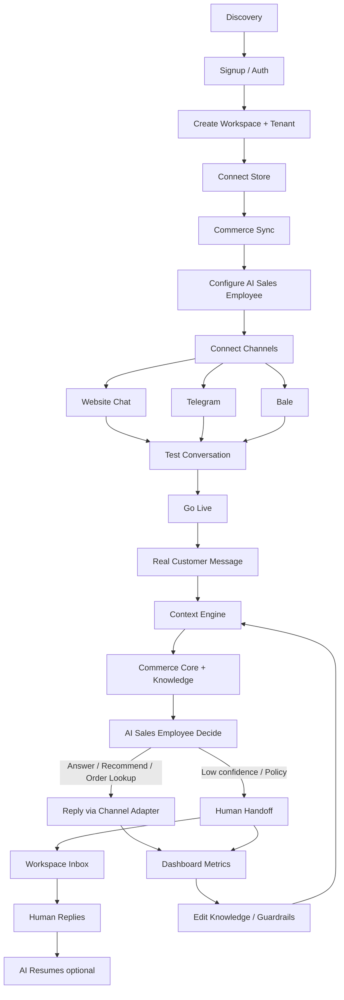

# User Journey

## Metadata

| Field | Value |
|-------|-------|
| **Version** | 0.1 |
| **Status** | Active — end-to-end journey reference for Product, Design, Engineering, Backend, Frontend, AI, and QA |
| **Owner** | Founder / Product |
| **Last Updated** | July 25, 2026 |
| **Related Documents** | [Product Vision](./product-vision.md) · [Product Principles](./product-principles.md) · [Product Scope](./product-scope.md) · [Roadmap](../00-overview/roadmap.md) · [Glossary](../00-overview/glossary.md) · [Business Plan](../01-business/business-plan.md) · [Market Research](../01-business/market-research.md) · [Pricing Strategy](../01-business/pricing-strategy.md) · [Go-To-Market](../01-business/go-to-market.md) · [Product Moat](../01-business/product-moat.md) · [Lean Canvas](../00-overview/lean-canvas.md) · [Vision (company)](../00-overview/vision.md) · [UI/UX](../05-ui/README.md) · [PRD Index](../04-prd/README.md) |

**Audience:** Product, Design, Engineering (Backend / Frontend / AI), QA, and anyone explaining how a merchant moves from discovery to continuous improvement.

**Authority:** MVP journey only. If a stage implies a feature outside [Product Scope](./product-scope.md), Scope wins.

---

# Purpose

This document answers one question:

**What does a merchant experience from first contact through a live, improving AI Sales Employee — and what must the platform, AI Runtime, and humans do at each step?**

It is the shared story for Product, Design, Engineering, Backend, Frontend, AI, and QA. Every PRD, screen, API, Skill, and test for onboarding and operations should map to a stage here.

### What User Journey is — and is not

| Document type | Question it answers | Role |
|---------------|---------------------|------|
| **User Journey** (this file) | *What happens* across merchant experience, platform internals, AI behavior, and human intervention — stage by stage | Narrative + system contract |
| **PRD** | *How* does a specific feature work (requirements, acceptance, edge cases)? | Specification |
| **UX / wireframes** | *How* does the interface present choices, states, and copy? | Interaction design |
| **Flow diagram (UI)** | *Which screens* and taps move the merchant from A to B? | Screen-level sequencing |

**Difference in one line:** UX and flow diagrams optimize screens. PRDs specify features. This User Journey explains the merchant’s job, the platform’s responsibilities, the AI’s decisions, and where humans remain in control — without prescribing pixel layouts.

It also encodes product philosophy in sequence form: merchants do not “build a bot.” They create a Workspace, connect commerce truth, hire an AI Sales Employee, connect channels, go live, monitor outcomes, and improve Knowledge.

---

# Journey Overview

The MVP path is deliberately linear and short. Anything that lengthens it without improving accuracy or trust is out of priority ([Product Principles](./product-principles.md) — *Fast Time To Value*; [Product Scope](./product-scope.md)).

```
Merchant discovers DeloRey
        ↓
Registers
        ↓
Creates Workspace
        ↓
Connects Store
        ↓
Catalog Sync
        ↓
Configure AI Employee
        ↓
Connect Website Chat
        ↓
Connect Telegram
        ↓
Connect Bale
        ↓
Test Conversation
        ↓
Go Live
        ↓
Real Customers
        ↓
Escalations
        ↓
Dashboard
        ↓
Continuous Improvement
```

**Target:** Connect store → configure Employee → enable a channel → first live grounded conversation in under 24 hours on a standard path.

**Primary product throughout:** AI Sales Employee on Website, Telegram, and Bale — grounded in Commerce Core and Knowledge, controlled by guardrails and Human Handoff, operated from the Workspace.

---

# Journey Stage 1 — Discovery

### Merchant goals

- Understand whether DeloRey is an AI Sales Employee for their shop — not another chatbot builder, CRM, or helpdesk.
- See that answers will use live catalog, inventory, orders, and policies.
- Believe time-to-value is short and risk is controllable (handoff, guardrails, audit).

### Merchant fears

- Another fluent bot that invents prices, stock, or return rules.
- A long setup that never reaches live channels.
- Loss of brand voice or uncontrolled discounts.
- Channel lock-in (especially Telegram risk in Iran) without Website and Bale coverage.

### Expected emotions

Curiosity mixed with skepticism from prior chatbot trauma; cautious optimism when commerce grounding and human control are clear.

### Product responsibilities

- Position DeloRey as hiring an AI Sales Employee, not configuring a bot ([Product Vision](./product-vision.md)).
- Set honest expectations: MVP channels are Website, Telegram, and Bale only ([Product Scope](./product-scope.md)).
- For design partners, discovery is often founder-led ([Go-To-Market](../01-business/go-to-market.md)).

### Success criteria

Merchant can state: *I connect my store, hire a Sales Employee, put it on my channels, and I stay in control when it is unsure* — and proceeds without expecting out-of-scope channels or CRM replacement.

---

# Journey Stage 2 — Signup

### Authentication

Merchant creates an account (signup / login, session security, password reset or equivalent). Identity is the gate to every Workspace action. No anonymous multi-tenant operations.

### Workspace creation

After authentication, the merchant creates a **Workspace** — the control plane for store connection, Employee config, channels, inbox, settings, and outcomes. One Workspace typically maps to one online business (one store, one brand) ([Glossary](../00-overview/glossary.md)).

### Tenant creation

Behind the Workspace, the platform creates a **Tenant**: the hard isolation boundary for catalog sync, Knowledge, Memory, conversations, analytics, jobs, and indexes. Runtime may be shared; data must not be. Tenant Isolation is non-negotiable SaaS foundation ([Product Scope](./product-scope.md)).

### What success looks like

Merchant is inside a legible Workspace with next step: connect store. Tenant-scoped storage is provisioned; no AI replies yet — Commerce Core and channels are not connected.

---

# Journey Stage 3 — Store Connection

### Why this stage exists

Without a connected storefront, DeloRey is a generic chatbot. Commerce Core is critical path ([Product Principles](./product-principles.md) — *Context Before Intelligence*).

### Shopify

Merchant authorizes Shopify (or equivalent OAuth / credential flow). Platform validates scopes needed for catalog, inventory signals, pricing, policies, and orders. Credentials are stored tenant-scoped; sync jobs are scheduled.

### WooCommerce

Merchant connects WooCommerce via supported credentials / plugin / API keys as defined by the MVP integration contract. Same Commerce Core model as Shopify: one brain, different connector — not forked business logic.

### Future connectors

Additional storefronts may come later. MVP needs one reliable primary path, not multi-platform coverage ([Product Scope](./product-scope.md)). Future connectors stay thin adapters into Commerce Core.

### Validation

Backend validates auth, permissions, reachability, and extractable catalog/orders. Frontend shows clear pass/fail — never silent “connected” with broken truth.

### Sync kickoff

Commerce Core starts initial ingest. Merchant sees sync status (running / succeeded / failed / stale). Spreadsheet upload is not the primary path.

### Failure handling

Auth failure, missing scopes, API errors, and empty catalog are visible incidents. Merchant retries or reconnects. AI must not go live on a failed connection — prefer blocked go-live over fluent lies.

---

# Journey Stage 4 — Commerce Sync

### What syncs

| Domain | Merchant experience | Platform responsibility |
|--------|---------------------|-------------------------|
| **Catalog** | Products, variants, prices, descriptions appear as known to the Employee | Commerce Core ingest + indexing for retrieval |
| **Inventory** | Stock signals available for recommendations and availability answers | Inventory flags / quantities per sync contract — not perfect real-time science |
| **Orders** | Order Lookup Skill can answer post-purchase status within guardrails | Order API access + tool surface |
| **Policies** | Shipping, returns, COD fields where available from storefront | Structured policy fields in Commerce Core |
| **Knowledge** | Synced facts plus room for FAQ / policy overrides and basic uploads | Knowledge Base with source attribution |

### Sync status

Workspace must show last successful sync, failure reason if any, and staleness. Stale catalog is a product incident, not a prompt issue ([Product Scope](./product-scope.md) anti-creep rules).

### Sync failure and retry

Failures emit observable events. Frontend surfaces retry/reconnect. AI Runtime degrades safely: refuse confident product facts when sync is broken or stale, and escalate rather than invent. Backend owns retry/backoff; Frontend owns merchant-visible recovery.

### Success criteria

Merchant sees a healthy sync. Catalog Sync and Order Lookup are operational for grounded Q&A and status checks.

---

# Journey Stage 5 — AI Employee Creation

Merchants **hire** an opinionated **AI Sales Employee**. They do not open a blank prompt IDE or visual flow builder.

### Merchant chooses

MVP primary role: **AI Sales Employee** — pre-purchase Q&A, inventory/price-aware recommendations, order status, policy answers, confidence/policy escalation. Dedicated Support Employee and multi-agent theater are out of MVP.

### Configuration surface (MVP)

| Setting | Intent |
|---------|--------|
| **Name** | How the Employee is referred to in Workspace and optionally disclosed to shoppers |
| **Tone** | Brand-aligned voice within opinionated Skill behavior |
| **Language** | MVP quality bar is Iran / Persian-first; architecture may be language-capable |
| **Guardrails** | Blocked topics, discount caps, restricted mutations, escalation triggers |
| **Discount rules** | Hard caps and approval paths — no silent deep discounts |
| **Escalation rules** | When confidence is low, policy requires a human, or customer asks for a person |

Settings are enforced in the Runtime, not as decorative UI ([Product Scope](./product-scope.md)). Defaults are safe; infinite configurability is not a goal. No live traffic until a channel is connected and testable; configuration without sync must not encourage go-live.

### Success criteria

Employee exists with enforceable guardrails. Merchant hired a Sales Employee with Skills, not a chatbot tree.

---

# Journey Stage 6 — Channel Connection

Channels are **Channel Adapters**. Business logic, Knowledge, Memory, Skills, and guardrails live in the Runtime. Website, Telegram, and Bale must not fork product rules ([Product Principles](./product-principles.md) — *One Brain, Multiple Channels*).

MVP requires all three adapters to be production-capable; a given merchant may go live on ≥1 channel first (target ≥2 by phase end) ([Product Scope](./product-scope.md) exit criteria).

### Website Chat

**Connection flow:** Merchant embeds the widget on Shopify / WooCommerce (or equivalent), confirms brand-basic styling, verifies session creation, and sees handoff states. Cart/page context when available is passed into Conversation context — DeloRey does not become a theme designer or checkout owner.

**Validation:** Test message round-trip; widget loads on mobile; handoff state renders when escalated.

**Errors / recovery:** Embed misconfiguration, CSP blocks, wrong store domain — Frontend diagnostics + reconnect instructions. Runtime never assumes website identity without adapter confirmation.

### Telegram

**Connection flow:** Merchant connects a bot to their Telegram business presence; credentials stored tenant-scoped; adapter registers webhooks / polling per implementation. Same brain as website: text plus product/link flows where supported; escalation can notify the merchant.

**Validation:** Inbound `/start` or test message produces a Runtime reply; escalation notify works.

**Errors / recovery:** Invalid token, webhook failure, bot blocked — visible disconnect; merchant reconnects. Website + Bale hedge Telegram platform risk ([Market Research](../01-business/market-research.md)) without forking logic.

**Non-goals:** Broadcast campaigns, Mini App storefront replacement.

### Bale

**Connection flow:** Merchant connects Bale bot / presence per API constraints. Parity with Telegram where the API allows; same Runtime and Knowledge.

**Validation:** Test inbound message; escalation path into Workspace Inbox.

**Errors / recovery:** API auth failure, delivery errors — same pattern: visible health, retry, reconnect. No channel-native business rules inside the Bale adapter.

### Success criteria

At least one channel shows “connected / healthy.” Merchant can send a message that reaches the AI Sales Employee with tenant-scoped context.

---

# Journey Stage 7 — Testing

Before real customers, the merchant (or design-partner concierge) runs a **test conversation**.

### Merchant sends test message

Typical tests: product availability, price, shipping/COD, return policy, order status (with a known order id), and a question designed to trigger escalation.

### AI answers

Runtime path: Channel Adapter → Conversation event → Context Engine assembles Commerce Core + Knowledge + history → Skills/tools (recommend, order lookup) → Guardrails → reply or escalate. Reply should be grounded; sources should be inspectable where Transparent AI applies.

### Merchant reviews

Merchant reads the answer in Workspace (inbox / conversation view), checks factual accuracy against the storefront, and notes tone.

### Merchant edits Knowledge

Wrong or incomplete answers are fixed by editing FAQ/policy overrides or uploading basic documents — not by rewriting a flow tree. Knowledge changes are re-indexed for RAG.

### Merchant retries

Same questions again until accuracy and escalation behavior feel trustworthy enough to go live. If sync is stale, fix sync first.

### Success criteria

Merchant trusts routine product/policy answers enough to enable live traffic; knows how to correct Knowledge; has seen Human Handoff once in a controlled test.

---

# Journey Stage 8 — Go Live

### Real customer arrives

A shopper messages on Website, Telegram, or Bale. The Channel Adapter normalizes the inbound event into a Conversation for the tenant.

### Conversation starts

Conversation History persists the thread. If customer identity is resolvable across channels, continuity may apply; if not, channel-local context still works. Conversations are commerce events, not helpdesk tickets.

### Context Engine runs

Before generation, Context Engine assembles live business state: catalog/inventory/pricing signals, relevant policies, Knowledge retrieval, and conversation memory. Generation without this assembly is out of product philosophy.

### Commerce Core loads

Tools and retrieval read from synced commerce truth — not model memorized guesses.

### Knowledge loads

RAG retrieves merchant FAQ, overrides, and uploads with attribution for audit.

### AI decides

Within guardrails, the AI Sales Employee chooses among Skill outcomes:

| Decision | When |
|----------|------|
| **Answer** | High enough confidence; grounded sources available |
| **Recommend** | Shopper shows purchase intent; inventory/price-aware catalog match |
| **Order Lookup** | Post-purchase status within allowed tools |
| **Escalate** | Low confidence, policy block, customer requests human, or unsafe mutation |

Prefer “I don’t know” + Human Handoff over wrong SKU, price, or policy.

### Success criteria

First live grounded conversation completes safely. Events feed analytics. Audit Logs record what the Employee knew, tools called, and whether it escalated.

---

# Journey Stage 9 — Human Handoff

### Confidence and escalation

Escalation is first-class trust mechanics — not an enterprise add-on. Triggers include low confidence, merchant escalation rules, blocked topics, discount approval needs, and explicit customer request.

### Human replies

Workspace Inbox surfaces the thread across Website / Telegram / Bale with a context packet (summary, customer identifiers if known, recent messages, relevant order/product facts). AI pauses for that conversation while the human owns the reply path.

### AI resumes

When policy allows and the human returns control (or after defined rules), the Employee may resume with conversation memory intact — it must not pretend the handoff never happened.

### Conversation memory

History remains the source of continuity for operators and for later turns. Audit retains tool calls and escalation reasons for Transparent AI.

### Success criteria

Merchant experiences control: they can take over, answer, and return the Employee to duty without losing context. Automation rate is never inflated by disabling handoff.

---

# Journey Stage 10 — Dashboard

The Workspace dashboard (basic Revenue Dashboard + analytics) is how merchants renew trust weekly.

### Merchant sees (MVP)

| Signal | Why it matters |
|--------|----------------|
| **Conversation count** | Volume and channel mix |
| **Resolution rate** | Share of routine questions closed without escalation |
| **Escalations** | Rate and reasons — trust and Knowledge gaps |
| **Revenue** | Conservative attributed conversion / recovery where linkage exists |
| **Top questions** | Objection and FAQ patterns |
| **Knowledge gaps** | Repeated misses / low-confidence topics that need KB edits |

Attribution must be honest and explainable — not fake-precision ROI graphs ([Product Scope](./product-scope.md)). Advanced BI is out of MVP.

### Success criteria

Merchant can explain Employee impact in one sentence using dashboard numbers. Design-partner bar includes ≥1 attributed conversion or recovery within 14 days where methodology allows ([Roadmap](../00-overview/roadmap.md)).

---

# Journey Stage 11 — Continuous Improvement

### Merchant edits Knowledge

Each correction (FAQ, policy override, document upload) strengthens the Commerce Context Graph over time ([Product Moat](../01-business/product-moat.md)).

### AI becomes better

Better Knowledge + healthier sync + tighter guardrails → higher grounded resolution, fewer hallucinations, fewer unnecessary escalations.

### Conversation quality improves

Operators spend time on exceptions; routine pre-purchase and status work stays with the Sales Employee. Retention follows visible accuracy and revenue signals, not message volume vanity metrics.

### Loop

Dashboard gaps → Knowledge edits → retest → live improvement. This loop *is* the product operating rhythm. Marketing automation, CRM pipelines, and helpdesk queues are not substitutes for it in MVP.

---

# Journey Diagram



---

# System View

For every stage, the same five lenses apply. This is the contract between Frontend, Backend, AI Runtime, Database, and Channels.

| Stage | Merchant | Frontend | Backend | AI Runtime | Database | Channel |
|-------|----------|----------|---------|------------|----------|---------|
| **1 Discovery** | Evaluates fit and risk | Marketing / sales materials (often founder-led) | N/A or lead capture only | N/A | N/A | N/A |
| **2 Signup** | Creates account + Workspace | Auth UI, Workspace shell, activation checklist | Auth, tenant provisioning, RBAC session | N/A | Tenant + user records | N/A |
| **3 Store connection** | Authorizes Shopify / Woo | Connector UI, validation errors | OAuth/credentials, connector validation | N/A | Encrypted credentials, connection state | N/A |
| **4 Commerce sync** | Watches sync health | Sync status, staleness, retry | Sync jobs, Commerce Core ingest, events | Must respect sync health | Catalog, inventory, orders, policy fields, KB index | N/A |
| **5 AI Employee** | Names Employee, sets tone/language/guardrails | Employee settings forms | Persist settings, enforce in Runtime config | Loads Skills + guardrails config | Employee config, audit of changes | N/A |
| **6 Channels** | Connects Web / Telegram / Bale | Channel setup, health, embed snippets | Adapter credentials, webhooks | Same brain registered per adapter | Channel bindings, health | Website widget, Telegram bot, Bale bot |
| **7 Testing** | Sends tests, edits KB | Inbox + KB editors + test affordances | Conversation APIs, reindex | Full grounded path | History, KB, audit | Test traffic on chosen channel |
| **8 Go live** | Enables live traffic | Live indicators, inbox | Event ingest, rate limits | Context → Skills → reply/escalate | Conversations, tool traces | Real shopper messages |
| **9 Handoff** | Takes over / returns control | Inbox takeover UX | Handoff state machine, notifications | Pause / resume, context packet | Escalation events, memory | Deliver human or AI replies |
| **10 Dashboard** | Reviews outcomes | Analytics / revenue views | Aggregation, attribution rules | N/A (consumes prior events) | Metrics store, audit | Per-channel breakdowns |
| **11 Improve** | Edits KB and rules | KB UI, gap lists | Reindex, config updates | Uses updated context next turn | Updated KB embeddings / docs | Unchanged adapters |

**Invariant:** Channel Adapters transport messages; they do not own catalog truth, discount policy, or escalation rules.

---

# Success Metrics

Aligned with MVP exit criteria and Roadmap Phase 1 targets — not new product promises.

| Metric | Definition | MVP-oriented bar |
|--------|------------|------------------|
| **Time to first value** | Signup → first live grounded conversation on a standard path | &lt; 24 hours |
| **Activation** | Store connected + Employee configured + ≥1 channel live + test passed | Merchant reaches Go Live |
| **Retention** | Design partner still active | ≥ 75% at 30 days (Roadmap) |
| **Trust** | Handoff, guardrails, audit used in production — not disabled for vanity automation | Trust mechanics observed live |
| **Accuracy** | Factual correctness on audited product/policy sample | ≥ 90%; hallucination &lt; 5% on factual commerce questions |
| **Resolution** | Routine product/policy questions resolved without human | ≥ 50% |
| **Revenue** | Conservative attributed conversion or recovery | ≥ 1 per design partner within 14 days where methodology allows |

Secondary operational signals: escalation rate and reasons, sync health uptime, grounded-answer visibility, channels activated (≥1 required; ≥2 target by phase end).

---

# Failure Scenarios

| Failure | What the merchant sees | Recovery |
|---------|------------------------|----------|
| **Never connects store** | Empty Employee; no grounded answers possible | Block go-live; Workspace checklist forces store connection; founder concierge for design partners |
| **Sync fails** | Explicit failed/stale sync; AI must not invent catalog facts | Show error; retry/backoff; reconnect credentials; degrade to escalate / “I don’t know” until healthy |
| **Telegram disconnected** | Channel health = disconnected; no Telegram delivery | Reconnect token/webhook; continue on Website and/or Bale; do not invent Telegram-only business logic |
| **No Knowledge / thin KB** | Generic or frequent escalations; weak policy answers | Prompt FAQ/policy overrides + basic uploads; surface top unanswered questions on dashboard |
| **AI confidence low** | Escalations spike; merchant inbox busy | Prefer handoff over wrong answers; merchant tightens KB and policies; review audit traces |
| **Human unavailable** | Escalated threads wait; shopper may see handoff/offline state | Clear handoff messaging; business-hours expectations; AI continues only on in-guardrail topics — never disable handoff to fake resolution |

**Rule:** Silent failure is a product defect. Visible failure with a recovery path is acceptable.

---

# Out of Scope

The following must not appear as stages, optional “quick adds,” or implied next steps in this journey for MVP:

| Excluded | Why |
|----------|-----|
| **Instagram** | Different API / moderation / media UX; after three-channel depth |
| **WhatsApp** | Business API cost and compliance; Growth layer at earliest |
| **CRM** | Conversation context yes; pipelines and CRM SoR no |
| **Helpdesk** | Escalation surface ≠ ticket product center of gravity |
| **Marketing Automation** | Blasts and drips dilute Sales Employee quality before ROI proof |
| **Marketplace** | Multi-seller / consumer marketplace ops are not SMB single-store MVP |

Also out of this journey’s implied scope: email/voice as channels, visual flow builders, workflow IDEs, Skill/agent marketplaces, multi-brand enterprise governance, white label, native apps, and advanced BI — per [Product Scope](./product-scope.md).

---

# Summary

The User Journey should make it obvious that the product is extremely simple:

```
Create Workspace
        ↓
Connect Store
        ↓
Create AI Employee
        ↓
Connect Channels
        ↓
Go Live
        ↓
Monitor Dashboard
        ↓
Improve Knowledge
```

Nothing else.

Behind that simplicity the platform does the hard work: Tenant Isolation, Commerce Core, Context Engine, Sales Skills, Channel Adapters, Human Handoff, Audit Logs, and honest measurement. Merchants hire an Employee; teams build a commerce conversation layer — not a chatbot studio.

Aligned with Vision, Principles, Scope, Roadmap, Business Plan, Market Research, Pricing, GTM, and Moat — **no new capabilities**. New stages require a Scope revision first, then a version bump here.

---

*User Journey v0.1. Version bump + written rationale required for changes. Validate onboarding and operations design against this document and [Product Scope](./product-scope.md).*
