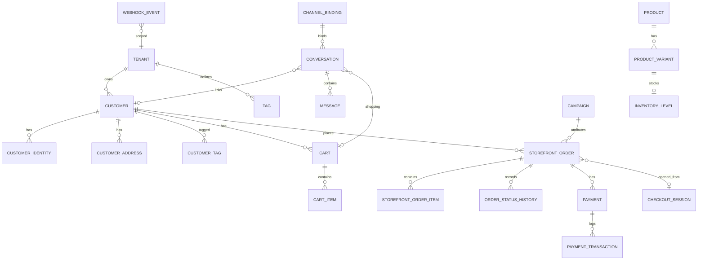

# Omnichannel Commerce Architecture

## Metadata

| Field | Value |
|-------|-------|
| **Version** | 0.2 |
| **Status** | Proposal — awaiting implementation approval |
| **Owner** | Engineering |
| **Last Updated** | August 17, 2026 |
| **Authority** | Product Scope v0.2 · Product Principles · this document for commerce-core evolution |
| **Related** | [System Architecture](./system-architecture.md) · [Backend Architecture](./backend-architecture.md) · [Database Design](./database-design.md) · [Product Scope](../02-product/product-scope.md) |

This document is the **implementation contract** for evolving Seloma into one commerce system with multiple channels. It does **not** replace existing docs wholesale. Where older architecture still says “AI Runtime is the center of gravity,” **this document wins for commerce truth**. AI remains an optional interface.

```
Product Scope / Principles
    ↓
This document (commerce SoR + channel adapters + AI tools)
    ↓
Existing component docs (Runtime, Gateway, Conversation, Security)
```

**Do not start large-scale implementation until this proposal is approved.**

---

# 1. Architecture Overview

## Governing rule

```
CHANNELS
   ↓
ADAPTERS
   ↓
CONVERSATION / COMMANDS
   ↓
APPLICATION USE CASES
   ↓
COMMERCE CORE
   ↓
DATABASE
```

AI is another interface, not a second commerce system:

```
AI → TOOLS → APPLICATION USE CASES → COMMERCE CORE
```

Never: `AI → Database`. Never: channel-specific Order/Cart logic.

## Center of gravity (updated)

| Layer | Role |
|-------|------|
| **Commerce Core** | Source of truth: Customer, Product, Cart, Order, Payment, Workflow |
| **Conversation Engine** | Deterministic thread + state; not tickets |
| **Channel Adapters** | Translate Instagram / Telegram / Bale / Website ↔ commands |
| **Rule Engine** | Cheap deterministic intents before any LLM |
| **AI Agent** | Optional NL interface via validated tools |
| **Workspace** | Merchant ops: orders, inbox, catalog, channels, analytics |

A merchant who never enables AI must still sell on website + messaging channels.

## Logical topology

```text
                   CUSTOMER
                      |
          +-----------+-----------+-----------+
          |           |           |           |
      Instagram   Telegram      Bale      Website
          |           |           |           |
          +-----------+-----------+-----------+
                      |
                Channel Gateway
                      |
              Conversation Engine
                      |
          +-----------+-----------+
          |                       |
     Rule Engine              AI Agent
          |                       |
          +-----------+-----------+
                      |
                Commerce Core
                      |
       +------+-------+-------+--------+
       |      |       |       |        |
    Customer Product Cart  Order   Payment
                      |
                  Workflow
                      |
                  Admin Panel
```

## Style

- **Modular NestJS monolith** (already the case). Extract process roles later (`api`, `webhook`, `runtime-worker`, `sync-worker`) — not new repos.
- PostgreSQL is SoR. Redis is cache / locks / queues / short-lived state.
- One `ShopService.placeOrder` (or extracted `CreateOrder` use case) for every channel.

---

# 2. Repository Analysis

## What already exists (reuse)

Monorepo `seloma-ai` (pnpm workspaces):

| App / package | Role | Port |
|---------------|------|------|
| `apps/api` | NestJS + Prisma + BullMQ | 3001, prefix `/v1` |
| `apps/workspace` | Next.js App Router admin | 3010 |
| `apps/storefront` | Public shop (home, PDP, cart, checkout, track) | 3020 |
| `apps/widget` | Website chat embed | 5173 |
| `apps/web` | Marketing / landing | 3000 |
| `packages/ui` | Shared tokens / chips | — |
| `packages/api-client` | Typed fetch client | — |

**Infra:** Docker Compose Postgres 16 (`15432`) + Redis 7. Prisma migrations through slice 27 + omnichannel customers.

**Auth today:** opaque session tokens in Postgres (`sessions`), Bearer header, `SessionAuthGuard`. Roles on `workspace_memberships` (`owner`). Not JWT + refresh yet.

**Commerce today (native SoR):**

- Catalog: `Product`, `Category`, `Attribute`, `ProductVariant`, `InventoryLevel`, `Discount`, `Article`
- Cart: `Cart` keyed by `(tenantId, sessionId)` — website session **or** `{channel}:{conversationId}`
- Orders: `StorefrontOrder` + line snapshots (`sku`, `title`, `unitPrice`)
- Customers: `Customer` unique on `(tenantId, phoneNormalized)` + `CustomerIdentity` + `CustomerAddress`
- Checkout: `ShopService.placeOrder` used by storefront **and** `ChannelCheckoutService`
- Payments: COD + Zarinpal (or mock) in `PaymentsService`
- Channel checkout state: `ChannelCheckoutSession` (conversation step machine)

**Channels today:**

- Website widget + storefront
- Telegram bot (webhook, encrypt token, simulate)
- Bale bot (same pattern)
- Instagram: production-shaped adapter + BoxAPI spike (not Official API in Runtime)

**AI today:**

- `RuntimeService.executeTurn` — regex intents, guardrails, handoff, then gateway
- `ChannelCheckoutService.handleTurn` runs **before** LLM for buy flows
- AI Gateway (provider plugins, circuit breaker, usage ledger)
- Knowledge FAQ + chunks
- Inbox takeover / release

**Jobs today:** BullMQ `batch.sync` only (Shopify/Woo). Connectors exist but env-disabled for Iran native shop.

## What is missing vs this brief (gaps)

| Area | Gap |
|------|-----|
| Module shape | `shop` is a god-module; no `repository/` layer; Prisma in services |
| Cart | No `customerId`, no price snapshot on `CartItem`, no cart `status`/`channel` columns |
| Orders | Two models (`Order` sync vs `StorefrontOrder` native); no status history; no reject reason; no `PENDING_ADMIN_APPROVAL` after paid |
| Workflow | Status list + UI buttons; not a validated state machine |
| Checkout URL | No signed, expiring, tenant-aware `CheckoutSession` token for Instagram → website |
| Payments | No `IPaymentProvider`; no `payments` / `payment_transactions` tables |
| Conversation | No `customerId`, no shopping state (`IDLE`…`WAITING_FOR_PAYMENT`); ownership only |
| Adapters | No shared `IChannelAdapter` + capability model; each adapter talks to Runtime directly |
| Rule Engine | Regexes inside Runtime, not a module |
| AI tools | No validated tool layer calling use cases |
| Attribution | `channel` on order; no `source` / `campaign` / `referrer` |
| Tags / campaigns | Not in schema |
| Notifications | No unified notify + retry; no originating-channel order status |
| Webhooks | No `webhook_events` idempotency table |
| Events | No domain event bus / outbox (except sync queue) |
| Auth | No JWT refresh, no RBAC matrix, no rate-limit middleware |
| Realtime | No Socket.IO |
| Admin | No customer 360 page; inbox lacks cart/orders side panel; no approve/reject with reason |
| Tests | Strong shop domain unit tests; missing order workflow, identity resolver, rule engine, channel E2E |
| Frontend libs | No Zustand / TanStack Query / RHF / Zod in workspace (local state + `api` helper). Keep existing UI system unless a screen needs them. |

## Explicit non-goals for this evolution

- Do not rewrite Workspace or Storefront from scratch.
- Do not create microservices.
- Do not delete Shopify/Woo connectors; keep them as optional ingest.
- Do not add Kafka.
- Do not make Instagram a full storefront UI.
- Do not introduce a second cart/order stack per channel.

---

# 3. Module Map

Keep NestJS modules. Evolve **boundaries** and **use cases**; do not rename the whole tree in one PR.

## Target backend modules (mapped to existing)

| Target module | Existing home | Action |
|---------------|---------------|--------|
| `auth` / `users` / `tenants` | `identity`, `platform` | Keep; later JWT/RBAC |
| `customers` / `customer-identities` | `shop/customers.service.ts` | Extract module + Identity Resolution |
| `channels` / `channel-integrations` | `ChannelBinding` + adapter connect APIs | Keep; add capabilities |
| `channel-adapters` | `adapters/{website,telegram,bale,instagram}` | Add `IChannelAdapter` |
| `conversations` / `messages` | `conversation`, `inbox` | Add customer link + shopping state |
| `products` / `categories` / `variants` / `inventory` | `shop/*` | Keep; split files incrementally |
| `carts` | `ShopService` cart methods | Extract `CartService` |
| `orders` / `order-workflows` | `StorefrontOrder` + CMS patch | Extract `OrderService` + workflow |
| `payments` / `payment-providers` | `PaymentsService` | Introduce `IPaymentProvider` |
| `shipping` / `addresses` | `CustomerAddress` | Extend address model later |
| `notifications` | — | New, queue-backed |
| `campaigns` / `analytics` | `analytics` (conversation metrics) | Extend events + channel breakdown |
| `ai` / `ai-agents` / `ai-tools` | `runtime`, `employee`, `ai-gateway` | Add tool registry |
| `admin` / `audit-logs` / `settings` | `audit`, `workspace`, storefront settings | Keep |
| `commerce` (connectors) | `commerce` + shopify/woo | Optional external projection |

## Use cases (shared entry points)

These must be callable from REST, webhook, bot, AI tool, and admin:

| Use case | Today |
|----------|--------|
| `IdentifyCustomer` | `CustomersService.lookupByPhone` / `lookupByIdentity` / `upsertFromCheckout` |
| `StartConversation` / `ReceiveMessage` | adapters + `ConversationService` |
| `SearchProducts` / `GetProduct` | `CommerceRetrievalService` + storefront reads |
| `AddItemToCart` / `RemoveCartItem` | `ShopService` cart |
| `CreateCheckout` / `CreateOrder` | `placeOrder` |
| `StartPayment` / `VerifyPayment` | `PaymentsService` |
| `ApproveOrder` / `RejectOrder` | CMS `updateStorefrontOrderStatus` (too loose) |
| `EnableHumanHandoff` / `AssignConversation` | `HandoffService` |
| `SendNotification` | missing |

## Frontend surfaces (keep)

```
Workspace (apps/workspace)
  Dashboard, Shop CMS, Orders, Inbox, Channels, Employee, Knowledge, Audit

Storefront (apps/storefront)
  Home → Products → PDP → Cart → Checkout → Payment → Track

Widget (apps/widget)
  Website conversation only
```

New Workspace screens when we reach Admin phase: Customers, Order detail (timeline + approve/reject), Conversation detail (chat + profile + cart + orders), Campaigns, richer Analytics.

---

# 4. Database ERD

Conceptual (native SoR). External `orders` table remains a **sync projection**, not a second checkout path.



---

# 5. Database Tables

## Keep as-is (already adequate)

`tenants`, `users`, `workspace_memberships`, `sessions`, `employees`, `channel_bindings`, `products`, `categories`, `product_variants`, `inventory_levels`, `inventory_transactions`, `discounts`, `customers`, `customer_identities`, `customer_addresses`, `storefront_orders`, `storefront_order_items`, `conversations`, `messages`, `knowledge_*`, `audit_*`, `ai_*`.

## Evolve (additive migrations)

### Cart

| Change | Why |
|--------|-----|
| `customer_id` nullable | Unify identities; anonymous website still uses `session_id` |
| `channel` | Attribution |
| `status` `active \| converted \| abandoned` | Analytics |
| `CartItem.unit_price_snapshot`, `line_total_snapshot` | Do not trust live price at checkout without re-quote |

### StorefrontOrder

| Change | Why |
|--------|-----|
| `source`, `campaign_id`, `referrer`, `landing_page` | Channel attribution |
| `payment_status` separate from `status` | Paid vs fulfillment |
| `rejection_reason` | Mandatory on reject |
| `conversation_id` nullable | Inbox context |
| `checkout_session_id` nullable | Secure web checkout |

### New tables

| Table | Purpose |
|-------|---------|
| `order_status_history` | Who/when/from→to + note |
| `checkout_sessions` | Signed token, expiry, cart/customer, one-time flag |
| `payments` | Provider-agnostic payment aggregate |
| `payment_transactions` | Request/verify/refund attempts; unique `payment_reference` |
| `webhook_events` | Unique `(tenant_id, provider, external_event_id)` |
| `tags` / `customer_tags` / `conversation_tags` | Dynamic tags |
| `campaigns` | Attribution entity |
| `analytics_events` | Append-only funnel events |
| `ai_tool_calls` | Validated tool audit |
| `notification_outbox` | Retryable channel/SMS/email sends |
| `domain_outbox` | Optional transactional events |

### Dual order models

| Table | Meaning going forward |
|-------|------------------------|
| `storefront_orders` | **The** Order Engine (all channels) |
| `orders` | External storefront sync for Order Lookup Skill only |

Do not merge in v1; hide `orders` from merchant “سفارش‌ها” UI (already native-only).

### Constraints (must add)

- Unique webhook event per tenant+provider+external id
- Unique payment reference per provider
- Unique checkout token
- Check constraints on order status / payment status enums (or app-enforced + tests)
- All new tables: `tenant_id NOT NULL` + indexes `(tenant_id, …)`

---

# 6. API Map

Keep global prefix **`/v1`** (already used by workspace, storefront, widget). Optional alias `/api/v1` later — do not break clients.

## Existing (stable)

| Group | Examples |
|-------|----------|
| Auth | `POST /v1/auth/signup`, `POST /v1/auth/login` |
| Workspace | `GET /v1/workspace/me` |
| Shop CMS | `/v1/shop/products`, categories, inventory, discounts, orders `PATCH` |
| Storefront | `/v1/storefront/:slug/{home,products,cart,checkout,orders/track}` |
| Payments | `/v1/payments/zarinpal/callback`, mock pay |
| Channels | `POST /v1/channels/{telegram,bale,instagram}/connect` |
| Webhooks | `POST /v1/webhooks/{telegram,bale,instagram}/:bindingId` |
| Inbox | `GET /v1/conversations`, takeover, release, operator message |
| Widget | `/v1/widget/sessions`, messages |
| AI | employee, knowledge, gateway health/policy/usage |
| Analytics | `/v1/analytics/summary`, `revenue` |

## Add incrementally

| Method | Path | Use case |
|--------|------|----------|
| GET/POST | `/v1/customers`, `/v1/customers/:id` | CRM 360 |
| POST | `/v1/checkout/sessions` | Signed checkout from any channel |
| GET | `/v1/checkout/sessions/:token` | Storefront hydrate |
| POST | `/v1/orders/:id/approve` | Admin approve |
| POST | `/v1/orders/:id/reject` | Admin reject + reason |
| GET | `/v1/orders/:id` | Order detail + timeline |
| GET | `/v1/analytics/channels` | Channel breakdown |
| POST | `/v1/conversations/:id/handoff` | already escalate — keep |

Webhook controllers stay thin: verify → persist event id → enqueue → 200.

---

# 7. Event Map

Emit **after** the commerce transaction commits. Consumers are idempotent. MVP transport: Postgres outbox **or** BullMQ jobs with `idempotencyKey`. Not Kafka.

| Event | Producer | Consumers |
|-------|----------|-----------|
| `CustomerCreated` / `CustomerIdentityLinked` | Customer use case | Analytics |
| `ConversationStarted` / `MessageReceived` | Conversation | Analytics, optional AI job |
| `ProductSelected` / `CartUpdated` | Cart | Analytics, abandoned-cart later |
| `CheckoutCreated` | Checkout session | Analytics |
| `OrderCreated` | Order | Notify, analytics |
| `PaymentStarted` / `PaymentCompleted` / `PaymentFailed` | Payment | Workflow, notify |
| `OrderApproved` / `OrderRejected` | Workflow | Notify originating channel |
| `OrderShipped` / `OrderDelivered` | Workflow | Notify |
| `catalog.updated` / `sync.*` | Existing connectors | Cache invalidation (already intended) |

### Funnel analytics events

`conversation_started`, `product_viewed`, `product_selected`, `cart_created`, `cart_updated`, `checkout_started`, `payment_started`, `payment_completed`, `order_created`, `order_approved`, `order_rejected`, `order_shipped`, `order_delivered`.

### BullMQ queues (target)

| Queue | Exists? | Jobs |
|-------|---------|------|
| `batch.sync` | Yes | Shopify/Woo |
| `interactive.turns` | No | Optional: move Runtime off request path |
| `notify` | No | `send_order_status`, `retry_channel_message` |
| `webhooks` | No | `process_webhook` (idempotent) |
| `ai` | No | `ai_message` when rules miss |
| `analytics` | No | `analytics_event` |

Interactive turns may stay in-process until latency/isolation requires a worker.

---

# 8. Channel Adapter Design

## Contract

```typescript
interface ChannelCapabilities {
  supportsButtons: boolean;
  supportsInlineKeyboard: boolean;
  supportsMiniApp: boolean;
  supportsProductCards: boolean;
  supportsImages: boolean;
  supportsCheckoutLink: boolean;
  supportsRichMessages: boolean;
}

interface IChannelAdapter {
  readonly channel: 'instagram' | 'telegram' | 'bale' | 'website';
  capabilities(): ChannelCapabilities;
  receiveMessage(input: NormalizedInbound): Promise<void>;
  sendMessage(input: OutboundText): Promise<void>;
  sendProduct(input: OutboundProduct): Promise<void>;
  sendImage(input: OutboundImage): Promise<void>;
  sendButtons(input: OutboundButtons): Promise<void>;
  sendCheckoutLink(input: OutboundCheckout): Promise<void>;
  sendOrderStatus(input: OutboundOrderStatus): Promise<void>;
}
```

Unsupported capabilities **downgrade** (product card → image+text+link; buttons → numbered replies).

## Capability matrix

| Capability | Instagram | Telegram | Bale | Website |
|------------|-----------|----------|------|---------|
| Buttons | Limited (API/provider) | Yes | Where API allows | UI |
| Inline keyboard | No | Yes | Partial | N/A |
| Mini App | No | Yes (later) | No | N/A |
| Product cards | Limited | Yes (photo+caption) | Degrade | Native PDP |
| Images | Yes | Yes | Yes | Yes |
| Checkout link | **Primary purchase path** | Yes + in-chat COD | Yes + in-chat COD | Native checkout |
| Rich messages | Provider-dependent | Yes | Degrade | Full |

## Adapter rule

Adapters **normalize and deliver**. They call use cases (`AddItemToCart`, `CreateCheckout`). They never compute price, stock, or order status.

Wrap existing `TelegramAdapterService`, `BaleAdapterService`, `InstagramAdapterService`, `WebsiteAdapterService` behind the interface; do not rewrite clients.

Instagram transport stays **BoxAPI (or Official API) behind `InstagramProviderPort`** — see [BoxAPI architecture recommendation](../07-evaluations/boxapi-instagram-official-api/11-architecture-recommendation.md).

---

# 9. Instagram Flow

Instagram is conversation + discovery + **checkout entry**, not a full shop UI.

```text
DM → Webhook (verify, idempotent)
  → IdentifyCustomer (instagram externalId; merge later on phone)
  → Conversation (state BROWSING_PRODUCTS)
  → Rule Engine (greeting / cart / checkout / search)
  → else AI tools (searchProducts, …)
  → Commerce Core search / cart
  → CreateCheckout → signed URL
  → Customer opens Website Checkout
  → Payment verify server-side
  → Order PAID → PENDING_ADMIN_APPROVAL
  → Admin approve/reject
  → Notify via Instagram adapter (fallback SMS/none)
```

Checkout URL requirements: HMAC-signed token, TTL, tenant + customer + cart bound, optional one-time use. Storefront checkout page hydrates from `GET /v1/checkout/sessions/:token` — **same** `CreateOrder` as website cart checkout.

---

# 10. Telegram Flow

```text
/start → Main menu (inline keyboard)
  فروشگاه → categories → products → variant → qty → CartService
  سفارش‌های من → GetCustomerOrders (identity = telegram user id)
  حساب من → collect phone → IdentifyCustomer merge
Checkout:
  in-chat COD (existing ChannelCheckoutService) OR checkout URL
Payment → same Order Engine
Mini App: later, when bot menus are stable — richer UI, still CartService/OrderService
```

Deep links: `t.me/bot?start=product_<id>` → `GetProduct` + optional add to cart.

---

# 11. Bale Flow

Same commands and use cases as Telegram. Only `BaleAdapter` knows Bot API differences. Feature-detect buttons; otherwise numbered text. Checkout URL + COD both allowed.

---

# 12. Website Flow

```text
Storefront Home → Category/Product → PDP (variant) → Cart → Checkout
  → address + phone → CreateOrder
  → COD: status pending (admin confirm)
  → Online: pending_payment → Zarinpal/mock verify → paid → admin approval
Order Track page stays on storefront
Widget is conversation only; buying uses storefront or checkout link
```

No separate website order system. `POST /v1/storefront/:slug/checkout` already calls `placeOrder`.

---

# 13. AI Tool Architecture

## Cost path (already partially implemented)

```
Message → Human ownership? → Guardrails
       → Rule Engine / ChannelCheckout
       → structured Skill (order lookup, recommend)
       → AI Gateway + tools
```

Do not call LLM for سلام / سبد / پرداخت / لغو / سفارش من.

## Tools (validate then use case)

| Tool | Use case |
|------|----------|
| `searchProducts` | ProductSearch |
| `getProduct` / `getProductVariants` | GetProduct |
| `checkInventory` | Inventory read |
| `addToCart` / `removeFromCart` / `getCart` | Cart |
| `createCheckout` | CreateCheckout |
| `getCustomerOrders` / `getOrderStatus` | Order queries |
| `requestHumanHandoff` | Handoff |

Tool JSON is **untrusted**. Backend validates tenant, customer, inventory, and guardrails. Persist `ai_tool_calls`.

AI never imports Prisma.

---

# 14. Order State Machine

Current statuses: `pending`, `pending_payment`, `confirmed`, `shipped`, `delivered`, `cancelled`.

**Target** (extend, migrate `confirmed` → `approved` in a dedicated PR):

```text
DRAFT (optional, unused if we create only on checkout)
  → PENDING_PAYMENT          (online)
  → PAID → PENDING_ADMIN_APPROVAL
  → APPROVED → PROCESSING → SHIPPED → DELIVERED

COD:
  PENDING_CONFIRMATION → APPROVED → …  (maps from today's pending → confirmed)
```

Terminal / alternate: `CANCELLED`, `REJECTED` (reason required), `PAYMENT_FAILED`, `REFUNDED`, `OUT_OF_STOCK`.

Only listed transitions allowed. `OrderWorkflowService.transition({ from, to, actor, reason })` writes `order_status_history`. Invalid transition throws domain error.

**Admin approval:** after successful **online** payment, do not skip to shipped. COD still needs merchant confirm (already `pending`).

Notifications fire from workflow, not from the HTTP controller.

---

# 15. Security Model

| Control | Today | Target |
|---------|--------|--------|
| Merchant auth | Session token 7d | Keep sessions for Workspace; add refresh **or** JWT later without breaking clients |
| RBAC | `owner` membership | Roles: owner / operator / viewer; enforce on approve/reject |
| Tenant isolation | `tenantId` on queries + session bind | Keep; fail closed; add isolation tests for new tables |
| Webhooks | Telegram secret header; Bale/IG similar | Verify + `webhook_events` uniqueness |
| Secrets | `encryptSecret` for bot tokens | Keep; never return to frontend |
| Checkout | Open storefront checkout by slug+session | Signed checkout tokens for cross-channel |
| Payments | Server-side Zarinpal verify | Keep; never trust query `Status=OK` alone |
| Validation | class-validator on DTOs | Keep; Zod on storefront only if we introduce forms library |
| Rate limit | None | Redis per IP / per binding on webhooks and login |
| Audit | `admin_audit_events` + `audit_turns` | Log approve/reject/handoff |

CORS already allowlists workspace/widget/storefront. Widget origin allowlist per `ChannelBinding`.

---

# 16. Redis / BullMQ Architecture

PostgreSQL remains SoR. Redis key grammar: `t:{tenantId}:…`

| Use | Key / queue | Today |
|-----|-------------|--------|
| Sessions | optional cache | Postgres only — OK for now |
| Rate limits | `t:{id}:rl:login:{ip}` | Missing |
| Conversation step | already in Postgres `channel_checkout_sessions` | Keep SoR in PG; Redis optional TTL cache |
| Checkout token denylist | after one-time use | New |
| Distributed lock | `t:{id}:lock:order:{id}` | Missing — add around payment verify |
| Idempotency | `t:{id}:idemp:{key}` short TTL + DB unique | New |
| AI circuit | existing | Keep |
| BullMQ | `batch.sync` | Add `notify`, `webhooks` when those features land |

Payment verify and order create must use DB unique constraints **and** a Redis lock to survive double callbacks.

---

# 17. Testing Strategy

Align with [Testing Strategy](./testing-strategy.md); add commerce-core suites.

## Unit (extend existing vitest)

- `CustomerIdentityResolver` (phone merge, no wrong merge)
- `CartService` (snapshot prices, stock check)
- `OrderWorkflow` (legal vs illegal transitions, reject requires reason)
- `PaymentsService` / provider adapter (verify, idempotent second callback)
- `RuleEngine` (greeting, cart, checkout, search)
- AI tool validation (rejects bad tenant/product)

Existing: pricing, inventory, discounts, variants, SKU, retrieval, phone.

## Integration

- Webhook → conversation (idempotent duplicate)
- Conversation → cart (`{channel}:{conversationId}` session)
- Cart → `placeOrder`
- Payment callback → PAID → pending approval
- Approve/reject → notification job enqueued (order still valid if notify fails)

## E2E (minimum)

1. Instagram-like simulate webhook → products → cart → checkout token → storefront pay mock → admin approve  
2. Telegram simulate `/start` → add SKU → COD placeOrder  
3. Bale simulate same business path  
4. Website storefront checkout COD  
5. Online payment verify + double-callback  
6. Admin reject with reason  
7. Human handoff stops AI  

Do not leave `main` failing typecheck or unit tests after a slice.

---

# 18. Implementation Roadmap

Work **incrementally**. Each slice: schema if needed → use case → typecheck → tests → docs note. No big-bang rewrite.

### Slice A — Commerce hardening (first after approval)

1. Extract `OrderWorkflowService` over current statuses (strict transitions + history table).  
2. `POST /v1/orders/:id/approve` and `/reject` (reason). Map UI buttons to these.  
3. Separate `paymentStatus` from fulfillment `status` (additive column).  
4. Online: `pending_payment` → verify → `paid` + `PENDING_ADMIN_APPROVAL` (or `confirmed` alias during migrate).  
5. Unit tests for workflow.

### Slice B — Cart & customer

1. Cart `customerId` / `channel` / `status` + line price snapshots.  
2. Extract `CartService` from `ShopService`.  
3. Identity resolution: link telegram/bale/instagram ids; merge on phone at checkout (already started).  
4. Customer Workspace page (read-only 360).

### Slice C — Secure checkout session

1. `checkout_sessions` + HMAC token.  
2. Instagram/Telegram/Bale: `sendCheckoutLink` for online path.  
3. Storefront route `/checkout/{token}`.  
4. Keep in-chat COD.

### Slice D — Payment provider port

1. `IPaymentProvider` wrapping Zarinpal + mock.  
2. `payments` / `payment_transactions`.  
3. Redis lock + unique authority.

### Slice E — Conversation state + Rule Engine

1. Conversation `customerId`, `shoppingState`, `context` jsonb.  
2. Extract Rule Engine from Runtime regexes + `ChannelCheckoutService` steps.  
3. Checkout steps remain deterministic.

### Slice F — Adapter interface + capabilities

1. `IChannelAdapter` + capability downgrade.  
2. Telegram menu (store / orders) calling use cases.  
3. Instagram production path: webhook → rules/cart → checkout link (BoxAPI port).  
4. `webhook_events`.

### Slice G — Notifications + events

1. `NotificationService` + BullMQ `notify`.  
2. Domain events for order/payment.  
3. Channel analytics from `storefront_orders.channel` + new `analytics_events`.

### Slice H — AI tools (only after A–C work)

1. Tool registry → use cases.  
2. `ai_tool_calls`.  
3. Runtime calls tools instead of ad-hoc Prisma/retrieval mix where mutations happen.

### Slice I — Admin UX

1. Order detail: customer, channel, items, payment, timeline, approve/reject.  
2. Inbox: profile + cart + orders pane.  
3. Dashboard channel breakdown.  
4. Tags (dynamic).

### Slice J — Auth/security polish

1. Rate limits, checkout token hardening.  
2. RBAC for operator vs owner.  
3. JWT/refresh only if product requires multi-device API clients — sessions are acceptable until then.

## Suggested first approval question

**Approve Slice A (order workflow + approve/reject + payment vs fulfillment split)** as the next engineering change, with no Instagram Mini-App, no JWT rewrite, and no module explosion.

---

# Decision log (proposed)

| Decision | Choice | Rationale |
|----------|--------|-----------|
| Architecture style | Modular monolith | Already shipped; matches brief |
| Order SoR | `StorefrontOrder` | All channels already write here |
| External `Order` table | Keep as sync projection | Avoid risky merge |
| API prefix | `/v1` | Do not break clients |
| Auth | Keep sessions now | Working; JWT is not a commerce blocker |
| Frontend stack | Existing Workspace/Storefront patterns | Avoid drive-by Zustand/RQ |
| Instagram purchase | Checkout URL → website | Matches brief; IG is not a shop UI |
| Telegram/Bale purchase | In-chat COD **and** checkout URL | Already have in-chat; URL for online pay |
| AI | After deterministic checkout | Cost + correctness |
| Connectors | Remain optional | Iran native shop is primary |

---

*ARCHITECTURE.md v0.2 — proposal. Implementation starts only after explicit approval of this document and of Slice A (or an agreed alternative first slice).*
