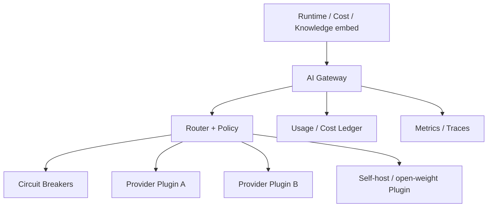
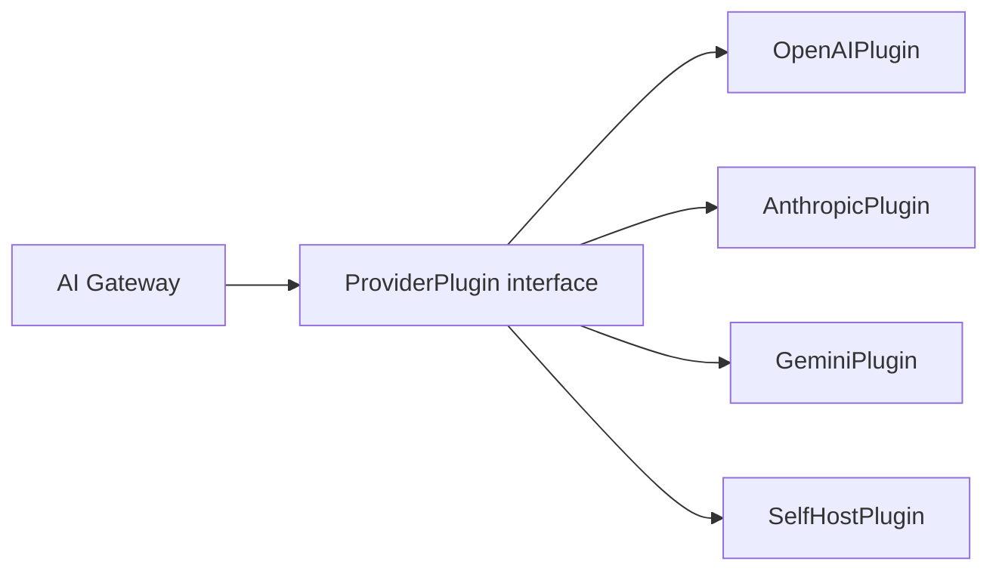
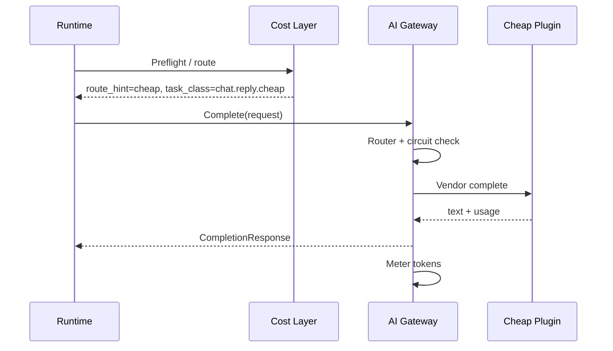
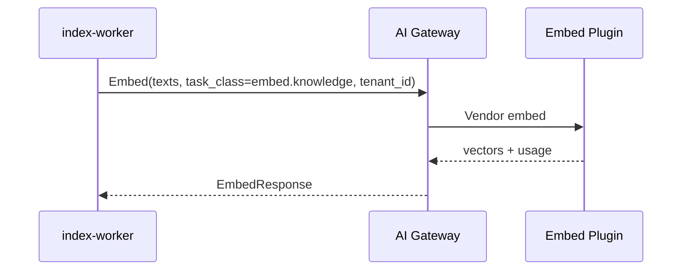
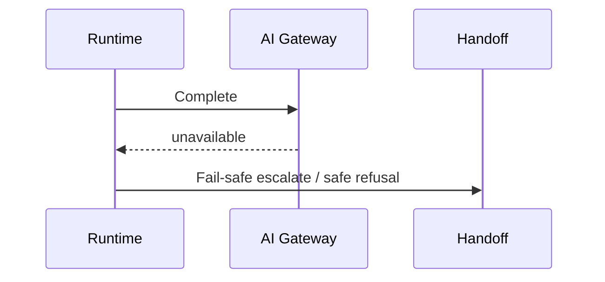

# AI Gateway Design

## Metadata

| Field | Value |
|-------|-------|
| **Version** | 0.1 |
| **Status** | Active — provider-agnostic AI access for DeloRey AI |
| **Owner** | Founder / AI Platform / Backend |
| **Last Updated** | July 25, 2026 |
| **Parent Documents** | [System Architecture](./system-architecture.md) · [AI Runtime Architecture](./ai-runtime-architecture.md) · [Backend Architecture](./backend-architecture.md) · [Domain-Driven Design](./domain-driven-design.md) |
| **Related Documents** | [Product Principles](../02-product/product-principles.md) · [Product Scope](../02-product/product-scope.md) · [Database Design](./database-design.md) · [Pricing Strategy](../01-business/pricing-strategy.md) |

**Audience:** AI Platform, Backend (`ai-gateway` / `cost` modules), DevOps (provider health, cost), Security.

**Authority:** Deepens System Architecture §6 (AI Gateway) and the **Model Independence** principle. Does not invent merchant-facing features. Does not move Skills, Guardrails, or Commerce truth into the Gateway.

If conflict:

```
Product Principles (Model Independence, Cost / LLM last resort)
    ↓
System Architecture / AI Runtime Architecture
    ↓
Backend Architecture (module boundary)
    ↓
This document
```

Cost Optimization Layer remains the **policy brain** for “need LLM?” and cheap-vs-premium intent; Gateway **executes** routing, providers, metering, and failover.

---

# 1. Purpose

The **AI Gateway** is the only component allowed to speak to LLM/embedding providers.

It provides a **provider-agnostic** interface for:

- Chat / text **completions** (`Complete`)  
- **Embeddings** (`Embed`)  
- **Moderation** later, as needed (`Moderate`)  

with routing, fallback, caching hooks, token metering, and observability ([System Architecture](./system-architecture.md) §6).

Business logic — Runtime, Skills, Commerce, Knowledge metadata — **must never know** whether the reply came from OpenAI, Claude, Gemini, Qwen, DeepSeek, Llama, or a future self-hosted model ([Product Principles](../02-product/product-principles.md) — *Model Independence*).



---

# 2. Non-Goals

| Gateway is not | Owner instead |
|----------------|---------------|
| Skill planner / commerce tool executor | Runtime + Skill Engine |
| Guardrails hard stops / handoff policy | Guardrails + Human Handoff |
| Catalog / order truth | Commerce Core |
| FAQ SoR / RAG retrieval planner | Knowledge + Context Engine |
| Sole safety layer against prompt injection | Guardrails + Runtime post-validate (Gateway assists) |
| Merchant invoice / subscription SoR | Billing V1 (Gateway only supplies usage signals) |
| Visual model playground for merchants | OUT OF MVP product surface |

---

# 3. Boundary & Callers

| Caller | Uses Gateway for | Must not |
|--------|------------------|----------|
| `runtime` | `Complete` when NLG needed after context/tools | Import provider SDKs |
| `cost` | Cheap classify / small-model NLG / route directives → `Complete` | Bypass Gateway for “quick” vendor calls |
| `knowledge` / `index-worker` | `Embed` for chunk + query embeddings | Embed via ad-hoc scripts with raw keys |
| `context` | Optional small-model compression / summaries via Gateway | Call providers directly |

Backend boundary ([Backend Architecture](./backend-architecture.md)):

```
runtime / cost / knowledge(embed)  →  ai-gateway.Complete / Embed  →  provider plugins
```

---

# 4. Internal APIs (stable contracts)

## 4.1 `Complete`

### Request (`CompletionRequest`)

| Field | Meaning |
|-------|---------|
| `tenant_id` | Mandatory — abuse limits, metering, logging attribute |
| `messages` | Provider-neutral message list (system/user/assistant/tool results already sanitized) |
| `tools_schema` | Optional — if Runtime exposes tools to the model; execution still in Skills |
| `temperature_bounds` | Allowed range; Gateway clamps |
| `max_tokens` | Cap |
| `task_class` | Routing key (see §6) |
| `route_hint` | From Cost Layer: `cheap` \| `premium` \| `classifier` \| `compress` (hints, not vendor names) |
| `prompt_template_id` / `prompt_version` | Optional — prompt versioning (§8) |
| `idempotency_key` | Optional — safe retries |
| `shadow` | Optional — shadow evaluation flag (§9) |

**Forbidden in request payloads:** storefront tokens, bot tokens, raw API keys, unnecessary PII dumps.

### Response (`CompletionResponse`)

| Field | Meaning |
|-------|---------|
| `text` | Generated text (or structured content as agreed) |
| `finish_reason` | Normalized |
| `usage` | `tokens_in`, `tokens_out` |
| `provider_id` | Internal plugin id (for ops/audit route label — not for Skill branching) |
| `model_id` | Internal model id |
| `latency_ms` | |
| `shadow` | If shadow run, marked and not used as primary reply |

Runtime may store **model_route** on `audit_turns` without exposing vendor marketing to merchants as product identity.

## 4.2 `Embed`

### Request (`EmbedRequest`)

| Field | Meaning |
|-------|---------|
| `tenant_id` | Mandatory |
| `texts` | Chunk(s) or query text |
| `model_hint` | Optional capability hint (e.g. `default_embed`) — not a vendor string required by callers |
| `task_class` | Typically `embed.knowledge` \| `embed.query` |

### Response (`EmbedResponse`)

| Field | Meaning |
|-------|---------|
| `vectors` | One per input text |
| `usage` | Token or billable units as normalized |
| `provider_id` / `model_id` | Internal |

## 4.3 `Moderate` (as needed / later)

Not an MVP blocker. When introduced: same plugin pattern; Runtime/Guardrails decide policy outcomes. Until then, blocked topics and safety remain Guardrails-first.

## 4.4 Typed errors

| Error | Runtime behavior (from Architecture) |
|-------|--------------------------------------|
| `timeout` | Failover or fail-safe escalate |
| `rate_limit` | Backoff + alternate provider; delay metrics |
| `content_filter` | Safe refusal / escalate |
| `unavailable` | Failover chain; if all down → Runtime fail-safe + alert |

---

# 5. Provider Plugin Model

Providers are **plugins** with capability metadata ([System Architecture](./system-architecture.md) §6):

| Metadata | Use |
|----------|-----|
| `context_window` | Reject/route oversized prompts; trigger compression upstream |
| `cost_tier` | `cheap` / `premium` mapping |
| `latency_class` | Interactive vs batch eligibility |
| `language_quality` | Persian commerce quality preference for MVP routing |
| `supports_tools` | Whether tool schemas allowed |
| `supports_embed` | Embed vs chat separation |
| `region` / residency hints | Future; not a product fork today |

### Documented plugin targets

Architecture explicitly anticipates plugins for:

- OpenAI  
- Anthropic  
- Gemini  
- Open-weight / self-hosted  
- Future providers  

MVP may ship **one primary + one fallback** chat path and **one embed** path; the **plugin interface** must exist so adding Qwen/DeepSeek/Llama/self-host does not touch Runtime/Skills.



### Plugin responsibilities

1. Map neutral `CompletionRequest` / `EmbedRequest` → vendor API.  
2. Map vendor response → neutral response + usage.  
3. Map vendor errors → typed Gateway errors.  
4. Never log secrets; redact authorization headers.  
5. Honor timeout budget from Router.

### Secrets

API keys **only** in secrets manager — never in repo, never plaintext in tenant DB ([System Architecture](./system-architecture.md) Security).

---

# 6. Routing Policy

Router selects plugin + model from:

1. **Cost Layer route hint** (`cheap` / `premium` / classifier / compress)  
2. **`task_class`**  
3. **Tenant plan / abuse budget** (align with Pricing metering later)  
4. **Provider health** (circuit breaker state in Redis)  
5. **Fallback chain** for that `task_class`  

### Example `task_class` values (internal)

| task_class | Typical route |
|------------|---------------|
| `chat.reply.cheap` | Small / cheap model NLG after tools |
| `chat.reply.premium` | High-stakes / multi-hop generation |
| `chat.classify` | Intent classify |
| `chat.compress` | Context / history compression |
| `embed.knowledge` | Batch index embeddings |
| `embed.query` | Interactive query embed |

Callers pass **task_class + route_hint**, never `gpt-4o` as a business dependency.

### Cost Layer ↔ Gateway split

| Cost Layer owns | Gateway owns |
|-----------------|--------------|
| Cache / Rule Engine / “need LLM?” | Executing `Complete` / `Embed` |
| Prefer template over NLG | Provider failover |
| Cheap vs premium **intent** | Mapping intent → plugin chain |
| Sync-version cache keys | Optional response-cache **hooks** if Cost asks to store/lookup by key |
| Compression directives | Running compress `task_class` if requested |

Semantic / response cache remains primarily **Cost Optimization Layer** ([System Architecture](./system-architecture.md) §12); Gateway may implement lookup/store hooks when Cost supplies a cache key — keys must include `tenant_id` + sync version; no cross-shopper PII cache.

---

# 7. Reliability: Timeout, Retry, Circuit Breaker, Fallback

| Mechanism | Behavior |
|-----------|----------|
| **Timeout** | Per-request budget; interactive turns tighter than batch embed |
| **Retry** | Limited retries on idempotent/safe failures; respect `idempotency_key` |
| **Circuit breaker** | Per provider in Redis; open on error storm → skip to next in chain |
| **Fallback** | Primary 5xx/timeout → next provider in `task_class` chain |
| **Rate limit** | Backoff + alternate provider; emit delay metrics |
| **All down** | Return `unavailable` → Runtime fail-safe / escalate; alert on-call |

Gateway is **horizontally scalable and mostly stateless**; circuit state lives in Redis ([System Architecture](./system-architecture.md) §6).

### Traffic separation

| Path | Queue / pool | SLO |
|------|--------------|-----|
| Interactive chat `Complete` | Interactive Runtime path | Low latency |
| Batch `Embed` | `batch.embed` / index-worker | Throughput |

Do not let reindex storms starve shopper turns ([Backend Architecture](./backend-architecture.md) queue separation; System Architecture scaling).

---

# 8. Prompt Templates & Versioning

Prompt versioning is a **Gateway concern**; Runtime depends only on stable contracts ([AI Runtime Architecture](./ai-runtime-architecture.md) §11).

| Concept | Purpose |
|---------|---------|
| `prompt_template_id` | Named template (e.g. sales_reply_grounded) |
| `prompt_version` | Immutable version for audit/eval |
| Registry | Store template text/metadata **without** secrets |
| Runtime usage | Pass id/version + variables (context refs, tone) — or pass already-built messages from Runtime |

MVP may start with Runtime-built messages **and** still record `prompt_version` when templates are introduced. Expanding templates must not fork per channel (One Brain).

---

# 9. Shadow Evaluation & Model A/B

System Architecture requires support for **shadow evaluation of new models without changing Runtime code**.

| Mode | Behavior |
|------|----------|
| **Primary** | Response returned to Runtime for customer path |
| **Shadow** | Async or parallel call to candidate model; result logged for eval; **not** shown to shopper |
| **A/B (ops)** | Router percentage split by `task_class` / tenant allowlist — product UX unchanged |

Shadow/A/B must still enforce tenant_id, secrets hygiene, and cost budgets (shadow traffic countable in ops cost, not silently unbounded).

---

# 10. Metering & Cost Ledger

Gateway **normalizes usage** (tokens in/out) for metering and cost dashboards ([System Architecture](./system-architecture.md) §6).

| Signal | Destination |
|--------|-------------|
| Tokens in/out | Metrics + `audit_turns` cost fields / usage hooks ([Database Design](./database-design.md)) |
| Cost per 1K tokens | Ops dashboards |
| Cost per tenant / turn | Cost Layer observability; Billing V1 later |
| Failover counts | Ops |

Per-tenant **abuse limits** on Gateway calls are mandatory. Hard commercial caps align with Pricing Strategy when billing ships — Gateway supplies the meter, not the invoice.

Merchant-facing invoices must **not** be raw token jargon ([Pricing Strategy](../01-business/pricing-strategy.md)); internal token tracking is still required for unit economics.

---

# 11. Security

| Control | Requirement |
|---------|-------------|
| Secrets | Secrets manager only |
| Logs | Redact provider payloads; no API keys; PII minimized |
| Tenant | Every call authenticated with `tenant_id`; fail closed |
| Abuse | Per-tenant rate/budget limits (cost bomb mitigation) |
| Prompt injection | Gateway is **not** sole safety layer — coordinate with Guardrails; tool permission checks remain in Runtime |
| Supply chain | Dependency scanning on provider SDKs inside plugins only |

---

# 12. Observability

| Signal | Examples |
|--------|----------|
| Latency | p50/p95 per provider / `task_class` |
| Errors | rate by typed error + provider |
| Tokens | by tenant / model / `task_class` |
| Failover | counts and reasons |
| Cost | per 1K tokens; cost/turn when attributed |
| Circuits | open/half-open state |
| Shadow | volume and candidate model ids |

Traces: `gateway.complete`, `gateway.embed`, `gateway.failover` — correlate with `runtime.turn`.

---

# 13. Sequence Diagrams

### A. Cheap reply after Cost Layer decides NLG



### B. Failover on primary timeout

```mermaid
sequenceDiagram
    participant GW as AI Gateway
    participant P1 as Primary Plugin
    participant P2 as Fallback Plugin

    GW->>P1: Complete
    P1-->>GW: timeout
    GW->>GW: Record failover; trip metrics
    GW->>P2: Complete
    P2-->>GW: text + usage
```

### C. Knowledge embed (batch)



### D. All providers unavailable



---

# 14. NestJS Module Shape (`ai-gateway`)

Aligned with [Backend Architecture](./backend-architecture.md):

```
modules/ai-gateway/
  ai-gateway.module.ts
  application/
    complete.use-case.ts
    embed.use-case.ts
    router.service.ts
  domain/
    provider-plugin.ts          # interface
    task-class.ts
    gateway-errors.ts
  infrastructure/
    plugins/openai.plugin.ts
    plugins/anthropic.plugin.ts
    plugins/...
    redis.circuit-breaker.ts
    secrets.provider.ts
    usage.ledger.ts
  api/                          # internal only — not public merchant REST
    gateway.controller.ts       # optional for worker RPC / health
```

Public merchant REST must **not** expose raw Gateway as a general LLM API ([Product Scope](../02-product/product-scope.md) — not a generic LLM platform).

---

# 15. Configuration (ops)

| Config | Purpose |
|--------|---------|
| Provider enablement flags | Gradual rollout |
| Fallback chains per `task_class` | Reliability |
| Timeout budgets | Interactive vs batch |
| Tenant rate limits | Abuse / cost bomb |
| Shadow percentage | Eval |
| Default embed model capability | Knowledge consistency |

Config via environment + secret store — no secrets in images ([System Architecture](./system-architecture.md) Deployment).

---

# 16. MVP vs Later

| Capability | MVP | Later |
|------------|-----|-------|
| `Complete` + `Embed` | Required | |
| Plugin interface + ≥1 chat + ≥1 embed provider | Required | Add providers without Runtime changes |
| Failover / timeout / circuit breaker | Required | |
| Token metering + tenant limits | Required | |
| Cost Layer route hints | Required | |
| Prompt version registry | Optional early / required as templates grow | |
| Shadow eval | Support hook; may be ops-light at first | Full eval harness |
| `Moderate` API | As needed | When Guardrails need provider moderation |
| Self-hosted plugin | Interface ready | When cost/residency justifies |
| Kafka-scale eventing of usage | Not required | If metering fan-out demands |

---

# 17. Testing Obligations

| Test | Intent |
|------|--------|
| Contract | Plugin maps errors to typed Gateway errors |
| Isolation | tenant_id required; cross-tenant metering separated |
| Failover | Primary down → secondary used |
| Redaction | Secrets never appear in logs fixtures |
| Runtime independence | Skills/Runtime unit tests mock Gateway — no vendor SDK |
| Embed batch | Does not block interactive complete pool (load smoke) |

---

# 18. Related Documents

| Document | Relationship |
|----------|--------------|
| [System Architecture §6 / §12](./system-architecture.md) | Parent contracts + Cost Layer |
| [AI Runtime Architecture](./ai-runtime-architecture.md) | When Complete is invoked |
| [Knowledge & RAG Design](./knowledge-rag-design.md) | Embed usage |
| [Context Engine Design](./context-engine-design.md) | Compression may call Gateway |
| [Testing Strategy](./testing-strategy.md) | Shadow / hallucination eval harness |
| [Pricing Strategy](../01-business/pricing-strategy.md) | Meter vs merchant invoice language |

---

# Summary

The AI Gateway is DeloRey’s **Model Independence boundary**: stable `Complete` / `Embed` APIs, provider plugins, Cost-driven routing, failover, metering, and observability — with **no** commerce or Skill logic inside. Runtime stays vendor-blind; self-hosted and alternate providers plug in without rewriting the Employee brain.

---

*AI Gateway Design v0.1. Changes require version bump and written rationale. Product Principles (Model Independence), System Architecture, and AI Runtime Architecture override Gateway enthusiasm when they conflict.*
