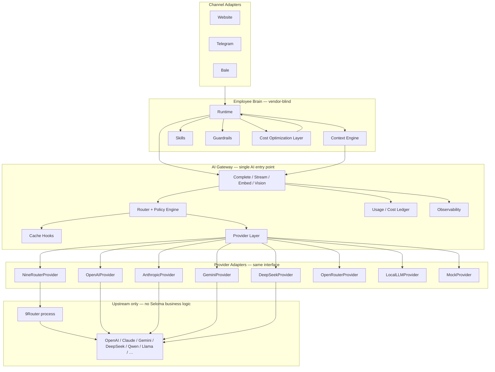
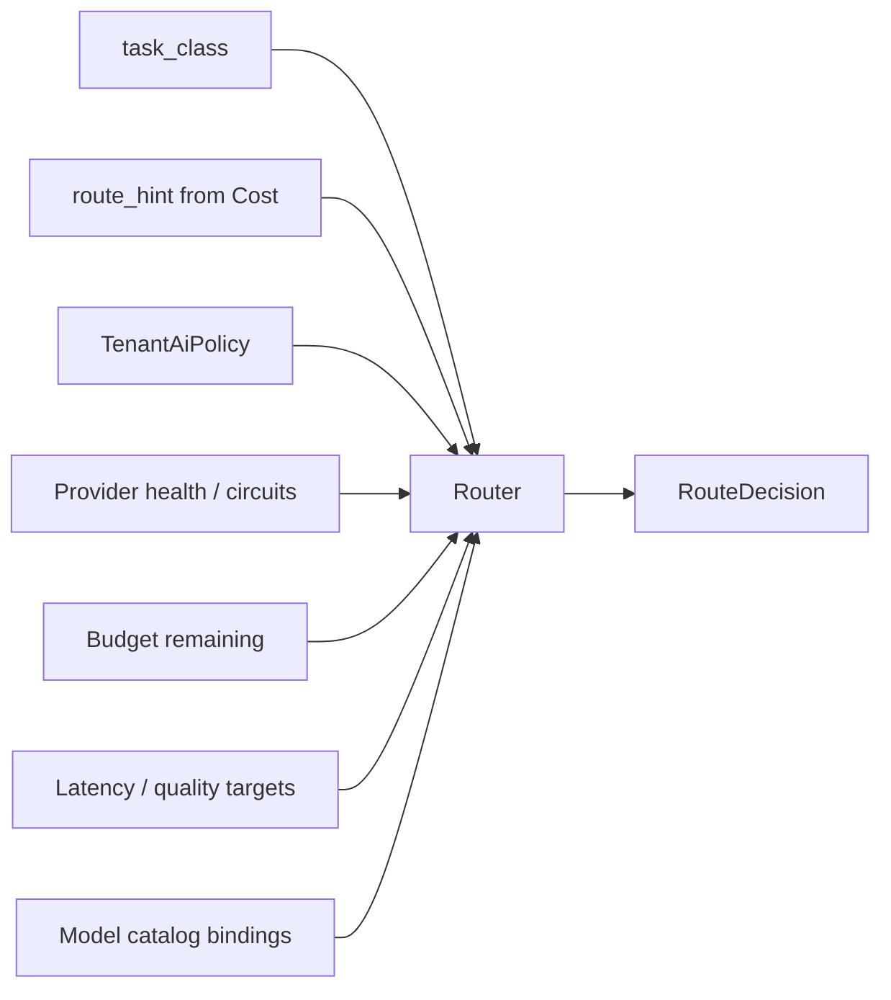

# AI Provider Layer Design

## Metadata

| Field | Value |
|-------|-------|
| **Version** | 0.1 |
| **Status** | Active — extends AI Gateway; does not replace it |
| **Owner** | Founder / AI Platform / Backend |
| **Last Updated** | July 28, 2026 |
| **Parent Documents** | [AI Gateway Design](./ai-gateway-design.md) · [System Architecture](./system-architecture.md) §6 · [Backend Architecture](./backend-architecture.md) |
| **Related Documents** | [Product Vision](../02-product/product-vision.md) · [Product Principles](../02-product/product-principles.md) · [Product Scope](../02-product/product-scope.md) · [User Journey](../02-product/user-journey.md) · [Database Design](./database-design.md) · [Pricing Strategy](../01-business/pricing-strategy.md) · [AI Runtime Architecture](./ai-runtime-architecture.md) |

**Audience:** AI Platform, Backend (`ai-gateway` / `cost`), DevOps (provider health, cost), Security.

**Authority:** Deepens [AI Gateway Design](./ai-gateway-design.md) Provider Plugin Model (§5) into a full **Provider Layer**. Does not invent merchant-facing features. Does not move Skills, Guardrails, Commerce truth, or Cost “need LLM?” policy into providers.

If conflict:

```
Product Principles (Model Independence, Cost / LLM last resort)
    ↓
System Architecture / AI Runtime Architecture
    ↓
AI Gateway Design (single entry point)
    ↓
This document (Provider Layer inside Gateway)
```

---

# Non-Negotiable Invariant

> **Seloma’s AI Gateway is the only entry point for every AI request.**  
> **9Router is an upstream provider behind that Gateway — never the system architecture.**

Merchants hire an AI Sales Employee ([Product Vision](../02-product/product-vision.md)). They never configure models, vendors, or routers. Provider identity must never leak into Runtime, Skills, Channel Adapters, or Workspace product identity ([Product Principles](../02-product/product-principles.md) — *Model Independence*).

```
Channels → Runtime → Context Engine → OUR AI Gateway → Provider Layer → [9Router | OpenAI | Claude | Gemini | …]
```

9Router may fan out to OpenAI, Claude, Gemini, DeepSeek, Qwen, Llama, and future models. That fan-out is **opaque transport**. Seloma still owns routing policy, retries, fallbacks, caching, metering, guardrail-adjacent validation hooks, and tenant economics.

---

# 1. Architecture

## 1.1 Placement in the stack



## 1.2 Responsibility split

| Layer | Owns | Must never own |
|-------|------|----------------|
| **Runtime / Skills / Guardrails** | Commerce actions, tools, hard stops, handoff | Provider SDKs, model names as product rules |
| **Cost Optimization Layer** | “Need LLM?”, cache policy brain, cheap vs premium **intent** | Direct vendor HTTP |
| **AI Gateway** | Routing, retries, fallbacks, abstraction, metering, observability, prompt versioning hooks, rate limits, failover | Catalog truth, Skill planning, merchant invoices |
| **Provider Layer (this doc)** | Uniform adapter interface + vendor mapping | Business rules, tenant policies, fallback *strategy* |
| **9Router (upstream)** | OpenAI-compatible proxy / multi-vendor transport | Seloma routing, billing, cache, guardrails, tenant policy |

## 1.3 Why 9Router is not the architecture

| Temptation | Why it is rejected |
|------------|--------------------|
| Point Runtime at 9Router directly | Breaks Model Independence; vendor coupling in the Employee brain |
| Let 9Router decide cheap vs premium | Cost / quality policy is Seloma product economics, not a coding proxy |
| Use 9Router RTK as the only cache | Semantic / sync-version cache is Cost + Commerce integrity |
| Expose 9Router dashboard to merchants | Merchants hire Employees, not model routers ([Product Scope](../02-product/product-scope.md)) |
| Encode fallback order only inside 9Router | Gateway must own failover for *all* providers, including non-9Router paths |

**Correct use:** Gateway selects `NineRouterProvider` (or another adapter) with an **internal model id**. The adapter translates to 9Router’s OpenAI-compatible API. If 9Router is down, Gateway failover may try `OpenAIProvider`, `AnthropicProvider`, or `MockProvider` — without Runtime changes.

## 1.4 Call path (normative)

1. Channel Adapter normalizes inbound message.  
2. Runtime + Cost Layer decide whether NLG is needed (`route_hint`, `task_class`).  
3. Context Engine assembles grounded context.  
4. Runtime calls **only** `ai-gateway` (`complete` / `stream` / `embed` / …).  
5. Gateway applies tenant policy, budgets, cache hooks, router strategy.  
6. Provider Layer invokes one adapter.  
7. Adapter returns neutral usage + text/stream.  
8. Gateway meters, observes, optionally validates shape, returns to Runtime.  
9. Guardrails / post-checks remain Runtime-owned; Gateway may assist with structured-output validation hooks.

---

# 2. Folder Structure

Aligned with NestJS modular monolith ([Backend Architecture](./backend-architecture.md)) and existing `modules/ai-gateway/`.

```
apps/api/src/modules/ai-gateway/
  ai-gateway.module.ts
  ai-gateway.service.ts              # façade: Complete / Stream / Embed / …

  application/
    complete.use-case.ts
    stream.use-case.ts
    embed.use-case.ts
    vision.use-case.ts
    health.use-case.ts
    router.service.ts                # selects provider + model + chain
    policy.service.ts                # tenant AI policies
    cache.coordinator.ts             # hooks into Cost cache keys
    cost-estimator.service.ts
    usage-ledger.service.ts
    prompt-registry.service.ts

  domain/
    provider.port.ts                 # AiProviderPort (canonical interface)
    provider.capabilities.ts
    provider.registry.ts
    routing.types.ts                 # TaskClass, RouteHint, RouteDecision
    tenant-ai-policy.ts
    gateway-errors.ts
    usage.ts
    cost-estimate.ts
    model-catalog.ts                 # internal model ids → capability

  infrastructure/
    providers/
      openai.provider.ts
      anthropic.provider.ts
      gemini.provider.ts
      deepseek.provider.ts
      openrouter.provider.ts
      ninerouter.provider.ts         # 9Router upstream adapter
      local-llm.provider.ts
      mock.provider.ts
      openai-compatible.base.ts      # shared HTTP mapping (GapGPT / Liara / BoxAPI / 9Router)
    circuit-breaker.redis.ts
    secrets.provider.ts
    metrics.emitter.ts
    persistence/
      ai-call.repository.ts
      tenant-ai-policy.repository.ts
      model-price.repository.ts

  api/                               # internal only — not public merchant LLM API
    gateway.health.controller.ts
```

**Rules:**

- No provider SDK imports outside `infrastructure/providers/`.  
- Runtime / cost / knowledge depend only on `AiGatewayService` (or application use-cases via the module export).  
- Adding a provider = new file under `infrastructure/providers/` + registry registration. **Zero Runtime diffs.**

---

# 3. Provider Abstraction

## 3.1 Design principles

1. **One port for all vendors** — every adapter implements `AiProviderPort`.  
2. **Capability negotiation** — Router checks `ProviderCapabilities` before calling a method.  
3. **Neutral I/O** — no vendor message formats leak above the adapter.  
4. **Typed errors** — map to `GatewayError` codes already defined in Gateway Design.  
5. **Cost estimate is first-class** — adapters can estimate; Gateway ledger records actuals.  
6. **Health is observable** — Router skips open circuits / unhealthy providers.  
7. **9Router is just another adapter** — same port, same metrics labels (`provider_id=ninerouter`).

## 3.2 Internal model ids vs vendor model strings

| Layer | Identifier | Example |
|-------|------------|---------|
| Caller / Runtime | `task_class` + `route_hint` | `chat.reply.cheap` |
| Gateway Router | Internal `model_id` | `seloma.chat.cheap.v1` |
| Provider adapter | Vendor / upstream model string | `gpt-4o-mini`, `kr/claude-sonnet-…` |

Runtime must never hard-code vendor strings. Ops maps internal models → provider bindings in config / DB.

## 3.3 Documented adapters

| Adapter | Role |
|---------|------|
| `OpenAIProvider` | Direct OpenAI API |
| `AnthropicProvider` | Direct Anthropic Messages API |
| `GeminiProvider` | Direct Google Generative AI |
| `DeepSeekProvider` | Direct DeepSeek (or compatible) |
| `OpenRouterProvider` | Aggregator alternative to 9Router |
| `NineRouterProvider` | 9Router OpenAI-compatible upstream |
| `LocalLLMProvider` | Self-hosted / open-weight endpoint |
| `MockProvider` | Deterministic grounded templates / tests (MVP fallback) |

Regional OpenAI-compatible proxies (GapGPT, Liara, BoxAPI AI) remain valid as **config presets** of the shared `openai-compatible` base — either thin wrappers or preset ids on `OpenAIProvider`-style transport. They are not separate business architectures.

---

# 4. TypeScript Interfaces

Canonical contracts for the Provider Layer. Names may be camelCase in code; docs show the domain shape.

```typescript
/** Capability flags — Router consults before dispatch */
export type ProviderCapabilities = {
  generate: boolean;
  stream: boolean;
  embeddings: boolean;
  vision: boolean;
  toolCalling: boolean;
  jsonMode: boolean;
  usage: boolean;
  healthCheck: boolean;
  listModels: boolean;
  estimateCost: boolean;
  contextWindow: number;
  costTier: 'free' | 'cheap' | 'standard' | 'premium';
  latencyClass: 'interactive' | 'batch' | 'either';
  languageQuality?: 'fa_commerce_ok' | 'unknown';
};

export type ProviderHealth = {
  healthy: boolean;
  latencyMs?: number;
  checkedAt: string; // ISO
  detail?: string;   // redacted
};

export type TokenUsage = {
  promptTokens: number;
  completionTokens: number;
  totalTokens: number;
};

export type CostEstimate = {
  currency: 'USD';
  amount: number;
  basis: 'tokens' | 'request' | 'unknown';
};

export type AiMessage =
  | { role: 'system' | 'user' | 'assistant'; content: string }
  | { role: 'tool'; toolCallId: string; content: string }
  | {
      role: 'assistant';
      content: string | null;
      toolCalls?: Array<{
        id: string;
        name: string;
        argumentsJson: string;
      }>;
    };

export type GenerateRequest = {
  tenantId: string;
  messages: AiMessage[];
  modelId: string; // internal or adapter-resolved
  maxTokens?: number;
  temperature?: number;
  tools?: Array<{ name: string; description?: string; parametersJsonSchema: unknown }>;
  jsonMode?: boolean;
  timeoutMs: number;
  idempotencyKey?: string;
};

export type GenerateResponse = {
  text: string | null;
  toolCalls?: Array<{ id: string; name: string; argumentsJson: string }>;
  finishReason: string;
  usage: TokenUsage;
  providerId: string;
  modelId: string;       // vendor/upstream id actually used
  latencyMs: number;
  rawCost?: CostEstimate;
};

export type StreamChunk =
  | { type: 'delta'; text: string }
  | { type: 'tool_call_delta'; id: string; name?: string; argumentsJsonDelta?: string }
  | { type: 'usage'; usage: TokenUsage }
  | { type: 'done'; finishReason: string; modelId: string };

export type EmbedRequest = {
  tenantId: string;
  texts: string[];
  modelId: string;
  timeoutMs: number;
};

export type EmbedResponse = {
  vectors: number[][];
  usage: TokenUsage;
  providerId: string;
  modelId: string;
  latencyMs: number;
};

export type VisionRequest = {
  tenantId: string;
  prompt: string;
  images: Array<{ mimeType: string; dataBase64?: string; url?: string }>;
  modelId: string;
  maxTokens?: number;
  timeoutMs: number;
};

export type ModelInfo = {
  id: string;          // adapter-visible model id
  displayName?: string;
  capabilities: Partial<ProviderCapabilities>;
};

/**
 * Every provider adapter implements this port.
 * Optional methods throw GatewayError('unavailable') if capability is false.
 */
export interface AiProviderPort {
  readonly id: string;
  readonly capabilities: ProviderCapabilities;

  generate(req: GenerateRequest): Promise<GenerateResponse>;

  stream(req: GenerateRequest): AsyncIterable<StreamChunk>;

  embeddings(req: EmbedRequest): Promise<EmbedResponse>;

  vision(req: VisionRequest): Promise<GenerateResponse>;

  /** Optional convenience — tool calling may also ride on generate() */
  toolCalling(req: GenerateRequest): Promise<GenerateResponse>;

  /** JSON / structured mode */
  jsonMode(req: GenerateRequest): Promise<GenerateResponse>;

  usage(raw: unknown): TokenUsage;

  healthCheck(): Promise<ProviderHealth>;

  listModels(): Promise<ModelInfo[]>;

  estimateCost(input: {
    modelId: string;
    promptTokens: number;
    completionTokens: number;
  }): Promise<CostEstimate>;
}
```

### Gateway façade (callers use this — not `AiProviderPort`)

```typescript
export type RouteHint = 'cheap' | 'premium' | 'classifier' | 'compress';

export type TaskClass =
  | 'chat.reply.cheap'
  | 'chat.reply.premium'
  | 'chat.classify'
  | 'chat.compress'
  | 'embed.knowledge'
  | 'embed.query'
  | 'vision.describe'; // later

export type CompletionRequest = {
  tenantId: string;
  messages: AiMessage[];
  taskClass: TaskClass;
  routeHint: RouteHint;
  toolsSchema?: GenerateRequest['tools'];
  jsonMode?: boolean;
  maxTokens?: number;
  temperatureBounds?: { min: number; max: number };
  promptTemplateId?: string;
  promptVersion?: string;
  idempotencyKey?: string;
  feature?: string; // e.g. 'sales_reply' | 'order_lookup_nlg' — for cost attribution
  conversationId?: string;
  workspaceId?: string;
  shadow?: boolean;
};

export interface AiGatewayPort {
  complete(req: CompletionRequest): Promise<GenerateResponse & { cacheHit?: boolean }>;
  stream(req: CompletionRequest): AsyncIterable<StreamChunk>;
  embed(req: Omit<EmbedRequest, 'modelId'> & { taskClass: TaskClass; modelHint?: string }): Promise<EmbedResponse>;
  // vision / moderate later as needed
}
```

### `NineRouterProvider` sketch

```typescript
/**
 * Thin OpenAI-compatible client pointed at 9Router base URL.
 * MUST NOT implement Seloma fallback policy, tenant budgets, or cache.
 */
export class NineRouterProvider implements AiProviderPort {
  readonly id = 'ninerouter';
  // capabilities: generate, stream, embeddings per deployed 9Router services
  // map internal modelId → 9Router model string from binding table
  // map HTTP errors → GatewayError
}
```

---

# 5. AI Gateway Responsibilities

The Gateway **remains** responsible for everything listed in [AI Gateway Design](./ai-gateway-design.md). Provider Layer only executes vendor I/O.

| Responsibility | Gateway behavior | Provider Layer role |
|----------------|------------------|---------------------|
| **Model routing** | Map `task_class` + `route_hint` + tenant policy → provider chain + internal model | Accept `modelId`, call vendor |
| **Retries** | Bounded retries on retryable `GatewayError` | Throw typed errors; no silent retry storms |
| **Fallbacks** | Ordered chain across adapters (incl. away from 9Router) | Single-shot call |
| **Provider abstraction** | Expose `AiGatewayPort` only | Implement `AiProviderPort` |
| **Caching** | Honor Cost Layer keys; semantic / response / embed hooks | None (except opaque HTTP caches if any — not relied on) |
| **Observability** | Emit metrics/traces/logs with tenant + route labels | Local latency + usage fields |
| **Billing signals** | Normalize usage → ledger / `usage_events` hooks | Return token usage |
| **Token accounting** | Aggregate prompt/completion; attribute feature/conversation | Parse vendor usage |
| **Cost optimization** | Execute cheapest eligible model under policy; cooperate with Cost Layer | `estimateCost` + price table |
| **Prompt versioning** | Registry + audit fields | Transport messages as given |
| **Guardrails assist** | Optional output schema / JSON validation hooks | `jsonMode` transport |
| **Output validation** | Basic shape / empty / JSON parse checks before return | Map finish reasons |
| **Rate limiting** | Per-tenant / per-provider budgets | Surface 429 as `rate_limit` |
| **Failover** | Circuit breaker + next-in-chain | `healthCheck` |

**Explicitly not Gateway/Provider:** Skill planning, commerce truth, Human Handoff decisions, merchant invoice copy, channel UX ([Product Scope](../02-product/product-scope.md)).

---

# 6. Router Strategy

## 6.1 Decision inputs



```typescript
export type RouteDecision = {
  primary: { providerId: string; modelId: string };
  fallbacks: Array<{ providerId: string; modelId: string }>;
  allowStream: boolean;
  timeoutMs: number;
  rejectReason?: 'budget_exceeded' | 'provider_blocked' | 'policy_deny' | 'no_healthy_provider';
};
```

## 6.2 Selection algorithm (normative order)

1. **Reject early** if tenant budget / max cost / abuse limit exceeded → Runtime fail-safe (no silent premium spend).  
2. Apply **TenantAiPolicy**: preferred providers, allowed/blocked lists, preferred models, fallback order override.  
3. Map `route_hint` + `task_class` → candidate internal models (`cheap` pool vs `premium` pool).  
4. Filter candidates by **capabilities** (tools, json, vision, embed).  
5. Filter by **circuit breaker** + recent `healthCheck`.  
6. Rank by policy objective:  
   - default: **min estimated cost** among quality-eligible models  
   - if `quality_target=high` or `route_hint=premium`: prefer quality tier, still respect `max_cost`  
   - if `latency_target=strict`: prefer `latencyClass=interactive` and low p95  
7. Build **fallback chain** (tenant order ∩ global defaults). Chain may mix `ninerouter` → `openai` → `anthropic` → `mock`.  
8. Execute primary; on retryable failure, retry same; then next fallback; record `retry_count` / `fallback_count`.

## 6.3 What 9Router must not decide

| Decision | Owner |
|----------|-------|
| Prefer cheap vs premium for a sales reply | Cost Layer + Gateway Router |
| Block a provider for a tenant | TenantAiPolicy |
| Escalate when all models fail | Runtime + Human Handoff |
| Cache a grounded FAQ answer | Cost Layer (+ Gateway hooks) |
| Which internal model binds to which 9Router string | Gateway model catalog (ops config) |

9Router’s own multi-tier fallback is treated as **transport resilience inside one provider id**, not as Seloma’s cross-provider policy. Gateway still configures timeouts and may abandon `ninerouter` entirely for another adapter.

## 6.4 Shadow / A/B

Unchanged from Gateway Design §9: primary path returns to Runtime; shadow calls are metered and never shown to shoppers. Shadow may target a different provider (e.g. evaluate direct Anthropic vs 9Router path) without Runtime code changes.

---

# 7. Cost Optimization Strategy

Cost Optimization remains a **dual-brain** design:

- **Cost Layer** = policy brain (“need LLM?”, cache invalidation with sync version).  
- **Gateway Provider Layer** = execution brain (which paid call, how cheap, how observed).

## 7.1 Cache classes

| Cache | Key must include | Owner | Notes |
|-------|------------------|-------|-------|
| **Semantic cache** | `tenant_id`, embedding/hash of intent, sync/content version | Cost Layer | No cross-shopper PII bleed |
| **Prompt cache** | `tenant_id`, `prompt_template_id`, `prompt_version`, var hash | Gateway + Cost | Provider prompt-caching is optional adapter hint only |
| **Response cache** | Cost-supplied key + sync version | Cost via Gateway hooks | Prefer for FAQ/template-like replies |
| **Embedding cache** | `tenant_id`, model, content hash | Gateway / Knowledge | Batch-friendly |

## 7.2 Token & context reduction (before Generate)

| Technique | Trigger | Executor |
|-----------|---------|----------|
| Context compression | Oversized prompt vs context window | Context Engine → Gateway `chat.compress` |
| Prompt compression | Template verbosity | Prompt registry / Cost |
| Conversation summaries | Long threads | Context Engine via Gateway |
| Token budget | Tenant / feature / conversation caps | Gateway policy before dispatch |
| Automatic cheapest model | Quality gate passed + `route_hint=cheap` | Router |

## 7.3 Cost attribution dimensions

Every successful/failed billable attempt records:

- tenant  
- workspace (when applicable)  
- conversation  
- feature (`feature` on request)  
- provider + model  
- task_class / route_hint  
- cache hit  
- estimated vs actual cost  

Supports ops unit economics and future Billing V1 **signals** — merchant invoices still must not be raw token jargon ([Pricing Strategy](../01-business/pricing-strategy.md)).

## 7.4 Provider comparison

Ops dashboards compare providers on: p95 latency, error rate, cost per 1K tokens, failover rate, Persian commerce quality samples (eval harness — not merchant UI). Router may use rolling cost/latency stats for ranking **within** policy constraints.

---

# 8. Database Schema

Extends [Database Design](./database-design.md). MVP may start with env-based routing + log metering; tables below are the durable target for multi-provider ops.

## 8.1 `tenant_ai_policies`

Per-tenant (and optional workspace) routing constraints. **Not** a merchant “model playground” — ops/admin + safe defaults.

| Column | Type | Notes |
|--------|------|-------|
| `id` | uuid PK | |
| `tenant_id` | uuid FK | Required |
| `workspace_id` | uuid NULL | Optional scope |
| `preferred_provider` | text NULL | Internal provider id |
| `preferred_models` | jsonb | `{ "cheap": "...", "premium": "...", "embed": "..." }` |
| `allowed_providers` | text[] NULL | NULL = all enabled globally |
| `blocked_providers` | text[] | |
| `fallback_order` | text[] | Provider ids |
| `max_cost_per_turn_usd` | numeric NULL | Soft/hard per policy |
| `max_cost_per_day_usd` | numeric NULL | |
| `latency_target_ms` | int NULL | |
| `quality_target` | text | `standard` \| `high` |
| `created_at` / `updated_at` | timestamptz | |

**Indexes:** unique `(tenant_id, workspace_id)`, `(tenant_id)`.

## 8.2 `ai_model_bindings`

Maps internal model ids → provider + upstream model string.

| Column | Type | Notes |
|--------|------|-------|
| `id` | uuid PK | |
| `internal_model_id` | text UNIQUE | e.g. `seloma.chat.cheap.v1` |
| `provider_id` | text | `ninerouter`, `openai`, … |
| `upstream_model` | text | Vendor / 9Router model string |
| `task_classes` | text[] | Eligibility |
| `cost_tier` | text | |
| `enabled` | boolean | |
| `price_prompt_per_1k` | numeric NULL | For estimates |
| `price_completion_per_1k` | numeric NULL | |
| `metadata` | jsonb | context window, capabilities |

## 8.3 `ai_call_events`

High-cardinality observability / cost ledger (append-only). May be partitioned by month.

| Column | Type | Notes |
|--------|------|-------|
| `id` | uuid PK | |
| `tenant_id` | uuid | |
| `workspace_id` | uuid NULL | |
| `conversation_id` | uuid NULL | |
| `feature` | text NULL | |
| `task_class` | text | |
| `route_hint` | text | |
| `provider_id` | text | |
| `model_id` | text | Upstream / resolved |
| `internal_model_id` | text NULL | |
| `latency_ms` | int | |
| `prompt_tokens` | int | |
| `completion_tokens` | int | |
| `total_tokens` | int | |
| `cost_usd` | numeric NULL | Actual or estimated |
| `retry_count` | int | default 0 |
| `fallback_count` | int | default 0 |
| `error_code` | text NULL | GatewayError code |
| `cache_hit` | boolean | default false |
| `shadow` | boolean | default false |
| `response_quality` | text NULL | ops/eval label later |
| `idempotency_key` | text NULL | |
| `created_at` | timestamptz | |

**Indexes:** `(tenant_id, created_at DESC)`, `(provider_id, created_at DESC)`, `(conversation_id)`, `(tenant_id, feature, created_at DESC)`.

Correlate with `audit_turns.model_route` / token fields — do not duplicate full prompt payloads here.

## 8.4 Redis keys (extend existing grammar)

```
t:{tenant_id}:circuit:{provider_id}
t:{tenant_id}:ai:budget:day
t:{tenant_id}:ai:ratelimit:{window}
global:provider:health:{provider_id}
global:provider:stats:{provider_id}   # rolling latency/error for ranking
```

Secrets for 9Router / OpenAI / etc. remain in secrets manager — never plaintext in these tables.

## 8.5 MVP subset

| Must have for multi-provider MVP | Can defer |
|----------------------------------|-----------|
| Env/config bindings + `ai_call_events` (or structured logs → later table) | Full `tenant_ai_policies` UI |
| Circuit keys in Redis | `response_quality` automation |
| Meter fields on `audit_turns` | Partitioned warehouse export |

---

# 9. Monitoring

## 9.1 Metrics (Prometheus-style labels)

| Metric | Labels | Use |
|--------|--------|-----|
| `ai_gateway_requests_total` | task_class, provider, result | Throughput |
| `ai_gateway_latency_ms` | provider, task_class | SLO |
| `ai_gateway_tokens` | tenant, provider, direction=prompt\|completion | Accounting |
| `ai_gateway_cost_usd` | tenant, provider, feature | Unit economics |
| `ai_gateway_retries_total` | provider, reason | Reliability |
| `ai_gateway_fallbacks_total` | from_provider, to_provider | Failover health |
| `ai_gateway_cache_hit_total` | cache_class | Cost win rate |
| `ai_gateway_errors_total` | provider, code | Pages |
| `ai_provider_circuit_state` | provider | 0/1 open |
| `ai_provider_health` | provider | Probe |

## 9.2 Traces

Spans: `gateway.complete` → `gateway.route` → `provider.generate` (`provider_id=ninerouter|openai|…`) → `gateway.meter`.

Correlate with `runtime.turn` and `conversation_id`.

## 9.3 Logs (redacted)

Include: tenant, task_class, provider, model, latency, tokens, cost, retry/fallback counts, cache_hit, error code.  
Exclude: API keys, full prompt bodies with PII, Authorization headers, raw 9Router admin tokens.

## 9.4 Alerts

| Condition | Severity |
|-----------|----------|
| All providers in chain unhealthy | P1 — Runtime fail-safe path |
| Cost per tenant spike vs baseline | P2 — abuse / loop |
| 9Router error rate high but direct OpenAI healthy | P2 — prefer failover away from ninerouter |
| Embed batch starving interactive pool | P2 — queue isolation |

## 9.5 Merchant vs ops surfaces

| Audience | Sees |
|----------|------|
| Merchant Workspace | Sync health, escalations, conversation outcomes — **not** “Claude vs GPT” product chrome |
| Ops / founders | Provider dashboards, cost/tenant, failover |

Transparent AI for merchants means **decision + sources**, not vendor marketing ([User Journey](../02-product/user-journey.md)).

---

# 10. Future Scalability

## 10.1 Adding a provider (checklist)

1. Implement `AiProviderPort` under `infrastructure/providers/`.  
2. Register in `ProviderRegistry`.  
3. Add `ai_model_bindings` rows (or env presets).  
4. Enable feature flag / provider enablement.  
5. Contract tests: error mapping, usage parse, timeout.  
6. Shadow traffic → promote into fallback / primary chains.  

**Forbidden:** changing Runtime, Skills, or Channel Adapters.

## 10.2 Scale dimensions

| Dimension | Approach |
|-----------|----------|
| Request volume | Stateless Gateway replicas; Redis circuits/budgets |
| Provider diversity | Registry + bindings; unlimited adapters |
| Regional residency | Capability `region` + policy filter (future) |
| Self-host | `LocalLLMProvider` when unit economics justify |
| Streaming UX | Gateway `stream()`; adapters that lack stream → buffer once (explicit capability) |
| Multi-aggregator | `NineRouterProvider` and `OpenRouterProvider` coexist; Router chooses |

## 10.3 Anti-patterns (reject in review)

- Runtime importing `openai` / `anthropic` / 9Router SDK.  
- Business `if (provider === 'ninerouter')` outside Gateway.  
- Merchant settings that require picking GPT vs Claude for MVP identity.  
- Replacing Cost Layer caches with “whatever 9Router does.”  
- Using 9Router as the only failover brain across all vendors.

## 10.4 Evolution path

| Phase | Provider Layer state |
|-------|----------------------|
| **Now / Pre-MVP** | `MockProvider` + one OpenAI-compatible live path (preset may point at 9Router or regional proxy) |
| **MVP harden** | Router chains, Redis circuits, `ai_call_events`, tenant budgets |
| **V1** | Multi-direct providers + 9Router as one option; richer policies; shadow eval |
| **Later** | Self-host, residency routing, automatic quality-aware ranking |

---

# Related Documents

| Document | Relationship |
|----------|--------------|
| [AI Gateway Design](./ai-gateway-design.md) | Parent — single entry point; this doc deepens plugins |
| [System Architecture §6 / §12](./system-architecture.md) | Cost Layer + Gateway contracts |
| [Backend Architecture](./backend-architecture.md) | Module boundary `ai-gateway` |
| [Database Design](./database-design.md) | Audit / usage hooks; schema extensions here |
| [Product Principles](../02-product/product-principles.md) | Model Independence; LLM last resort |
| [Product Scope](../02-product/product-scope.md) | Not a generic LLM platform for merchants |

---

# Summary

Seloma keeps **one AI Gateway** as the platform brain for model access. The **Provider Layer** standardizes every upstream behind `AiProviderPort`. **9Router is one adapter** — a convenient multi-model pipe — not the architecture, not the policy engine, and never something merchants (or Runtime) should know exists.

```
Channels → Runtime → Context → AI Gateway → Provider Layer → 9Router → vendors
                                         ↘ OpenAI / Claude / Gemini / … (direct)
                                         ↘ Mock / Local
```

---

*AI Provider Layer Design v0.1. Changes require version bump and written rationale. Product Principles (Model Independence), System Architecture, and AI Gateway Design override Provider Layer enthusiasm when they conflict.*
