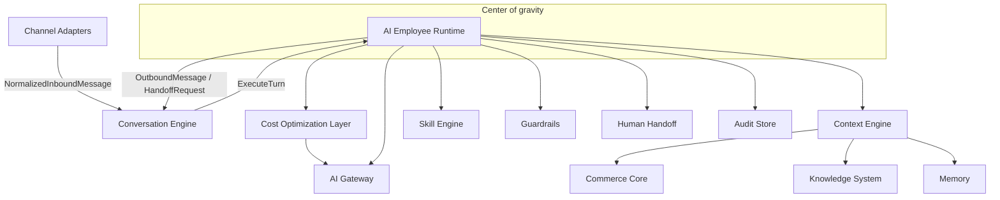
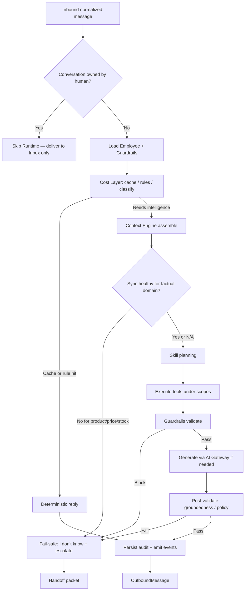
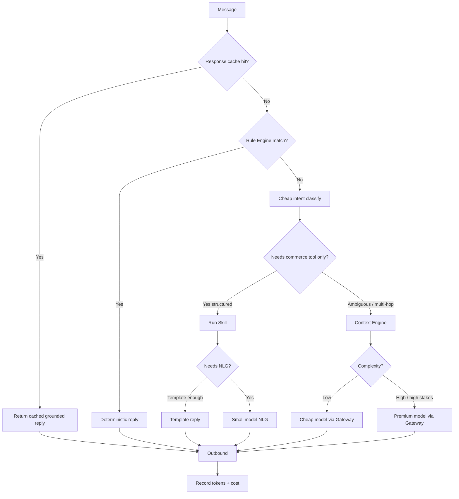
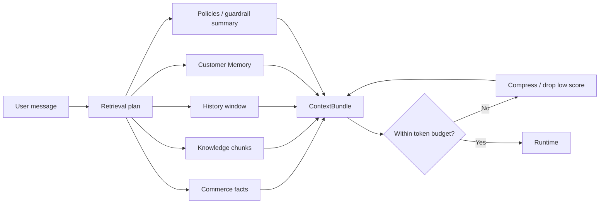
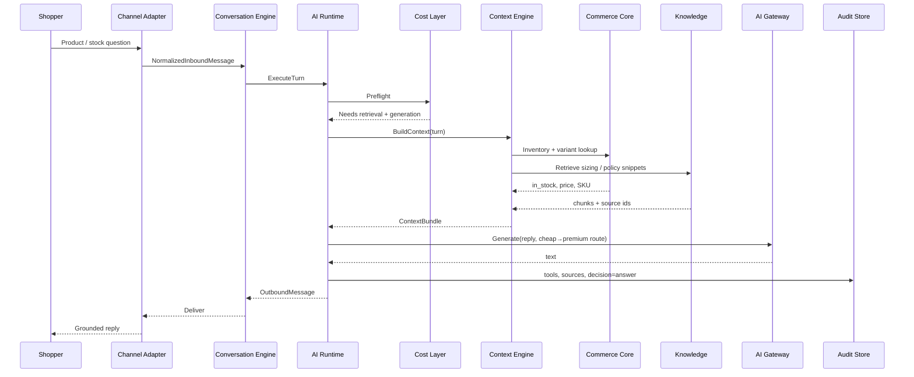
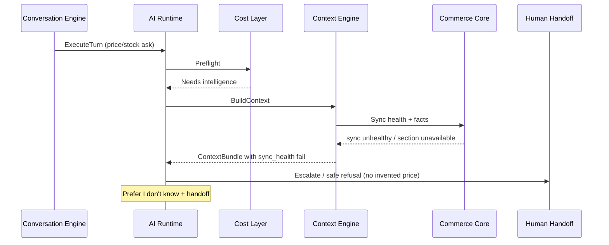
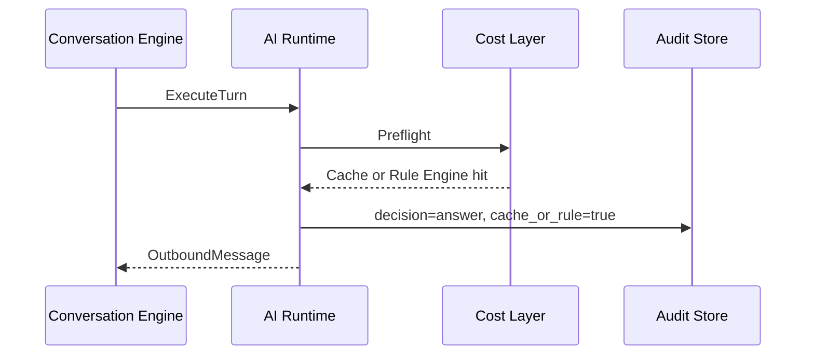
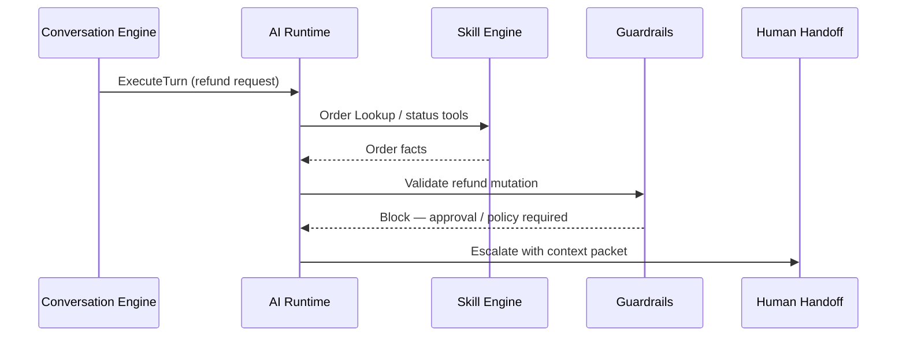

# AI Runtime Architecture

## Metadata

| Field | Value |
|-------|-------|
| **Version** | 0.1 |
| **Status** | Active — deep design of the AI Employee Runtime |
| **Owner** | Founder / AI Platform / Backend |
| **Last Updated** | July 25, 2026 |
| **Parent Document** | [System Architecture](./system-architecture.md) |
| **Related Documents** | [Product Vision](../02-product/product-vision.md) · [Product Principles](../02-product/product-principles.md) · [Product Scope](../02-product/product-scope.md) · [User Journey](../02-product/user-journey.md) · [Roadmap](../00-overview/roadmap.md) · [Glossary](../00-overview/glossary.md) · [Product Moat](../01-business/product-moat.md) · [Domain-Driven Design](./domain-driven-design.md) · [AI Gateway Design](./ai-gateway-design.md) · [Context Engine Design](./context-engine-design.md) |

**Audience:** AI Platform, Backend, Frontend (Inbox / Employee settings), QA / Evaluation, DevOps (observability for turns).

**Authority:** This document deepens the **AI Employee Runtime** defined in System Architecture. It must not invent features outside Product Scope, contradict Product Principles, or expand MVP.

If conflict:

```
Product Vision
    ↓
Product Principles
    ↓
Product Scope
    ↓
User Journey
    ↓
Roadmap
    ↓
System Architecture
    ↓
This document
```

Product and System Architecture win. This document only specifies how the Runtime executes what they already require.

---

# 1. Purpose

The **AI Employee Runtime** is the center of gravity of DeloRey AI ([System Architecture](./system-architecture.md) §5).

It executes **one conversation turn** for an **AI Sales Employee**: gather context, decide among Skills, enforce guardrails, produce a grounded reply or Human Handoff — with full auditability and cost awareness.

Every shopper message that is **not** owned by a human operator is executed here. Channels are adapters only. Business logic, Knowledge, Memory, Skills, and guardrails live in the Runtime ([Product Scope](../02-product/product-scope.md), [Product Principles](../02-product/product-principles.md) — *One Brain, Multiple Channels*).

### What Runtime is

| Runtime is | Runtime is not |
|------------|----------------|
| Orchestrator of a grounded Sales Employee turn | A chatbot tree / visual flow builder |
| Enforcer of Context Before Intelligence | A thin OpenAI wrapper |
| Owner of Skill planning, Guardrails, escalate/answer decisions | Owner of storefront truth (Commerce Core owns that) |
| Emitter of audit + analytics events | A helpdesk ticket engine or CRM pipeline |
| Consumer of AI Gateway for generation/embeddings | A place that imports vendor SDKs directly |

### Glossary alignment

| Term | Meaning in this document |
|------|--------------------------|
| **AI Employee** | Product-facing commerce role the merchant hires (MVP: Sales) |
| **Agent** | Technical runtime unit behind the Employee: message → context → tools → reply within guardrails ([Glossary](../00-overview/glossary.md)) |
| **Skill** | Allowed commerce action / outcome (product search, recommend, order status, escalate) |
| **Turn** | One inbound shopper message processed to an outbound reply or handoff |

---

# 2. Runtime Philosophy

These rules are binding for every turn. They are restated from Product Principles and System Architecture — not new product policy.

| Rule | Source | Architectural consequence |
|------|--------|---------------------------|
| **Context Before Intelligence** | Product Principles | No LLM generation path without Context Engine assembly when intelligence is needed |
| **LLMs are the last resort, not the first step** | Product Principles — AI Principles | Cost Layer: Rules, Commerce tools, Cache, Knowledge retrieval before premium generation |
| **Model Independence** | Product Principles | Runtime never calls a provider SDK; only AI Gateway |
| **Humans Control AI** | Product Principles | Guardrails and Human Handoff are hard stops |
| **Never hallucinate confidently** | Product Principles | Missing context → refuse / escalate; never invent price, stock, policy |
| **Prefer “I don’t know”** | Product Principles | Uncertainty + handoff beats fluent wrong answer |
| **Stay in role** | Product Principles | Sales Employee sells/supports purchase blockers within Sales Skills — not a general assistant |
| **Respect inventory / pricing / policies** | Product Principles — Commerce | Facts come from Commerce Core + Knowledge, never model prior |
| **Fail safe** | Product Principles — Technical | Degrade + escalate when sync/tools fail |
| **Transparent AI** | Product Principles | Audit records what was known, tools called, escalation reasons |
| **Cost First** | System Architecture | Token spend is a first-class turn concern |
| **Runtime First** | System Architecture | All channels share one brain |



---

# 3. Position in the System

### Layer

Runtime sits in **L4 — Intelligence** ([System Architecture](./system-architecture.md) §3):

```
L3 Conversation (Adapters + Conversation Engine)
        ↓
L4 Intelligence (Runtime + Skills + Guardrails + Handoff)
        ↓
L5 Context (Context Engine + Memory + Knowledge)
        ↓
L6 Commerce / L7 AI Access / L8 Platform
```

### Request path (summary)

From System Architecture end-to-end lifecycle:

**Adapter → Conversation Engine → Cost Layer → Context Engine → Skills → Guardrails → AI Gateway → Audit → Adapter**

### Ownership split

| Concern | Owner | Runtime must |
|---------|-------|--------------|
| Message ingest, ownership (`ai_active` / `human_owned` / `paused`), delivery | Conversation Engine | Skip turn if human-owned; return `OutboundMessage` only |
| Catalog / inventory / price / orders / sync health | Commerce Core | Read via Context / Skills; never invent |
| FAQ / policy overrides / uploads | Knowledge System | Consume via Context RAG + citations |
| Model routing, tokens, provider failover | AI Gateway + Cost Layer | Request generation/embed; never bind to a vendor |
| Tenant isolation | Platform / every store | Carry verified `tenant_id` on every step |
| Operator inbox UX | Workspace | Emit handoff packet; do not own ticket SoR |

---

# 4. MVP Scope for Runtime

Aligned with [Product Scope](../02-product/product-scope.md) — **AI Sales Employee** primary product.

### In scope (must exist)

| Capability | Runtime behavior |
|------------|------------------|
| Grounded pre-purchase Q&A | Context + Knowledge + Commerce facts → Answer |
| Product Recommendation | Inventory/price-aware catalog match → Recommend |
| Order Lookup | Post-purchase status within allowed tools → Order Lookup |
| Policy / FAQ answers | Knowledge-grounded → Answer |
| Escalation / Human Handoff | Low confidence, policy, customer request, unsafe mutation → Escalate |
| Guardrails | Tone/language loaded; blocked topics, discount caps, restricted mutations enforced |
| Audit | Context refs, tools, reply, escalation reason |
| Cost-aware path | Cache / rules / cheap route before premium LLM |
| Three channels | Identical brain; adapters format only |

### Explicitly out of Runtime MVP

Per Product Scope OUT OF MVP and Principles anti-patterns — Runtime must not implement:

| Excluded | Why |
|----------|-----|
| Visual flow / workflow builder as core path | Chatbot-builder identity |
| Channel-forked business rules | One Brain |
| Ungrounded “stylist” upsell | Sales Skills contract |
| Unguarded refund / cancel mutation | Humans Control; MVP mutations limited |
| Multi-agent orchestration theater | Depth before breadth |
| Skill Marketplace / third-party Skills | Premature ecosystem |
| Instagram / WhatsApp / email / voice adapters | Not MVP channels |
| CRM / helpdesk as SoR | Wrong category |
| Marketing automation / campaigns | Dilutes Sales Employee |
| Disabling handoff to inflate automation rate | Trust anti-pattern |
| Direct provider SDK calls | Model Independence |

### Decision outcomes (only these)

From [User Journey](../02-product/user-journey.md) Stage 8 and System Architecture Runtime responsibilities:

| Decision | When |
|----------|------|
| **Answer** | High enough confidence; grounded sources available |
| **Recommend** | Shopper shows purchase intent; inventory/price-aware catalog match |
| **Order Lookup** | Post-purchase status within allowed tools |
| **Escalate** | Low confidence, policy block, customer requests human, or unsafe mutation |

Prefer “I don’t know” + Human Handoff over wrong SKU, price, or policy.

---

# 5. Turn Lifecycle

### Entry conditions

Conversation Engine calls Runtime `ExecuteTurn` when:

1. Inbound message is persisted and idempotency key is accepted.
2. Conversation ownership is **`ai_active`** (not `human_owned`, not `paused` for AI).
3. Employee is live for that channel binding.

If ownership is human: **Skip Runtime** — deliver to Inbox only ([System Architecture](./system-architecture.md) §5 pipeline).

### Canonical pipeline

Exact pipeline from System Architecture §5:



### Stage contracts

| Stage | Purpose | Must not |
|-------|---------|----------|
| **1. Load Employee + Guardrails** | Role, tone, language, Skills, hard-stop policies | Treat settings as decorative UI only |
| **2. Cost Layer preflight** | Cache / Rule Engine / cheap classify; skip unnecessary LLM | Bypass Cost Layer for “always GPT” |
| **3. Context Engine assemble** | `ContextBundle`: commerce, Knowledge, history, Memory, policies, sync flags | Generate without assembly when intelligence is needed |
| **4. Sync health gate** | For product/price/stock: refuse if sync unhealthy | Confident factual answers on stale sync |
| **5. Skill planning + execute** | Product search, recommend, order status, escalate tools under scopes | Channel-specific Skill forks |
| **6. Guardrails validate** | Hard stops on actions and content | Soft-suggest and continue |
| **7. Generate (if needed)** | AI Gateway Complete with routed model | Call provider SDKs; invent facts in prompt as truth |
| **8. Post-validate** | Groundedness / policy check | Ship unvalidated high-stakes claims |
| **9. Persist audit + events** | Transparent AI + Measure Everything | Hide escalations for vanity metrics |
| **10. Outbound or Handoff** | Channel-agnostic message or context packet | Put business rules in adapter |

---

# 6. Inputs and Outputs

### Inputs

| Input | Source | Notes |
|-------|--------|-------|
| `NormalizedInboundMessage` | Channel Adapter via Conversation Engine | Text + channel metadata; no business rules |
| `tenant_id` | Verified binding, not raw adapter claim | Fail closed if missing |
| `employee_id` | Conversation / channel binding | Sales Employee config |
| `conversation_id` | Conversation Engine | Ownership + history |
| Employee config + guardrails | Workspace config store | Tone, language, Skills, caps, blocked topics, escalation rules |
| Sync health | Commerce Core | Gates factual product answers |
| Cost / cache signals | Cost Optimization Layer | Route plan, cache hit, classify |

### Outputs

| Output | Consumer |
|--------|----------|
| `OutboundMessage` (text, optional product cards/links) | Conversation Engine → Adapter |
| `HandoffRequest` + context packet | Human Handoff → Workspace Inbox |
| Audit records | Audit Store |
| Runtime events | Analytics, monitoring |
| Token/cost usage | Metering |

### Context packet (handoff)

From User Journey Stage 9 and System Architecture escalation path — packet includes:

- Summary  
- Customer identifiers if known  
- Recent messages  
- Relevant order/product facts  
- Escalation reason  

AI pauses for that conversation while the human owns the reply path.

---

# 7. Cost Optimization Integration

Runtime **must** invoke Cost Optimization Layer before expensive model calls ([System Architecture](./system-architecture.md) §5, §12; Product Principles — *LLMs are the last resort*).

### Preflight outcomes

| Outcome | Runtime action |
|---------|----------------|
| Response / semantic cache hit (TTL + sync version) | Deterministic / cached grounded reply → audit → outbound |
| Rule Engine match (e.g. exact FAQ, business-hours message) | Deterministic reply |
| Needs commerce tool only + template enough | Run Skill → template reply (no NLG or light template) |
| Needs NLG after structured Skill | Small / cheap model via Gateway |
| Ambiguous / multi-hop | Context Engine → cheap or premium route by complexity / stakes |
| Classifier error | Prefer safer path (retrieve + escalate) over wrong deterministic answer |

### Cost flow (authoritative)



### Cost rules Runtime must honor

- Cache keys include `tenant_id` and sync version / content hash; invalidate on `catalog.updated` / `knowledge.updated`.
- Do not cache PII-heavy personalized replies across shoppers.
- Skip unnecessary LLM when Skills return complete structured answers that only need light templating.
- Token budget exceeded → compress / summarize history; drop low-relevance chunks before premium call (keep hard facts: price/stock).

Deep design of cache keys, classifiers, and routing policies belongs in later **Cost Optimization** / **AI Gateway** design docs — Runtime only consumes their contracts.

---

# 8. Context Assembly Contract

When Cost Layer requires intelligence, Runtime calls Context Engine to build a `ContextBundle` **before generation** ([System Architecture](./system-architecture.md) §8; User Journey Stage 8).

### Bundle contents (typed sections)

| Section | Source | Role |
|---------|--------|------|
| Commerce facts | Commerce Core | Catalog, inventory signals, pricing, structured policies, order facts as needed |
| Knowledge chunks | Knowledge System (RAG) | FAQ/overrides/uploads with source ids |
| History window | Conversation Engine | Recent turns (+ summaries when compressed) |
| Customer Memory | Memory / Customer Profile | Continuity when identity resolvable |
| Policies / guardrail summary | Employee config + commerce policies | Constraints for planning |
| Sync health flags | Commerce Core | Section availability |
| Citations / retrieval diagnostics | Knowledge + Commerce | Transparent AI / audit |
| Token estimate | Context Engine | Budget enforcement |

### Assembly diagram



### Runtime obligations after `ContextBundle`

1. If product/price/stock section required and sync unhealthy → fail-safe escalate / “I don’t know”.
2. Never invent missing commerce facts.
3. Prefer escalate / “I don’t know” on empty Knowledge retrieval for policy asks over inventing policy.
4. Pass citations/source refs into audit on grounded answers.

Context Engine internals (retrieval SLOs, vector filters) are owned by Context / Knowledge design docs. Runtime treats `ContextBundle` as the contract.

---

# 9. Skill Engine

Skills are the extension point for commerce behavior — not prompt forks per merchant ([Product Principles](../02-product/product-principles.md) — *Composable by Default*).

### MVP Skills

From Product Scope and System Architecture core components:

| Skill | Job | Inputs (conceptual) | Outputs (conceptual) | Guardrail notes |
|-------|-----|---------------------|----------------------|-----------------|
| **Product Search / Grounded Q&A** | Answer product questions from live catalog | Query, catalog indexes, variants | Matched products/facts + sources | No answer without sync-healthy facts when factual |
| **Product Recommendation** | Inventory/price-aware recommendations | Intent + catalog + stock/price | Recommended SKUs + links/cards | No irrelevant push; respect inventory |
| **Order Status (Order Lookup)** | Post-purchase status within tools | Order identifiers + order API | Status payload for reply | Read-heavy; no unguarded refund/cancel |
| **Escalation** | Transfer to human with packet | Reason, context refs | `HandoffRequest` | First-class; never disabled for vanity |

### Skill planning rules

1. Plan Skills from Employee allowed set + turn need — Sales Employee stays in role.
2. Execute tools under **permission scopes**.
3. Secrets and storefront credentials never enter prompts or logs.
4. Skill mutations that affect money/policy require scoped permissions + approval path; MVP keeps mutations limited (order lookup read-heavy).
5. Adapters never implement Skills.

### Skill ↔ decision mapping

| Skill outcome | Decision enum |
|---------------|---------------|
| Grounded FAQ / product fact reply | Answer |
| Catalog match for purchase intent | Recommend |
| Order status tool success | Order Lookup |
| Policy/confidence/customer/human-required | Escalate |

---

# 10. Guardrails

Guardrails are **hard stops, not soft suggestions** ([Product Principles](../02-product/product-principles.md); System Architecture).

### Loaded with Employee

| Setting (MVP) | Intent |
|---------------|--------|
| Tone | Brand-aligned voice within opinionated Skill behavior |
| Language | Persian-quality bar for Iran MVP |
| Blocked topics | Skip Agent / escalate (e.g. legal triggers via Workflow rules where defined) |
| Discount caps | Above-cap discounts require human approval |
| Restricted mutations | No unguarded refund/cancel |
| Escalation triggers | Confidence, policy, customer request, business-hours rules |

### Enforcement points

| Point | Behavior |
|-------|----------|
| Before tool side effects | Block forbidden mutations |
| After Skill / before generate | Block disallowed content / discount |
| Post-validate | Fail → escalate or clarification per policy |
| Prompt injection attempts | Tool permission checks after model suggestions; Guardrails remain sole safety authority with Runtime (Gateway is not sole safety layer) |

### Violation behavior

Block action; escalate or ask clarification per merchant policy. Never silently continue.

---

# 11. Generation via AI Gateway

When NLG is required after context and tools:

1. Runtime (or Cost Layer on Runtime’s behalf) calls AI Gateway `Complete` / related APIs.
2. Request includes messages/context derived from `ContextBundle`, tool results, Employee tone — **not** raw secrets.
3. Routing (cheap vs premium, fallback) is Gateway + Cost policy — Runtime is provider-agnostic.
4. Usage (tokens) recorded for metering and cost dashboards.

Runtime must treat Gateway errors as typed: timeout, rate_limit, content_filter, unavailable → fail-safe / escalate per System Architecture failure tables.

Prompt versioning, A/B of models, and provider plugins are **AI Gateway** concerns. Runtime only depends on stable Gateway contracts.

---

# 12. Post-Validation

Before outbound delivery, Runtime post-validates ([System Architecture](./system-architecture.md) §5 pipeline):

| Check | Fail behavior |
|-------|---------------|
| Groundedness for factual commerce claims | Escalate / refuse — never invent stock/price/policy |
| Policy / guardrail compliance | Block + escalate or clarify |
| Role adherence | Reject out-of-role assistant behavior |
| Sync-dependent claims still valid | Refuse if sync degraded mid-turn |

Hallucination incidents affecting price, stock, or policy are P0/P1 product failures ([Product Principles](../02-product/product-principles.md) — AI quality bar).

---

# 13. Human Handoff

Handoff is first-class trust mechanics ([Glossary](../00-overview/glossary.md); User Journey Stage 9).

### Triggers (documented)

- Low confidence  
- Merchant escalation rules / blocked topics  
- Discount approval needs  
- Explicit customer request for human  
- Unsafe / forbidden mutation path  
- Fail-safe on sync/tool/Gateway failure for factual asks  

### Sequence

```mermaid
sequenceDiagram
    participant RT as Runtime
    participant HH as Handoff
    participant IN as Inbox API
    participant OP as Operator
    participant AD as Adapter

    RT->>HH: Escalate(reason, context packet)
    HH->>IN: Create/open inbox item; pause AI
    IN->>OP: Notify
    OP->>IN: Reply
    IN->>AD: Deliver human message
    OP->>IN: Return to AI
    IN->>RT: Resume with memory
```

### Resume rules

- Conversation ownership returns to `ai_active` only when operator returns control (or defined rules).
- Memory/history remains intact; Employee must not pretend the handoff never happened.
- Automation rate must never be inflated by disabling handoff.

---

# 14. Memory and Continuity

| Concern | Behavior |
|---------|----------|
| Conversation History | Source of continuity for operators and later turns |
| Customer Profile | Cross-channel continuity when identity is resolvable; prefer no merge over wrong merge |
| Memory selection | Smart selection via Cost Layer / Context — not full dump every turn |
| Summaries | Used for compression when over token budget |

Memory is part of Employee quality, not a premium add-on ([Product Principles](../02-product/product-principles.md)). Runtime consumes Memory through Context Engine; it does not store Memory outside tenant boundaries.

---

# 15. Audit, Events, Observability

### Audit (Transparent AI)

Every turn that runs Runtime should leave merchant-inspectable artifacts:

- What the Employee knew (context snapshot refs / sources)  
- Tools called (I/O summaries — no secrets)  
- Reply text  
- Decision (`Answer` / `Recommend` / `Order Lookup` / `Escalate`)  
- Escalation reason when applicable  
- Cache hit / model route (as available)  

### Events (MVP catalog — Runtime-related)

From System Architecture §13 — Runtime participates as producer where applicable:

| Event | When |
|-------|------|
| `conversation.message` | Each message (Conversation Engine; Runtime contributes side effects) |
| `conversation.escalated` | Handoff |
| `employee.updated` | Config change → Runtime config cache bust (consumer) |
| `sync.succeeded` / `sync.failed` | Gates Runtime factual answers (consumer) |
| `catalog.updated` / `knowledge.updated` | Cache invalidation (Cost Layer consumer) |

Critical user turns remain **request/response** on the Runtime path; events notify side effects.

### Observability signals

From System Architecture §5:

| Signal | Examples |
|--------|----------|
| Traces | `runtime.turn`, `context.build`, `skill.*`, `guardrail.check`, `gateway.generate` |
| Metrics | turn_latency_p50/p95, escalation_rate, grounded_answer_rate, tool_error_rate, cost_per_turn |
| Logs | Structured JSON with tenant, conversation, decision, cache_hit, model_route (no secrets) |

Aligns with Product Principles Technical — Observability of Runtime steps: context build, retrieval, tool calls, guardrails, channel delivery.

---

# 16. Failure Modes

Authoritative table from System Architecture §5 (Runtime), extended only with behaviors already specified in Cost / Context / Gateway / Conversation sections:

| Failure | Behavior |
|---------|----------|
| Conversation human-owned | Skip Runtime |
| Context Engine timeout | Escalate or safe refusal; never invent stock/price |
| Skill / Commerce tool error | Retry once with backoff; then escalate |
| Guardrail violation | Block; escalate or clarify per policy |
| AI Gateway outage | Failover provider if configured; else degrade + escalate |
| Stale sync for factual ask | Refuse confident facts; surface sync health in Workspace |
| Token budget exceeded | Compress / summarize; drop low-relevance chunks; keep hard facts |
| Cache stale after catalog change | Prevented by sync-version keys; invalidate on domain events |
| Classifier error | Safer path (retrieve + escalate) |
| Duplicate webhook | Idempotency key — no double Runtime execution |
| Missing tenant context | Fail closed |
| Vector / Knowledge empty for policy | Prefer escalate / “I don’t know” |
| Content filter from Gateway | Safe refusal / escalate |

---

# 17. Scaling and Security

### Scaling (from System Architecture)

- Runtime workers are **stateless**; scale horizontally behind queue or HTTP turn executor.
- Per-tenant concurrency limits — fair use across merchants.
- Separate **interactive** queue (shopper turns) from **batch** (reindex, sync).
- Idempotency key per inbound message delivery.

### Security (from System Architecture + Principles)

- Verified `tenant_id` on every turn.
- Tool credentials and storefront secrets never in prompts or logs.
- PII minimization in prompts; redact in logs.
- Scoped Skills; no unguarded refund/cancel in MVP.
- Prompt injection: Guardrails + post-tool permission checks.
- Tenant isolation on Memory, history, embeddings, audit.

---

# 18. Sequence Diagrams

### A. Grounded product question (happy path)

From System Architecture §5:



### B. Fail-safe on unhealthy sync (factual domain)



### C. Deterministic / cache path (no premium LLM)



### D. Order Lookup then escalate on restricted mutation



---

# 19. Employee Configuration Surface

Loaded each turn from Workspace config (User Journey Stage 5; Product Scope Settings / Guardrails):

| Field | Enforced in Runtime |
|-------|---------------------|
| Role | Sales (MVP); stay in role |
| Tone | Within safety bounds |
| Language | Iran / Persian quality bar for MVP |
| Enabled Skills | Subset of MVP Skills |
| Guardrails | Hard stops |
| Escalation rules | Triggers for Handoff |

Settings without sync + channel must not encourage go-live. Configuration is meaningless until Commerce Core and a channel are healthy ([User Journey](../02-product/user-journey.md)).

---

# 20. Quality Bar and Measurement

Runtime must emit signals merchants and engineering use ([Product Principles](../02-product/product-principles.md); User Journey Stage 10):

| Signal | Expectation |
|--------|-------------|
| Grounded response rate | Majority of factual commerce answers tied to Context / Knowledge |
| Hallucination incidents | P0/P1 when price, stock, or policy wrong |
| Escalation appropriateness | High-stakes / low-confidence → human; trivial FAQ → not |
| Resolution rate | Routine questions closed without unnecessary escalation |
| Cost per turn | Visible via Cost Layer + Gateway metering |
| Sync-lag impact | Factual refuse when unhealthy — visible in Workspace |

Evaluation / hallucination test suites belong in Testing Strategy; Runtime must expose hooks (audit refs, decision, sources) for those tests.

---

# 21. Future Evolution (no early build)

Architecture may prepare seams; MVP must not build these ([System Architecture](./system-architecture.md) § Future Evolution; Product Scope layers):

| Horizon | Runtime change |
|---------|----------------|
| **V1 / Beta** | Same Runtime; clearer escalation reasons; quality/retrieval hardening |
| **Growth** | Support Employee as config + Skills on same Runtime; guarded Automations subordinate to Employee outcomes |
| **Platform** | Multi-Employee orchestration under guardrails; certified Skill packs — not a generic agent IDE |
| **New channels** | New adapters only; zero Runtime business-rule forks |

Evolution rules:

1. New Employees = goals + Skills + metrics, same Runtime.  
2. Automations only after core quality.  
3. Marketplace / third-party Skills only after first-party Skills are stable.  
4. Never open visual flow builder as the extensibility story.

---

# 22. Related Components (contract neighbors)

| Component | Relationship to Runtime |
|-----------|-------------------------|
| Conversation Engine | Invokes `ExecuteTurn`; owns ownership state and delivery |
| Cost Optimization Layer | Preflight; routing directives; cache |
| Context Engine | Builds `ContextBundle` |
| Skill Engine | Executes commerce tools |
| Guardrails | Hard-stop validation |
| Human Handoff | Escalation path |
| AI Gateway | Provider-agnostic generation/embeddings |
| Commerce Core | Live truth via Context/Skills |
| Knowledge System | RAG via Context |
| Memory | Continuity via Context |
| Audit Store | Transparent AI persistence |
| Event Bus | Side-effect fan-out |
| Analytics / Revenue Intelligence | Consumes Runtime events |
| Channel Adapters | Never contain Runtime logic |

Downstream docs (do not change this Runtime shape):

- Context Engine Design  
- AI Gateway Design  
- Knowledge & RAG Design  
- [Conversation Engine Design](./conversation-engine-design.md)  
- Cost Optimization (deep)  
- Skill PRDs / Feature PRDs  

---

# 23. Implementation Guidance

### AI / Backend

- Implement the §5 pipeline stages as explicit steps with trace spans — not a single opaque “ask LLM” function.
- Enforce tenant_id and guardrails in code paths that execute tools, not only in prompts.
- Keep adapters thin; put Answer / Recommend / Order Lookup / Escalate decisions in Runtime.
- Wire Cost Layer before Gateway; measure % turns with zero premium calls.

### Frontend

- Employee settings and Inbox must reflect Runtime reality: sync health, escalation reasons, audit visibility.
- Never imply go-live without sync + channel + test conversation path.

### QA

- Acceptance tests: grounded stock/price, stale-sync refuse, handoff resume with memory, idempotent webhooks, cross-tenant isolation on Memory/context.
- Treat wrong price/stock/policy as product bugs, not “model vibe” issues.

---

# Summary

DeloRey’s AI Runtime is a **single, tenant-aware, cost-aware turn executor** for the AI Sales Employee. It loads Employee + guardrails, prefers deterministic/cheap paths, assembles Context before intelligence, runs MVP Skills under scopes, hard-stops on Guardrails, generates only through the AI Gateway when needed, post-validates groundedness, audits every decision, and escalates to humans when trust requires it.

**Build:** the pipeline and contracts above for Website, Telegram, and Bale.  
**Do not build:** channel-forked logic, flow builders, unguarded mutations, provider lock-in, or autonomy that skips context and handoff.

---

*AI Runtime Architecture v0.1. Changes require version bump and written rationale. Product Scope, Product Principles, and System Architecture override Runtime enthusiasm when they conflict.*
