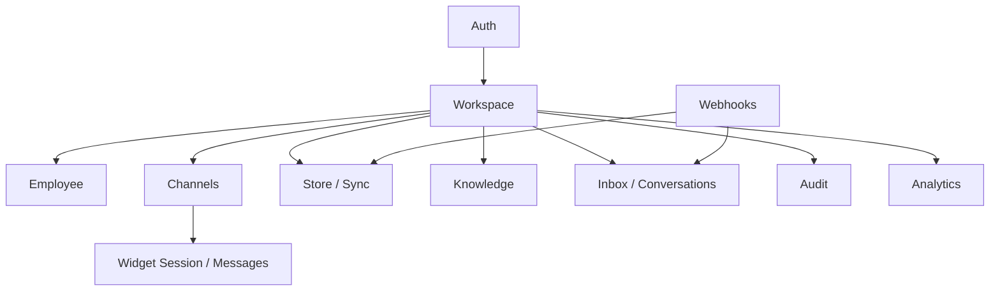

# API Specification

## Metadata

| Field | Value |
|-------|-------|
| **Version** | 0.1 |
| **Status** | Active — logical `/v1` contracts for Seloma AI MVP |
| **Owner** | Founder / Backend / Frontend |
| **Last Updated** | July 25, 2026 |
| **Parent Documents** | [Backend Architecture](./backend-architecture.md) · [Frontend Architecture](./frontend-architecture.md) · [Database Design](./database-design.md) · [Conversation Engine Design](./conversation-engine-design.md) · [System Architecture](./system-architecture.md) |
| **Related Documents** | [Product Scope](../02-product/product-scope.md) · [Product Principles](../02-product/product-principles.md) · [User Journey](../02-product/user-journey.md) · [Domain-Driven Design](./domain-driven-design.md) · [AI Runtime Architecture](./ai-runtime-architecture.md) · [Knowledge & RAG Design](./knowledge-rag-design.md) |

**Audience:** Backend, Frontend (`api-client`), QA (contract tests), future Platform API consumers (same shapes later).

**Authority:** APIs expose **only** MVP capabilities from Product Scope and architecture modules. UI is a client of these contracts ([Product Principles](../02-product/product-principles.md) — *API First*). This is a **logical** specification (resources, verbs, payloads, errors) — OpenAPI YAML may be generated later without changing meaning.

If conflict:

```
Product Scope
    ↓
System / Backend / Conversation / Database designs
    ↓
This document
```

---

# 1. Principles

| Rule | Meaning |
|------|---------|
| **API First** | Workspace UI and Widget use the same versioned contracts; no dashboard-only hidden writes |
| **Stateless** | Auth via session/cookie (or bearer); durable state in stores |
| **Tenant isolation** | Every merchant resource scoped by authenticated Workspace membership; missing tenant → **fail closed** |
| **Ubiquitous language** | `Employee`, `Conversation`, `Handoff` — not `Bot`, `Ticket` |
| **No business rules in Widget** | Shopper APIs send/receive messages only |
| **Secrets never in responses** | OAuth tokens, bot tokens returned as status/refs only — not plaintext |
| **Public developer platform** | **Platform phase** — not MVP ([Product Scope](../02-product/product-scope.md)); still design `/v1` as if it will become public |

---

# 2. Conventions

### Base URL & versioning

```
https://{api-host}/v1/...
```

Breaking changes → `/v2`. Additive fields allowed in `/v1` with care.

### Content type

- JSON `application/json` unless multipart upload (Knowledge files).
- Timestamps: ISO-8601 UTC.
- IDs: UUID strings.

### Authentication

| Client | Auth |
|--------|------|
| Workspace | Session cookie after login (secure, HTTP-only) — or equivalent session token |
| Widget (shopper) | Short-lived **widget session** token issued by Backend for a ChannelBinding — not merchant JWT |
| Webhooks | Channel/storefront signature verification — not session auth |
| Ops internal | Separate ops auth — not merchant-facing |

Password reset and signup/login per Product Scope Authentication.

### Authorization

Workspace-scoped membership roles (least privilege). Inbox/KB/Employee mutations require membership on that tenant’s Workspace.

### Idempotency

| Surface | Mechanism |
|---------|-----------|
| Channel webhooks | `idempotency_key` on ingest ([Conversation Engine Design](./conversation-engine-design.md)) |
| Merchant POSTs that may retry | Optional `Idempotency-Key` header where noted |

### Error envelope

```json
{
  "error": {
    "code": "sync_unhealthy | not_found | forbidden | validation_failed | conflict | rate_limited | ...",
    "message": "Merchant-safe explanation",
    "details": {}
  }
}
```

| HTTP | Typical use |
|------|-------------|
| 400 | Validation |
| 401 | Unauthenticated |
| 403 | Forbidden / wrong tenant |
| 404 | Not found **in tenant** (no cross-tenant leakage) |
| 409 | Conflict (duplicate idempotency, invalid ownership transition) |
| 429 | Rate limit |
| 503 | Dependency degraded (with recovery hint when safe) |

Silent “connected” with broken truth is forbidden — commerce/channel health APIs must surface failure ([User Journey](../02-product/user-journey.md)).

### Pagination

List endpoints: `cursor` or `page` + `limit`; default reasonable page size. Inbox ordered by `last_message_at DESC`.

---

# 3. Resource Map (MVP)



---

# 4. Auth — `/v1/auth`

| Method | Path | Purpose |
|--------|------|---------|
| `POST` | `/v1/auth/signup` | Create user (+ provision tenant/workspace path) |
| `POST` | `/v1/auth/login` | Establish session |
| `POST` | `/v1/auth/logout` | End session |
| `POST` | `/v1/auth/password-reset/request` | Start reset |
| `POST` | `/v1/auth/password-reset/confirm` | Complete reset |
| `GET` | `/v1/auth/me` | Current user + workspace memberships |

### Signup / login (logical body)

| Field | Notes |
|-------|-------|
| `email` | |
| `password` | Never logged; never returned |
| `workspace_name` | On signup — creates Workspace 1:1 Tenant MVP |

### Response `me`

| Field | Notes |
|-------|-------|
| `user` | id, email |
| `workspaces[]` | id, name, `tenant_id`, role |

Provisioning side effects (`tenant.provisioned`, default Sales Employee inactive, empty KB namespace) are Backend — not separate public “provision” API for MVP merchants.

---

# 5. Workspace — `/v1/workspaces`

| Method | Path | Purpose |
|--------|------|---------|
| `GET` | `/v1/workspaces/{workspaceId}` | Workspace summary |
| `GET` | `/v1/workspaces/{workspaceId}/attention` | Home triage: sync issues, open handoffs, employee health |
| `GET` | `/v1/workspaces/{workspaceId}/onboarding` | Checklist state (store, sync, employee, channel, test) |
| `GET` | `/v1/workspaces/{workspaceId}/members` | Memberships |
| `POST` | `/v1/workspaces/{workspaceId}/members` | Invite/add (MVP may be founder-only single user) |

### `attention` (maps UX triage)

```json
{
  "sync": { "status": "healthy|unhealthy|unknown", "action": "fix_store" },
  "handoffs_open": 3,
  "employee": { "status": "active|inactive|paused|error" },
  "channels": [{ "type": "website", "status": "connected|degraded|disconnected" }]
}
```

---

# 6. Employee — `/v1/workspaces/{workspaceId}/employees`

MVP: primary **Sales** Employee ([Product Scope](../02-product/product-scope.md)).

| Method | Path | Purpose |
|--------|------|---------|
| `GET` | `.../employees` | List |
| `GET` | `.../employees/{employeeId}` | Detail + guardrails |
| `PATCH` | `.../employees/{employeeId}` | Update name, tone, language, skills, status |
| `PUT` | `.../employees/{employeeId}/guardrails` | Replace guardrail config |

### Employee body (logical)

| Field | Allowed |
|-------|---------|
| `role` | `sales` (MVP) |
| `name` | |
| `tone` | |
| `language` | Persian-quality bar for Iran MVP |
| `enabled_skills` | ⊆ `product_search`, `recommend`, `order_status`, `escalate` |
| `status` | `inactive` \| `active` \| `paused` |

### Guardrails body (logical)

| Field | Notes |
|-------|-------|
| `blocked_topics` | |
| `discount_cap_percent` | Above → human approval path |
| `restricted_mutations` | MVP: no unguarded refund/cancel |
| `escalation_rules` | confidence / policy / customer_request / business_hours |

Emits `employee.updated` → Runtime config cache bust. Settings are enforced in Runtime — API must persist real config, not decorative flags.

**Go-live policy:** API/docs should not encourage activating live traffic without healthy sync + connected channel (Workspace checklist).

---

# 7. Channels — `/v1/workspaces/{workspaceId}/channels`

MVP types: `website` \| `telegram` \| `bale` only.

| Method | Path | Purpose |
|--------|------|---------|
| `GET` | `.../channels` | List bindings + health |
| `POST` | `.../channels` | Connect / create binding |
| `GET` | `.../channels/{channelId}` | Detail |
| `PATCH` | `.../channels/{channelId}` | Update config (e.g. origin allowlist) |
| `POST` | `.../channels/{channelId}/reconnect` | Recovery |
| `GET` | `.../channels/{channelId}/embed` | Website snippet + public embed key material only |
| `DELETE` | `.../channels/{channelId}` | Disconnect |

### Channel resource (logical)

| Field | Notes |
|-------|-------|
| `channel_type` | website / telegram / bale |
| `status` | connected / degraded / disconnected |
| `employee_id` | Which Employee serves |
| `config` | Non-secret config (origins, bot username) |
| `health_detail` | last error, checked_at |
| `credentials` | **Never** returned; write-only or OAuth redirect |

Telegram/Bale: connection may use token submit once → stored encrypted/secrets manager.

Explicit non-goals: Instagram, WhatsApp, email, SMS, broadcast campaign APIs.

---

# 8. Commerce / Store — `/v1/workspaces/{workspaceId}/store`

| Method | Path | Purpose |
|--------|------|---------|
| `GET` | `.../store` | Connection status |
| `POST` | `.../store/connect` | Start OAuth / connect Shopify or Woo path |
| `POST` | `.../store/disconnect` | |
| `GET` | `.../store/sync-health` | Domains: catalog, inventory, orders, policies |
| `POST` | `.../store/sync` | Trigger sync job |
| `GET` | `.../store/sync` | Latest sync run summary |

### Sync health item

| Field | Notes |
|-------|-------|
| `domain` | catalog \| inventory \| orders \| policies |
| `status` | healthy \| stale \| failed \| unknown |
| `last_success_at` | |
| `lag_seconds` | |
| `last_failure_reason` | Merchant-visible |

No silent healthy when failed. Empty catalog must be visible error for go-live gating.

**Not exposed as merchant CRUD:** raw product/order mutation tables — Skills read via Runtime. Optional read-only catalog browse is Optional polish, not MVP-required.

Platforms: Shopify primary; WooCommerce equivalent — not multi-platform coverage as MVP requirement.

---

# 9. Knowledge — `/v1/workspaces/{workspaceId}/knowledge`

| Method | Path | Purpose |
|--------|------|---------|
| `GET` | `.../knowledge/docs` | List FAQ / overrides / uploads |
| `POST` | `.../knowledge/docs` | Create FAQ or policy_override |
| `GET` | `.../knowledge/docs/{docId}` | Detail + attribution + status |
| `PATCH` | `.../knowledge/docs/{docId}` | Update text/title |
| `DELETE` | `.../knowledge/docs/{docId}` | |
| `POST` | `.../knowledge/uploads` | Multipart PDF/text upload |
| `GET` | `.../knowledge/index-status` | Lag / failed counts |

### Doc resource

| Field | Notes |
|-------|-------|
| `doc_type` | `faq` \| `policy_override` \| `upload` |
| `title`, `body_text` | |
| `source_attribution` | Required for Transparent AI |
| `status` | `active` \| `indexing` \| `failed` |

Upload size/malware validation → `400` on corrupt/reject. Indexing async; clients must poll status — do not claim instant learn.

---

# 10. Inbox & Conversations — `/v1/workspaces/{workspaceId}/...`

### Conversations

| Method | Path | Purpose |
|--------|------|---------|
| `GET` | `.../conversations` | Inbox list (filters: ownership, channel_type) |
| `GET` | `.../conversations/{conversationId}` | Thread + handoff if any |
| `GET` | `.../conversations/{conversationId}/messages` | Paginated messages |
| `POST` | `.../conversations/{conversationId}/takeover` | Ensure `human_owned` |
| `POST` | `.../conversations/{conversationId}/messages` | Human reply |
| `POST` | `.../conversations/{conversationId}/return-to-ai` | `human_owned` → `ai_active` |
| `GET` | `.../conversations/{conversationId}/audit` | Audit turns for Transparent AI |
| `GET` | `.../handoffs` | Open escalations shortcut |

### Conversation resource

| Field | Notes |
|-------|-------|
| `ownership` | `ai_active` \| `human_owned` \| `paused` \| `ended` |
| `channel_type` | website / telegram / bale |
| `employee_id` | |
| `customer` | identifiers if known |
| `last_message_at` | |
| `handoff` | Embedded summary when open |

### Handoff / context packet

| Field | Notes |
|-------|-------|
| `reason` | |
| `context_packet` | summary, identifiers, recent messages, order/product facts, reason |
| `status` | open \| resolved \| returned_to_ai |

### Human message body

```json
{ "text": "..." }
```

Invalid transition (e.g. return-to-ai when already ai_active) → `409`.

**Not in MVP API:** ticket fields, SLA timers, CRM stages, assignment engine (V1 optional assignment later).

---

# 11. Audit — thread-scoped

Prefer nested under conversation (`GET .../audit`) for operator clarity.

### Audit turn resource

| Field | Notes |
|-------|-------|
| `decision` | `answer` \| `recommend` \| `order_lookup` \| `escalate` |
| `context_refs` | Source/citation refs — no secrets |
| `tool_calls` | Summaries |
| `reply_preview` | |
| `escalation_reason` | Nullable |
| `cache_hit` | |
| `model_route` | Ops label — not vendor lock-in in product copy |
| `created_at` | |

---

# 12. Analytics / Dashboard — `/v1/workspaces/{workspaceId}/analytics`

| Method | Path | Purpose |
|--------|------|---------|
| `GET` | `.../analytics/summary` | Basic Revenue / conversation dashboard |
| `GET` | `.../analytics/knowledge-gaps` | Repeated misses / low-confidence topics |

### Summary metrics (MVP)

| Metric | Notes |
|--------|-------|
| `conversation_count` | By channel optional breakdown |
| `resolution_rate` | |
| `escalation_rate` | + reasons breakdown |
| `grounded_answer_visibility` | |
| `attributed_conversion_or_recovery` | Conservative, explainable — not fake precision |
| `top_questions` | |

No advanced BI / custom report builder endpoints.

---

# 13. Website Widget APIs

Separate auth: **widget session**.

| Method | Path | Purpose |
|--------|------|---------|
| `POST` | `/v1/widget/sessions` | Create session for embed (public key / binding id + origin checks) |
| `POST` | `/v1/widget/sessions/{sessionId}/messages` | Shopper inbound |
| `GET` | `/v1/widget/sessions/{sessionId}/messages` | Poll or cursor history for UI |
| `GET` | `/v1/widget/sessions/{sessionId}` | State: ai_active / handoff / degraded |

### Session create (logical)

| Field | Notes |
|-------|-------|
| `channel_public_id` / embed key | Maps to ChannelBinding |
| `origin` | Must match allowlist |
| `page_url`, `cart_hints` | Optional hints only |

### Message

| Field | Notes |
|-------|-------|
| `text` | |
| Idempotency | Client may send `Idempotency-Key` |

Responses may include AI text and optional product card/link payload from Runtime — Widget **must not** compute prices/stock.

Handoff/offline states must be representable in session/message stream ([Product Scope](../02-product/product-scope.md) Website Chat).

Telegram/Bale shoppers do **not** use these REST APIs — they use Bot webhooks.

---

# 14. Webhooks (ingress)

Not session-authenticated. Signature + binding lookup → `tenant_id`.

| Path (illustrative) | Source |
|---------------------|--------|
| `POST /v1/webhooks/telegram/{bindingId}` | Telegram updates |
| `POST /v1/webhooks/bale/{bindingId}` | Bale updates |
| `POST /v1/webhooks/store/{connectionId}` | Shopify/Woo webhooks |
| `GET/POST /v1/oauth/store/callback` | OAuth return |

### Behavior

1. Verify signature / OAuth state.  
2. Normalize → Conversation ingest **or** sync enqueue.  
3. Idempotent processing.  
4. Fast ack; heavy work on queues (`interactive.turns` / `batch.sync`).  

Duplicate delivery → `200` without second side effects.

---

# 15. Internal / Ops (non-merchant)

| Area | Notes |
|------|-------|
| Health | `/health`, `/ready` — process liveness |
| Worker admin | Ops-only; not Workspace JWT |
| AI Gateway | **Internal module API only** — not a public “LLM API” for merchants ([AI Gateway Design](./ai-gateway-design.md)) |

Exposing raw Gateway as a general LLM product is out of category.

---

# 16. Events (outbound webhooks) — later

MVP may omit merchant-subscribed webhooks. Domain events remain internal (`conversation.escalated`, `sync.failed`, …). Platform phase can publish versioned webhook deliveries mirroring Workspace capabilities ([Product Scope](../02-product/product-scope.md) Platform).

---

# 17. Explicit Non-Goals (API)

| Excluded API | Why |
|--------------|-----|
| Public Skill Marketplace / agent store | Premature |
| Visual flow / workflow builder CRUD | Chatbot-builder identity |
| CRM pipelines / ticket SLA | Wrong SoR |
| Instagram / WhatsApp / email channel resources | Depth before breadth |
| Native mobile-only APIs | Browser Workspace enough |
| Billing subscription CRUD | **V1** — MVP may only have internal `usage_events` |
| Multi-brand org hierarchy | Single-store MVP |
| Unguarded refund/cancel commerce mutations | Guardrails |
| Token-level merchant billing endpoints as product | Pricing language is conversations/channels |

---

# 18. Mapping: Frontend routes → APIs

| Workspace route | Primary APIs |
|-----------------|--------------|
| `/login`, `/signup` | Auth |
| `/` home | `attention`, analytics peek |
| `/onboarding` | onboarding + store + employee + channels |
| `/store` | store + sync-health + sync |
| `/employee` | employees + guardrails |
| `/channels` | channels + embed |
| `/inbox` | conversations + handoffs + messages + takeover/return |
| `/knowledge` | knowledge docs + uploads + index-status |
| `/dashboard` | analytics/summary + knowledge-gaps |
| Audit panel | conversation audit |
| Widget | `/v1/widget/*` |

---

# 19. Contract Testing Obligations

| Test | Intent |
|------|--------|
| Isolation | User A token cannot `GET` User B conversation (403/404) |
| Secrets | Channel/store GET never includes raw tokens |
| Idempotent webhook | Same body twice → one message / one turn |
| Ownership | Human reply allowed only when `human_owned` (or takeover first) |
| Widget origin | Reject session create from non-allowlisted origin |
| Sync health honesty | Failed sync not reported as healthy |
| Knowledge status | After POST, status may be `indexing` until worker completes |
| OpenAPI drift | CI checks handlers match this resource list for MVP |

---

# 20. Related Documents

| Document | Relationship |
|----------|--------------|
| [Backend Architecture](./backend-architecture.md) | Module owners |
| [Frontend Architecture](./frontend-architecture.md) | `api-client` consumer |
| [Conversation Engine Design](./conversation-engine-design.md) | Inbox/widget semantics |
| [Database Design](./database-design.md) | Field shapes |
| [Knowledge & RAG Design](./knowledge-rag-design.md) | KB resources |
| [Security Architecture](./security-architecture.md) | Authn/z depth, webhook crypto |
| [Testing Strategy](./testing-strategy.md) | Contract + isolation suites |
| Feature PRDs (planned) | Per-endpoint acceptance |

---

# Summary

Seloma’s MVP API is a versioned **`/v1` Workspace + Widget + Webhooks** surface: Auth, Employee, Channels, Store/Sync, Knowledge, Inbox/Handoff, Audit, Analytics — API-first, tenant-fail-closed, secret-safe, and free of ticket/CRM/flow-builder/platform-marketplace endpoints. The same contracts are what a future public Platform API will harden — not a parallel UI-only backend.

---

*API Specification v0.1. Changes require version bump and written rationale. Product Scope and architecture parent docs override API enthusiasm when they conflict.*
