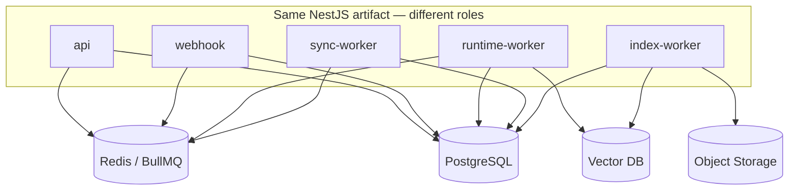
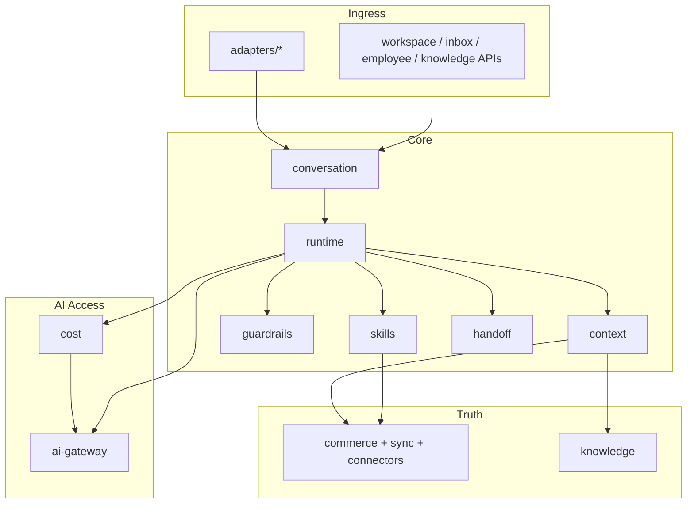
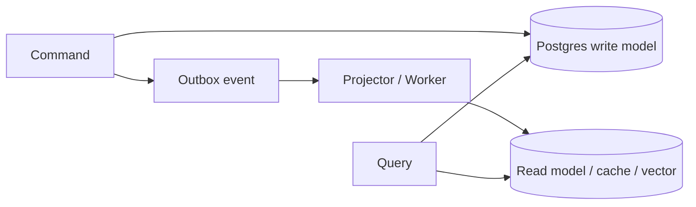

# Backend Architecture

## Metadata

| Field | Value |
|-------|-------|
| **Version** | 0.1 |
| **Status** | Active — NestJS backend shape for DeloRey AI MVP |
| **Owner** | Founder / Backend |
| **Last Updated** | July 25, 2026 |
| **Parent Documents** | [System Architecture](./system-architecture.md) · [Domain-Driven Design](./domain-driven-design.md) · [Database Design](./database-design.md) · [AI Runtime Architecture](./ai-runtime-architecture.md) |
| **Related Documents** | [Product Principles](../02-product/product-principles.md) · [Product Scope](../02-product/product-scope.md) · [User Journey](../02-product/user-journey.md) · [Glossary](../00-overview/glossary.md) |

**Audience:** Backend engineers, AI Platform (Runtime workers), DevOps, Tech leads reviewing module PRs.

**Authority:** Backend implements Product + System Architecture through DDD module boundaries and Database contracts. No OUT-OF-MVP domains. No business logic in Channel Adapters. No direct LLM provider SDKs outside AI Gateway.

If conflict:

```
Product Scope / Principles
    ↓
System Architecture / AI Runtime Architecture
    ↓
Domain-Driven Design / Database Design
    ↓
This document
```

---

# 1. Purpose

Define how the DeloRey **backend** is structured so teams can implement:

- API-first Workspace and Conversation contracts  
- Stateless, horizontally scalable handlers  
- Tenant-isolated persistence and jobs  
- Event-driven paths **where Architecture already requires them**  
- Separate **interactive** (shopper turns) vs **batch** (sync / embed) workers  

This is not a CRUD admin backend with a chat widget. Center of gravity remains the **AI Employee Runtime** ([System Architecture](./system-architecture.md)).

---

# 2. Technology Choices (MVP)

Derived from docs; libraries realize documented components — they are not new product features.

| Concern | Choice | Source |
|---------|--------|--------|
| Application framework | **NestJS** (modular monolith → extract workers) | [DDD §9 Module Mapping](./domain-driven-design.md) |
| Language | TypeScript | NestJS ecosystem / API-first services |
| SoR | **PostgreSQL** | System Architecture §14 / Database Design |
| Cache, locks, sessions, circuits | **Redis** (`t:{tenant_id}:…`) | System Architecture §14–15 / Database Design |
| Job / Queue System | **Redis-backed queues**; default NestJS implementation **BullMQ** | System Architecture Job/Queue; interactive vs batch separation |
| Event Bus (MVP) | **Transactional outbox (Postgres) + Redis Streams or BullMQ-hosted consumers** | System Architecture Event Bus; Event Driven *where valuable* |
| Kafka | **Not MVP-required** | Introduce only if fan-out/volume outgrows MVP bus |
| Vector DB | Tenant-scoped collections/filters | Knowledge / Database Design |
| Object Storage | `tenants/{id}/…` | Database Design |
| Secrets | Secrets manager + encrypted columns | [Security Architecture](./security-architecture.md) |

**Kafka rule:** Architecture names an abstract **Event Bus**, not Kafka. Do not add Kafka complexity before sync, Runtime, and isolation are proven.

---

# 3. Architectural Style

| Principle | Backend implication |
|-----------|---------------------|
| **API First** | Controllers expose versioned HTTP APIs; Workspace UI is a client |
| **Stateless APIs** | No sticky in-memory merchant state; durable state in Postgres/Redis/Vector/Object |
| **Runtime First** | Turn execution is a first-class application service, not a side script |
| **One Brain** | Adapters only normalize/deliver |
| **Model Independence** | Only `ai-gateway` talks to providers |
| **Cost First** | `cost` module consulted before premium `Complete` |
| **Multi Tenant by Design** | Tenant middleware + repository predicates / RLS |
| **Event Driven where valuable** | Sync, Knowledge index, conversation lifecycle, attribution — not every write |
| **Fail safe** | Degrade + escalate; never invent price/stock/policy |
| **Humans Control AI** | Guardrails + handoff are code paths, not prompts alone |

### Modular monolith (MVP)

Ship as **one NestJS codebase** with clear modules, deployed as **multiple process roles** (same artifact, different entry commands):

| Process role | Responsibility | Scales with |
|--------------|----------------|-------------|
| `api` | Auth, Workspace REST, Inbox, KB CRUD, sync triggers | Control-plane traffic |
| `webhook` | Channel Adapter ingress (Telegram/Bale/widget webhooks) | Message bursts |
| `runtime-worker` | `ExecuteTurn` queue consumers | Interactive turn depth |
| `sync-worker` | Storefront sync jobs | Catalog size / webhook storms |
| `index-worker` | Embed / reindex Knowledge | KB update volume |

Matches Deployment Architecture pods: API, Webhook/Adapter, Runtime workers, Sync workers, Index/embed workers ([System Architecture](./system-architecture.md) §17).



Extract true microservices only when a module’s scale or failure domain forces it — not by fashion.

---

# 4. High-Level Request Paths

### A. Workspace (merchant)

```
Client → Edge → api → AuthN/Z + TenantContext → Workspace / Employee / Commerce / Knowledge / Inbox modules → Postgres
```

### B. Shopper message (happy path)

```
Channel → webhook adapter → Conversation ingest (idempotent)
    → enqueue interactive job (tenant_id + message_id)
    → runtime-worker ExecuteTurn
        → Cost → Context → Skills → Guardrails → AI Gateway → Audit
    → Conversation outbound → Adapter deliver
```

Aligned with [AI Runtime Architecture](./ai-runtime-architecture.md) and System Architecture lifecycle.

### C. Sync / Knowledge

```
Connector webhook or schedule → sync-worker → Commerce upsert + sync_health
    → emit catalog.updated / sync.* 
    → cost cache invalidation; optional search reindex

Knowledge write → api → knowledge_docs
    → enqueue embed → index-worker → chunks + Vector
    → knowledge.updated / knowledge.reindex_failed
```

---

# 5. NestJS Module Map

Modules follow Bounded Contexts ([DDD §9](./domain-driven-design.md)) — **not** UI pages.

| Module | Bounded Context | Owns | Must not own |
|--------|-----------------|------|--------------|
| `identity` / `auth` | Identity | Signup/login, sessions, password reset | Commerce truth |
| `tenant` | Tenant & Workspace | Provisioning, tenant metadata | Runtime Skills |
| `workspace` | Tenant & Workspace | Workspace APIs, memberships | Channel formatting |
| `employee` | Employee & Settings | Employee + guardrail config | Turn execution |
| `channels` | Channels | ChannelBinding CRUD, health | Skills / Knowledge |
| `adapters/website` | Channels | Widget session, normalize/deliver | Business rules |
| `adapters/telegram` | Channels | Bot webhook, normalize/deliver | Business rules |
| `adapters/bale` | Channels | Bot webhook, parity where API allows | Business rules |
| `conversation` | Conversation | Threads, messages, ownership, idempotency | Skill policy |
| `inbox` | Conversation | Operator takeover APIs over conversations/handoffs | Ticket SoR |
| `memory` | Conversation | Summaries / profile continuity helpers | Catalog SoR |
| `commerce` | Commerce | Products, variants, inventory, policies, orders reads | Prompts |
| `sync` | Commerce | Sync jobs, cursors, sync_health | Channel delivery |
| `connectors/shopify` | Commerce ACL | Shopify API ↔ normalizer | Runtime |
| `connectors/woocommerce` | Commerce ACL | Woo equivalent path | Runtime |
| `knowledge` | Knowledge | Docs CRUD, chunk metadata, reindex enqueue | Catalog SoR |
| `runtime` | AI Runtime | `ExecuteTurn` orchestration | Provider SDKs |
| `skills` | AI Runtime | product_search, recommend, order_status, escalate | Adapter forks |
| `guardrails` | AI Runtime | Hard-stop validation | Soft “please don’t” only |
| `context` | AI Runtime / Context | Build `ContextBundle` | Channel delivery |
| `handoff` | Conversation × Runtime | Escalate packet, pause/resume hooks | Helpdesk product |
| `cost` | AI Access | Cache/rules/classify/route directives | Merchant policy |
| `ai-gateway` | AI Access | `Complete` / `Embed`, plugins, metering normalize | Skills |
| `audit` | Audit | Persist `audit_turns` | Analytics rollups sole owner |
| `analytics` | Analytics | Events → rollups, attributions | Conversation SoR |
| `notifications` | Notifications | Escalation/channel health notify jobs | Campaign blasts |
| `billing` | Billing | **V1** — MVP: optional `usage_events` writer only | Token invoices |
| `shared` / `platform` | L8 | TenantContext, outbox, observability, crypto helpers | Product opinions |



---

# 6. Inside a Module (NestJS conventions)

Recommended layout per module (illustrative):

```
modules/commerce/
  commerce.module.ts
  application/          # use cases / commands / queries
  domain/               # entities, invariants (optional pure TS)
  infrastructure/       # TypeORM/Prisma/Drizzle repos, connectors
  api/                  # controllers / DTOs (if HTTP-facing)
  jobs/                 # BullMQ processors (if worker-facing)
  events/               # publishers / handlers
```

| Layer | Responsibility |
|-------|----------------|
| **API** | HTTP/webhooks, DTO validation, AuthZ checks |
| **Application** | Use cases (`ConnectStore`, `ExecuteTurn`, `UpsertCatalogBatch`) |
| **Domain** | Invariants (sync health gates, ownership transitions) |
| **Infrastructure** | DB, Redis, Vector, Object Storage, external APIs |

Repositories **always** constrain by `tenant_id`. Missing tenant context → fail closed.

---

# 7. CQRS — Where Valuable

**Not** CQRS Everywhere. Use command/query separation where read and write models diverge or where Architecture already splits paths.

| Area | Commands (write) | Queries (read) |
|------|------------------|----------------|
| Commerce sync | Upsert products/orders, update sync_health | Context/Skill product search, order lookup, Workspace sync health |
| Knowledge | Create/update doc, enqueue reindex | RAG retrieval via Context (vector + metadata) |
| Conversation | Ingest message, set ownership, enqueue turn | Inbox lists, history windows |
| Runtime | ExecuteTurn (side effects: messages, audit, handoff) | — |
| Analytics | Project from events | Dashboard aggregates |
| Employee | Update config/guardrails | Runtime config load |



Workspace list endpoints may read Postgres directly in MVP. Add materialized read models when inbox/analytics latency requires it ([Database Design](./database-design.md) analytics rollups).

---

# 8. Jobs & Queues (BullMQ on Redis)

### Queue separation (mandatory)

| Queue | Purpose | Consumer | SLO |
|-------|---------|----------|-----|
| `interactive.turns` | Shopper `ExecuteTurn` | `runtime-worker` | Low latency |
| `batch.sync` | Catalog/order sync | `sync-worker` | Throughput |
| `batch.embed` | Embeddings / reindex | `index-worker` | Throughput |
| `notify` | Escalation / health notifications | `api` or `notify` role | Best-effort + retry |

Never process heavy sync/embed on the interactive turn path ([System Architecture](./system-architecture.md) Runtime scaling + Cost/Knowledge).

### Job envelope (Database Design contract)

```json
{
  "tenant_id": "uuid",
  "type": "runtime.execute_turn | commerce.sync | knowledge.embed | notify.escalation",
  "payload": {},
  "idempotency_key": "optional"
}
```

Worker **must** validate `tenant_id` before side effects. Job without tenant → dead-letter + alert.

### BullMQ mapping

| BullMQ concept | Use |
|----------------|-----|
| Queue | One of the four queues above |
| Job id / idempotency | Align with `messages.idempotency_key` for turns |
| Attempts + backoff | Skill/Commerce tool retry once with backoff; then escalate (Runtime failure table) |
| Priority | Interactive > notify > batch when sharing Redis |
| Per-tenant limiter | Concurrency caps so one merchant cannot starve others |

### Turn lock

Redis `t:{tenant_id}:turnlock:{conversation_id}` prevents concurrent double replies on the same conversation under retry races.

---

# 9. Event Architecture in Backend

### Principles (System Architecture §13)

- Events are facts that already happened (past tense).  
- Consumers are idempotent.  
- Critical user turns are **request/response** on Runtime; events notify side effects.  
- Not every DB write emits an event.

### MVP transport

1. **Outbox table** (same Postgres transaction as state change) →  
2. **Relay** publishes to Redis Streams (or BullMQ repeatable publish) →  
3. **Consumers** in analytics, cost cache invalidator, index workers, notifications.

Upgrade path to Kafka remains compatible with the same event names when scale demands it — **without** changing domain event contracts.

### Event catalog (implement handlers for)

| Event | Producers | Consumers |
|-------|-----------|-----------|
| `tenant.provisioned` | `tenant` | KB namespace bootstrap, default Employee |
| `store.connected` | `commerce` | Kickoff sync |
| `sync.succeeded` / `sync.failed` | `sync` | Workspace health, Runtime gates |
| `catalog.updated` / `inventory.updated` | `sync` | Cost cache invalidation |
| `order.updated` | `sync` | Optional later notify |
| `knowledge.updated` | `knowledge` | `batch.embed` |
| `knowledge.reindex_failed` | `index-worker` | Workspace / ops |
| `employee.updated` | `employee` | Runtime config cache bust |
| `conversation.started` / `.message` / `.escalated` / `.ended` | `conversation` / `runtime` | Analytics, notify |
| `conversion.attributed` | `analytics` | Revenue dashboard |

---

# 10. Tenant Context & Security Middleware

```mermaid
sequenceDiagram
    participant C as Client/Webhook
    participant MW as TenantContext + Auth
    participant CTL as Controller
    participant APP as UseCase
    participant REPO as Repository

    C->>MW: Request
    MW->>MW: AuthN/Z; bind tenant_id
    MW->>CTL: Request + TenantContext
    CTL->>APP: Command/Query
    APP->>REPO: All queries include tenant_id
    Note over MW,REPO: Missing tenant → fail closed
```

| Concern | Implementation |
|---------|----------------|
| Workspace APIs | Session/JWT → membership → `tenant_id` |
| Webhooks | ChannelBinding lookup by bot token/secret → `tenant_id` (never trust body tenant alone) |
| Workers | Job `tenant_id` → set RLS session var / AsyncLocalStorage |
| Cross-tenant tests | Mandatory in CI ([System Architecture](./system-architecture.md) §15) |

Secrets (storefront OAuth, bot tokens) only via secrets manager / encrypted refs — never logged, never in prompts ([AI Runtime](./ai-runtime-architecture.md) / Security).

---

# 11. Runtime Module Design

`runtime` implements [AI Runtime Architecture](./ai-runtime-architecture.md) pipeline as explicit steps with trace spans:

1. Skip if ownership ≠ `ai_active`  
2. Load Employee + Guardrails (`employee`)  
3. Cost preflight (`cost`)  
4. Context assemble (`context`)  
5. Sync health gate (commerce projection)  
6. Skill plan/execute (`skills`)  
7. Guardrails validate (`guardrails`)  
8. Generate if needed (`ai-gateway`)  
9. Post-validate groundedness/policy  
10. Persist audit (`audit`) + emit events  
11. Return `OutboundMessage` or `HandoffRequest`  

### Skills (MVP only)

| Skill module service | Tools against |
|----------------------|---------------|
| `ProductSearchSkill` | `commerce` reads |
| `RecommendSkill` | `commerce` inventory/price |
| `OrderStatusSkill` | `commerce` orders (read-heavy) |
| `EscalateSkill` | `handoff` |

No unguarded refund/cancel mutation endpoints from Skills in MVP.

### AI Gateway boundary

```
runtime / cost / knowledge(embed)  →  ai-gateway.Complete / Embed  →  provider plugins
```

Business modules **must not** import OpenAI/Anthropic/Gemini SDKs directly.

---

# 12. Adapter Pattern

Each adapter module:

| Responsibility | Yes | No |
|----------------|-----|-----|
| Verify signatures / tokens | ✓ | |
| Normalize → `NormalizedInboundMessage` | ✓ | |
| Deliver `OutboundMessage` | ✓ | |
| Report channel health | ✓ | |
| Implement Skills / pricing / Knowledge | | ✗ |
| Fork escalation rules | | ✗ |

Website widget is a client of Conversation APIs — no business rules in the browser beyond UX ([System Architecture](./system-architecture.md) Frontend guidance).

---

# 13. Data Access

| Store | Access pattern |
|-------|----------------|
| PostgreSQL | Repository per aggregate; transactions for ownership+handoff; outbox in same TX |
| Redis | Cache, locks, BullMQ, circuits — tenant prefix grammar from Database Design |
| Vector | Only via `knowledge` / `context` retrieval services with tenant filter |
| Object Storage | Knowledge uploads under `tenants/{id}/…` |

ORM choice (Prisma / TypeORM / Drizzle) is an implementation detail; **isolation and indexes** in Database Design are not.

---

# 14. API Surface (backend ownership)

Detailed contracts belong in **[API Specification](./api-specification.md)**. Backend owns these groups for MVP:

| Group | Examples |
|-------|----------|
| Auth | signup, login, password reset |
| Workspace / Tenant | bootstrap, members |
| Employee | CRUD settings, guardrails |
| Channels | connect Website/Telegram/Bale, health |
| Commerce | connect store, sync trigger, sync health |
| Knowledge | FAQ/override/upload, index status |
| Inbox / Conversation | list, thread, takeover, return to AI |
| Analytics | basic dashboard metrics |
| Internal | Runtime health, worker admin (ops-only) |
| Webhooks | storefront + channel ingress |

Public developer platform API = **Platform phase** — not MVP ([Product Scope](../02-product/product-scope.md)).

Versioning: stable `/v1/...` from day one; UI uses same contracts as future public API.

---

# 15. Observability Hooks

Emit from backend (Principles + System Architecture):

| Signal | Backend source |
|--------|----------------|
| Traces | `runtime.turn`, `context.build`, `skill.*`, `guardrail.check`, `gateway.generate`, `sync.*` |
| Metrics | turn_latency, escalation_rate, grounded_answer_rate, tool_error_rate, cost_per_turn, queue depth, sync lag |
| Logs | Structured JSON with `tenant_id`, conversation, decision, cache_hit, model_route — **no secrets** |

Queue depth and provider outages are first-class ops signals ([System Architecture](./system-architecture.md) Monitoring).

---

# 16. Failure & Backpressure

| Failure | Backend behavior |
|---------|------------------|
| Interactive queue overload | Slow ingest acks where safe; channel-appropriate delay message; never silent drop without operator visibility |
| Sync storm | Debounce into `batch.sync`; idempotent upserts |
| Provider outage | Gateway failover; else Runtime fail-safe escalate |
| Poison job | Dead-letter + alert; do not infinite-loop |
| Stale sync factual ask | Refuse confident facts; surface sync_health |

---

# 17. Testing Obligations (Backend)

| Test type | Must cover |
|-----------|------------|
| Unit | Guardrails hard stops; ownership transitions; cost route decisions |
| Integration | Tenant isolation / IDOR; idempotent webhook → single turn; sync upsert by external id |
| Contract | Adapter normalize/deliver; Gateway plugin interface |
| Eval hooks | Audit refs available for groundedness / hallucination suites (Testing Strategy later) |

Isolation tests **before** channel polish ([System Architecture](./system-architecture.md) Backend guidance).

---

# 18. Build Order (Backend)

Aligned with System Architecture implementation guidance:

1. `tenant` + `auth` + `workspace` + isolation middleware/tests  
2. `commerce` + `sync` + one connector + `sync_health`  
3. `conversation` ingest + idempotency + ownership  
4. `runtime` + `context` + `skills` + `guardrails` + `cost` + `ai-gateway`  
5. `audit` + basic `analytics` events  
6. Thin `adapters/website|telegram|bale`  
7. `knowledge` + `index-worker`  
8. `inbox` + `handoff` + `notifications`  
9. `usage_events` hooks; full `billing` at V1  

---

# 19. Explicit Non-Goals

| Non-goal | Why |
|----------|-----|
| Business logic in adapters | One Brain |
| Provider SDKs in `skills` / `runtime` | Model Independence |
| Kafka-first MVP | Unnecessary until Event Bus scale requires it |
| Workflow / visual flow engine | OUT OF MVP |
| Helpdesk ticket module | Wrong identity |
| Skill Marketplace service | Premature |
| Microservices per table | Modular monolith first |
| Event on every INSERT | Event Driven where valuable only |

---

# 20. Downstream Documents

| Document | Relationship |
|----------|--------------|
| **API Specification** | HTTP/webhook contracts for modules above — see [API Specification](./api-specification.md) |
| **AI Gateway Design** | Provider plugins, routing, metering internals — see [AI Gateway Design](./ai-gateway-design.md) |
| **Context Engine Design** | `context` module retrieval plan — see [Context Engine Design](./context-engine-design.md) |
| **Knowledge & RAG Design** | `knowledge` + `index-worker` details — see [Knowledge & RAG Design](./knowledge-rag-design.md) |
| **Conversation Engine Design** | Deepen `conversation` / `inbox` / ownership — see [Conversation Engine Design](./conversation-engine-design.md) |
| **Frontend Architecture** | Consumes same APIs — see [Frontend Architecture](./frontend-architecture.md) |
| **DevOps** | Process roles, HPA, queue monitoring |
| **Testing Strategy** | Isolation, load, AI eval |

---

# Summary

DeloRey’s backend is a **NestJS modular monolith** deployed as **api / webhook / runtime-worker / sync-worker / index-worker**, using **PostgreSQL + Redis**, **BullMQ** for the documented Job/Queue System, and an **outbox-based Event Bus** for sync, Knowledge, conversation lifecycle, and attribution. Modules match DDD Bounded Contexts. Runtime stays provider-agnostic via `ai-gateway`. Adapters stay thin. Kafka waits until it is needed.

---

*Backend Architecture v0.1. Changes require version bump and written rationale. Product Scope, System Architecture, DDD, Database Design, and AI Runtime Architecture override backend enthusiasm when they conflict.*
