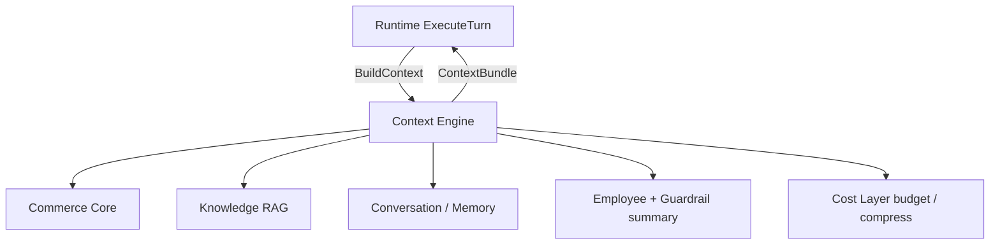
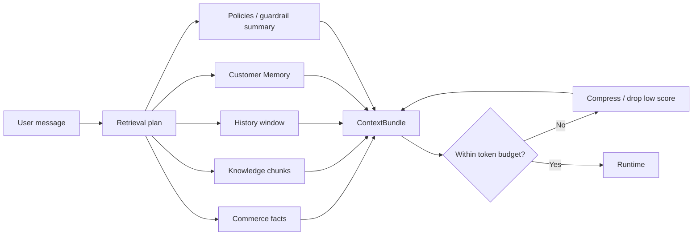
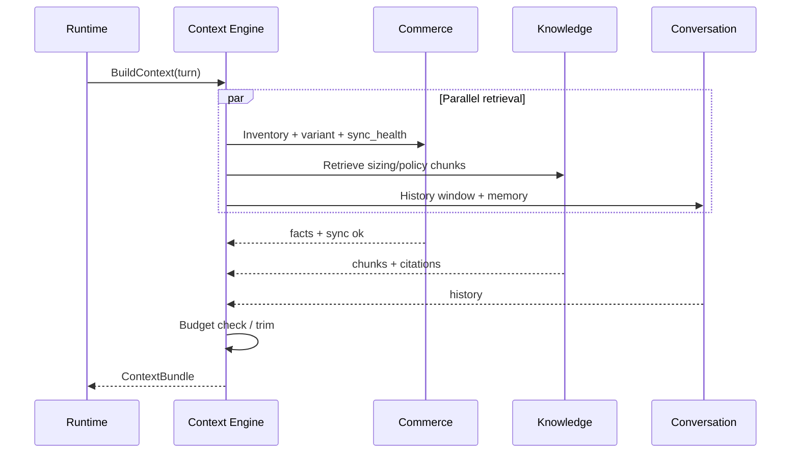
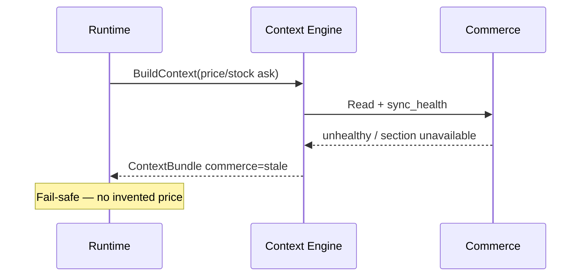
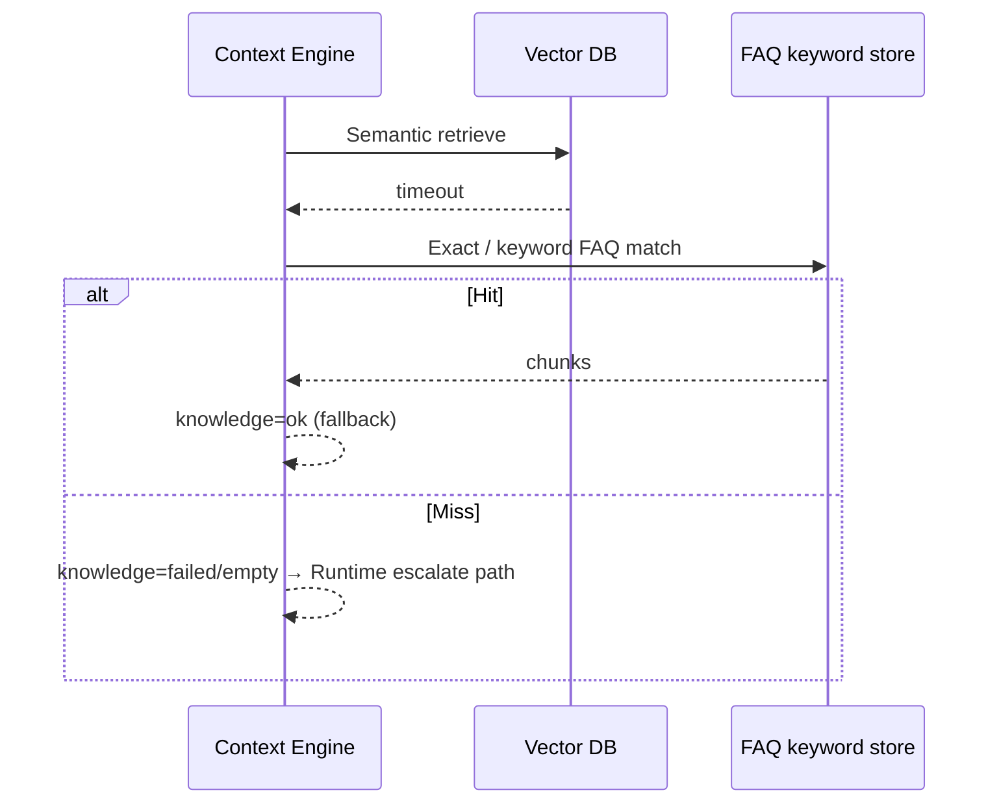

# Context Engine Design

## Metadata

| Field | Value |
|-------|-------|
| **Version** | 0.1 |
| **Status** | Active — per-turn context assembly for Seloma AI |
| **Owner** | Founder / AI Platform / Backend |
| **Last Updated** | July 25, 2026 |
| **Parent Documents** | [System Architecture](./system-architecture.md) · [AI Runtime Architecture](./ai-runtime-architecture.md) · [Backend Architecture](./backend-architecture.md) · [Domain-Driven Design](./domain-driven-design.md) · [Database Design](./database-design.md) |
| **Related Documents** | [Product Principles](../02-product/product-principles.md) · [Product Scope](../02-product/product-scope.md) · [User Journey](../02-product/user-journey.md) · [Glossary](../00-overview/glossary.md) · [AI Gateway Design](./ai-gateway-design.md) |

**Audience:** AI Platform, Backend (`context` module), QA / evaluation, anyone wiring Runtime turns.

**Authority:** Deepens System Architecture §8 and the principle **Context Before Intelligence**. Does not invent OUT-OF-MVP retrieval sources (ads graphs, CRM pipelines, multi-agent memory theaters). Does not own catalog SoR or generation.

If conflict:

```
Product Principles (Context Before Intelligence, Fail safe, Transparent AI)
    ↓
Product Scope / User Journey
    ↓
System Architecture / AI Runtime Architecture
    ↓
This document
```

Knowledge indexing internals deepen in **Knowledge & RAG Design** (next). Context Engine **consumes** Knowledge retrieval APIs; it does not replace Knowledge System.

---

# 1. Purpose

The **Context Engine** assembles everything the AI Sales Employee needs **before generation**:

- Live commerce signals  
- Knowledge retrieval (RAG)  
- Conversation history  
- Memory / Customer Profile continuity  
- Employee constraints (tone, guardrail summary)  

within a strict **context budget** (tokens and latency) ([System Architecture](./system-architecture.md) §8; [Glossary](../00-overview/glossary.md)).

> Context beats clever prompts. Generation without this assembly is out of product philosophy ([User Journey](../02-product/user-journey.md) Stage 8).



---

# 2. Non-Goals

| Context Engine is not | Owner instead |
|----------------------|---------------|
| LLM completion | AI Gateway |
| Skill tool execution (search/recommend/order) | Skill Engine — may run after/with context; Context supplies facts for planning |
| Catalog sync / connectors | Commerce Core + Sync |
| FAQ CRUD / embed pipeline | Knowledge System |
| Channel formatting | Adapters |
| Guardrail hard-stop enforcement | Guardrails module (Context only **summarizes** constraints into the bundle) |
| Sole “need LLM?” decision | Cost Optimization Layer |

---

# 3. When Context Engine Runs

From [AI Runtime Architecture](./ai-runtime-architecture.md) pipeline:

1. Conversation ownership is `ai_active`.  
2. Cost Layer preflight did **not** fully satisfy the turn via cache/rule/template-only path.  
3. Turn **needs intelligence** → Runtime calls `BuildContext(turn)`.

Cost Layer may still skip embedding every turn when classifier/rules suffice ([System Architecture](./system-architecture.md) §8 scaling). Context Engine must not force premium embed+generate when Cost says not needed.

Deterministic / cache hits that never need a bundle still skip Context Engine (Cost path).

---

# 4. Inputs

| Input | Source | Notes |
|-------|--------|-------|
| Turn message | Runtime | Normalized shopper text (+ optional page/cart hints from Website adapter) |
| `tenant_id`, `conversation_id`, `employee_id` | Runtime / Conversation | Verified tenant — fail closed if missing |
| Employee config | Config store | Role, tone, language, enabled Skills |
| Guardrail summary needs | Guardrail config | Caps, blocked topics summary for planning — not enforcement |
| Cost directives | Cost Layer | Token budget, compression preference, retrieval breadth hint |
| Deadline | Runtime | Single retrieval SLO budget |

---

# 5. Output: `ContextBundle` Contract

Typed sections + citations + sync flags + token estimate ([System Architecture](./system-architecture.md) §8; [AI Runtime Architecture](./ai-runtime-architecture.md) §8).

## 5.1 Section schema (logical)

| Section | Contents | Availability |
|---------|----------|--------------|
| `commerce` | Products/variants/price/stock signals, order facts if needed, structured policy fields | Gated by `sync_health` |
| `knowledge` | Ranked chunks + `source_id` / attribution | Tenant-scoped RAG |
| `history` | Recent messages window | Conversation Engine |
| `memory` | Customer Profile continuity snippets when identity resolvable | Memory — prefer no wrong merge |
| `constraints` | Tone/language + guardrail **summary** + Employee role | Config |
| `sync_health` | Per-domain flags: catalog / inventory / orders / policies | Commerce projection |
| `diagnostics` | Retrieval timings, empty flags, cache hits | Audit / Transparent AI |
| `token_estimate` | Estimated tokens of bundle | Budget enforcement |

### Section status flags

Each factual section carries:

| Flag | Meaning |
|------|---------|
| `ok` | Usable for grounded answers |
| `stale` / `unhealthy` | Sync unhealthy — Runtime must not invent facts |
| `empty` | Retrieval returned nothing |
| `failed` | Read timeout/error — Runtime fail-safe |
| `skipped` | Cost/plan decided section not needed for this turn |

## 5.2 Citations

For Transparent AI / audit:

- Knowledge: doc id, chunk id, source attribution label  
- Commerce: product/variant/order ids used as facts  

Runtime passes citation refs into `audit_turns.context_refs` ([Database Design](./database-design.md)).

## 5.3 What must never appear in a bundle

- Storefront OAuth tokens, bot tokens, API keys  
- Raw credential material  
- Unnecessary PII beyond what the turn requires  
- Cross-tenant data  

---

# 6. Assembly Pipeline

Authoritative flow from System Architecture:



### Stages

| Stage | Action |
|-------|--------|
| **1. Plan** | Decide which sections to fetch from message + Cost hints + enabled Skills (e.g. skip orders if no order intent) |
| **2. Parallel fetch** | Commerce + Knowledge + History + Memory under one deadline |
| **3. Merge** | Build typed `ContextBundle` with flags |
| **4. Budget** | If over token budget → compress / drop lowest-relevance first; **keep hard facts (price/stock)** |
| **5. Return** | Bundle + diagnostics to Runtime |

### Parallelism & SLO

- Parallelize commerce + RAG + memory fetches with a **single deadline budget** (Architecture target example: **200–400ms** retrieval SLO — tune in implementation).  
- On partial timeout: mark timed-out sections `failed` / degrade; do not block forever.  
- Cache hot product/policy snippets per tenant with **short TTL keyed by sync version**.

---

# 7. Retrieval Plan (MVP heuristics)

Plan is deterministic enough for tests — not a merchant-facing workflow builder.

| Signal in message / Cost classify | Prefer sections |
|-----------------------------------|-----------------|
| Product / size / stock / price / availability | `commerce` (catalog+inventory+price), optional `knowledge` (sizing FAQ) |
| Shipping / returns / COD / policy FAQ | `knowledge` + `commerce.policies` |
| Order status / tracking | `commerce.orders` (+ identity hints) |
| Ambiguous / multi-hop | Broader commerce + knowledge + history |
| Recommendation / purchase intent | `commerce` inventory/price-aware candidates |
| Follow-up on prior SKU | `history` + `memory` + targeted commerce |

**Always** attach `constraints` (role/tone/guardrail summary) when building a generation-bound bundle.

Avoid embedding every turn when Cost classifier/rules already routed to tools-only or cache ([System Architecture](./system-architecture.md) §8).

---

# 8. Commerce Assembly

### Reads (via Commerce Core APIs — not connectors)

| Need | Data |
|------|------|
| Product Q&A | Title, variant options, price, `in_stock` / quantity signal, URL |
| Recommend | Inventory/price-aware matches — never push what cannot ship |
| Order Lookup support | Order status fields by order number / external id |
| Policies | Shipping / returns / COD structured fields |

### Sync health gate (critical)

| Condition | Bundle behavior | Runtime obligation |
|-----------|-----------------|--------------------|
| Sync unhealthy for product/price/stock domain | Mark `commerce` stale/unhealthy; omit confident facts | Fail-safe: “I don’t know” + escalate — never invent |
| Empty catalog | Visible gap | Do not encourage go-live; factual refuse |
| Commerce read failure | Section `failed` | Fail-safe |

Context Engine **never invents** missing commerce facts; it **exposes gaps** ([System Architecture](./system-architecture.md) §8).

---

# 9. Knowledge (RAG) Assembly

Context Engine calls Knowledge System retrieval (tenant-scoped vector index + filters):

| Step | Behavior |
|------|----------|
| Query | Turn message (+ optional rewrite later — not required to invent MVP rewriter product) |
| Retrieve | Top-k chunks with citations |
| Empty | Flag `knowledge.empty` — Runtime prefers escalate / “I don’t know” for policy asks over inventing policy |
| Vector timeout | Fall back to **keyword / FAQ exact match** if available; else escalate path ([System Architecture](./system-architecture.md) §8 failure modes) |

Deep chunking/embed/index design → **Knowledge & RAG Design**. Context only requires a retrieval API:

`Retrieve(tenant_id, query, filters, top_k) → chunks[] + citations + diagnostics`

---

# 10. History & Memory

| Source | Selection rule |
|--------|----------------|
| **History window** | Recent turns from Conversation Engine; enough for continuity, not full dump |
| **Summaries** | Use `conversation_summaries` when Cost/budget requires compression ([Database Design](./database-design.md)) |
| **Customer Memory** | Profile-linked preferences/prior interests when identity resolvable |
| **Identity uncertainty** | Prefer **no merge** over wrong merge — keep channel-local context ([System Architecture](./system-architecture.md) Conversation) |

Smart Memory selection is a Cost First concern: **not** dumping entire history every turn ([System Architecture](./system-architecture.md) §12; [AI Runtime Architecture](./ai-runtime-architecture.md) §14).

PII: minimize history in bundle when not required for the turn.

---

# 11. Budget & Compression

| Rule | Behavior |
|------|----------|
| Over token budget | Drop lowest-relevance Knowledge chunks first |
| Preserve | Hard commerce facts (price/stock), critical policy snippets, latest user message, guardrail summary |
| Collaboration | Cost Layer may request compression / summary via Gateway small model (`chat.compress`) — Context applies result into bundle |
| Token estimate | Always return estimate for Runtime/Gateway max_tokens planning |

Compression must not “fill gaps” with model-invented catalog facts — only shorten/select existing grounded material.

---

# 12. Runtime Contract After Bundle

From [AI Runtime Architecture](./ai-runtime-architecture.md):

1. If product/price/stock required and sync unhealthy → fail-safe escalate / “I don’t know”.  
2. Never invent missing commerce facts.  
3. Empty Knowledge on policy asks → prefer escalate / “I don’t know”.  
4. Pass citations into audit on grounded answers.  
5. Skills may still call Commerce tools for precise lookups; Context reduces hallucination and guides planning — tools remain source of live reads when Skills execute.

---

# 13. Sequence Diagrams

### A. Grounded product question



### B. Unhealthy sync (factual domain)



### C. Vector timeout with FAQ fallback



---

# 14. Tenant Isolation & Security

| Rule | Requirement |
|------|-------------|
| Every retrieval | `tenant_id` mandatory |
| Vector | Tenant collection or mandatory filter + CI leakage tests |
| Commerce / history | Repository predicates / RLS |
| Secrets | Strip from bundles |
| Cross-tenant | Shop A policy/catalog never in Shop B bundle ([Product Principles](../02-product/product-principles.md)) |

Missing tenant context → **fail closed**.

---

# 15. Observability

| Signal | Examples |
|--------|----------|
| Trace | `context.build` with child spans: `commerce`, `knowledge`, `history`, `memory`, `compress` |
| Latency | Breakdown vs 200–400ms target; deadline budget breaches |
| Counts | Chunk counts, products attached, history messages |
| Quality | Empty-retrieval rate, fallback-to-keyword rate, sync_health flag distribution |
| Cache | Hot snippet hit rate (keyed by sync version) |
| Tokens | `token_estimate` distribution |

Feeds Transparent AI diagnostics and evaluation loops (merchant corrections → better Knowledge — Context should surface what was retrieved).

---

# 16. NestJS Module Shape (`context`)

Aligned with [Backend Architecture](./backend-architecture.md):

```
modules/context/
  context.module.ts
  application/
    build-context.use-case.ts
    retrieval-plan.service.ts
    budget.service.ts
  domain/
    context-bundle.ts
    section-status.ts
  infrastructure/
    commerce-reader.adapter.ts
    knowledge-retriever.adapter.ts
    history-reader.adapter.ts
    memory-reader.adapter.ts
    snippet-cache.redis.ts
```

`context` depends on commerce/knowledge/conversation **read ports** — not on Channel Adapters or provider SDKs.

---

# 17. Failure Modes (summary)

| Failure | Behavior |
|---------|----------|
| Vector DB timeout | Keyword/FAQ exact match if available; else escalate |
| Commerce read failure | Section failed; Runtime fail-safe |
| Over-budget | Drop low-score chunks; keep price/stock hard facts |
| Sync stale for factual ask | Flag unhealthy; Runtime refuse confident facts |
| Empty Knowledge (policy) | Flag empty; Runtime prefer “I don’t know” / escalate |
| Deadline exceeded | Return partial bundle with failed/skipped flags — never hang the turn |
| Identity collision risk | No aggressive merge; channel-local history |

---

# 18. MVP vs Later

| Capability | MVP | Later |
|------------|-----|-------|
| Typed `ContextBundle` + sync flags | Required | |
| Parallel commerce + RAG + history | Required | |
| Budget trim preserving hard facts | Required | |
| Keyword fallback on vector timeout | Required | |
| Hot snippet cache by sync version | Required | |
| Smart memory (not full dump) | Required | Stronger multi-channel Memory (Growth) |
| Query rewrite / multi-hop planners | Optional light | Deeper retrieval quality (V1 AI quality) |
| Cross-Employee shared context | No | Platform multi-Employee |

---

# 19. Testing Obligations

| Test | Intent |
|------|--------|
| Isolation | Tenant A retrieval never returns Tenant B chunks/products |
| Sync gate | Unhealthy sync → commerce section not `ok` |
| Budget | Over-limit drops FAQ fluff before price/stock |
| Empty policy RAG | Bundle flags empty — no invented policy text injected by Context |
| Deadline | Partial failure flags set; no infinite wait |
| Citations | Chunk/product ids present for audit |
| No secrets | Bundle scrubber rejects token-like fields |

Hallucination / groundedness evals sit in Testing Strategy; Context must expose diagnostics and citations those tests need.

---

# 20. Related Documents

| Document | Relationship |
|----------|--------------|
| [System Architecture §8](./system-architecture.md) | Parent |
| [AI Runtime Architecture](./ai-runtime-architecture.md) | Consumer of `ContextBundle` |
| [AI Gateway Design](./ai-gateway-design.md) | Optional compress `Complete`; embeds owned by Knowledge path |
| [Knowledge & RAG Design](./knowledge-rag-design.md) | Index + retrieve implementation |
| [Conversation Engine Design](./conversation-engine-design.md) | History/ownership deep dive |
| [Database Design](./database-design.md) | Tables behind readers |

---

# Summary

The Context Engine is Seloma’s **Context Before Intelligence** machinery: a tenant-scoped, deadline-bounded assembler that produces a typed **`ContextBundle`** — commerce, Knowledge, history, Memory, constraints, sync flags, citations — without inventing facts or calling LLM providers for truth. Runtime fails safe on gaps; Gateway only generates after context exists when intelligence is required.

---

*Context Engine Design v0.1. Changes require version bump and written rationale. Product Principles, System Architecture, and AI Runtime Architecture override Context enthusiasm when they conflict.*
