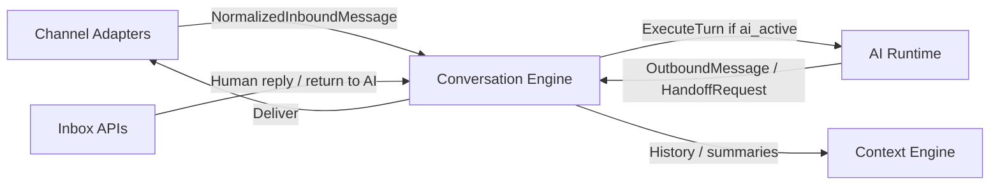
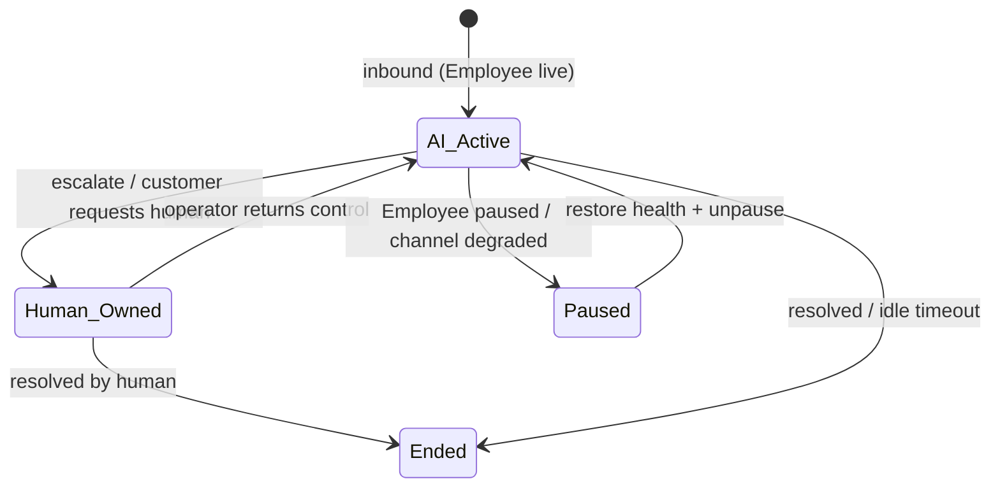
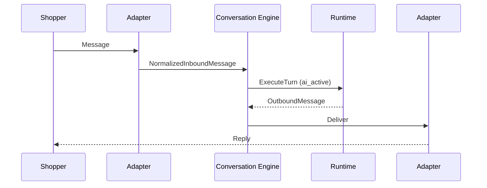
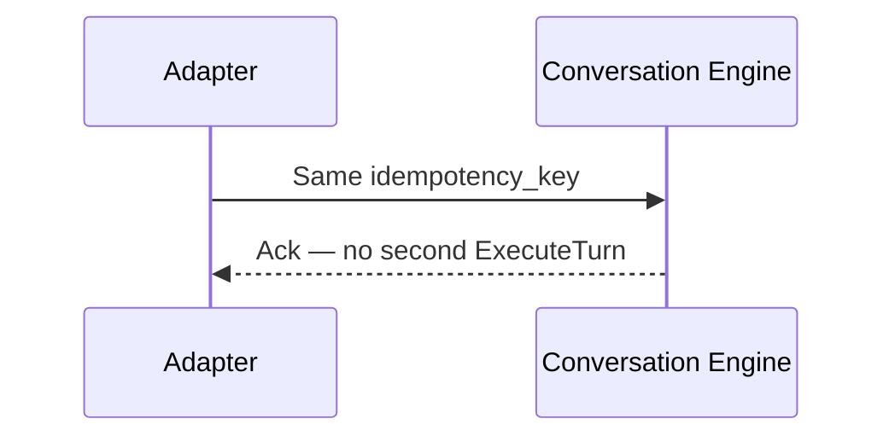

# Conversation Engine Design

## Metadata

| Field | Value |
|-------|-------|
| **Version** | 0.1 |
| **Status** | Active — conversation threads as commerce events for Seloma AI MVP |
| **Owner** | Founder / Backend / Frontend (Inbox) |
| **Last Updated** | July 25, 2026 |
| **Parent Documents** | [System Architecture](./system-architecture.md) · [AI Runtime Architecture](./ai-runtime-architecture.md) · [Domain-Driven Design](./domain-driven-design.md) · [Database Design](./database-design.md) · [Backend Architecture](./backend-architecture.md) |
| **Related Documents** | [Product Principles](../02-product/product-principles.md) · [Product Scope](../02-product/product-scope.md) · [User Journey](../02-product/user-journey.md) · [Glossary](../00-overview/glossary.md) · [Context Engine Design](./context-engine-design.md) · [Frontend Architecture](./frontend-architecture.md) · [Pricing Strategy](../01-business/pricing-strategy.md) |

**Audience:** Backend (`conversation`, `inbox`, `memory`, `handoff`, adapters), Frontend Inbox, AI Runtime (ExecuteTurn gating), QA.

**Authority:** Deepens System Architecture §10 and DDD Conversation context. Conversations are **commerce events**, not helpdesk tickets. No CRM pipelines, SLA engines, or channel-forked business rules.

If conflict:

```
Product Scope / Principles (One Brain, Humans Control, Conversations ≠ tickets)
    ↓
User Journey (Stages 7–9)
    ↓
System Architecture / AI Runtime Architecture
    ↓
Database Design
    ↓
This document
```

---

# 1. Purpose

The **Conversation Engine** owns shopper–business threads as **commerce events**:

1. Idempotent ingest of normalized inbound messages  
2. Persistence and ordering of messages  
3. **Ownership** state: AI vs human vs paused  
4. Cross-channel continuity when identity is resolvable  
5. History / summary windows for Context Engine / Memory  
6. Delivery of outbound messages to the correct Channel Adapter  
7. Lifecycle events for analytics and notifications  

([System Architecture](./system-architecture.md) §10; [Glossary](../00-overview/glossary.md) — Conversation)



---

# 2. Non-Goals

| Conversation Engine is not | Owner instead |
|----------------------------|---------------|
| Skill / pricing / Knowledge rules | Runtime / Commerce / Knowledge |
| Catalog truth | Commerce Core |
| Ticket queue / SLA / CRM pipeline SoR | OUT OF MVP / wrong identity |
| Channel-specific business forks | Forbidden — adapters only format |
| LLM generation | AI Gateway via Runtime |
| Disabling handoff for vanity automation | Trust anti-pattern — never |

Inbox is a **view/API over** conversations + handoffs + messages — not a Zendesk clone ([Database Design](./database-design.md); [Product Scope](../02-product/product-scope.md)).

---

# 3. Core Contracts

## 3.1 `NormalizedInboundMessage`

Produced by Channel Adapters ([System Architecture](./system-architecture.md) §11):

| Field (logical) | Meaning |
|-----------------|---------|
| `tenant_id` | From **ChannelBinding lookup** — never trust body alone |
| `channel_type` | `website` \| `telegram` \| `bale` |
| `channel_binding_id` | |
| `external_user_id` | Channel-native shopper id |
| `idempotency_key` | Webhook delivery key — unique per tenant |
| `text` / media refs | Content |
| `channel_message_id` | Optional external id |
| `page_cart_hints` | Website only — optional context hints, not policy |

**No business rules** embedded in the normalized message.

## 3.2 `OutboundMessage`

Channel-agnostic from Runtime or human operator:

| Field (logical) | Meaning |
|-----------------|---------|
| `conversation_id`, `tenant_id` | |
| `text` | |
| `payload` | Optional product cards/links metadata |
| `sender_type` | `ai` \| `human` \| `system` |

Adapters render to channel-specific APIs.

## 3.3 `HandoffRequest`

From Runtime Escalate path ([AI Runtime Architecture](./ai-runtime-architecture.md); [User Journey](../02-product/user-journey.md) Stage 9):

| Field | Meaning |
|-------|---------|
| `reason` | low_confidence / policy / customer_request / sync_fail / mutation_block / … |
| `context_packet` | Summary, customer identifiers if known, recent messages, relevant order/product facts, escalation reason |

Conversation Engine applies ownership → `human_owned`, persists `handoffs` row, notifies Inbox / notify jobs.

---

# 4. Aggregates & Persistence

Aligned with [Database Design](./database-design.md) §5.6 and [DDD](./domain-driven-design.md) §4.7:

| Entity | Role |
|--------|------|
| **Conversation** | Aggregate root — thread, ownership, channel binding, employee, optional customer_profile |
| **Message** | Ordered messages; delivery status; idempotency_key |
| **CustomerProfile** | Cross-channel shopper record when linkable |
| **CustomerChannelIdentity** | `(tenant, channel_type, external_user_id)` → profile |
| **ConversationSummary** | Compression aid for Context / Cost |
| **Handoff** | Open escalation with context packet |

### Conversation fields (logical)

| Field | Notes |
|-------|-------|
| `ownership` | `ai_active` \| `human_owned` \| `paused` \| `ended` |
| `employee_id` | Sales Employee serving thread |
| `channel_binding_id` / `channel_type` | Surface |
| `customer_profile_id` | Nullable |
| `last_message_at` | Idle timeout + metering window |
| `started_at` / `ended_at` | Lifecycle |

### Message fields (logical)

| Field | Notes |
|-------|-------|
| `direction` | inbound / outbound |
| `sender_type` | shopper / ai / human / system |
| `body` | Encrypted at rest |
| `delivery_status` | pending / delivered / delivery_failed |
| `idempotency_key` | Unique `(tenant_id, idempotency_key)` |

---

# 5. Ownership State Machine

Authoritative diagram ([System Architecture](./system-architecture.md) §10):



| Transition | Trigger | Side effects |
|------------|---------|--------------|
| → `human_owned` | Runtime `HandoffRequest` or explicit customer request for human | Create/open `handoffs`; pause AI; emit `conversation.escalated`; notify |
| → `ai_active` (from human) | Operator **return to AI** | Close handoff as returned; resume with memory intact — must not pretend handoff never happened |
| → `paused` | Employee paused / channel degraded | Skip ExecuteTurn until restored |
| → `ended` | Resolved / idle timeout | Emit `conversation.ended`; attribution window may start |

**Invariant:** If ownership ≠ `ai_active`, **Skip Runtime** — inbound goes to Inbox only ([AI Runtime Architecture](./ai-runtime-architecture.md)).

Automation rate must **never** be inflated by disabling handoff ([Product Principles](../02-product/product-principles.md); User Journey Stage 9).

---

# 6. Inbound Path (Idempotent)

```mermaid
sequenceDiagram
    participant AD as Adapter
    participant CE as Conversation Engine
    participant PG as Postgres
    participant Q as interactive.turns
    participant RT as Runtime

    AD->>CE: NormalizedInboundMessage
    CE->>PG: Resolve ChannelBinding → tenant_id
    CE->>PG: Upsert Message by idempotency_key
    alt Duplicate key
        CE-->>AD: Ack (no second ExecuteTurn)
    else New message
        CE->>PG: Ensure Conversation; set last_message_at
        CE->>CE: Emit conversation.started/message
        alt ownership = ai_active
            CE->>Q: Enqueue ExecuteTurn job
            Q->>RT: Worker picks up
        else human_owned / paused
            CE->>CE: Inbox only — skip Runtime
        end
    end
```

### Rules

1. **Idempotency key** prevents double Runtime execution on webhook retries.  
2. Tenant from binding lookup — fail closed if unbound.  
3. Turn lock Redis `t:{tenant_id}:turnlock:{conversation_id}` prevents concurrent double replies ([Backend Architecture](./backend-architecture.md); Database Design).  
4. Hot thread cache: `t:{tenant_id}:conv:hot:{conversation_id}` optional for active threads.

---

# 7. ExecuteTurn Gating

Conversation Engine requests Runtime when **all** hold ([AI Runtime Architecture](./ai-runtime-architecture.md) §5):

1. Inbound persisted and idempotency accepted  
2. Ownership is `ai_active`  
3. Employee is live for that channel binding  
4. Not `paused` / `ended`

Runtime returns:

- `OutboundMessage` → persist outbound message → adapter deliver  
- `HandoffRequest` → ownership flip + handoff row + notify  

Critical turns remain **request/response** (via queue worker); events notify side effects only.

---

# 8. Outbound Delivery

| Step | Behavior |
|------|----------|
| Persist outbound message | `delivery_status=pending` |
| Call adapter | Channel-specific send |
| Success | `delivered` |
| Failure | Retry with backoff; mark `delivery_failed`; alert ([System Architecture](./system-architecture.md) §10) |

Human replies from Inbox follow the same outbound path with `sender_type=human` while ownership is `human_owned`.

---

# 9. Human Handoff & Inbox

### Collaboration split ([DDD](./domain-driven-design.md))

| Concern | Owner |
|---------|-------|
| Decide Escalate + build context packet | **Runtime** |
| Ownership pause/resume, handoff persistence, Inbox surfacing | **Conversation Engine** |
| Operator UX | **Workspace Frontend** via Inbox APIs |

### Context packet (must include)

- Summary  
- Customer identifiers if known  
- Recent messages  
- Relevant order/product facts  
- Escalation reason  

### Inbox APIs (logical)

| Action | Effect |
|--------|--------|
| List threads | Filter by ownership, channel, recency |
| Get thread | Messages + handoff packet + audit refs |
| Take over | Ensure `human_owned` (if not already) |
| Reply | Outbound human message → adapter |
| Return to AI | `human_owned` → `ai_active`; handoff closed/returned |

V1 may add filters, tags, assignment, canned replies ([Product Scope](../02-product/product-scope.md) V1) — **not** MVP blockers; do not build full helpdesk SLA engine.

---

# 10. Customer Profile & Cross-Channel Continuity

| Rule | Behavior |
|------|----------|
| Link when resolvable | Map `customer_channel_identities` → `customer_profiles` |
| Collision risk | Prefer **no merge** over wrong merge; keep channel-local context |
| Omnichannel Memory | Same Employee brain; history continuity when linked ([Product Principles](../02-product/product-principles.md) — One Brain) |
| Unlinked | Channel-local conversation still works |

Memory selection for Context is **smart** (not full dump) — Conversation Engine provides history windows + summaries ([Context Engine Design](./context-engine-design.md)).

---

# 11. History & Summaries for Context

| API (logical) | Consumer |
|---------------|----------|
| Recent message window | Context Engine `history` section |
| Conversation summary up to message id | Cost compression / Memory |
| Profile memory snippets | Context `memory` section when linked |

Conversation Engine does not invent commerce facts; it only supplies dialogue continuity.

---

# 12. Domain Events

| Event | When | Consumers |
|-------|------|-----------|
| `conversation.started` | First message / thread create | Analytics |
| `conversation.message` | Each message | Analytics |
| `conversation.escalated` | Handoff opened | Inbox notify, metrics |
| `conversation.ended` | Close / idle timeout | Attribution window |

Emit via outbox; consumers idempotent ([System Architecture](./system-architecture.md) §13).

### Metering hook

Pricing defines an **AI Conversation** meter (rolling inactivity window, e.g. 24h — exact window implementation decision) ([Pricing Strategy](../01-business/pricing-strategy.md)). Conversation Engine / usage hooks may emit `usage_events` when an AI grounded reply counts — full Billing is V1.

---

# 13. Adapters Relationship

MVP adapters: Website, Telegram, Bale ([System Architecture](./system-architecture.md) §11).

| Adapters do | Adapters must not |
|-------------|-------------------|
| Verify signatures / tokens | Own Skills, Knowledge, discount rules |
| Normalize inbound | Fork escalation policy |
| Render outbound | Reinterpret business rules |
| Report channel health | Become broadcast/campaign tools |

Website widget is a Conversation API client ([Frontend Architecture](./frontend-architecture.md); Backend guidance).

Channel degraded → Conversation may move to `paused` for that binding’s threads as product rules dictate; other channels keep same brain.

---

# 14. Scaling, Retention, Security

| Topic | Rule |
|-------|------|
| Partition | By `tenant_id` as scale requires |
| Hot cache | Redis active threads |
| Cold | Archive per retention policy |
| Encryption | In transit; message bodies at rest |
| AuthZ | Inbox reads/writes Workspace-scoped |
| PII | Retention/deletion per privacy policy |
| Observability | Ingest lag, delivery success, handoff count, cross-channel link rate, idle counts |

---

# 15. Sequence Diagrams

### A. Happy path AI reply



### B. Human-owned skip Runtime

```mermaid
sequenceDiagram
    participant AD as Adapter
    participant CE as Conversation Engine
    participant IN as Inbox

    AD->>CE: Inbound (ownership=human_owned)
    CE->>CE: Persist message; skip ExecuteTurn
    CE->>IN: Surface for operator
```

### C. Escalate → human → return to AI

```mermaid
sequenceDiagram
    participant RT as Runtime
    participant CE as Conversation Engine
    participant IN as Inbox
    participant OP as Operator
    participant AD as Adapter

    RT->>CE: HandoffRequest + packet
    CE->>CE: ownership=human_owned; handoffs row
    CE->>IN: Notify
    OP->>IN: Reply
    IN->>CE: Human OutboundMessage
    CE->>AD: Deliver
    OP->>IN: Return to AI
    IN->>CE: ownership=ai_active
    Note over CE: Memory/history intact
```

### D. Duplicate webhook



---

# 16. NestJS Module Shape

Aligned with [Backend Architecture](./backend-architecture.md):

```
modules/conversation/
  conversation.module.ts
  application/
    ingest-inbound.use-case.ts
    enqueue-turn.use-case.ts
    apply-outbound.use-case.ts
    apply-handoff.use-case.ts
    return-to-ai.use-case.ts
    history-window.query.ts
  domain/
    ownership.ts
    conversation.ts
  infrastructure/
    conversation.repository.ts
    message.repository.ts
    hot-cache.redis.ts
    turn-lock.redis.ts

modules/inbox/
  # Operator-facing APIs over conversation/handoff

modules/handoff/
  # Handoff persistence helpers / notify trigger

modules/memory/
  # Summaries + profile continuity helpers

modules/adapters/{website,telegram,bale}/
  # Normalize + deliver only
```

---

# 17. MVP vs Later

| Capability | MVP | Later |
|------------|-----|-------|
| Idempotent ingest + ownership machine | Required | |
| ExecuteTurn gating | Required | |
| Handoff packet + Inbox takeover/return | Required | |
| Three-channel unified inbox | Required | |
| Profile link when resolvable (no wrong merge) | Required | Stronger identity (Growth) |
| Summaries for compression | Required | |
| Assignment / tags / canned replies | Optional polish → V1 | |
| Helpdesk SLA engine | Forbidden as center | Never as product identity |
| Instagram/WhatsApp threads | No | Growth adapters only |

---

# 18. Testing Obligations

| Test | Intent |
|------|--------|
| Idempotency | Duplicate webhook → single message + single turn |
| Ownership gate | `human_owned` never calls Runtime |
| Handoff resume | Return to AI keeps history; no “amnesia” |
| Isolation | Tenant A cannot read Tenant B threads |
| Delivery failure | Status `delivery_failed` + retry behavior |
| Identity | Ambiguous merge refused — channel-local retained |
| Turn lock | Concurrent jobs do not double-reply |

---

# 19. Related Documents

| Document | Relationship |
|----------|--------------|
| [System Architecture §10–11](./system-architecture.md) | Parent + adapters |
| [AI Runtime Architecture](./ai-runtime-architecture.md) | ExecuteTurn consumer |
| [Context Engine Design](./context-engine-design.md) | History/memory reader |
| [Database Design](./database-design.md) | Tables |
| [Frontend Architecture](./frontend-architecture.md) | Inbox / widget |
| [Backend Architecture](./backend-architecture.md) | Queues / modules |
| [API Specification](./api-specification.md) | HTTP/webhook contracts |

---

# Summary

The Conversation Engine is Seloma’s **thread SoR for commerce conversations**: idempotent ingest, ownership (`ai_active` / `human_owned` / `paused` / `ended`), safe handoff with context packets, history for Context, and thin adapter delivery — **never** a ticket product, **never** a place for Skills or catalog truth, **never** a reason to hide escalations.

---

*Conversation Engine Design v0.1. Changes require version bump and written rationale. Product Scope, System Architecture, AI Runtime Architecture, and Database Design override Conversation enthusiasm when they conflict.*
