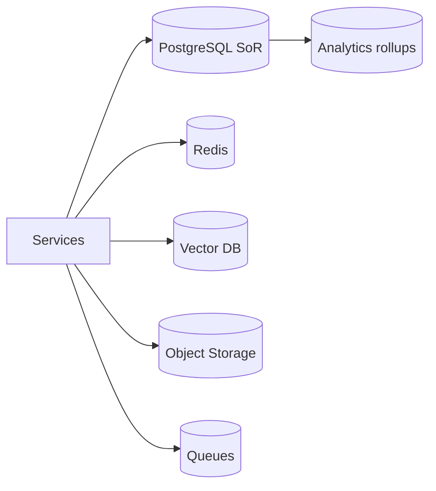
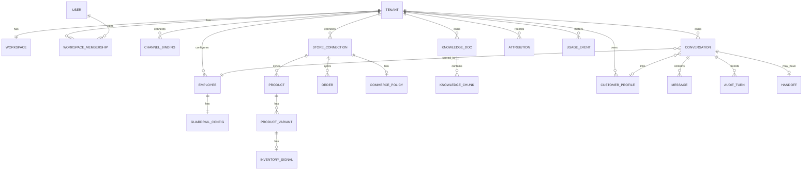

# Database Design

## Metadata

| Field | Value |
|-------|-------|
| **Version** | 0.1 |
| **Status** | Active — logical data model for DeloRey AI MVP |
| **Owner** | Founder / Backend / Data |
| **Last Updated** | July 25, 2026 |
| **Parent Documents** | [Domain-Driven Design](./domain-driven-design.md) · [System Architecture](./system-architecture.md) · [AI Runtime Architecture](./ai-runtime-architecture.md) |
| **Related Documents** | [Glossary](../00-overview/glossary.md) · [Product Scope](../02-product/product-scope.md) · [Product Principles](../02-product/product-principles.md) · [User Journey](../02-product/user-journey.md) · [Pricing Strategy](../01-business/pricing-strategy.md) |

**Audience:** Backend, Database, DevOps, AI Platform (retrieval stores), Security.

**Authority:** Tables and stores implement Bounded Contexts and System Architecture Data Architecture. Do not invent entities for OUT-OF-MVP products (CRM, helpdesk tickets, flow builders, Skill Marketplace, multi-brand hierarchy, full Billing SoR as MVP blocker).

If conflict:

```
Product Scope / Principles
    ↓
System Architecture (Data + Multi-Tenant)
    ↓
Domain-Driven Design
    ↓
This document
```

Physical DDL (exact types, migration tool) is an implementation detail; this document is the **logical contract**. Backend repositories must honor tenant isolation and indexes below.

---

# 1. Purpose

Translate DeloRey’s domain into durable stores so that:

1. **PostgreSQL** is the system of record for tenants, users, employees, conversations, messages, commerce entities, audit metadata, attributions ([System Architecture](./system-architecture.md) §14).  
2. **Redis**, **Vector DB**, **Object Storage**, **Queues**, and **Analytics** follow the isolation matrix (§15).  
3. Every merchant fact is **tenant-scoped**; missing `tenant_id` → fail closed.  
4. Conversations remain **commerce events**, not tickets.  
5. Catalog/Orders live under **Commerce**, not as Runtime-owned SoR.

---

# 2. Store Topology

| Store | Role | Tenancy mechanism |
|-------|------|-------------------|
| **PostgreSQL** | SoR: identity, workspace, employee, channels, commerce, knowledge metadata, conversations, audit, attribution | `tenant_id` on all merchant rows; **RLS or equivalent** + repository predicates; CI isolation tests |
| **Redis** | Sessions, rate limits, turn locks, hot conversation cache, response/semantic cache keys, circuit breakers, sync cursors/locks | Key prefix `t:{tenant_id}:` — no unscoped merchant keys |
| **Vector DB** | Knowledge embeddings for RAG | Per-tenant collection **or** mandatory tenant filter + leakage tests |
| **Object Storage** | Uploaded Knowledge docs, export artifacts, media refs | Prefix `tenants/{tenant_id}/` + IAM |
| **Queue** | Sync, embed, reindex, notify; interactive vs batch separation | Job payload **must** include `tenant_id`; worker validates |
| **Analytics store** | Aggregates / rollups (may start as Postgres + materialized views) | Tenant-scoped only |



---

# 3. Global Data Rules

| Rule | Requirement |
|------|-------------|
| **Tenant column** | Every merchant-owned table includes `tenant_id` (UUID/FK to `tenants`) — non-null |
| **Fail closed** | Queries/jobs/caches without tenant context are bugs → reject / dead-letter |
| **Primary keys** | Opaque UUIDs (or ULID) for internal ids |
| **External ids** | Storefront/channel external ids unique **per tenant** (composite unique) for idempotent upserts |
| **Timestamps** | `created_at`, `updated_at` on mutable SoR rows |
| **Soft vs hard delete** | Prefer soft-delete/archive for conversations where audit needs continuity; hard-delete only with retention policy |
| **Secrets** | Bot tokens, OAuth tokens in secrets manager and/or **encrypted columns** — never in prompts, logs, or audit payloads |
| **PII** | Minimize; encrypt message bodies at rest; retention limits ([System Architecture](./system-architecture.md) Security) |
| **No ticket SoR** | Do not add `tickets`, `pipelines`, `crm_deals` tables for MVP |
| **Billing** | Full subscription schema is **V1**; MVP may persist usage signals only (§12) |

---

# 4. ER Overview

Aligned with System Architecture + DDD aggregates:



---

# 5. PostgreSQL Logical Schema

Column lists are **logical** — types illustrative (`uuid`, `text`, `timestamptz`, `jsonb`, `boolean`, `numeric`). Implementers choose concrete Postgres types without changing meaning.

## 5.1 Identity & Tenant / Workspace

### `tenants`

| Column | Notes |
|--------|-------|
| `id` | PK |
| `status` | active / suspended (ops) |
| `created_at` | |

Isolation root. Provisioning creates tenant + workspace + default Sales Employee skeleton (inactive) + empty KB namespace + quota defaults ([System Architecture](./system-architecture.md) §15).

### `users`

| Column | Notes |
|--------|-------|
| `id` | PK |
| `email` | Unique (global login identity) |
| `password_hash` | Or external auth provider ref — never plaintext |
| `created_at`, `updated_at` | |

Users are people; tenancy is via membership (a user may later join multiple workspaces — MVP can still be 1:1 in practice).

### `workspaces`

| Column | Notes |
|--------|-------|
| `id` | PK |
| `tenant_id` | Unique (MVP **1:1** Tenant↔Workspace) |
| `name` | Merchant-facing |
| `created_at`, `updated_at` | |

### `workspace_memberships`

| Column | Notes |
|--------|-------|
| `id` | PK |
| `tenant_id` | Denormalized for RLS |
| `workspace_id` | FK |
| `user_id` | FK |
| `role` | Workspace-scoped AuthZ (least privilege) |
| `created_at` | |

**Indexes:** `(tenant_id)`, unique `(workspace_id, user_id)`, `(user_id)`.

---

## 5.2 Employee & Settings

### `employees`

| Column | Notes |
|--------|-------|
| `id` | PK |
| `tenant_id` | FK, required |
| `role` | MVP: `sales` |
| `name` | Display |
| `tone` | Config |
| `language` | Iran/Persian quality bar for MVP |
| `enabled_skills` | jsonb/array ⊆ {product_search, recommend, order_status, escalate} |
| `status` | `inactive` until sync + channel; then active/paused |
| `created_at`, `updated_at` | |

**Indexes:** `(tenant_id)`, `(tenant_id, status)`.

### `guardrail_configs`

| Column | Notes |
|--------|-------|
| `id` | PK |
| `tenant_id` | |
| `employee_id` | Unique per employee (1:1) |
| `blocked_topics` | jsonb/text[] |
| `discount_cap_percent` | numeric — above cap → human approval |
| `restricted_mutations` | jsonb — MVP: block unguarded refund/cancel |
| `escalation_rules` | jsonb — confidence/policy/customer-request/business-hours |
| `updated_at` | |

Emitting `employee.updated` on change busts Runtime config cache.

---

## 5.3 Channels

### `channel_bindings`

| Column | Notes |
|--------|-------|
| `id` | PK |
| `tenant_id` | |
| `employee_id` | Which Employee serves this binding |
| `channel_type` | `website` \| `telegram` \| `bale` only for MVP |
| `status` | connected / degraded / disconnected |
| `credentials_ref` | Secrets manager id or encrypted payload ref |
| `config` | jsonb — e.g. widget origin allowlist, bot username |
| `health_detail` | last error / checked_at |
| `created_at`, `updated_at` | |

**Indexes:** `(tenant_id)`, unique `(tenant_id, channel_type)` if one binding per channel type per tenant in MVP, `(status)`.

**Non-goal tables:** do not add Instagram/WhatsApp/email channel types in MVP migrations.

---

## 5.4 Commerce

### `store_connections`

| Column | Notes |
|--------|-------|
| `id` | PK |
| `tenant_id` | |
| `platform` | `shopify` \| `woocommerce` (equivalent path) |
| `external_shop_id` | |
| `credentials_ref` | Encrypted / secrets manager |
| `status` | healthy / unhealthy / disconnected |
| `created_at`, `updated_at` | |

**Indexes:** `(tenant_id)`, unique `(tenant_id, platform, external_shop_id)`.

### `sync_health`

Projection of sync state (may be columns on `store_connections` **or** separate table — one row per connection/domain).

| Column | Notes |
|--------|-------|
| `id` | PK |
| `tenant_id` | |
| `store_connection_id` | |
| `domain` | e.g. `catalog` \| `inventory` \| `orders` \| `policies` |
| `last_success_at` | |
| `lag_seconds` | |
| `last_failure_reason` | |
| `updated_at` | |

**Indexes:** unique `(store_connection_id, domain)`, `(tenant_id)`.

Runtime factual gates read this — user-visible in Workspace.

### `products`

| Column | Notes |
|--------|-------|
| `id` | PK |
| `tenant_id` | |
| `store_connection_id` | |
| `external_id` | Storefront product id |
| `title` | |
| `description` | Optional synced text |
| `url` | Product/link for cards |
| `status` | active/archived |
| `raw_attrs` | jsonb — non-core synced fields |
| `synced_at` | |
| `created_at`, `updated_at` | |

**Indexes:** unique `(tenant_id, store_connection_id, external_id)`, `(tenant_id, title)` or search index strategy for product search Skill, `(tenant_id, status)`.

### `product_variants`

| Column | Notes |
|--------|-------|
| `id` | PK |
| `tenant_id` | |
| `product_id` | FK |
| `external_id` | |
| `sku` | |
| `options` | jsonb — size/color/etc. |
| `price_amount` | numeric |
| `currency` | |
| `synced_at` | |

**Indexes:** unique `(tenant_id, store_connection_id, external_id)` via product join or denormalize `store_connection_id`, `(tenant_id, sku)`.

### `inventory_signals`

| Column | Notes |
|--------|-------|
| `id` | PK |
| `tenant_id` | |
| `variant_id` | FK unique |
| `in_stock` | boolean / quantity signal |
| `quantity` | nullable if only flags available |
| `synced_at` | |

Respect inventory — do not recommend what cannot ship when signal says out of stock.

### `commerce_policies`

Structured policy fields from storefront ([Product Scope](../02-product/product-scope.md) / Commerce Core).

| Column | Notes |
|--------|-------|
| `id` | PK |
| `tenant_id` | |
| `store_connection_id` | Unique per connection |
| `shipping` | jsonb/text fields |
| `returns` | |
| `cod` | |
| `synced_at` | |

Seeds Context / Knowledge — not a substitute for merchant FAQ overrides.

### `orders`

| Column | Notes |
|--------|-------|
| `id` | PK |
| `tenant_id` | |
| `store_connection_id` | |
| `external_id` | |
| `order_number` | Merchant-facing lookup key when used |
| `status` | Normalized status fields for Order Lookup Skill |
| `customer_external_id` | Optional link hint |
| `payload` | jsonb — additional status fields |
| `synced_at` | |
| `updated_at` | |

**Indexes:** unique `(tenant_id, store_connection_id, external_id)`, `(tenant_id, order_number)`, `(tenant_id, customer_external_id)`.

**MVP mutation rule:** schema may store status; Runtime/Skills must not expose unguarded refund/cancel writes.

### Commerce idempotency

Sync workers: **idempotent upserts by external id** per tenant; webhook storms debounced via queue ([System Architecture](./system-architecture.md) §7).

---

## 5.5 Knowledge

### `knowledge_docs`

| Column | Notes |
|--------|-------|
| `id` | PK |
| `tenant_id` | |
| `doc_type` | `faq` \| `policy_override` \| `upload` |
| `title` | |
| `body_text` | Canonical text (for FAQ/override) |
| `source_attribution` | Merchant-visible source label |
| `object_key` | Object Storage key for uploads (`tenants/{id}/...`) |
| `status` | active / indexing / failed |
| `created_at`, `updated_at` | |

**Indexes:** `(tenant_id, doc_type)`, `(tenant_id, updated_at)`.

### `knowledge_chunks`

| Column | Notes |
|--------|-------|
| `id` | PK |
| `tenant_id` | |
| `knowledge_doc_id` | FK |
| `ordinal` | Chunk order |
| `content` | Chunk text |
| `embedding_ref` | Vector DB point id / collection key |
| `created_at` | |

Embeddings are **rebuildable** from canonical docs. Vector payload must include `tenant_id` + `knowledge_doc_id` + `chunk_id`.

**Indexes:** `(tenant_id, knowledge_doc_id)`, `(embedding_ref)`.

---

## 5.6 Conversation, Memory, Handoff

### `customer_profiles`

| Column | Notes |
|--------|-------|
| `id` | PK |
| `tenant_id` | |
| `display_name` | Optional |
| `merged_from` | Avoid wrong merges — prefer no merge |
| `created_at`, `updated_at` | |

### `customer_channel_identities`

Links shopper ids per channel without forcing bad merges.

| Column | Notes |
|--------|-------|
| `id` | PK |
| `tenant_id` | |
| `customer_profile_id` | FK nullable until linked |
| `channel_type` | website / telegram / bale |
| `external_user_id` | Channel-native id |
| `created_at` | |

**Indexes:** unique `(tenant_id, channel_type, external_user_id)`, `(customer_profile_id)`.

### `conversations`

| Column | Notes |
|--------|-------|
| `id` | PK |
| `tenant_id` | |
| `employee_id` | |
| `channel_binding_id` | |
| `channel_type` | Denormalized for analytics |
| `customer_profile_id` | Nullable |
| `ownership` | `ai_active` \| `human_owned` \| `paused` \| `ended` |
| `started_at`, `ended_at` | |
| `last_message_at` | For idle timeout / metering window |
| `created_at`, `updated_at` | |

**Indexes:** `(tenant_id, last_message_at DESC)`, `(tenant_id, ownership)`, `(tenant_id, channel_type)`, `(customer_profile_id)`, `(employee_id)`.

Partition strategy: partition or shard **by `tenant_id`** as scale requires ([System Architecture](./system-architecture.md) Conversation scaling).

### `messages`

| Column | Notes |
|--------|-------|
| `id` | PK |
| `tenant_id` | |
| `conversation_id` | FK |
| `direction` | inbound / outbound |
| `sender_type` | shopper / ai / human / system |
| `body` | Encrypted at rest |
| `payload` | jsonb — product cards/links metadata |
| `delivery_status` | pending / delivered / delivery_failed |
| `idempotency_key` | Unique per tenant — webhook retries |
| `channel_message_id` | Optional external id |
| `created_at` | |

**Indexes:** unique `(tenant_id, idempotency_key)`, `(conversation_id, created_at)`, `(tenant_id, created_at)`.

### `conversation_summaries` (Memory support)

Optional table for Cost Layer / Context compression.

| Column | Notes |
|--------|-------|
| `id` | PK |
| `tenant_id` | |
| `conversation_id` | |
| `summary_text` | |
| `up_to_message_id` | |
| `updated_at` | |

### `handoffs`

| Column | Notes |
|--------|-------|
| `id` | PK |
| `tenant_id` | |
| `conversation_id` | |
| `reason` | low_confidence / policy / customer_request / sync_fail / mutation_block / … |
| `context_packet` | jsonb — summary, identifiers, recent messages refs, order/product facts, reason |
| `status` | open / resolved / returned_to_ai |
| `opened_at`, `closed_at` | |
| `assigned_user_id` | Nullable (V1 assignment polish) |

**Indexes:** `(tenant_id, status, opened_at DESC)`, `(conversation_id)`.

Inbox is a **view/API over** `conversations` + `handoffs` + `messages` — not a Zendesk ticket table.

---

## 5.7 Audit & Analytics

### `audit_turns`

| Column | Notes |
|--------|-------|
| `id` | PK |
| `tenant_id` | |
| `conversation_id` | |
| `message_id` | Inbound message that triggered turn |
| `employee_id` | |
| `decision` | `answer` \| `recommend` \| `order_lookup` \| `escalate` |
| `context_refs` | jsonb — snapshot refs / source ids (not full secret-bearing dumps) |
| `tool_calls` | jsonb — summaries only |
| `reply_preview` | text/ref |
| `escalation_reason` | Nullable |
| `cache_hit` | boolean |
| `model_route` | Provider-agnostic route label from Gateway (no raw keys) |
| `cost_tokens_in`, `cost_tokens_out` | Metering hooks |
| `created_at` | |

**Indexes:** `(tenant_id, created_at DESC)`, `(conversation_id)`, `(tenant_id, decision)`.

**Retention:** longer than hot chat for trust/dispute ([System Architecture](./system-architecture.md) §14). Treat as append-mostly / immutable-ish.

### `attributions`

Conservative conversion/recovery linkage for Revenue Dashboard.

| Column | Notes |
|--------|-------|
| `id` | PK |
| `tenant_id` | |
| `conversation_id` | |
| `order_id` | Nullable FK to `orders` |
| `attribution_type` | conversion / recovery (as methodology allows) |
| `amount` | Optional |
| `methodology_note` | Explainable — not fake precision |
| `created_at` | |

**Indexes:** `(tenant_id, created_at)`, unique-enough constraint to prevent double-count per policy.

### Analytics rollups

May be **materialized views** or tables such as daily `analytics_daily_tenant` with conversation counts, resolution rate, escalation rate — derived from events/messages/audit. No advanced BI schema in MVP.

---

## 5.8 Usage signals (MVP hooks → Billing V1)

### `usage_events`

Supports future conversation allowance metering without full Billing SoR ([Pricing Strategy](../01-business/pricing-strategy.md); DDD Billing = V1).

| Column | Notes |
|--------|-------|
| `id` | PK |
| `tenant_id` | |
| `conversation_id` | |
| `event_type` | e.g. `ai_conversation_counted` |
| `occurred_at` | |
| `metadata` | jsonb — channel, window id |

Do **not** bill merchants by Knowledge size or raw tokens on the invoice story.

Full `subscriptions` / `plans` / `invoices` tables belong in **V1**, not as MVP exit blockers unless Roadmap explicitly requires paid self-serve.

---

# 6. Recommended Indexes (access patterns)

| Pattern | Index intent |
|---------|--------------|
| Inbox list | `conversations (tenant_id, ownership, last_message_at DESC)` |
| Idempotent webhook | `messages (tenant_id, idempotency_key) UNIQUE` |
| Order Lookup Skill | `orders (tenant_id, order_number)`, `(tenant_id, external_id)` |
| Product search | `products (tenant_id, …)` + optional search extension; variants by sku |
| Sync worker upsert | unique external ids per tenant/connection |
| Knowledge edit → chunks | `knowledge_chunks (tenant_id, knowledge_doc_id)` |
| Audit / Transparent AI | `audit_turns (conversation_id)`, `(tenant_id, created_at DESC)` |
| Escalation inbox | `handoffs (tenant_id, status, opened_at DESC)` |
| Channel identity resolve | unique `(tenant_id, channel_type, external_user_id)` |

---

# 7. Tenant Isolation Design

### PostgreSQL

1. `tenant_id NOT NULL` + FK to `tenants` on all merchant tables.  
2. Enable **RLS** policies `tenant_id = current_setting('app.tenant_id')::uuid` **or** equivalent repository discipline with mandatory integration tests ([System Architecture](./system-architecture.md) §15).  
3. Prefer setting tenant on connection/transaction for Workspace requests; workers set tenant from job payload.  
4. CI: automated cross-tenant isolation / IDOR tests — mandatory.

### Redis key grammar

```
t:{tenant_id}:session:{…}
t:{tenant_id}:ratelimit:{…}
t:{tenant_id}:turnlock:{conversation_id}
t:{tenant_id}:conv:hot:{conversation_id}
t:{tenant_id}:cache:resp:{sync_version}:{hash}
t:{tenant_id}:circuit:{provider}
t:{tenant_id}:sync:cursor:{store_connection_id}
```

Cache keys for Cost Layer **must** include sync version / content hash and invalidate on `catalog.updated` / `knowledge.updated`. Do not cache PII-heavy personalized replies across shoppers.

### Vector DB

- Collection name `tenant_{tenant_id}` **or** single collection with mandatory `tenant_id` filter on every query.  
- Payload: `tenant_id`, `knowledge_doc_id`, `chunk_id`, `source_attribution`.  
- Leakage tests in CI.

### Object Storage

```
tenants/{tenant_id}/knowledge/{doc_id}/…
tenants/{tenant_id}/exports/…
```

### Queues

Job envelope:

```json
{ "tenant_id": "…", "type": "sync|embed|reindex|notify", "payload": { } }
```

Interactive Runtime turns vs batch sync/embed on **separate queues** so sync storms do not inflate reply latency.

---

# 8. Retention & Lifecycle

| Data | Policy (from Architecture) |
|------|----------------------------|
| Hot conversations | Online Postgres (+ Redis hot cache) |
| Cold conversations | Archive per retention policy |
| Message bodies | Encrypt at rest; retention limits for PII |
| Audit turns | Longer retention for trust/dispute |
| Embeddings | Rebuildable from `knowledge_docs` / chunks |
| Usage events | Retain enough for billing disputes when V1 ships |

Exact day counts are ops/legal decisions — document in privacy policy; schema must support archive/delete jobs **scoped by tenant**.

---

# 9. Consistency & Idempotency

| Flow | Consistency approach |
|------|----------------------|
| Webhook inbound | `messages.idempotency_key` → at-most-once Runtime execution |
| Catalog sync | Upsert by `(tenant_id, store_connection_id, external_id)` |
| Knowledge update | Write canonical doc → enqueue embed → update chunk + vector; on failure `knowledge.reindex_failed` |
| Handoff | Conversation ownership flip + `handoffs` row in one transaction where possible |
| Attribution | Conservative insert; avoid double-count |
| Domain events | At-least-once bus → idempotent consumers |

Critical shopper turns remain **request/response** on Runtime path; events are side effects ([System Architecture](./system-architecture.md) §13).

---

# 10. Mapping: Bounded Context → Tables

| Bounded Context | Primary tables / stores |
|-----------------|-------------------------|
| Identity | `users` |
| Tenant & Workspace | `tenants`, `workspaces`, `workspace_memberships` |
| Employee & Settings | `employees`, `guardrail_configs` |
| Channels | `channel_bindings` |
| Commerce | `store_connections`, `sync_health`, `products`, `product_variants`, `inventory_signals`, `commerce_policies`, `orders` |
| Knowledge | `knowledge_docs`, `knowledge_chunks` + Vector + Object Storage |
| Conversation | `conversations`, `messages`, `customer_profiles`, `customer_channel_identities`, `conversation_summaries`, `handoffs` |
| AI Runtime | Stateless workers; persists via Conversation + `audit_turns` (+ Redis locks/cache) |
| AI Access | Redis cache/circuits; token fields on `audit_turns` / metering; provider secrets outside DB plaintext |
| Audit | `audit_turns` |
| Analytics | `attributions` + rollups/views |
| Billing (V1) | Future `subscriptions`…; MVP `usage_events` only |
| Notifications | Queue jobs; optional `notification_outbox` if needed for reliability (tenant-scoped) |

---

# 11. Explicit Non-Goals (schema)

Do **not** add MVP tables for:

| Excluded | Why |
|----------|-----|
| `tickets`, SLA engines, CRM pipelines | Wrong product identity |
| Channel-specific `telegram_products` forks | One Brain |
| `workflow_graphs`, visual flow nodes | Chatbot-builder |
| `skill_marketplace_*` | Premature ecosystem |
| Multi-brand `organizations` hierarchy | Single-store MVP |
| Full `invoices` / payment ledger as MVP blocker | Billing V1 |
| Knowledge size quota as price driver tables | Pricing Strategy |

---

# 12. Migration / Provisioning Checklist

On `tenant.provisioned`:

1. Insert `tenants`, `workspaces`.  
2. Create default **Sales** `employees` row (`status=inactive`) + default `guardrail_configs`.  
3. Create empty Vector namespace/collection for tenant.  
4. Ensure Object Storage prefix exists/policy applied.  
5. Initialize quota defaults (config/flags — full billing later).  

Acceptance: cross-tenant read of another tenant’s `products` / `messages` / vector query **fails** in automated tests.

---

# 13. Downstream

| Document | Uses this for |
|----------|----------------|
| **Backend Architecture** | Repository modules, RLS session vars, queue payloads — see [Backend Architecture](./backend-architecture.md) |
| **API Specification** | DTOs shaped like these entities — see [API Specification](./api-specification.md) |
| **Knowledge & RAG Design** | Chunk ↔ vector payload contract — see [Knowledge & RAG Design](./knowledge-rag-design.md) |
| **DevOps** | Backup/restore of Postgres + object + vector; tenant-scoped deletes — see [DevOps & Infrastructure](./devops-infrastructure.md) |
| **Testing Strategy** | Isolation, idempotency, sync upsert tests |
| **Security Architecture** | Isolation, encryption, secrets — see [Security Architecture](./security-architecture.md) |

---

# Summary

DeloRey’s database is a **tenant-first PostgreSQL SoR** for Workspace, Employee, Channels, Commerce, Knowledge metadata, Conversations, Handoffs, and Audit — with **Redis / Vector / Object Storage / Queues** as isolated satellites. Catalog and Orders are commerce tables, not chatbot or ticket schemas. MVP ships isolation, idempotency, sync health, and audit; full Billing schema waits for V1.

---

*Database Design v0.1. Changes require version bump and written rationale. Product Scope, System Architecture, and Domain-Driven Design override schema enthusiasm when they conflict.*
