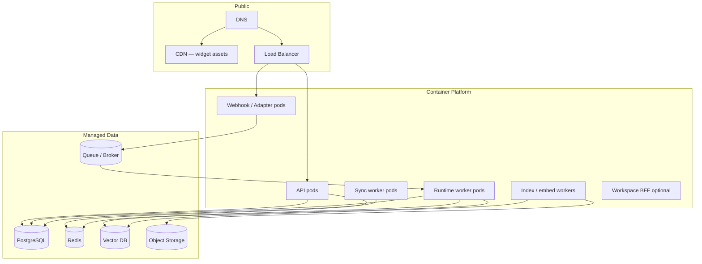
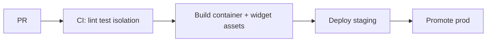

# DevOps & Infrastructure

## Metadata

| Field | Value |
|-------|-------|
| **Version** | 0.1 |
| **Status** | Active — deploy, observe, scale, recover for DeloRey AI MVP |
| **Owner** | Founder / DevOps / Backend |
| **Last Updated** | July 25, 2026 |
| **Parent Documents** | [System Architecture](./system-architecture.md) · [Backend Architecture](./backend-architecture.md) · [Security Architecture](./security-architecture.md) · [Frontend Architecture](./frontend-architecture.md) · [Database Design](./database-design.md) |
| **Related Documents** | [API Specification](./api-specification.md) · [AI Gateway Design](./ai-gateway-design.md) · [Product Principles](../02-product/product-principles.md) · [Product Scope](../02-product/product-scope.md) |

**Audience:** DevOps, Backend, Frontend (CDN widget), on-call.

**Authority:** Deepens System Architecture §§17–20 (Deployment, Monitoring, Scaling, Disaster Recovery). Observability and backup/restore ship **before** fancy multi-region ([System Architecture](./system-architecture.md) Implementation Guidance). Region choice is an **ops decision**, not a product fork.

If conflict:

```
Product Principles (Measure Everything, Security By Default, Fail safe)
    ↓
System Architecture Deployment / Monitoring / Scaling / DR
    ↓
Backend / Security / Database designs
    ↓
This document
```

---

# 1. Purpose

Operate DeloRey as a **multi-tenant cloud SaaS** with:

1. Separate **control plane** (Workspace API) and **conversation data plane** (webhooks + Runtime workers)  
2. Fair scheduling so sync/embed storms do not starve shopper turns  
3. Visible **sync health, cost, trust mechanics**, and infra golden signals  
4. Recoverability (Postgres PITR, rebuildable vectors) with **fail-safe product behavior** during incidents  



([System Architecture](./system-architecture.md) §17)

---

# 2. Environments

| Env | Use |
|-----|-----|
| `dev` | Engineers |
| `staging` | Pre-prod, design-partner dry runs |
| `prod` | Paying / design-partner production |

Same artifact shape across envs; config and secrets differ. No production secrets in `dev` images.

---

# 3. Process Roles (same NestJS artifact)

Aligned with [Backend Architecture](./backend-architecture.md):

| Role | Responsibility | Scales with |
|------|----------------|-------------|
| `api` | Auth, Workspace REST, Inbox, KB, sync triggers | Control-plane traffic |
| `webhook` | Channel Adapter ingress | Message bursts |
| `runtime-worker` | `interactive.turns` → ExecuteTurn | Turn depth / latency |
| `sync-worker` | `batch.sync` | Catalog size / webhook storms |
| `index-worker` | `batch.embed` | KB update volume |

Optional Workspace BFF remains optional — prefer direct `/v1` ([Frontend Architecture](./frontend-architecture.md)).

**Containerization:** Deploy as containers on a container platform (reference: Kubernetes-style pods in System Architecture). Docker (or equivalent) images are the immutable artifact unit — **no secrets baked in**.

---

# 4. Deployment Principles

| Principle | Practice |
|-----------|----------|
| Immutable artifacts | Build once; promote image/tag across staging → prod |
| Progressive rollout | Rolling / canary as ops maturity allows |
| Separate cadence | **Widget CDN** may deploy independently of API |
| Config | Environment + **secret store** |
| Autoscaling | HPA independently on API, webhook, Runtime workers |
| Health | `/health`, `/ready` for orchestration ([API Specification](./api-specification.md)) |

### CI/CD pipeline (logical)



| CI must include | Why |
|-----------------|-----|
| Unit / integration tests | Backend quality |
| **Cross-tenant isolation tests** | Security ship gate |
| Dependency scanning | Supply chain ([Security Architecture](./security-architecture.md)) |
| Contract smoke vs API resource list | Drift control |

Least privilege CI roles; secrets injected, not committed.

---

# 5. Edge & Networking

| Component | Role |
|-----------|------|
| DNS | api + app + widget CDN hosts |
| CDN | Website Widget static assets ([Frontend Architecture](./frontend-architecture.md)) |
| Load Balancer | TLS termination to API + webhook pods |
| WAF + rate limit | Edge abuse protection ([Security Architecture](./security-architecture.md)) |

TLS everywhere. Public widget assets only on CDN — never storefront/bot/LLM secrets in bundles.

---

# 6. Data Plane Services

| Service | Ops notes |
|---------|-----------|
| **PostgreSQL** | SoR; managed preferred; indexes per Database Design; read replicas when read-heavy |
| **Redis** | BullMQ queues, caches, locks, circuits — tenant key prefix; treat as **ephemeral** for DR |
| **Vector DB** | Tenant collections/filters; reindexable from canonical Knowledge |
| **Object Storage** | `tenants/{id}/…`; versioning for uploads |
| **Queue** | Redis-backed BullMQ queues: `interactive.turns`, `batch.sync`, `batch.embed`, `notify` |

Kafka is **not** MVP-required ([Backend Architecture](./backend-architecture.md)).

---

# 7. Queue Operations

| Queue | Consumer | SLO / priority |
|-------|----------|----------------|
| `interactive.turns` | runtime-worker | Low latency — protect first |
| `batch.sync` | sync-worker | Throughput; fair per tenant |
| `batch.embed` | index-worker | Throughput; never on interactive path |
| `notify` | notify path | Best-effort + retry |

### Ops rules

- Monitor **queue depth** as first-class signal.  
- Per-tenant concurrency caps on Runtime.  
- Poison messages → dead-letter + alert; do not infinite-loop.  
- Backpressure when interactive depth exceeds threshold: slow ingest acks where safe, or channel-appropriate “busy / slight delay” — **never silent drop** without operator visibility ([System Architecture](./system-architecture.md) §19).

---

# 8. Monitoring & Observability

Unmeasured systems violate *Measure Everything* ([Product Principles](../02-product/product-principles.md)).

### Pillars

| Pillar | What we watch |
|--------|----------------|
| **Metrics** | Latency, error rate, saturation; business: resolution, escalation, grounded rate, cost/turn |
| **Logs** | Structured JSON with tenant, conversation, decision — **no secrets** |
| **Traces** | End-to-end turn: adapter → runtime → context → gateway → delivery |
| **Audits** | Merchant-visible Transparent AI trail |
| **Alerts** | Sync failed, Gateway down, isolation test fail, cost anomaly, error budget burn |

Implementation tools (Prometheus/Grafana-style metrics, log aggregation, trace backend, error tracker such as Sentry-class for apps) **realize these pillars** — they are not new product features. Choose stack that supports tenant-labeled series and secure log access control.

### Golden signals (conversation path)

1. Ingest success rate  
2. Turn latency p95  
3. Delivery success rate  
4. Escalation rate (reason breakdown)  
5. Grounded answer rate  
6. Cost per turn  
7. Sync lag  

### Additional infra signals

| Signal | Why |
|--------|-----|
| Queue depth (interactive vs batch) | Backpressure / starvation |
| DB saturation / connection pool | SoR health |
| Redis memory / BullMQ lag | Job health |
| Provider latency/error/failover | AI Gateway |
| Embed queue depth / index lag | Knowledge |
| CDN / widget error rate | Shopper channel #1 |

### Merchant-visible vs internal

| Merchant Workspace | Internal ops |
|--------------------|--------------|
| Sync health, channel health, escalations, basic revenue metrics | Provider outages, queue depth, DB saturation, cost anomalies |

Frontend may send client errors to an error tracker **without PII/secrets**.

### Trace names (from architecture)

`runtime.turn`, `context.build`, `skill.*`, `guardrail.check`, `gateway.generate` / `gateway.embed`, `sync.*`, plus ingest/delivery spans.

---

# 9. Scaling Strategy

### Traffic shapes

- Bursty messaging (evening peaks, merchant-side spikes)  
- Sync storms after reconnect  
- Embed backlogs after bulk FAQ upload  

### Scale levers

| Component | Strategy |
|-----------|----------|
| API / Workspace | Horizontal pods; cache session/config |
| Adapters / webhook | Scale on webhook concurrency; respect external quotas |
| Runtime | Queue + worker autoscaling; per-tenant concurrency caps |
| Commerce sync | Tenant fair scheduling; backoff |
| Vector / embed | Async workers; batch |
| PostgreSQL | Indexes on tenant+time; read replicas for heavy reads |
| Redis | Cluster if needed; careful TTLs |
| AI Gateway | Multi-provider; shed to cheap models under budget pressure |

Autoscaling targets: CPU/RPS/queue depth as appropriate — **interactive** HPA separate from **batch** workers so sync cannot steal turn capacity.

---

# 10. Disaster Recovery

### Objectives (initial posture — refine with ops data)

| Objective | Initial posture |
|-----------|-----------------|
| **RPO** | Minutes for Postgres (continuous backup / PITR); rebuildable indexes for vectors |
| **RTO** | Prioritize control plane + conversation **accept** path; degrade AI generation via Gateway failover; sync can lag |

### Strategies

1. Automated Postgres backups + **tested** restore  
2. Multi-AZ for stateful managed services where available  
3. Redis: ephemeral; rebuild caches  
4. Vector DB: reindex from canonical Knowledge (and commerce text where applicable) if corrupted  
5. Object Storage versioning for uploads  
6. Provider failover in AI Gateway  
7. Runbooks: region outage, provider outage, poison queue, credential leak rotation  

### Fail-safe product behavior during DR

Prefer **Human Handoff** and honest degradation over autonomous wrong commerce facts. **Sync health must remain visible** ([System Architecture](./system-architecture.md) §20).

Backup access control is least-privilege (Security). Tenant-scoped deletes/archives must not break backup integrity assumptions without runbook.

---

# 11. Secrets & Config in Ops

| Rule | Practice |
|------|----------|
| No secrets in images | Inject at runtime from secret store |
| Environments | Separate secret namespaces for staging/prod |
| Rotation | Bot/storefront/LLM keys rotatable; disconnect channel on compromise |
| Config | Non-secret via env/config maps; feature flags without expanding MVP scope |

---

# 12. Frontend / Widget Deploy

| Artifact | Deploy |
|----------|--------|
| Workspace Next.js app | App hosting / containers behind LB |
| Widget bundle | **CDN**; hashed filenames; cache-friendly |
| Cadence | Widget may ship without API redeploy when API-compatible |

Embed diagnostics (CSP/domain) remain product/Frontend concerns; CDN must serve correct CORS/cache headers for merchant origins as designed.

---

# 13. Runbooks (minimum set)

Documented in ops wiki / repo — Architecture requires these scenarios:

| Runbook | Actions (logical) |
|---------|-------------------|
| **Region / AZ outage** | Fail over managed data if multi-AZ; prioritize accept path; communicate degradation |
| **LLM provider outage** | Gateway failover; if all down → Runtime fail-safe escalate; alert |
| **Poison queue** | Isolate DLQ job; fix; replay tenant-scoped if safe |
| **Credential leak** | Rotate secrets; disconnect affected channel/store; audit access |
| **Sync failed storm** | Fair schedule; surface sync_health; do not invent catalog facts |
| **Interactive queue overload** | Scale runtime-workers; apply backpressure; never silent drop |
| **Cross-tenant suspicion** | Page severity-1; freeze related deploys; forensic tenant-scoped logs |

---

# 14. MVP Ops Bar vs Later

| Capability | MVP | Later |
|------------|-----|-------|
| Containerized roles + CI/CD | Required | |
| Staging + prod | Required | |
| Metrics/logs/traces + golden alerts | Required | |
| Postgres backup + restore drill | Required | |
| Queue depth monitoring + DLQ | Required | |
| Widget CDN separate deploy | Required | |
| Multi-region active-active | Not required | When scale/DR demand |
| Kafka | Not required | If Event Bus outgrows Redis/outbox |
| Fancy multi-region before observability | Forbidden by guidance | — |

---

# 15. Explicit Non-Goals

| Non-goal | Why |
|----------|-----|
| Product-forking infra per Iran vs global | Region is ops, not product identity |
| Premature microservices sprawl | Modular monolith + process roles first |
| Silent drop under load | Trust / Measure Everything |
| Skipping isolation tests in CI to “move faster” | Company-ending risk |
| Treating Redis as durable SoR without backup story | Architecture: ephemeral |

---

# 16. Related Documents

| Document | Relationship |
|----------|--------------|
| [System Architecture §§17–20](./system-architecture.md) | Parent |
| [Backend Architecture](./backend-architecture.md) | Process roles, queues |
| [Security Architecture](./security-architecture.md) | WAF, secrets, CI supply chain |
| [Frontend Architecture](./frontend-architecture.md) | CDN widget |
| [Database Design](./database-design.md) | Backup/retention scopes |
| [AI Gateway Design](./ai-gateway-design.md) | Provider health/failover |
| [Testing Strategy](./testing-strategy.md) | Load, chaos, restore drills |

---

# Summary

DeloRey ops run a **containerized modular monolith** as api / webhook / runtime / sync / index workers behind TLS+WAF, with **Postgres + Redis + Vector + Object Storage**, **interactive vs batch queues**, independent HPA, CDN widget deploys, and observability that covers both **infra golden signals** and **commerce trust signals** (sync lag, escalation, grounded rate, cost/turn). DR favors accept-path + handoff over wrong autonomous answers; backups and isolation tests beat multi-region theater.

---

*DevOps & Infrastructure v0.1. Changes require version bump and written rationale. System Architecture and Security Architecture override ops enthusiasm when they conflict.*
