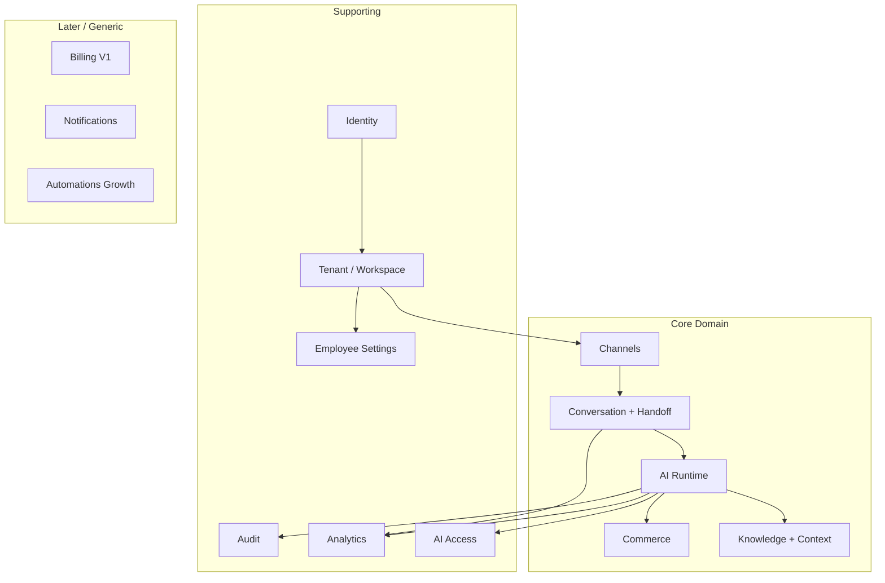
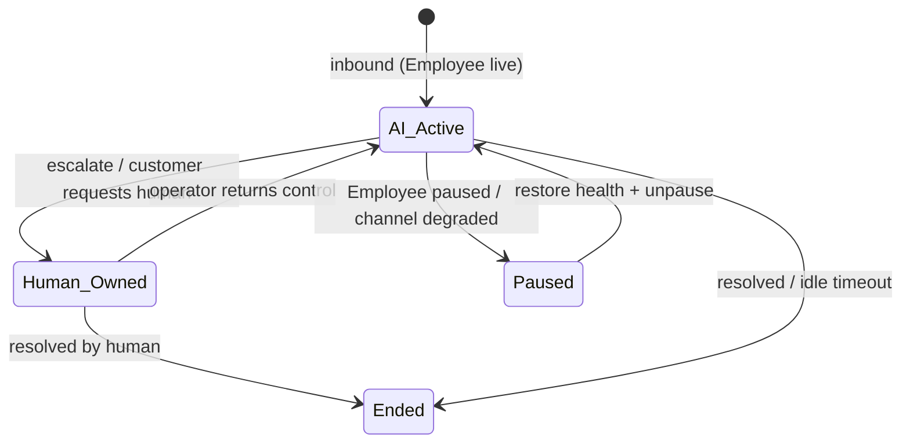
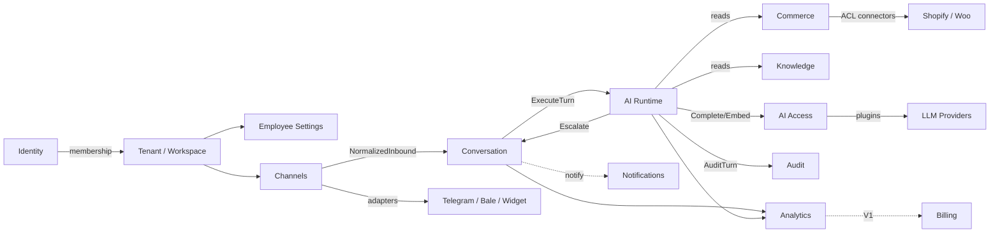
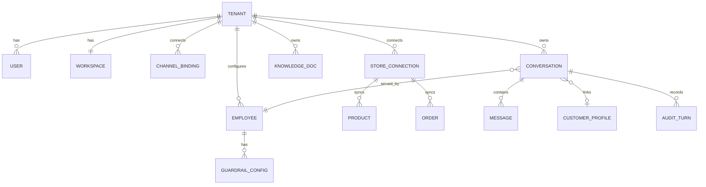

# Domain-Driven Design

## Metadata

| Field | Value |
|-------|-------|
| **Version** | 0.1 |
| **Status** | Active — domain model and bounded contexts for DeloRey AI |
| **Owner** | Founder / Backend / Product |
| **Last Updated** | July 25, 2026 |
| **Parent Documents** | [System Architecture](./system-architecture.md) · [AI Runtime Architecture](./ai-runtime-architecture.md) |
| **Related Documents** | [Glossary](../00-overview/glossary.md) · [Product Principles](../02-product/product-principles.md) · [Product Scope](../02-product/product-scope.md) · [User Journey](../02-product/user-journey.md) · [Pricing Strategy](../01-business/pricing-strategy.md) · [Roadmap](../00-overview/roadmap.md) · [Database Design](./database-design.md) |

**Audience:** Backend, AI Platform, Frontend (API contracts), Database designers, anyone writing PRDs or modules.

**Authority:** This document names and bounds the **domain** already defined by Product and System Architecture. It must not invent features, aggregates, or contexts outside Product Scope. Ubiquitous language must match the [Glossary](../00-overview/glossary.md).

If conflict:

```
Product Vision
    ↓
Product Principles
    ↓
Product Scope
    ↓
User Journey
    ↓
Roadmap
    ↓
System Architecture / AI Runtime Architecture
    ↓
This document
```

Database Design and Backend Architecture derive from this map. They do not redefine product identity.

---

# 1. Purpose

DeloRey AI is an **AI Commerce Platform**. The domain is not “tickets,” “CRM pipelines,” or “chatbot flows.” The domain is:

> A merchant hires an **AI Sales Employee** that, across **Channel Adapters**, conducts **Conversations** grounded in **Commerce Core** and **Knowledge**, controlled by **Guardrails** and **Human Handoff**, operated from a **Workspace**, isolated by **Tenant**.

Domain-Driven Design here means:

1. **Ubiquitous language** shared by Product, Engineering, and docs.  
2. **Bounded Contexts** aligned to System Architecture components.  
3. **Aggregates** that protect invariants (especially tenancy, sync health, ownership, guardrails).  
4. **Context map** showing who is upstream/downstream — without Event-Driven-Everything.  
5. Clear **MVP vs later** boundaries so Database/Backend do not build Growth domains early.

---

# 2. Strategic Domain View

### Core domain

What makes DeloRey DeloRey (lose this and the product thesis fails — [Product Scope](../02-product/product-scope.md) Core tier):

| Domain focus | Why core |
|--------------|----------|
| **AI Employee Runtime** (turn: context → Skills → guardrails → reply/escalate) | Primary product behavior |
| **Commerce Core** (live catalog, inventory, pricing, policies, orders) | Context Before Intelligence |
| **Context / Knowledge grounding** | Prevents hallucination theater |
| **Conversation + Human Handoff** | Commerce events + trust mechanics |
| **Channel Adapters (Website, Telegram, Bale)** | One brain, market surfaces |

### Supporting domains

Required to operate Core safely ([Product Scope](../02-product/product-scope.md) Supporting):

| Domain | Role |
|--------|------|
| **Identity** | Merchant authn/z |
| **Tenant / Workspace** | Isolation boundary + control plane |
| **Employee Settings / Guardrails config** | Humans Control |
| **Audit** | Transparent AI |
| **Analytics / Revenue Intelligence (basic)** | Measure Everything |
| **AI Access** (Cost Layer + AI Gateway) | Model Independence + Cost First |

### Generic / later domains

| Domain | Phase note |
|--------|------------|
| **Billing / subscription metering** | Self-serve billing is **V1** ([Product Scope](../02-product/product-scope.md)); Architecture lists “Billing / Metering later.” Domain language exists in Pricing Strategy — implement as hooks in MVP, full billing context in V1. |
| **Notifications** | Escalation notify + Workspace alerts as event consumers — not a separate product category. |
| **Automations** (abandoned cart, etc.) | **Growth** — after core Employee quality ([Glossary](../00-overview/glossary.md), Roadmap). |
| **Public API / Marketplace / multi-Employee orchestration** | **Platform** |



---

# 3. Ubiquitous Language

Terms below are **product language**. Prefer these names in code modules, APIs, events, and PRDs. Full definitions: [Glossary](../00-overview/glossary.md).

| Term | Meaning (DeloRey) | Anti-term (do not use as SoR) |
|------|-------------------|-------------------------------|
| **AI Employee** | Commerce role merchant hires (MVP: Sales) | “Bot,” “assistant,” “chatbot tree” |
| **Agent** | Technical runtime unit behind an Employee | Independent product name for merchants |
| **Workspace** | Merchant operational home | “Admin panel” as identity of product |
| **Tenant** | Hard isolation boundary | Shared undeclared data pools |
| **Channel** | Shopper surface (MVP: Website, Telegram, Bale) | Place where business rules live |
| **Channel Adapter** | Format/deliver only | Owner of Skills or Knowledge |
| **Conversation** | Commerce event thread | Helpdesk **ticket** |
| **Context Engine** | Assembles live state before generation | Optional prompt garnish |
| **Knowledge Base** | FAQ/overrides/uploads + attributions | Dump without sources |
| **RAG** | Retrieve then generate | Generate then hope |
| **Commerce Core** | Live catalog, inventory, pricing, policies, orders | Spreadsheet / model memory |
| **Skill** | Allowed commerce capability (search, recommend, order status, escalate) | Prompt fork per merchant |
| **Guardrails** | Hard stops | Soft suggestions |
| **Human Handoff** | First-class transfer with context packet | Hidden failure / vanity automation |
| **Customer Profile** | Cross-channel shopper record when identity resolvable | Forced merge on weak signals |
| **Memory** | Continuity for turns and operators | Full dump every turn |
| **Audit** | What Employee knew, tools, replies, escalations | Optional enterprise log |
| **Sync health** | User-visible commerce freshness | Silent background detail |
| **AI Conversation** (billing sense) | Metered usage unit per Pricing Strategy | Raw token bill on SMB invoice |

### Decision vocabulary (Runtime)

Only these turn outcomes ([User Journey](../02-product/user-journey.md), [AI Runtime Architecture](./ai-runtime-architecture.md)):

**Answer** | **Recommend** | **Order Lookup** | **Escalate**

### Conversation ownership vocabulary

From Conversation Engine state machine ([System Architecture](./system-architecture.md)):

**`ai_active`** | **`human_owned`** | **`paused`** | **`ended`**

---

# 4. Bounded Contexts

Each context below maps to System Architecture components. **Catalog** and **Orders** are **subdomains inside Commerce**, not separate product categories — Commerce Core owns that truth ([System Architecture](./system-architecture.md) §7).

## 4.1 Identity

| | |
|--|--|
| **Purpose** | Merchant authentication and authorization into the Workspace |
| **Architecture** | Auth Service |
| **MVP** | Signup/login, secure sessions, password reset; future SSO hooks only |
| **Owns** | User credentials/sessions, auth challenges |
| **Does not own** | Tenant commerce data, Conversations, Employee Skills |
| **Ubiquitous language** | User, Session, AuthN, AuthZ |
| **Published language** | Authenticated principal → Tenant/Workspace membership |

### Aggregates / entities (conceptual)

| Name | Type | Invariants |
|------|------|------------|
| **User** | Entity | Belongs to tenancy via membership; credentials never in prompts/logs |
| **Session** | Entity | Secure, revocable |

---

## 4.2 Tenant & Workspace

| | |
|--|--|
| **Purpose** | Isolation boundary and merchant control plane |
| **Architecture** | Tenant Manager, Workspace Services |
| **MVP** | One Workspace ≈ one online business / one store default ([Pricing Strategy](../01-business/pricing-strategy.md), Roadmap: no multi-brand MVP) |
| **Owns** | Tenant metadata, Workspace, membership, provisioning of isolation namespaces |
| **Does not own** | Storefront catalog truth, Runtime Skills logic |
| **Ubiquitous language** | Tenant, Workspace, Tenant Isolation |
| **Key rule** | Runtime may be shared; data must not be ([Glossary](../00-overview/glossary.md), System Architecture §15) |

### Aggregates / entities (conceptual)

| Name | Type | Invariants |
|------|------|------------|
| **Tenant** | Aggregate root | Hard boundary for DB, Redis, Vector, storage, queues, logs, analytics, Memory, embeddings |
| **Workspace** | Entity (1:1 with Tenant in MVP model) | Control plane home; UI is a client of APIs |
| **Membership** | Entity | Workspace-scoped AuthZ |

### Domain events (related)

- `tenant.provisioned` — index bootstrap, default Employee skeleton ([System Architecture](./system-architecture.md) §13)

---

## 4.3 Employee & Settings

| | |
|--|--|
| **Purpose** | Configure the AI Sales Employee the merchant “hires” |
| **Architecture** | Workspace config store; Guardrails config; enforced in Runtime |
| **MVP** | One primary **AI Sales Employee**; tone, language, Skills, guardrails, escalation rules |
| **Owns** | Employee configuration, GuardrailConfig |
| **Does not own** | Turn execution (Runtime), channel delivery |
| **Ubiquitous language** | AI Employee, Agent (technical), Guardrails, Settings |
| **Key rule** | Settings are enforced in Runtime — not decorative UI ([User Journey](../02-product/user-journey.md) Stage 5) |

### Aggregates / entities (conceptual)

| Name | Type | Invariants |
|------|------|------------|
| **Employee** | Aggregate root | Tenant-scoped; role stays Sales for MVP; Skills ⊆ allowed MVP set |
| **GuardrailConfig** | Entity / value object set | Hard stops: blocked topics, discount caps, restricted mutations, escalation triggers |

### Domain events

- `employee.updated` — Runtime config cache bust

### Explicit non-goals (MVP)

- Multi-agent orchestration as product center  
- Custom Employee builder as blank chatbot IDE  
- Support as separate dedicated Employee role (Growth / later Skills maturity)

---

## 4.4 Channels

| | |
|--|--|
| **Purpose** | Connect shopper surfaces; normalize ingress/egress |
| **Architecture** | Channel Adapters + Channel bindings |
| **MVP adapters** | Website Chat, Telegram, Bale |
| **Owns** | ChannelBinding, adapter credentials, normalization, delivery formatting, channel health |
| **Does not own** | Skills, Knowledge, discount policy, escalation rules |
| **Ubiquitous language** | Channel, Channel Adapter, ChannelBinding |
| **Key rule** | Adapters format; they do not reinterpret business rules ([Product Principles](../02-product/product-principles.md)) |

### Aggregates / entities (conceptual)

| Name | Type | Invariants |
|------|------|------------|
| **ChannelBinding** | Aggregate root | Tenant-scoped; verified credentials; origin allowlists for widget |
| **NormalizedInboundMessage** | Value / message contract | No business rules embedded |
| **OutboundMessage** | Value / message contract | Channel-agnostic from Runtime |

### Explicit non-goals (MVP)

Instagram, WhatsApp, email, SMS, voice — Depth before breadth.

---

## 4.5 Commerce

| | |
|--|--|
| **Purpose** | Own live commerce truth required for conversations |
| **Architecture** | Commerce Core + Sync Workers + connectors |
| **MVP** | One primary storefront path (Shopify primary; WooCommerce equivalent): catalog, inventory flags, pricing, shipping/return/COD policy fields, orders |
| **Owns** | StoreConnection, sync health, normalized Product/Variant/Inventory/Price, Order, structured policies |
| **Does not own** | LLM prompts, channel formatting, ticket queues |
| **Ubiquitous language** | Commerce Core, Catalog Sync, Sync health, Order Lookup (Skill consuming Orders) |
| **Key rule** | Without Commerce Core, DeloRey is a generic chatbot |

### Subdomains (inside Commerce — not separate BCs)

| Subdomain | Responsibility | Events (examples) |
|-----------|----------------|-------------------|
| **Catalog** | Products, variants, searchable commerce facts | `catalog.updated` |
| **Inventory** | Stock signals for recommendations and availability | `inventory.updated` |
| **Pricing** | Prices; discounts only via merchant rules / guardrails | (via catalog/commerce updates) |
| **Policies** | Shipping, returns, COD fields from storefront | Seed Knowledge / Context |
| **Orders** | Order records for status Skill | `order.updated` |
| **Sync** | Initial + incremental ingest; health projection | `sync.succeeded`, `sync.failed`, `store.connected` |

### Aggregates / entities (conceptual)

| Name | Type | Invariants |
|------|------|------------|
| **StoreConnection** | Aggregate root | Tenant-scoped secrets; unhealthy connection blocks confident catalog answers |
| **Product** ( + Variant ) | Entity | External id idempotent upsert; tenant_id mandatory |
| **InventorySignal** | Value / entity | Stale inventory is a product failure — do not sell what cannot ship |
| **Order** | Entity | Read-heavy for MVP Skills; no unguarded refund/cancel mutation |
| **SyncHealth** | Projection | Last success, lag, failure reason — user-visible |

### Invariants

1. Factual product/price/stock answers require healthy sync for that domain.  
2. Credentials encrypted; never in prompts/logs.  
3. Empty catalog → visible error; do not allow misleading go-live.

---

## 4.6 Knowledge

| | |
|--|--|
| **Purpose** | Merchant knowledge beyond sync: FAQ/policy overrides, uploads, citations |
| **Architecture** | Knowledge System + Vector DB + Object Storage |
| **MVP** | FAQ/policy overrides + basic document upload; source attribution; reindex on update |
| **Owns** | KnowledgeDoc, chunks, embeddings indexes (tenant-scoped), citation metadata |
| **Does not own** | Catalog SoR (Commerce owns sync truth); Runtime decisions |
| **Ubiquitous language** | Knowledge Base, RAG, Embedding, Vector Database, source attribution |
| **Key rule** | Policy/FAQ answers ground in Knowledge/synced facts — not model prior |

### Aggregates / entities (conceptual)

| Name | Type | Invariants |
|------|------|------------|
| **KnowledgeDoc** | Aggregate root | Tenant-scoped; canonical text/upload; attribution retained |
| **Chunk / Embedding** | Entities | Rebuildable from canonical docs; tenant filter/collection mandatory |

### Domain events

- `knowledge.updated`  
- `knowledge.reindex_failed`

### Explicit non-goals

- Billing by Knowledge Base size ([Pricing Strategy](../01-business/pricing-strategy.md))  
- Unstructured dump without attribution  

---

## 4.7 Conversation

| | |
|--|--|
| **Purpose** | Threads as commerce events: persistence, ownership, continuity, delivery orchestration |
| **Architecture** | Conversation Engine + Memory + Inbox integration |
| **MVP** | History; AI vs human ownership; cross-channel continuity when identity resolvable; Workspace Inbox takeover |
| **Owns** | Conversation, Message, ownership state, delivery commands, history windows/summaries |
| **Does not own** | Skill business rules, catalog truth |
| **Ubiquitous language** | Conversation, Message, Customer Profile, Memory, Inbox |
| **Key rule** | Conversations are not helpdesk tickets |

### Aggregates / entities (conceptual)

| Name | Type | Invariants |
|------|------|------------|
| **Conversation** | Aggregate root | Tenant-scoped; ownership state machine; idempotent ingest |
| **Message** | Entity | Ordered; delivery status; no double Runtime on webhook retry |
| **CustomerProfile** | Entity | Prefer no merge over wrong merge |
| **Memory** | Supporting model | Continuity; smart selection — not full dump |

### Ownership state machine



### Domain events

- `conversation.started`  
- `conversation.message`  
- `conversation.escalated`  
- `conversation.ended`  

### Human Handoff (within Conversation + Runtime collaboration)

Handoff is first-class ([Glossary](../00-overview/glossary.md)). Conversation owns **ownership pause/resume** and Inbox surfacing; Runtime **decides Escalate** and builds the context packet.

Context packet includes: summary, customer identifiers if known, recent messages, relevant order/product facts, escalation reason ([User Journey](../02-product/user-journey.md) Stage 9).

---

## 4.8 AI Runtime

| | |
|--|--|
| **Purpose** | Execute one Sales Employee turn with cost awareness and trust mechanics |
| **Architecture** | AI Employee Runtime + Skill Engine + Guardrails enforcement + Context Engine orchestration + Human Handoff initiation |
| **MVP** | Answer / Recommend / Order Lookup / Escalate; Cost Layer preflight; Context before generation; Audit |
| **Owns** | Turn orchestration, Skill planning/execution under scopes, decision outcome, audit emission for the turn |
| **Does not own** | Provider SDKs (AI Gateway), storefront connectors, adapter formatting |
| **Ubiquitous language** | Runtime, Turn, Skill, ContextBundle, Decision, Fail-safe |
| **Deep design** | [AI Runtime Architecture](./ai-runtime-architecture.md) |

### Aggregates / entities (conceptual)

| Name | Type | Invariants |
|------|------|------------|
| **Turn** (execution) | Process / aggregate of work | Idempotent per inbound delivery key; always carries tenant_id |
| **ContextBundle** | Value object (from Context Engine) | Typed sections + citations + sync flags; no invented commerce facts |
| **SkillInvocation** | Entity / record | Scoped permissions; secrets excluded |
| **Decision** | Value | One of Answer \| Recommend \| Order Lookup \| Escalate |

### Context Engine (supporting capability inside / beside Runtime)

Assembles catalog/inventory/pricing, policies, Knowledge retrieval, history, Memory within token budget ([System Architecture](./system-architecture.md) §8). Treated as a **domain service** boundary consumed by Runtime — detailed in a later Context Engine Design doc.

### MVP Skills (domain capabilities)

| Skill | Consumes | Produces |
|-------|----------|----------|
| Product Search / Grounded Q&A | Commerce + Knowledge | Grounded Answer material |
| Product Recommendation | Commerce inventory/price | Recommend material |
| Order Status | Commerce Orders | Order Lookup material |
| Escalation | Conversation + context packet | Handoff |

---

## 4.9 AI Access (Cost + Gateway)

| | |
|--|--|
| **Purpose** | Provider-agnostic model I/O with cost control |
| **Architecture** | Cost Optimization Layer + AI Gateway |
| **MVP** | Cache/rules/classify/routing; Complete/Embed; token metering; failover |
| **Owns** | Routing policy execution, provider plugins, token/cost ledger entries, semantic/response cache coordination |
| **Does not own** | Merchant policy, Skills, catalog truth |
| **Ubiquitous language** | AI Gateway, Cost First, Model Independence, cheap vs premium route |
| **Key rule** | Business logic never knows OpenAI vs Claude vs Gemini vs self-hosted |

This is a **generic subdomain** supporting the core Runtime — not the product identity.

---

## 4.10 Audit

| | |
|--|--|
| **Purpose** | Transparent AI — merchants can inspect what happened |
| **Architecture** | Audit Store + Runtime instrumentation |
| **MVP** | What Employee knew, tools called, replies, escalations |
| **Owns** | AuditTurn / audit records |
| **Does not own** | Analytics rollups (may project from audit/events) |
| **Ubiquitous language** | Audit Logs, Transparent AI |

### Aggregates / entities (conceptual)

| Name | Type | Invariants |
|------|------|------------|
| **AuditTurn** | Entity | Tenant-scoped; longer retention for trust/dispute; no secrets in payloads |

---

## 4.11 Analytics & Revenue Intelligence

| | |
|--|--|
| **Purpose** | Measure conversations, resolution, escalations, grounded answers, conservative attribution |
| **Architecture** | Analytics / Revenue Intelligence + event pipeline |
| **MVP** | Basic dashboard — directional, explainable attribution; not advanced BI |
| **Owns** | Aggregates/rollups, attribution records (conservative) |
| **Does not own** | Conversation SoR, Runtime decisions |
| **Ubiquitous language** | Resolution rate, escalation rate, grounded-answer visibility, attributed conversion/recovery |
| **Key rule** | Honest measurement — not vanity ROI graphs |

### Domain events (consumed)

- Conversation lifecycle events  
- `conversion.attributed` (conservative)

### Explicit non-goals (MVP)

Advanced BI, custom report builders, warehouse exports, perfect causal science.

---

## 4.12 Billing (V1 — domain language now, full context later)

| | |
|--|--|
| **Purpose** | SaaS subscription + conversation allowance fencing ([Pricing Strategy](../01-business/pricing-strategy.md)) |
| **Architecture** | Billing / Metering later in System Architecture; self-serve billing in V1 Scope |
| **MVP stance** | Emit usage signals (conversations, cost) needed for future metering; do not build full billing SoR as MVP blocker unless Roadmap exit requires it |
| **Owns (when built)** | Plan, Subscription, entitlements (channels, seats, Employees), conversation allowance, overage policy |
| **Does not own** | Token jargon on merchant invoice; Knowledge size as price driver |
| **Ubiquitous language** | AI Conversation (meter), Connected Channel (expansion), Store (packaging unit), Workspace (boundary) |

### Metering definition (from Pricing — productize later)

An **AI Conversation** is a continuous customer thread on one channel where the AI Employee produces ≥1 grounded reply within a rolling inactivity window (e.g. 24 hours). Exact window is an implementation decision; publish beside pricing.

---

## 4.13 Notifications (supporting)

| | |
|--|--|
| **Purpose** | Merchant-facing alerts (e.g. escalation notify on Telegram/Bale flows; Workspace notifications) |
| **Architecture** | Job/Queue notifications; event consumers |
| **MVP** | Escalation / channel health notifications required by Journey and Scope — not a marketing suite |
| **Owns** | Notification dispatch requests |
| **Does not own** | Campaign builder, blasts, drips |

---

# 5. Context Map

Relationships use DDD integration styles already implied by Architecture: **Published Language** (normalized messages, events), **Customer/Supplier** (Runtime consumes Commerce/Knowledge), **Conformist** (adapters conform to Conversation model), **Anti-Corruption Layer** (Commerce connectors normalize Shopify/Woo into internal schema).



| Upstream | Downstream | Style | Contract |
|----------|------------|-------|----------|
| Channel Adapters | Conversation | Conformist | `NormalizedInboundMessage` |
| Conversation | AI Runtime | Customer/Supplier | `ExecuteTurn` |
| Commerce connectors | Commerce | Anti-Corruption Layer | Normalized catalog/orders |
| Commerce / Knowledge / Memory | Context Engine → Runtime | Customer/Supplier | `ContextBundle` |
| Runtime / Cost | AI Gateway | Published Language | `Complete` / `Embed` |
| Runtime | Audit / Analytics | Published Language | Audit records + events |
| Employee Settings | Runtime | Customer/Supplier | Config + Guardrails |
| Pricing/Billing (V1) | Conversation metering | Conformist to Pricing definition | AI Conversation meter |

---

# 6. Domain Events Catalog (MVP-oriented)

Authoritative list from [System Architecture](./system-architecture.md) §13 — domain names only; not every DB write emits an event.

| Event | Context | Typical consumers |
|-------|---------|-------------------|
| `tenant.provisioned` | Tenant & Workspace | Index bootstrap, default Employee |
| `store.connected` | Commerce | Kickoff sync |
| `sync.succeeded` / `sync.failed` | Commerce | Workspace health, Runtime gates |
| `catalog.updated` | Commerce | Cache invalidation, search reindex |
| `inventory.updated` | Commerce | Cache / retrieval freshness |
| `order.updated` | Commerce | Optional later notifications |
| `knowledge.updated` | Knowledge | Reembed / reindex |
| `knowledge.reindex_failed` | Knowledge | Workspace / ops |
| `employee.updated` | Employee Settings | Runtime config cache bust |
| `conversation.started` | Conversation | Analytics |
| `conversation.message` | Conversation | Analytics |
| `conversation.escalated` | Conversation | Inbox notify, metrics |
| `conversation.ended` | Conversation | Attribution window |
| `conversion.attributed` | Analytics | Revenue dashboard |

**Rule:** Critical shopper turns are request/response on the Runtime path; events notify side effects.

---

# 7. Cross-Cutting Invariants

These are domain laws — Database and Backend must enforce them.

| Invariant | Source |
|-----------|--------|
| Every persistent merchant fact carries **`tenant_id`**; missing tenant → fail closed | Multi Tenant by Design |
| **No LLM factual path** without Context assembly when intelligence is required | Context Before Intelligence |
| **No provider SDK** in Business/Runtime Skills | Model Independence |
| **Adapters never own** Skills, Knowledge, or discount rules | One Brain |
| **Guardrails are hard stops** | Humans Control AI |
| **Stale sync** ⇒ no confident product/price/stock answers | Sync health as product |
| Prefer **“I don’t know” + Escalate** over wrong SKU/price/policy | Fail safe / AI Principles |
| **Conversations ≠ tickets** | Product identity |
| **MVP Skills only**: search/Q&A, recommend, order status, escalate | Product Scope |
| **No unguarded refund/cancel** in MVP | Product Scope / Security |
| Audit retains tools, sources, escalation reasons | Transparent AI |

---

# 8. Aggregate Relationship Overview

Conceptual model from System Architecture data entities — refined with domain names:



Detailed tables, indexes, and RLS belong in **Database Design** — this diagram is the domain skeleton only.

---

# 9. Module Mapping (for Backend Architecture)

Suggested NestJS / service module boundaries follow Bounded Contexts — not UI pages.

| Bounded Context | Suggested module / package | MVP priority |
|-----------------|----------------------------|--------------|
| Identity | `identity` / `auth` | P0 |
| Tenant & Workspace | `tenant`, `workspace` | P0 |
| Employee & Settings | `employee` | P0 |
| Channels | `channels` + `adapters/{website,telegram,bale}` | P0 |
| Conversation | `conversation`, `inbox`, `memory` | P0 |
| Commerce | `commerce`, `sync`, `connectors/*` | P0 |
| Knowledge | `knowledge` | P0 |
| AI Runtime | `runtime`, `skills`, `guardrails`, `context` | P0 |
| AI Access | `ai-gateway`, `cost` | P0 |
| Audit | `audit` | P0 |
| Analytics | `analytics` | P0 |
| Notifications | `notifications` | P0 (minimal) |
| Billing | `billing` | V1 |

CQRS/events: use where Architecture already says (sync, Knowledge index, conversation lifecycle, attribution) — not Event-Driven Everything.

---

# 10. What This Document Refuses

Aligned with Product Scope OUT OF MVP and Architecture anti-patterns:

| Refusal | Why |
|---------|-----|
| Ticket / CRM pipeline as core aggregates | Wrong product identity |
| Channel-specific Product/Policy entities | Forks One Brain |
| Workflow Builder / Visual Flow as domain core | Chatbot-builder gravity |
| Skill Marketplace aggregates in MVP | Premature ecosystem |
| Multi-brand Tenant hierarchy in MVP | Single-store focus |
| Billing-by-tokens as merchant language | Pricing Strategy |
| Separate “Catalog BC” that Runtime writes to as SoR | Commerce Core owns truth; Runtime reads via Skills/Context |

---

# 11. Downstream Documents

| Next doc | Derives from this |
|----------|-------------------|
| **Database Design** | Aggregates → tables, relations, indexes, tenant isolation — see [Database Design](./database-design.md) |
| **Backend Architecture** | Contexts → modules, CQRS/events, jobs — see [Backend Architecture](./backend-architecture.md) |
| **API Specification** | Published language between contexts |
| **Context Engine / Knowledge / Gateway designs** | Deepen Commerce–Knowledge–Runtime edges |
| **Feature PRDs** | One capability per context without crossing OUT OF MVP |

---

# Summary

DeloRey’s domain is an **AI Sales Employee operating across thin Channel Adapters**, grounded in **Commerce + Knowledge**, orchestrated by **AI Runtime**, controlled by **Guardrails + Human Handoff**, inside a **Tenant/Workspace**, made trustworthy by **Audit** and measurable by **Analytics**.

**Catalog** and **Orders** live inside **Commerce**. **Billing** is real domain language now and a full bounded context at **V1**. **Automations** and **Marketplace** wait for Growth/Platform.

---

*Domain-Driven Design v0.1. Changes require version bump and written rationale. Product Scope, Product Principles, System Architecture, and AI Runtime Architecture override domain modeling enthusiasm when they conflict.*
