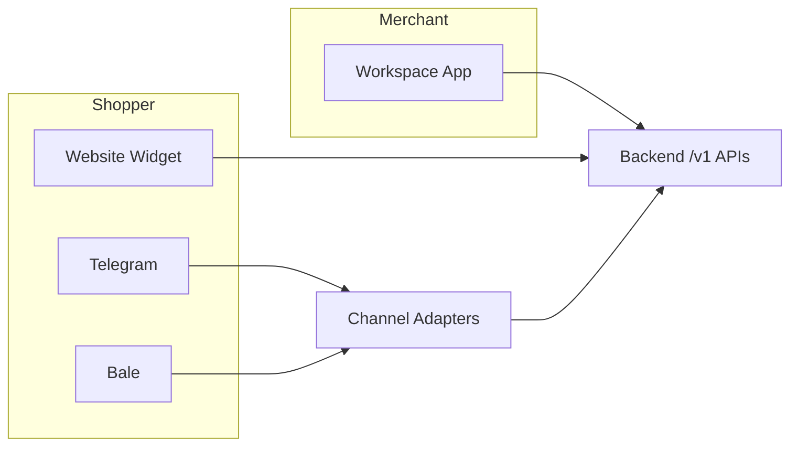
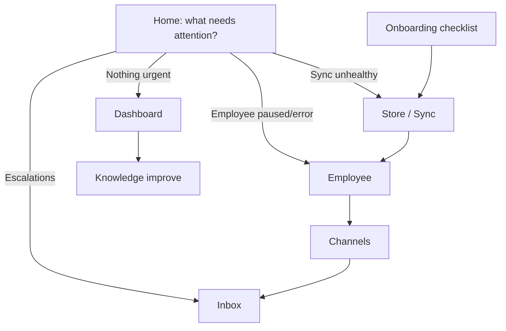
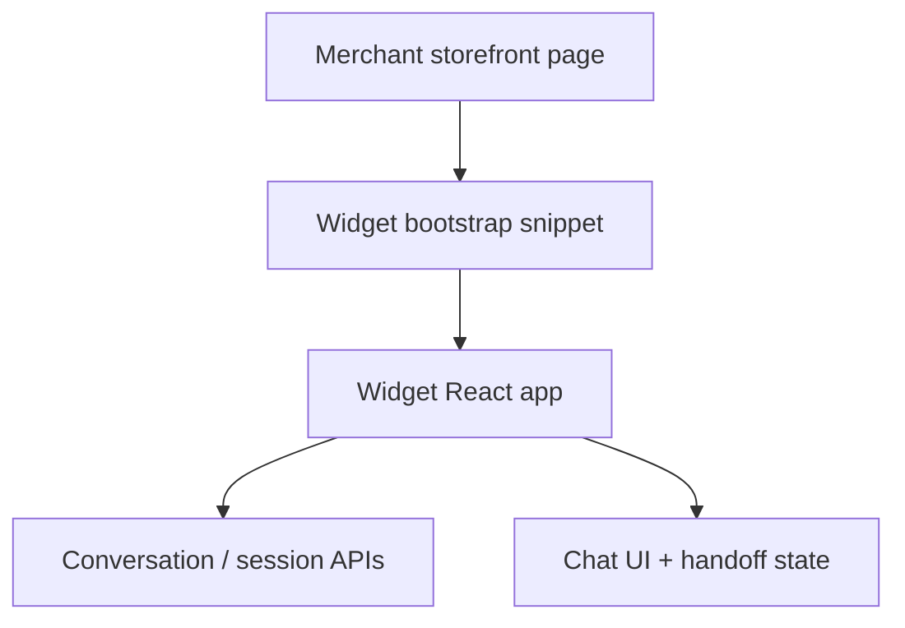

# Frontend Architecture

## Metadata

| Field | Value |
|-------|-------|
| **Version** | 0.1 |
| **Status** | Active — Workspace + Website Widget frontend for DeloRey AI MVP |
| **Owner** | Founder / Frontend / Design |
| **Last Updated** | July 25, 2026 |
| **Parent Documents** | [System Architecture](./system-architecture.md) · [Backend Architecture](./backend-architecture.md) · [Domain-Driven Design](./domain-driven-design.md) · [AI Runtime Architecture](./ai-runtime-architecture.md) |
| **Related Documents** | [Product Principles](../02-product/product-principles.md) · [Product Scope](../02-product/product-scope.md) · [User Journey](../02-product/user-journey.md) · [Product Vision](../02-product/product-vision.md) · [Glossary](../00-overview/glossary.md) |

**Audience:** Frontend, Design, Backend (API contracts), QA.

**Authority:** Frontend is a **client of stable APIs**. It must not invent product capabilities, own commerce truth, or become a chatbot builder / helpdesk / CRM. Screens map to [User Journey](../02-product/user-journey.md) and [Product Scope](../02-product/product-scope.md) MVP only.

If conflict:

```
Product Scope / Principles / UX Principles
    ↓
User Journey
    ↓
System Architecture / Backend Architecture
    ↓
This document
```

Wireframes and Design System (later UI/UX docs) refine presentation; they do not expand MVP scope.

---

# 1. Purpose

DeloRey’s frontend exists to make the **AI Sales Employee operable and trustworthy**:

1. **Workspace (control plane)** — merchants connect the store, configure the Employee, enable channels, review conversations, take over handoffs, edit Knowledge, and see honest outcomes.  
2. **Website Chat Widget** — shopper-facing surface that talks to Conversation APIs; formatting and session only.

Frontend does **not** decide Skills, pricing, inventory, or escalation policy. Those live in Runtime / Commerce / Knowledge ([System Architecture](./system-architecture.md) Frontend guidance; [Product Principles](../02-product/product-principles.md) — *API First*, *One Brain*).

---

# 2. Experience Surfaces (MVP)

| Surface | Users | Job | Out of scope on this surface |
|---------|-------|-----|------------------------------|
| **Workspace web app** | Merchant / operator | Control plane for MVP capabilities | Native mobile app; multi-brand fleet admin; advanced BI; flow builder |
| **Website Chat Widget** | Shopper | Message the Sales Employee on the storefront | Theme designer, page builder, owning checkout |
| **Marketing / sales site** | Prospects | Discovery (often founder-led in Pre-MVP) | Not the product control plane |

Telegram and Bale are **not** custom frontend apps — they are Channel Adapters on the backend. Workspace shows their connection health and inbox threads.



---

# 3. Technology Choices (MVP)

Stack realizes System Architecture **L1 Experience** and Backend’s API-first contracts — not new product features.

| Concern | Choice | Rationale in docs framework |
|---------|--------|-----------------------------|
| Workspace app | **Next.js** (App Router) | SSR/CSR hybrid for auth Workspace; CDN-friendly |
| Widget | **Lightweight embeddable bundle** (React) served via CDN | System Architecture: widget CDN separate deploy cadence |
| Structure | **Feature-Sliced Design (FSD)** | Keeps UI mapped to product capabilities, not a junk-drawer of pages |
| Repo layout | **Monorepo** (`apps/workspace`, `apps/widget`, shared packages) | Shared API client + design tokens; independent widget deploy |
| Server state | **TanStack Query (React Query)** | Workspace is API client — cache/invalidate against `/v1` |
| Client UI state | Local React state / URL state | Filters, selected thread, wizard step — not commerce SoR |
| Auth session | Cookie/session against Backend Auth | Identity gate per User Journey Stage 2 |
| Styling | Design tokens + component library (later Design System doc) | Brand-basic widget styling; Workspace responsive |

Native mobile apps are **OUT OF MVP** — mobile-usable Workspace in the browser is enough ([Product Scope](../02-product/product-scope.md)).

---

# 4. Architectural Principles (Frontend)

| Principle | Frontend rule |
|-----------|---------------|
| **API First** | All mutations/queries go through versioned Backend APIs; no “dashboard-only” hidden writes |
| **UI is not source of truth** | Optimistic UI must reconcile with server; never invent sync health or audit |
| **One primary job per screen** | UX Principles — low cognitive load |
| **Clear AI state** | Always show active / paused / syncing / degraded / awaiting human |
| **Never hide uncertainty** | Low confidence, missing Knowledge, escalations visible |
| **Explain AI actions** | Recommendations, escalations, tool/source visibility where Transparent AI applies |
| **Silent failure is a defect** | Show sync/channel errors + recovery ([User Journey](../02-product/user-journey.md) Failure Scenarios) |
| **No business rules in Widget** | Widget formats and sends/receives; Runtime owns answers |
| **Conversations ≠ tickets** | Inbox is commerce threads + handoff — not a Zendesk clone |
| **Depth before breadth** | No Instagram/WhatsApp/email channel UIs in MVP |
| **Progressive disclosure** | Defaults simple; advanced paths behind clear entry |
| **Responsive + accessible** | Laptop and phone; keyboard operable; readable contrast |

### UX anti-goals (do not ship)

- Decorating uncertainty with confident copy  
- Hiding escalations so dashboards look “automated”  
- Configuration UIs that feel like a developer IDE for SMBs  
- Card-heavy dashboards that bury the next action  
- Empty “build your bot” labyrinth  

([Product Principles](../02-product/product-principles.md) — UX)

---

# 5. Monorepo Layout

```
apps/
  workspace/          # Next.js — merchant control plane
  widget/             # Embeddable chat widget (CDN build)
packages/
  api-client/         # Typed /v1 client shared by workspace + widget (widget: conversation subset)
  ui/                 # Shared primitives / tokens (Design System grows here)
  config/             # ESLint, TSConfig, etc.
```

| App | Deploy | Talks to |
|-----|--------|----------|
| `workspace` | App hosting | Full Workspace `/v1` surface |
| `widget` | CDN static + optional edge | Conversation / session APIs only |

Optional BFF in Backend Architecture remains optional — Frontend should not require a BFF to invent logic; prefer direct `/v1` contracts.

---

# 6. Feature-Sliced Design (Workspace)

FSD layers keep features aligned with product capabilities (not random folders).

```
apps/workspace/src/
  app/                 # Next.js routes, providers
  pages/               # Next.js page entries (or app router segments) — thin
  widgets/             # Composed blocks (Inbox list + thread, Sync health banner)
  features/            # User actions (connect-store, take-over-conversation, edit-faq)
  entities/            # Employee, Conversation, ChannelBinding, SyncHealth, KnowledgeDoc…
  shared/              # api-client bindings, ui kit, lib, config
```

| FSD layer | Contains | Example |
|-----------|----------|---------|
| **app** | Providers (QueryClient, auth), route shell | Activation checklist layout |
| **pages** | Route composition only | `/inbox`, `/employee`, `/channels` |
| **widgets** | Significant UI blocks | `InboxWorkspace`, `SyncHealthPanel` |
| **features** | One user intention | `connectStore`, `returnToAi`, `uploadKnowledge` |
| **entities** | Domain views + API mappers | `conversation`, `employee`, `syncHealth` |
| **shared** | Cross-cutting | `api`, `ui/Button`, i18n helpers |

**Import rule:** higher layers may use lower; `entities` must not import `features`/`widgets`. Prevents god-pages.

Map slices to Backend modules / DDD contexts — same ubiquitous language (`Employee`, not `BotConfig`).

---

# 7. State Management

| Kind of state | Tool | Examples |
|---------------|------|----------|
| **Server state** | React Query | Conversations, sync health, Employee config, KB docs, dashboard metrics |
| **URL state** | Next.js searchParams | Selected conversation id, inbox filter (`ownership=human_owned`) |
| **Ephemeral UI** | `useState` / local | Composer draft, modal open, wizard step |
| **Auth session** | Backend session cookie + thin auth entity | Current user, workspace membership |

### React Query conventions

- Query keys include **workspace/tenant scope** implicitly via auth (never mix tenants in cache).  
- Invalidate on mutations: e.g. after Knowledge save → invalidate KB lists + index status; after takeover → invalidate conversation + handoff.  
- Polling only where Journey requires freshness: sync health during onboarding, inbox while operator is active — not aggressive global polling.  
- No duplicate SoR in Redux for catalog/orders — Frontend does not own Commerce Core.

Widget: minimal React Query or thin fetch wrapper; prefer small bundle.

---

# 8. Routing Map (Workspace ↔ User Journey)

Routes are the UI expression of Journey stages — one primary job each.

| Route (illustrative) | Journey stage | Primary job | MVP must show |
|----------------------|---------------|-------------|-----------------|
| `/login`, `/signup` | 2 Signup | Authenticate | Session security, password reset path |
| `/` or `/home` | Attention triage | What needs attention? | Sync unhealthy → fix; escalations → inbox; Employee error → restore; else dashboard |
| `/onboarding` | 2–7 checklist | Fast path to first conversation | Connect store → sync → Employee → channel → test |
| `/store` | 3–4 | Connect + sync health | Pass/fail validation; last sync; staleness; retry/reconnect |
| `/employee` | 5 | Configure Sales Employee | Name, tone, language, Skills, guardrails; safe defaults; no go-live nudge without sync+channel |
| `/channels` | 6 | Connect Website / Telegram / Bale | Health; embed snippet; reconnect diagnostics (CSP/domain) |
| `/inbox` | 7–9 | Review + takeover | Unified Website/Telegram/Bale; handoff packet; pause/resume AI |
| `/knowledge` | 7, 11 | FAQ/overrides/uploads | Source attribution; index status; gap lists from dashboard |
| `/audit` or thread audit panel | Transparent AI | What Employee knew / tools / escalation | Per-conversation inspectability |
| `/dashboard` | 10 | Outcomes | Conversations, resolution, escalations, conservative revenue, top questions, knowledge gaps |



**V1 (not MVP-blocking):** richer inbox filters/tags/assignment, self-serve billing UI — per Product Scope V1. Do not build as MVP stretch.

---

# 9. Screen Contracts (MVP)

### Home / attention

Implements UX triage diagram: sync → inbox → Employee health → revenue/conversations.

### Store connection & sync

| Must | Must not |
|------|----------|
| Clear pass/fail connect | Silent “connected” with broken truth |
| Last success, lag, failure reason | Hide stale as healthy |
| Retry / reconnect CTA | Allow confident go-live with empty/failed catalog |

### Employee settings

| Must | Must not |
|------|----------|
| Tone, language, guardrails, Skills toggles within MVP set | Infinite prompt IDE |
| Enforce that settings are “real” (copy: enforced in Runtime) | Decorative switches with no backend |

### Channels

| Must | Must not |
|------|----------|
| Website embed instructions + health | Theme designer / page builder |
| Telegram / Bale connect + escalation notify check | Channel-specific business rule editors |

### Inbox & handoff

| Must | Must not |
|------|----------|
| Thread across three channels | Ticket pipelines / SLA engine (MVP) |
| Context packet: summary, ids, recent messages, order/product facts, reason | Fake “resolved” by hiding handoff |
| Take over / return to AI | Disable handoff to inflate automation |

### Knowledge

| Must | Must not |
|------|----------|
| FAQ/policy overrides, basic upload | Unattributed dump |
| Index/reindex status visible | Pretend upload = instantly learned without status |

### Dashboard

| Must | Must not |
|------|----------|
| Conversation count, resolution, escalations + reasons, conservative attribution, top questions, knowledge gaps | Fake-precision ROI graphs; advanced BI builders |

### Widget (shopper)

| Must | Must not |
|------|----------|
| Session; send/receive text; product/link cards when API provides; handoff/offline states; mobile-usable; brand-basic styling | Checkout ownership; invent prices; local Skill logic |

Page/cart context when available is passed as **hints** to Backend — Widget does not interpret commerce policy.

---

# 10. API Client Layer

```
UI feature → packages/api-client → HTTP /v1 → Backend modules
```

| Client area | Backend group ([Backend Architecture](./backend-architecture.md)) |
|-------------|------------------------------------------------------------------|
| Auth | Auth |
| Workspace | Workspace / Tenant |
| Employee | Employee |
| Channels | Channels |
| Store / Sync | Commerce |
| Knowledge | Knowledge |
| Inbox / Conversations | Inbox / Conversation |
| Dashboard | Analytics |
| Widget session/messages | Conversation (+ website adapter session) |

### Rules

1. Types mirror API DTOs — ubiquitous language.  
2. Errors mapped to merchant-visible recovery copy (Journey failure table).  
3. Widget uses a **restricted** client surface (no Employee guardrail admin APIs).  
4. No embedding of provider API keys or storefront secrets in Frontend.

---

# 11. Realtime / Freshness

MVP may use:

| Mechanism | Use |
|-----------|-----|
| React Query refetch interval | Sync health, open inbox |
| Re-fetch on focus/visibility | Operator returning to tab |
| Optional SSE/WebSocket later | Nice-to-have; not required to call MVP done if polling meets operator needs |

Do not block MVP on a custom realtime mesh. Backend events already feed analytics; Frontend consumes query APIs.

---

# 12. Widget Architecture



| Concern | Approach |
|---------|----------|
| Embed | Script snippet + container; origin allowlist enforced by Backend |
| Bundle | Small CDN asset; separate deploy from Workspace |
| Auth | Shopper session token from Backend — not merchant JWT |
| States | Active AI, human_owned / handoff, degraded/offline messaging |
| Branding | Brand-basic (colors) — deep theming is Optional polish |
| Security | No secrets; CSP diagnostics in Workspace Channels UI |

---

# 13. Internationalization & Iran MVP

| Concern | Frontend stance |
|---------|-----------------|
| Merchant Workspace copy | Persian-first quality bar for Iran MVP; architecture may keep i18n keys |
| Shopper widget | Merchant tone/language settings from Employee config via API |
| Full i18n productization | Beyond MVP quality criteria ([Product Scope](../02-product/product-scope.md)) |

RTL layout support is required for Persian Workspace/widget usability — presentation concern, not a new product module.

---

# 14. Performance & Deploy

| Topic | Rule |
|-------|------|
| Workspace | Code-split by route (inbox/dashboard/settings) |
| Widget | Strict bundle budget; lazy non-critical UI |
| CDN | Widget assets on CDN; cache-friendly hashed filenames |
| Deploy cadence | Widget may deploy independently of API ([System Architecture](./system-architecture.md) §17) |
| Secrets | Only public embed keys / shop ids as designed by Backend — never OAuth storefront tokens in browser |

---

# 15. Observability (Frontend)

| Signal | Why |
|--------|-----|
| Client errors (Sentry or equivalent) | Broken embed/CSP, Inbox failures |
| Funnel events (optional) | Onboarding checklist completion — product analytics, not vanity |
| Never log PII/secrets | Align with Security / Transparent AI |

Frontend does not replace Backend metrics (escalation_rate, sync lag). It **displays** them.

---

# 16. Testing (Frontend)

| Layer | Focus |
|-------|-------|
| Unit | Features: takeover toggles ownership UI; sync banner renders stale |
| Component | Inbox thread + handoff packet visibility |
| E2E (critical paths) | Signup → connect store (mock) → Employee → channel snippet → inbox takeover |
| A11y smoke | Keyboard inbox, contrast on AI state badges |
| Widget | Embed boot, send message against mock API, handoff state |

Visual/flow detail expands in later **UI/UX** docs; architecture requires testability of Journey stages 2–11.

---

# 17. Build Order (Frontend)

Aligned with Backend build order and Journey:

1. Auth + Workspace shell + activation checklist  
2. Store connect + sync health UI  
3. Employee settings  
4. Channels (Website embed first, then Telegram/Bale health)  
5. Inbox + handoff takeover/return  
6. Knowledge editors  
7. Dashboard (basic metrics)  
8. Widget MVP (session + chat + handoff states)  
9. Audit visibility on threads  
10. Polish (brand color depth, richer cards) only after exit-critical paths work  

---

# 18. Explicit Non-Goals

| Non-goal | Why |
|----------|-----|
| Visual flow / workflow builder UI | Chatbot-builder identity |
| CRM pipelines / helpdesk ticket UX as center | Wrong product |
| Native iOS/Android apps | OUT OF MVP |
| Advanced BI / custom report builder | OUT OF MVP |
| Instagram/WhatsApp/email channel consoles | Depth before breadth |
| Skill Marketplace UI | Premature |
| Multi-brand enterprise switcher | Single-store MVP |
| Business logic or catalog cache as SoR in Widget | One Brain / API First |
| Hiding escalations for vanity automation rate | Trust anti-pattern |

---

# 19. Downstream Documents

| Document | Relationship |
|----------|--------------|
| **API Specification** | Contracts `api-client` implements — see [API Specification](./api-specification.md) |
| **UI/UX / Design System** | Screens, wireframes, tokens — within this architecture |
| **Feature PRDs** | Per-screen acceptance mapped to Journey |
| **Testing Strategy** | E2E + a11y bars — see [Testing Strategy](./testing-strategy.md) |
| **DevOps** | CDN widget + Workspace app pipelines — see [DevOps & Infrastructure](./devops-infrastructure.md) |

---

# Summary

DeloRey’s frontend is two clients — **Next.js Workspace** (FSD, React Query, monorepo) and a **CDN Website Widget** — both API-first, both free of commerce business rules. Screens follow the User Journey and UX Principles: clear AI state, visible sync/handoff truth, one job per screen, mobile-usable Workspace, no bot-builder IDE.

---

*Frontend Architecture v0.1. Changes require version bump and written rationale. Product Scope, UX Principles, User Journey, System Architecture, and Backend Architecture override frontend enthusiasm when they conflict.*
