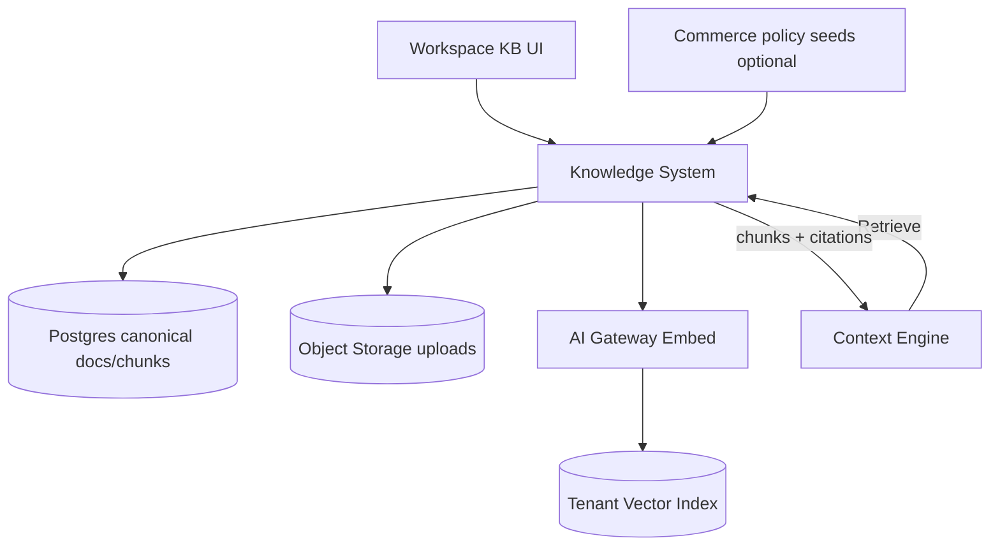
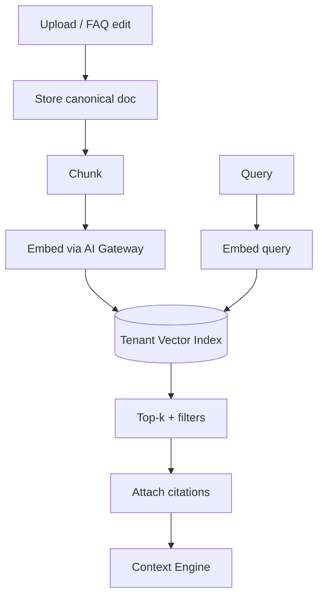
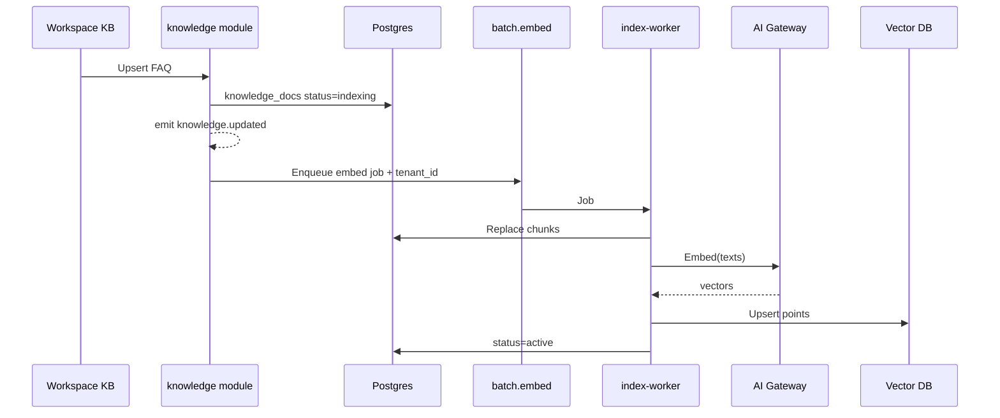
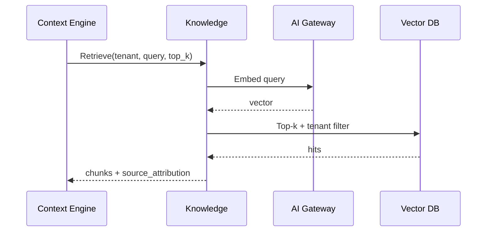
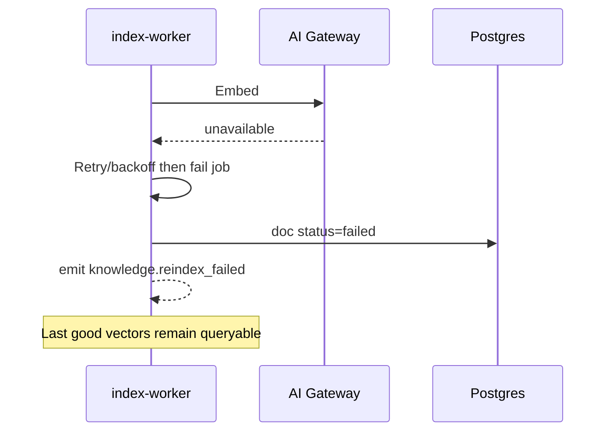

# Knowledge & RAG Design

## Metadata

| Field | Value |
|-------|-------|
| **Version** | 0.1 |
| **Status** | Active — Knowledge Base + RAG for DeloRey AI MVP |
| **Owner** | Founder / AI Platform / Backend |
| **Last Updated** | July 25, 2026 |
| **Parent Documents** | [System Architecture](./system-architecture.md) · [Context Engine Design](./context-engine-design.md) · [Database Design](./database-design.md) · [AI Gateway Design](./ai-gateway-design.md) · [Backend Architecture](./backend-architecture.md) · [Domain-Driven Design](./domain-driven-design.md) |
| **Related Documents** | [Product Principles](../02-product/product-principles.md) · [Product Scope](../02-product/product-scope.md) · [User Journey](../02-product/user-journey.md) · [Glossary](../00-overview/glossary.md) · [AI Runtime Architecture](./ai-runtime-architecture.md) · [Pricing Strategy](../01-business/pricing-strategy.md) |

**Audience:** AI Platform, Backend (`knowledge` + `index-worker`), Frontend (KB UI), QA / evaluation.

**Authority:** Deepens System Architecture §9 (Knowledge System) and Glossary definitions of Knowledge Base, RAG, Embedding, Vector Database. Does not replace Commerce Core as catalog SoR. Does not invent OUT-OF-MVP knowledge products (enterprise approval workflows as center, multi-corpus marketplace packs).

If conflict:

```
Product Scope / Principles (Ground answers in Knowledge, Transparent AI)
    ↓
System Architecture / Context Engine Design
    ↓
Database Design
    ↓
This document
```

---

# 1. Purpose

The **Knowledge System** stores, indexes, and retrieves merchant knowledge that **storefront sync alone cannot cover**:

- FAQ / policy overrides  
- Uploaded documents (PDF/text)  
- Brand / policy text  

with **source attribution** for Transparent AI ([System Architecture](./system-architecture.md) §9; [Glossary](../00-overview/glossary.md)).

**RAG (Retrieval-Augmented Generation)** is the pattern: retrieve relevant merchant chunks (and Commerce facts via Context Engine) **before** generation — so answers reflect what the merchant sells and promises, not model prior knowledge ([Glossary](../00-overview/glossary.md); [Product Principles](../02-product/product-principles.md)).



---

# 2. Scope Split: Knowledge vs Commerce

| Concern | System of record | Knowledge role |
|---------|------------------|----------------|
| Catalog, variants, price, stock | **Commerce Core** | May reference in answers via Context; not duplicated as primary truth |
| Orders / status | **Commerce Core** | Not a KB substitute for Order Lookup Skill |
| Shipping / returns / COD structured fields | Commerce policies (synced) | Optional **seed**; merchant FAQ/overrides win for edge cases |
| FAQ, edge policies, sizing charts, brand guides | **Knowledge Base** | Canonical for RAG |

Without Commerce Core, DeloRey is a generic chatbot. Without Knowledge, policy/edge answers stay thin and escalate ([User Journey](../02-product/user-journey.md) failure: thin KB).

**Non-goal:** Billing by Knowledge Base size ([Pricing Strategy](../01-business/pricing-strategy.md); [DDD](./domain-driven-design.md)).

**Non-goal:** Unstructured dump without attribution ([Product Scope](../02-product/product-scope.md)).

---

# 3. Document Types (MVP)

Aligned with [Database Design](./database-design.md) `knowledge_docs.doc_type`:

| `doc_type` | Origin | Canonical body | Object Storage |
|------------|--------|----------------|----------------|
| `faq` | Merchant Workspace | `body_text` | No |
| `policy_override` | Merchant Workspace | `body_text` | No |
| `upload` | Merchant upload (PDF/text) | Extracted/derived text + file | Yes — `tenants/{tenant_id}/knowledge/{doc_id}/…` |

Optional: Commerce Core may **seed** policy text into Knowledge for indexing — seeds are not a substitute for merchant overrides.

Each doc carries **`source_attribution`** (merchant-visible label) for Transparent AI.

### Status

| `status` | Meaning |
|----------|---------|
| `active` | Retrievable |
| `indexing` | Write accepted; embed/reindex in progress |
| `failed` | Reindex failed — Workspace visible; last good index still served when possible |

---

# 4. Canonical Data Model

From [Database Design](./database-design.md):

### `knowledge_docs` (SoR)

| Field | Role |
|-------|------|
| `id`, `tenant_id` | Identity + isolation |
| `doc_type` | faq / policy_override / upload |
| `title`, `body_text` | Canonical text |
| `source_attribution` | Inspectable source |
| `object_key` | Upload path |
| `status` | active / indexing / failed |
| timestamps | |

### `knowledge_chunks`

| Field | Role |
|-------|------|
| `id`, `tenant_id`, `knowledge_doc_id` | |
| `ordinal` | Order within doc |
| `content` | Chunk text |
| `embedding_ref` | Vector point / collection key |

**Invariant:** Embeddings are **rebuildable** from canonical docs. Vector payload must include `tenant_id` + `knowledge_doc_id` + `chunk_id` (+ `source_attribution`).

---

# 5. Write Path (Ingest & Index)

Authoritative RAG pipeline ([System Architecture](./system-architecture.md) §9):



### Steps

| Step | Behavior |
|------|----------|
| **1. Validate** | AuthZ: Workspace members of tenant only; size limits; malware scan on uploads; reject corrupt uploads |
| **2. Store canonical** | Upsert `knowledge_docs`; store upload bytes under tenant prefix |
| **3. Emit** | `knowledge.updated` |
| **4. Enqueue** | `batch.embed` / reindex job with `tenant_id` ([Backend Architecture](./backend-architecture.md)) |
| **5. Chunk** | Split canonical text into `knowledge_chunks` (ordinal preserved) |
| **6. Embed** | `AI Gateway.Embed` with `task_class=embed.knowledge` |
| **7. Index** | Upsert vectors into tenant collection/filter |
| **8. Activate** | Set doc `active`; on failure → `failed` + `knowledge.reindex_failed`; **serve last good index** |

### Incremental vs batch

| Change | Strategy |
|--------|----------|
| FAQ / policy text edit | Incremental reindex that doc’s chunks |
| Upload replace | Re-chunk + re-embed doc |
| Tenant provision | Empty vector namespace ([System Architecture](./system-architecture.md) provisioning) |
| Embed provider down | Queue reindex; serve last good index; alert |

Async **index-worker** must stay off the interactive turn path so reindex storms do not inflate reply latency.

### Cost Layer invalidation

On `knowledge.updated`, invalidate response/semantic cache keys that include knowledge content hash / sync version ([System Architecture](./system-architecture.md) §12; [Database Design](./database-design.md)).

---

# 6. Read Path (Retrieval API for Context Engine)

Context Engine calls Knowledge — it does not own indexing ([Context Engine Design](./context-engine-design.md)).

### Contract

```
Retrieve(tenant_id, query, filters?, top_k) →
  chunks[] { chunk_id, knowledge_doc_id, content, score, source_attribution }
  + diagnostics { latency, empty, fallback_used, cache_hit? }
```

### Pipeline

| Step | Behavior |
|------|----------|
| Embed query | `AI Gateway.Embed` `task_class=embed.query` (skip if Cost/rules already satisfied another path) |
| Vector search | Top-k + **mandatory tenant filter** / tenant collection |
| Citations | Attach source ids + attribution labels |
| Return | Ranked chunks to Context Engine → `ContextBundle.knowledge` |

### Fallback (required)

On **Vector DB timeout**: fall back to **keyword / FAQ exact match** if available; else mark empty/failed so Runtime prefers escalate / “I don’t know” over inventing policy ([System Architecture](./system-architecture.md) §8–9; [Context Engine Design](./context-engine-design.md)).

### Empty retrieval

Runtime / Context obligations: prefer escalate or “I don’t know” for policy asks — **never invent policy** ([Product Principles](../02-product/product-principles.md)).

---

# 7. Keyword / FAQ Store (fallback & Cost rules)

Architecture requires FAQ exact match / Rule Engine paths for Cost First and vector fallback.

| Use | Behavior |
|-----|----------|
| Cost Rule Engine | Exact FAQ id hit → deterministic reply without premium LLM when applicable |
| Vector timeout fallback | Keyword / exact match over FAQ/override text |
| Implementation | Postgres full-text or exact title/id lookup on `knowledge_docs` / chunks — tenant-scoped |

This is not a separate product; it is part of Knowledge retrieval resilience + Cost Layer.

---

# 8. Merchant Correction Loop

Product operating rhythm ([User Journey](../02-product/user-journey.md) Stage 11):

```
Dashboard knowledge gaps / escalations
    → Merchant edits FAQ / policy / upload
    → Reindex
    → Retest conversation
    → Live improvement
```

Principles: **Improve from correction** — same mistake must not repeat ([Product Principles](../02-product/product-principles.md)).

Frontend shows index status (indexing/failed/active) — never imply upload = instantly learned without status ([Frontend Architecture](./frontend-architecture.md)).

Evaluation / quality loops consume citations + audit; Knowledge must keep attribution stable across reindexes (doc id stable; chunk ids may rotate if re-chunked — audit stores refs available at answer time).

---

# 9. Tenant Isolation & Security

| Control | Requirement |
|---------|-------------|
| Postgres | `tenant_id` on docs/chunks; RLS or equivalent |
| Vector | Per-tenant collection **or** hard filter + CI leakage tests — never shared undeclared corpora |
| Object Storage | `tenants/{tenant_id}/knowledge/...` + IAM |
| Jobs | `tenant_id` required; worker validates |
| AuthZ | Only Workspace members of tenant read/write KB |
| Uploads | Malware scan; size limits; reject corrupt files |
| Logs | No secrets; minimize PII in indexed text when merchants paste secrets (validation guidance) |

Cross-tenant leakage is a company-ending failure mode ([Product Principles](../02-product/product-principles.md) — Tenant Isolation).

---

# 10. Events

| Event | When | Consumers |
|-------|------|-----------|
| `knowledge.updated` | Canonical doc created/updated/deleted | index-worker; Cost cache invalidator |
| `knowledge.reindex_failed` | Embed/index failure after retries | Workspace health; ops alert |

Consumers are idempotent; at-least-once delivery ([System Architecture](./system-architecture.md) §13).

---

# 11. Observability

| Signal | Purpose |
|--------|---------|
| Index lag | Time from doc update → searchable |
| Embed queue depth | Backpressure / provider issues |
| Retrieval hit rate | Empty vs non-empty |
| Citation coverage | Grounded answers with source ids |
| Fallback rate | Vector timeout → keyword path |
| Reindex failure rate | `knowledge.reindex_failed` |

Workspace surfaces **index health** to merchants (Supporting control plane).

---

# 12. Sequence Diagrams

### A. Merchant FAQ edit → searchable



### B. Context retrieval with citation



### C. Embed provider outage



---

# 13. NestJS Module Shape

Aligned with [Backend Architecture](./backend-architecture.md):

```
modules/knowledge/
  knowledge.module.ts
  application/
    upsert-doc.use-case.ts
    retrieve.use-case.ts
    delete-doc.use-case.ts
  domain/
    knowledge-doc.ts
    chunk.ts
  infrastructure/
    doc.repository.ts
    chunk.repository.ts
    object-storage.adapter.ts
    vector.adapter.ts
    keyword-faq.adapter.ts
  api/
    knowledge.controller.ts      # Workspace CRUD + index status
  jobs/
    embed-reindex.processor.ts   # index-worker role
```

Dependencies: `ai-gateway` for Embed only; never provider SDKs inside Knowledge.

---

# 14. MVP vs Later

| Capability | MVP | Later |
|------------|-----|-------|
| FAQ + policy_override + basic PDF/text upload | Required | |
| Chunk → Embed → tenant Vector | Required | |
| Citations / source attribution | Required | |
| Async reindex + last-good serve | Required | |
| Keyword/FAQ fallback | Required | |
| Commerce policy seed (optional) | Allowed | Richer multi-source |
| Approval workflows on KB | No | Business tier / Growth ([Pricing](../01-business/pricing-strategy.md) mentions richer controls later) |
| Query rewrite / hybrid rankers as product theater | Not required | V1 AI quality hardening |
| Skill Marketplace knowledge packs | Forbidden MVP | Platform |

---

# 15. Testing Obligations

| Test | Intent |
|------|--------|
| Isolation | Tenant A query never returns Tenant B chunks |
| Attribution | Retrieve always includes source labels/ids |
| Incremental FAQ | Edit becomes searchable after job; old vectors replaced |
| Provider down | Last good index still retrieves; status=failed visible |
| Corrupt upload | Rejected; no partial poison index |
| Empty retrieve | Diagnostics empty=true — no fabricated chunk content |
| Queue separation | Heavy reindex does not share interactive turn queue |
| Cache invalidation | `knowledge.updated` busts Cost response cache keys |

---

# 16. Related Documents

| Document | Relationship |
|----------|--------------|
| [System Architecture §9](./system-architecture.md) | Parent |
| [Context Engine Design](./context-engine-design.md) | Primary retrieve consumer |
| [AI Gateway Design](./ai-gateway-design.md) | Embed only |
| [Database Design](./database-design.md) | Tables + vector payload |
| [Frontend Architecture](./frontend-architecture.md) | `/knowledge` UI |
| [AI Runtime Architecture](./ai-runtime-architecture.md) | Grounded Answer / escalate on empty |
| Conversation Engine Design (planned) | History separate from KB |

---

# Summary

Knowledge & RAG give DeloRey **grounded policy/FAQ memory** with inspectable sources: canonical docs in Postgres, uploads in Object Storage, embeddings via AI Gateway into **tenant-scoped** vectors, async reindex on `batch.embed`, and retrieval (+ keyword fallback) for the Context Engine. Commerce remains live catalog/order truth; Knowledge covers what sync cannot — never an unattributed dump, never a token/KB-size invoice meter.

---

*Knowledge & RAG Design v0.1. Changes require version bump and written rationale. Product Scope, System Architecture, Context Engine Design, and Database Design override Knowledge enthusiasm when they conflict.*
