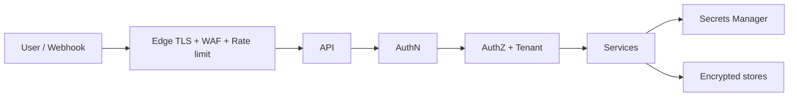

# Security Architecture

## Metadata

| Field | Value |
|-------|-------|
| **Version** | 0.1 |
| **Status** | Active — security defaults for DeloRey AI MVP |
| **Owner** | Founder / Backend / DevOps / Security |
| **Last Updated** | July 25, 2026 |
| **Parent Documents** | [System Architecture](./system-architecture.md) · [API Specification](./api-specification.md) · [Database Design](./database-design.md) · [Backend Architecture](./backend-architecture.md) · [AI Runtime Architecture](./ai-runtime-architecture.md) · [AI Gateway Design](./ai-gateway-design.md) |
| **Related Documents** | [Product Principles](../02-product/product-principles.md) · [Product Scope](../02-product/product-scope.md) · [Conversation Engine Design](./conversation-engine-design.md) · [Knowledge & RAG Design](./knowledge-rag-design.md) · [Frontend Architecture](./frontend-architecture.md) |

**Audience:** Backend, AI Platform, DevOps, Frontend (secret handling), QA (isolation/IDOR tests).

**Authority:** Deepens System Architecture §15–16 and *Security By Default*. Security is **default**, not an enterprise add-on. Does not invent Platform-only controls (SSO depth, multi-brand fleet RBAC) as MVP blockers.

If conflict:

```
Product Principles (Security By Default, Tenant Isolation, Humans Control)
    ↓
System Architecture (§15 Multi-Tenant, §16 Security)
    ↓
API / Database / Runtime / Gateway designs
    ↓
This document
```

---

# 1. Purpose

Protect:

1. **Merchant commerce data** (catalog, orders, storefront credentials)  
2. **Shopper PII** (messages, identities)  
3. **Tool blast radius** (Skills that could mutate commerce)  
4. **AI cost / abuse** (Gateway and turn floods)  
5. **Trust mechanics** (handoff, audit, no vanity automation by hiding escalations)

One **cross-tenant** incident ends the company ([Product Principles](../02-product/product-principles.md) — Tenant Isolation).



([System Architecture](./system-architecture.md) §16)

---

# 2. Security Principles (product-aligned)

| Principle | Security consequence |
|-----------|----------------------|
| **Security By Default** | Authn/z, encryption, least privilege, safe tools — not pre-enterprise checklist |
| **Tenant Isolation** | Hard boundaries across all stores; fail closed |
| **Humans Control AI** | Guardrails hard stops; handoff first-class; no unguarded refund/cancel in MVP |
| **Transparent AI** | Audit of what Employee knew, tools, escalations — without secrets in audit payloads |
| **Model Independence** | Provider keys only in Gateway/secrets — never in Skills/Runtime business code |
| **API First** | Every Workspace capability authenticated; UI is not a backdoor |
| **Fail safe** | Prefer degrade + escalate over confident wrong automation when deps fail |

---

# 3. Threat Model (MVP themes)

Authoritative themes from System Architecture §16 — expanded only with mitigations already required elsewhere in docs:

| Threat | Impact | Mitigation |
|--------|--------|------------|
| **Cross-tenant data leak** | Company-ending | `tenant_id` everywhere; RLS/predicates; CI isolation + IDOR chaos tests; fail closed |
| **Prompt injection → policy bypass** | Wrong discounts, forbidden mutations, data exfil via tools | Guardrails hard stops; **tool permission checks after model suggestions**; Gateway not sole safety layer |
| **Stolen bot / storefront token** | Channel hijack / catalog scrape | Encrypted storage / secrets manager; rotation; mark channel disconnected; health in Workspace |
| **Abuse / cost bomb** | Runaway LLM spend | Per-tenant rate + Gateway budget limits; queue fair scheduling |
| **Insider access** | Merchant data exposure | Least privilege; audit admin access |
| **Webhook forgery / replay** | Fake messages / double turns | Signature verification; replay skew window; idempotency keys |
| **Widget origin abuse** | Session creation from evil sites | Origin allowlists per merchant domain |
| **Upload malware** | Host compromise | Scan uploads; size limits; reject corrupt ([Knowledge & RAG](./knowledge-rag-design.md)) |
| **Log/PII leakage** | Privacy incident | Minimize PII in logs/prompts; redact; retention limits |
| **Hallucinated price/stock as “security of trust”** | Brand damage | Sync health gates; never invent; escalate — treated as P0/P1 product failure |

OWASP-oriented hygiene (injection, broken authZ, SSRF via connectors, insecure deserialization in uploads) is implied by AuthZ-on-every-API, parameterized DB access, signed webhooks, and upload validation — not a separate product SKU.

---

# 4. Authentication (AuthN)

| Actor | Mechanism | Source |
|-------|-----------|--------|
| Merchant | Signup / login, **secure sessions**, password reset | Product Scope; API `/v1/auth` |
| Shopper (Website Widget) | Short-lived **widget session** — not merchant JWT | API Specification |
| Telegram / Bale | Bot token + webhook authenticity | Channel Adapters |
| Storefront | OAuth / API credentials | Commerce connectors |
| Ops | Separate ops auth — not Workspace JWT | API Specification |

### Session rules (MVP)

- HTTP-only, secure cookies (or equivalent session token).  
- Logout invalidates session.  
- Password stored as hash only — never plaintext, never in prompts/logs.  
- Future SSO hooks allowed in Auth Service shape; **SSO depth is Platform/Enterprise**, not MVP requirement ([Product Scope](../02-product/product-scope.md)).

---

# 5. Authorization (AuthZ / RBAC)

| Rule | Requirement |
|------|-------------|
| Workspace scope | All merchant APIs require membership on that Workspace |
| Least privilege | Roles on `workspace_memberships` ([Database Design](./database-design.md)) |
| Enforce on every API | No unauthenticated Workspace mutation ([Product Principles](../02-product/product-principles.md)) |
| Inbox / KB / Employee | Mutations only for members of tenant |
| Cross-tenant IDOR | Return 403/404 **without** leaking existence across tenants ([API Specification](./api-specification.md)) |

MVP may start with simple roles (e.g. owner/member); deep enterprise RBAC is later. Shape must not require rewriting tenant checks later.

---

# 6. Multi-Tenant Isolation

Runtime may be shared; **data must not** ([System Architecture](./system-architecture.md) §15; [Glossary](../00-overview/glossary.md)).

### Isolation matrix

| Resource | Mechanism |
|----------|-----------|
| PostgreSQL | `tenant_id` mandatory; RLS **or** repository predicates; CI tests |
| Redis | Prefix `t:{tenant_id}:` — no unscoped merchant keys |
| Vector DB | Per-tenant collection **or** mandatory filter + leakage tests |
| Object Storage | Prefix `tenants/{tenant_id}/` + IAM |
| Queues / Jobs | `tenant_id` in envelope; worker validates before side effects |
| Logs / Traces | Tenant attribute on every span/log; access control on queries |
| Analytics | Tenant-scoped aggregates only |
| Memory / History / Embeddings | Tenant-bound |
| Channel / store credentials | Per-tenant secrets |

### Fail closed

| Case | Behavior |
|------|----------|
| Missing tenant context | Reject |
| Job without tenant | Dead-letter + alert |
| Cache key without tenant | Treat as bug |
| Adapter-supplied tenant without binding lookup | Never trust — bind via ChannelBinding ([Conversation Engine](./conversation-engine-design.md); Runtime security) |

### Mandatory tests

Automated **cross-tenant isolation** tests in CI. Chaos/IDOR attempts across APIs ([System Architecture](./system-architecture.md) §15).

---

# 7. Secrets Management

| Secret | Storage | Never |
|--------|---------|-------|
| Storefront OAuth / API tokens | Secrets manager and/or encrypted columns | Repo, prompts, logs, API GET bodies |
| Bot tokens (Telegram/Bale) | Same | Returned in channel GET |
| LLM provider API keys | Secrets manager; Gateway plugins only | Skills/Runtime/Frontend |
| Widget embed public material | Public by design | Must not equal storefront secret |

### Rotation & compromise

- Stolen bot token → encrypt at rest already; **rotate**; mark channel **disconnected**; Workspace recovery ([System Architecture](./system-architecture.md) threat table).  
- Config via environment + secret store; **no secrets in images** ([System Architecture](./system-architecture.md) Deployment).

---

# 8. Transport & Encryption at Rest

| Layer | Requirement |
|-------|-------------|
| Transport | **TLS everywhere** |
| Edge | TLS termination + WAF + rate limit |
| Message bodies | Encryption at rest ([Conversation Engine](./conversation-engine-design.md); Database Design) |
| Sensitive fields | Encrypt (credentials refs, PII-heavy fields as designed) |
| Object Storage | Encrypted buckets; tenant prefix IAM |
| CDN widget | Public assets only — no secrets in bundle |

---

# 9. Webhook & Widget Security

### Webhooks

| Control | Requirement |
|---------|-------------|
| Signature verification | Where channel/storefront provides it |
| Replay protection | Reject outside skew window ([System Architecture](./system-architecture.md) Channel Adapters) |
| Binding lookup | Resolve `tenant_id` from binding — not request body claim |
| Idempotency | `idempotency_key` → no double Runtime execution |
| Fast ack | Heavy work on queues |

### Widget

| Control | Requirement |
|---------|-------------|
| Origin allowlist | Per merchant domain |
| Session minting | Validates public embed key + origin |
| No merchant JWT in browser for admin APIs | Widget client is restricted ([API Specification](./api-specification.md)) |
| CSP / embed errors | Frontend diagnostics — Runtime never assumes identity without adapter confirmation ([User Journey](../02-product/user-journey.md)) |

---

# 10. AI / Runtime / Tool Safety

| Control | Requirement |
|---------|-------------|
| Secrets in prompts | **Never** |
| Guardrails | Hard stops: blocked topics, discount caps, restricted mutations |
| Tool permissions | Check **after** model suggestions — do not trust the model to self-police |
| MVP mutations | Order lookup **read-heavy**; **no unguarded refund/cancel** |
| Gateway | Not sole safety layer; coordinates with Guardrails ([AI Gateway Design](./ai-gateway-design.md)) |
| Provider SDKs | Only inside `ai-gateway` plugins |
| Context bundle | Strip secrets; minimize PII ([Context Engine Design](./context-engine-design.md)) |
| Audit | Tools/sources/escalations without secret material |

Prompt injection that tries to bypass discount caps or force refunds must fail at Guardrails + tool scope — not “model said so.”

---

# 11. Rate Limiting & Abuse

| Layer | Purpose |
|-------|---------|
| Edge WAF / rate limit | Generic flood protection |
| Per-tenant API limits | Workspace abuse |
| Per-tenant Gateway limits | Cost bomb / LLM abuse ([System Architecture](./system-architecture.md); AI Gateway) |
| Queue fair scheduling | One merchant cannot starve others’ interactive turns |
| Channel API quotas | Respect Telegram/Bale limits |

Cost Layer + Gateway metering support budgets; commercial hard caps align with Pricing when Billing V1 ships — security still enforces technical limits in MVP.

---

# 12. PII, Retention, Privacy

| Rule | Requirement |
|------|-------------|
| Minimize PII in logs | Redact |
| Minimize PII in prompts | Only what the turn needs |
| Message retention | Limits aligned with privacy policy |
| Audit retention | Longer for trust/dispute — still no secrets |
| Deletion | Tenant-scoped delete/archive jobs ([Database Design](./database-design.md)) |
| Cache | Do not cache PII-heavy personalized replies across shoppers |

---

# 13. Audit & Accountability

| Requirement | Notes |
|-------------|-------|
| Immutable-ish Employee action trail | `audit_turns` |
| Transparent AI for merchants | What was known, tools, replies, escalations |
| Admin/ops access | Audit insider access; least privilege |
| Hallucination / cross-tenant / sync incidents | Principle-linked postmortems ([Product Principles](../02-product/product-principles.md) Incident Reviews) |

Disabling handoff to fake automation metrics is a **trust/security-of-product** violation, not only a UX issue.

---

# 14. Supply Chain & CI

| Control | Requirement |
|---------|-------------|
| Dependency scanning | On app and provider SDK plugins |
| Least privilege CI roles | No production secret sprawl |
| Isolation tests in CI | Mandatory before channel polish ([System Architecture](./system-architecture.md) Backend guidance) |
| Secrets in CI | Injected, not committed |

---

# 15. Knowledge Upload Security

| Control | Requirement |
|---------|-------------|
| Malware scanning | On uploads |
| Size limits | Enforce |
| Corrupt files | Reject with validation error |
| AuthZ | Only Workspace members of tenant |
| Tenant path | `tenants/{id}/knowledge/...` |

---

# 16. Frontend Security Obligations

| Rule | Notes |
|------|-------|
| No storefront/bot secrets in browser | API never returns them |
| Widget bundle | No embedded provider keys |
| XSS hygiene | Standard React escaping; merchant-authored KB rendered safely |
| Auth cookies | Secure attributes; CSRF strategy appropriate to cookie auth |
| Observability | Client errors without PII/secrets ([Frontend Architecture](./frontend-architecture.md)) |

---

# 17. Security Control Checklist (MVP)

Mapped from System Architecture §16 Controls:

| Area | MVP bar |
|------|---------|
| AuthN | Signup/login, secure sessions, password reset |
| AuthZ | Workspace-scoped least privilege |
| Secrets | Secrets manager / encrypted columns |
| Transport | TLS everywhere |
| At rest | Sensitive fields + storage encryption |
| Tenant isolation | Matrix §6 + CI tests |
| Prompt safety | No secrets in prompts; Guardrails |
| Tool safety | Scoped Skills; no unguarded refund/cancel |
| PII | Minimize, redact, retention |
| Webhook security | Signatures + replay protection |
| Audit | Employee action trail |
| Supply chain | Dependency scan + least-privilege CI |
| Rate / abuse | Edge + per-tenant Gateway/API limits |

---

# 18. Explicit Non-Goals (MVP)

| Non-goal | Why |
|----------|-----|
| Enterprise SSO / SAML as MVP blocker | Platform / Enterprise later |
| Multi-brand fleet governance RBAC | Single-store MVP |
| Customer-facing “security marketplace” | Out of category |
| Using security theater to skip handoff | Violates Humans Control |
| Exposing AI Gateway as public LLM API | Wrong product ([API Specification](./api-specification.md)) |

---

# 19. Testing Obligations

| Test | Intent |
|------|--------|
| Cross-tenant read/write | Fail closed |
| IDOR chaos | Guess UUIDs across tenants |
| Webhook without valid signature | Reject |
| Replay outside skew | Reject |
| Widget bad origin | Reject session |
| Secrets scrub | Logs/prompts/audit fixtures clean |
| Guardrail + tool scope | Model-requested refund blocked |
| Rate limit | Tenant cannot unbounded Gateway call |
| Upload malware/corrupt | Rejected |

Detailed AI eval / load tests belong in Testing Strategy; security tests above are **ship gates**.

---

# 20. Related Documents

| Document | Relationship |
|----------|--------------|
| [System Architecture §15–16](./system-architecture.md) | Parent |
| [API Specification](./api-specification.md) | Authn/z surface |
| [Database Design](./database-design.md) | RLS, encryption, prefixes |
| [AI Runtime Architecture](./ai-runtime-architecture.md) | Tool/prompt safety |
| [AI Gateway Design](./ai-gateway-design.md) | Provider keys, abuse limits |
| [Conversation Engine Design](./conversation-engine-design.md) | Webhook idempotency, message encryption |
| [Knowledge & RAG Design](./knowledge-rag-design.md) | Upload safety, vector isolation |
| [DevOps & Infrastructure](./devops-infrastructure.md) | WAF, TLS, secret injection, backup access control |
| Testing Strategy (planned) | Isolation + security suite |

---

# Summary

DeloRey security is **tenant-fail-closed, secret-safe, tool-scoped, and audit-visible by default**: TLS, AuthN/Z, isolation across Postgres/Redis/Vector/Object/Queues, signed webhooks, Guardrails over prompt injection, Gateway rate/budget limits, and no unguarded commerce mutations in MVP. Enterprise SSO and fleet RBAC wait; cross-tenant isolation and handoff integrity do not.

---

*Security Architecture v0.1. Changes require version bump and written rationale. Product Principles and System Architecture override security enthusiasm when they conflict.*
