# System Architecture

## Metadata

| Field | Value |
|-------|-------|
| **Version** | 0.1 |
| **Status** | Active — primary system architecture for Backend, Frontend, AI, and DevOps |
| **Owner** | Founder / Engineering |
| **Last Updated** | July 25, 2026 |
| **Related Documents** | [Product Vision](../02-product/product-vision.md) · [Product Principles](../02-product/product-principles.md) · [Product Scope](../02-product/product-scope.md) · [User Journey](../02-product/user-journey.md) · [Roadmap](../00-overview/roadmap.md) · [Glossary](../00-overview/glossary.md) · [Product Moat](../01-business/product-moat.md) · [Business Plan](../01-business/business-plan.md) · [Lean Canvas](../00-overview/lean-canvas.md) · [Market Research](../01-business/market-research.md) · [Pricing Strategy](../01-business/pricing-strategy.md) · [Go-To-Market](../01-business/go-to-market.md) · [AI Runtime Architecture](./ai-runtime-architecture.md) · [Domain-Driven Design](./domain-driven-design.md) · [Database Design](./database-design.md) · [Backend Architecture](./backend-architecture.md) · [Frontend Architecture](./frontend-architecture.md) · [AI Gateway Design](./ai-gateway-design.md) · [Context Engine Design](./context-engine-design.md) · [Knowledge & RAG Design](./knowledge-rag-design.md) · [Conversation Engine Design](./conversation-engine-design.md) |

**Audience:** Backend, Frontend, AI Platform, DevOps, Security, and anyone designing or reviewing system changes.

**Authority:** Architecture implements Product. If this document conflicts with Product documents, Product wins in this order:

```
Product Vision
    ↓
Product Principles
    ↓
Product Scope
    ↓
User Journey
    ↓
Roadmap
```

Never invent features outside Product Scope. Never expand MVP. Never contradict Product Principles.

---

# 1. Architecture Philosophy

DeloRey AI is an **AI Commerce Platform**, not a CRUD SaaS with a chat widget bolted on. The center of gravity is the **AI Employee Runtime**. Databases, REST APIs, and UIs exist to serve that Runtime — not the other way around.

### Governing beliefs

| Belief | Architectural consequence |
|--------|---------------------------|
| **AI First** | Request paths optimize for grounded conversation turns, not resource CRUD. |
| **Context Before Intelligence** | No LLM call without Context Engine assembly (catalog, inventory, orders, policies, Knowledge, history, Memory). |
| **Runtime First** | All conversations pass one Runtime. Channels are adapters only. |
| **One Brain, Multiple Channels** | Website, Telegram, and Bale share Skills, Knowledge, Memory, and guardrails. |
| **AI Provider Independence** | Business logic never imports OpenAI, Anthropic, or any vendor SDK directly. All calls go through **AI Gateway**. |
| **Cost First** | Token spend is a first-class constraint. Cheap paths (cache, rules, retrieval, small models) run before premium models. |
| **Multi Tenant by Design** | Isolation is structural across DB, Redis, Vector DB, storage, queues, jobs, logs, analytics, Memory, embeddings. |
| **Humans Control AI** | Guardrails, audit logs, Human Handoff, approval flows, and Runtime validation are core — not enterprise extras. |
| **Event Driven Where Valuable** | Sync, conversation lifecycle, Knowledge updates, and attribution use events. Not “Event Driven Everything.” |
| **Fail Safe** | Prefer degrade + escalate over fluent wrong answers when sync is stale or tools fail. |
| **API First** | Workspace is a client of stable APIs. UI is not the source of truth. |
| **Depth Before Breadth** | MVP hardens three channels and Sales Employee quality before Instagram, WhatsApp, or platform theater. |

### What this architecture refuses

| Refused pattern | Why |
|-----------------|-----|
| Channel-native business rules | Forks product truth; breaks One Brain |
| Direct LLM answers without context | Hallucination theater |
| Vendor lock-in in Skills / Runtime | Provider independence fails |
| Ticket-centric data model | Wrong product identity (not helpdesk) |
| Visual flow / workflow builder as core | Chatbot-builder gravity |
| Disabling handoff to inflate automation | Trust anti-pattern |
| Silent sync failure | Stale catalog is a P0 product incident |

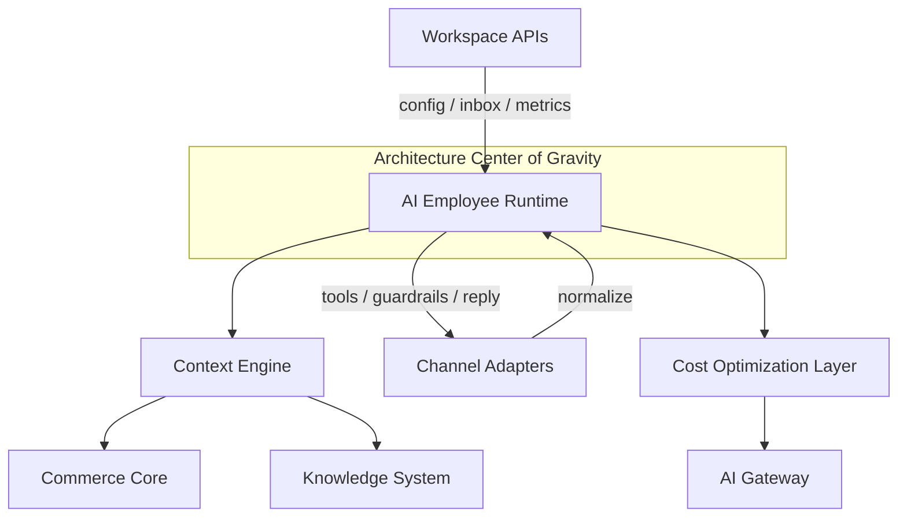

---

# 2. High Level Architecture

### System context

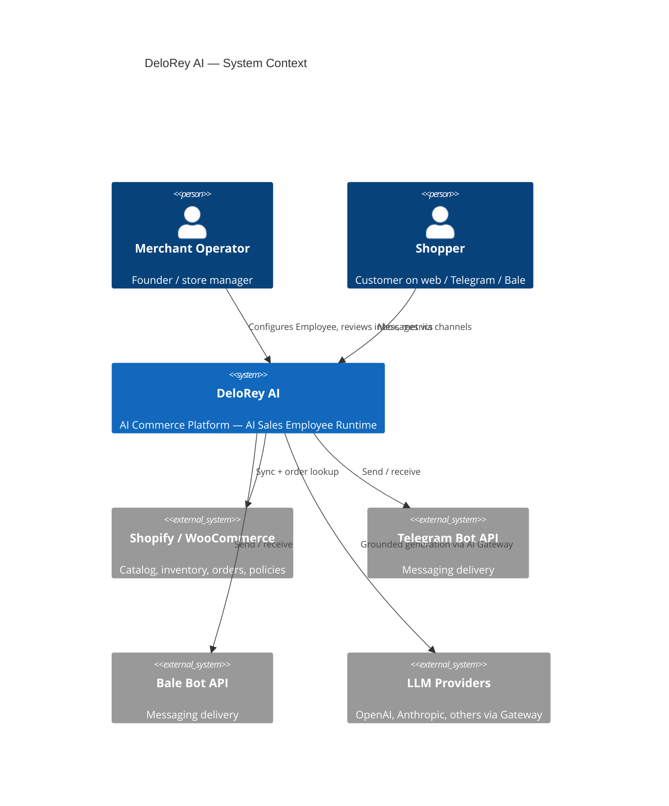

### Logical topology

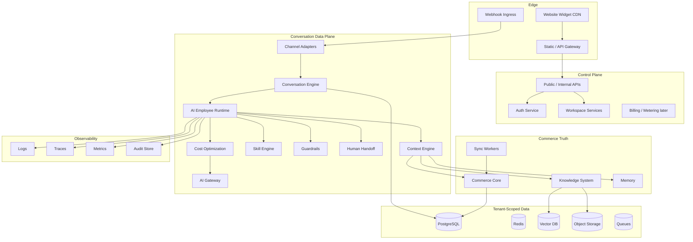

### MVP capability mapping (architecture ↔ Product Scope)

| Product capability | Primary components |
|--------------------|--------------------|
| Authentication / Workspace | Auth Service, Workspace APIs, Tenant provisioning |
| Tenant Isolation | Tenant context middleware, row/index/key scoping |
| Commerce Core / Catalog Sync / Order Lookup | Commerce Core + Sync Workers + Skills |
| Knowledge Base | Knowledge System + Vector index + Object Storage |
| Context Engine | Context Engine |
| AI Sales Employee | Runtime + Skills + Guardrails |
| Website / Telegram / Bale | Channel Adapters |
| Conversation History | Conversation Engine + PostgreSQL |
| Human Handoff | Handoff service + Workspace Inbox |
| Settings / Guardrails | Config store + Guardrails enforcement in Runtime |
| Revenue Dashboard / Analytics | Event pipeline + metrics store |
| Audit Logs | Audit Store + Runtime instrumentation |

**Out of MVP architecture surface:** Instagram, WhatsApp, email, voice, CRM/helpdesk SoR, marketing automation, visual flow builders, Skill Marketplace, multi-agent orchestration, white label, native apps, advanced BI.

---

# 3. Architecture Layers

Layers are dependency-ordered. Upper layers may call lower layers; lower layers must not depend on upper UI concepts.

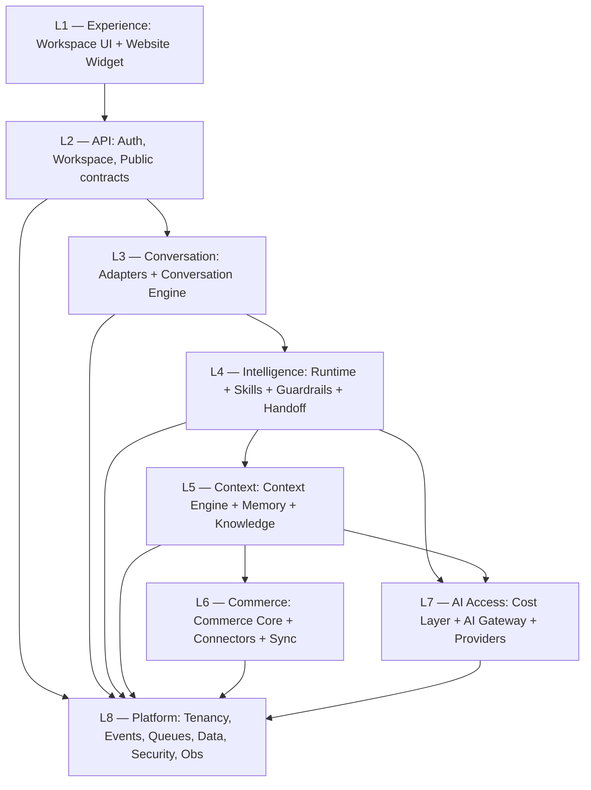

| Layer | Purpose | Owns | Must not own |
|-------|---------|------|--------------|
| **L1 Experience** | Merchant and shopper surfaces | Screens, widget UX, formatting | Discount policy, catalog truth |
| **L2 API** | Stable contracts | AuthZ, DTOs, versioning | Prompt logic, channel forks |
| **L3 Conversation** | Thread lifecycle | Identity links, message persistence, delivery | Skill business rules |
| **L4 Intelligence** | Decide and act | Skills, guardrails, handoff, Employee goals | Storefront API details |
| **L5 Context** | Assemble truth | Retrieval plans, memory selection, context budget | Channel delivery |
| **L6 Commerce** | Live business data | Sync, connectors, inventory/order APIs | LLM prompts |
| **L7 AI Access** | Model I/O | Routing, cache, providers, token metering | Merchant policy |
| **L8 Platform** | Shared substrate | Tenancy, events, storage, security, observability | Product opinions beyond isolation |

---

# 4. Core Components

Overview of MVP core components. Detailed sections follow for Runtime, Gateway, Commerce, Context, Knowledge, Conversation, Channels, and Cost.

| Component | One-line purpose |
|-----------|------------------|
| **API Gateway / Edge** | TLS termination, routing, rate limits, WAF |
| **Auth Service** | Merchant identity, sessions, password reset, future SSO hooks |
| **Workspace Services** | Employee config, channels, inbox, KB editors, sync health, dashboard |
| **Tenant Manager** | Provision isolation boundaries and tenant metadata |
| **Channel Adapters** | Normalize Website / Telegram / Bale ↔ Conversation events |
| **Conversation Engine** | Threads, messages, ownership (AI vs human), continuity |
| **AI Employee Runtime** | Orchestrate turn: context → decide → tools → guardrails → reply/escalate |
| **Skill Engine** | Product search, recommend, order status, escalate |
| **Guardrails** | Hard stops: blocked topics, discount caps, mutation policy |
| **Human Handoff** | Pause AI, context packet, inbox assignment, resume |
| **Context Engine** | Assemble per-turn business state within token budget |
| **Memory** | Conversation + Customer Profile continuity |
| **Knowledge System** | FAQ/policies/uploads + RAG indexing |
| **Commerce Core** | Catalog, inventory signals, pricing, policies, orders |
| **Sync Workers** | Initial + incremental storefront ingest |
| **Cost Optimization Layer** | Cache, classify, route, compress before premium LLM |
| **AI Gateway** | Provider-agnostic model access |
| **Event Bus** | Domain events for sync, conversation, Knowledge, attribution |
| **Audit Store** | What Employee knew, tools called, replies, escalations |
| **Analytics / Revenue Intelligence** | Resolution, escalation, grounded answers, conservative attribution |
| **Object Storage** | Uploaded documents, media references |
| **Job / Queue System** | Sync, embed, reindex, notifications |

---

# 5. AI Runtime

The **AI Employee Runtime** is the most important component in the system. Every shopper message that is not owned by a human operator is executed here.

### Purpose

Execute one conversation turn for an AI Sales Employee: gather context, decide among Skills, enforce guardrails, produce a grounded reply or Human Handoff — with full auditability and cost awareness.

### Responsibilities

1. Load Employee configuration (role, tone, language, Skills, guardrails).
2. Resolve Conversation + Customer Profile for the tenant.
3. Invoke Cost Optimization Layer before any expensive model call.
4. Invoke Context Engine to assemble grounded state.
5. Plan and execute Skills/tools under permission scopes.
6. Enforce Guardrails (hard stops, not soft suggestions).
7. Decide: **Answer** | **Recommend** | **Order Lookup** | **Escalate**.
8. Persist audit artifacts (context snapshot refs, tool calls, confidence/escalation reason).
9. Return a channel-agnostic `OutboundMessage` to Conversation Engine.
10. Emit structured Runtime events for analytics and observability.

### Inputs

| Input | Source |
|-------|--------|
| `NormalizedInboundMessage` | Channel Adapter via Conversation Engine |
| `tenant_id`, `employee_id`, `conversation_id` | Conversation Engine |
| Employee config + guardrails | Workspace config store |
| Sync health | Commerce Core |
| Cost / cache signals | Cost Optimization Layer |

### Outputs

| Output | Consumer |
|--------|----------|
| `OutboundMessage` (text, optional product cards/links) | Conversation Engine → Adapter |
| `HandoffRequest` + context packet | Human Handoff → Inbox |
| Audit records | Audit Store |
| Runtime events | Analytics, monitoring |
| Token/cost usage | Metering |

### Dependencies

Context Engine, Skill Engine, Guardrails, Human Handoff, Cost Optimization Layer, AI Gateway (indirect), Commerce Core (via Skills/Context), Knowledge System (via Context), Conversation Engine, Audit Store, Event Bus.

### Runtime turn pipeline

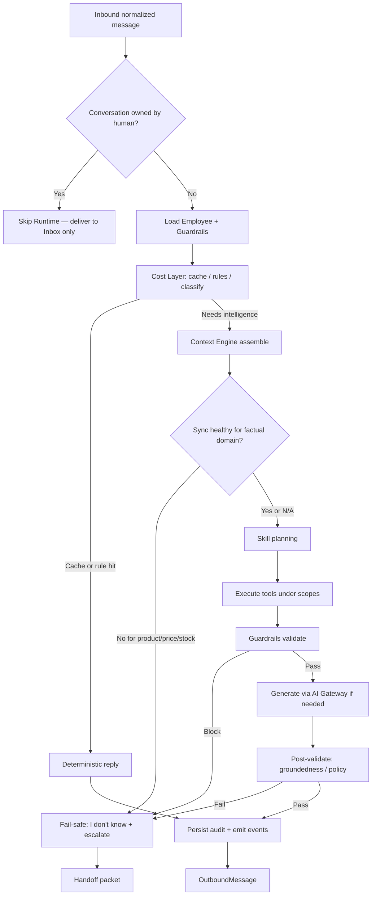

### Sequence — grounded product question

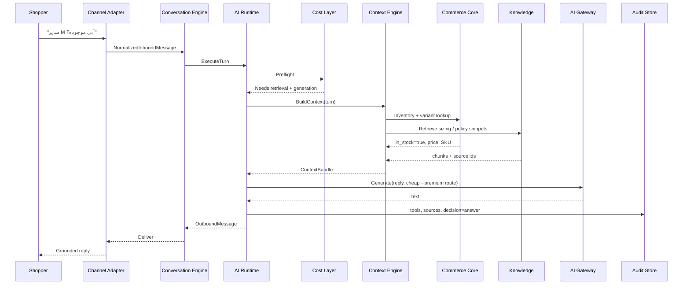

### Failure modes

| Failure | Behavior |
|---------|----------|
| Context Engine timeout | Escalate or safe refusal; never invent stock/price |
| Skill / Commerce tool error | Retry once with backoff; then escalate |
| Guardrail violation | Block action; escalate or ask clarification per policy |
| AI Gateway outage | Failover provider if configured; else degrade + escalate |
| Stale sync for factual ask | Refuse confident facts; surface sync health in Workspace |
| Token budget exceeded | Compress / summarize history; drop low-relevance chunks before premium call |

### Scaling considerations

- Runtime workers are **stateless**; scale horizontally behind a queue or HTTP turn executor.
- Per-tenant concurrency limits prevent one merchant from starving others.
- Separate **interactive** queue (shopper turns) from **batch** (reindex, sync) so sync storms do not inflate reply latency.
- Idempotency key per inbound message delivery to avoid double replies on webhook retries.

### Security considerations

- Every turn carries verified `tenant_id`; never trust adapter-supplied tenant without binding lookup.
- Tool credentials and storefront secrets never enter prompts or logs.
- PII minimization in prompts; redact in logs.
- Skill mutations (future discounts) require scoped permissions + approval path — MVP mutations limited (order lookup read-heavy; no unguarded refund/cancel).

### Observability

| Signal | Examples |
|--------|----------|
| Traces | `runtime.turn`, `context.build`, `skill.*`, `guardrail.check`, `gateway.generate` |
| Metrics | turn_latency_p50/p95, escalation_rate, grounded_answer_rate, tool_error_rate, cost_per_turn |
| Logs | Structured JSON with tenant, conversation, decision, cache_hit, model_route (no secrets) |
| Audit | Context refs, tool I/O summaries, reply, escalation reason |

### Related components

Conversation Engine, Context Engine, Skill Engine, Guardrails, Human Handoff, Cost Optimization Layer, AI Gateway, Commerce Core, Knowledge System, Audit Store, Analytics.

---

# 6. AI Gateway

### Purpose

Provide a **provider-agnostic** interface for embeddings, chat completions, and (later) moderation — with routing, fallback, caching hooks, and token metering. Business logic must never know whether the reply came from OpenAI, Claude, Gemini, Qwen, DeepSeek, Llama, or a future self-hosted model.

### Responsibilities

1. Expose stable internal APIs: `Complete`, `Embed`, `Moderate` (as needed).
2. Register providers as plugins with capability metadata (context window, cost tier, latency class, language quality).
3. Route requests by policy (task type, tenant plan, cost tier, fallback chain).
4. Enforce timeouts, retries, and circuit breakers per provider.
5. Normalize usage (tokens in/out) for metering and cost dashboards.
6. Redact secrets from provider payloads in logs.
7. Support shadow evaluation of new models without changing Runtime code.

### Inputs

| Input | Description |
|-------|-------------|
| `CompletionRequest` | Messages, tools schema (if any), temperature bounds, max tokens, task_class |
| `EmbedRequest` | Texts, model_hint (optional), tenant_id |
| Routing policy | From Cost Layer / tenant plan |

### Outputs

| Output | Description |
|--------|-------------|
| `CompletionResponse` | Text, finish reason, usage, provider_id, model_id |
| `EmbedResponse` | Vectors + usage |
| Errors | Typed: timeout, rate_limit, content_filter, unavailable |

### Dependencies

Provider plugins, Redis (optional response cache keys from Cost Layer), secrets manager, metrics, cost ledger.

### Provider plugin model

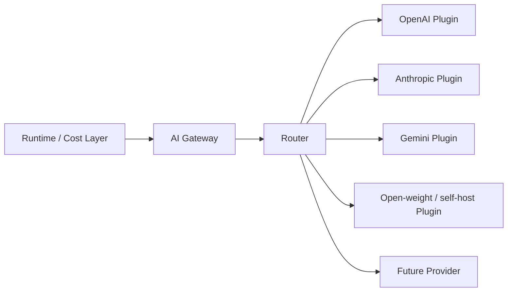

### Failure modes

| Failure | Behavior |
|---------|----------|
| Primary provider 5xx / timeout | Failover to next in chain for that task_class |
| Rate limit | Backoff + alternate provider; surface delay metrics |
| Content filter | Return typed error to Runtime → safe refusal / escalate |
| All providers down | Runtime fail-safe path; alert on-call |

### Scaling considerations

- Gateway is horizontally scalable and stateless aside from circuit state in Redis.
- Connection pooling per provider.
- Separate embed traffic from chat traffic (different SLOs and queues).

### Security considerations

- API keys only in secrets manager; never in repo or tenant DB plaintext.
- Per-tenant abuse limits on Gateway calls.
- Prompt injection defenses coordinated with Guardrails (Gateway is not the sole safety layer).

### Observability

Provider latency, error rate, token usage by tenant/model/task_class, failover counts, cost per 1K tokens.

### Related components

Cost Optimization Layer, Runtime, Knowledge System (embeddings), Context Engine (compression may call small models).

---

# 7. Commerce Core

### Purpose

Own the merchant’s **live commerce truth** required for conversations: catalog, variants, inventory signals, pricing, structured policies (shipping/returns/COD), and orders. Without Commerce Core, DeloRey is a generic chatbot.

### Responsibilities

1. Manage storefront connections (Shopify primary path; WooCommerce equivalent) with tenant-scoped credentials.
2. Run initial and incremental sync jobs; publish sync health (last success, lag, failure reason).
3. Normalize storefront data into internal commerce schema (Commerce Context Graph foundation).
4. Serve read APIs for Context Engine and Skills (product search, inventory, price, order status).
5. Emit domain events: `catalog.updated`, `inventory.updated`, `order.updated`, `sync.failed`, `sync.succeeded`.
6. Enforce that go-live / factual product answers respect sync health.

### Inputs

| Input | Source |
|-------|--------|
| OAuth / API credentials | Merchant via Workspace |
| Storefront webhooks / poll results | Connectors |
| Skill queries | Runtime Skills |
| Context retrieval queries | Context Engine |

### Outputs

| Output | Consumer |
|--------|----------|
| Normalized products, variants, inventory, prices | Context, Skills, search indexes |
| Orders + status fields | Order Status Skill |
| Policy fields | Context / Knowledge seeding |
| Sync health projection | Workspace UI, Runtime fail-safe |

### Dependencies

Connector plugins (Shopify, Woo), Sync Workers, PostgreSQL, Redis (locks/cursors), queues, secret storage, Event Bus.

### Connector pattern

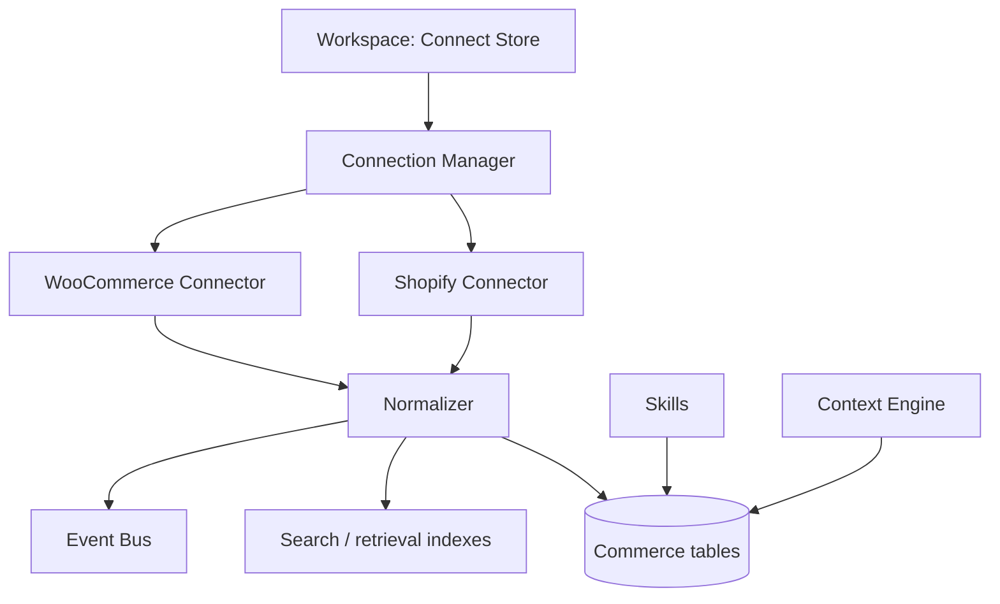

### Failure modes

| Failure | Behavior |
|---------|----------|
| Auth / scope invalid | Mark connection unhealthy; block confident catalog answers |
| Partial sync | Persist what succeeded; mark domains stale; alert merchant |
| Webhook storm | Debounce + queue; idempotent upserts by external id |
| Empty catalog | Visible error; do not allow misleading go-live |

### Scaling considerations

- Per-tenant sync concurrency limits.
- Incremental cursors; prefer webhooks + reconciliation poll.
- Shard large catalogs with batched upserts.
- Read replicas for Context/Skill reads under load.

### Security considerations

- Encrypt credentials at rest; rotate tokens.
- Least-privilege OAuth scopes.
- Never log raw access tokens.
- Tenant isolation on every commerce query.

### Observability

Sync duration, lag seconds, error rate by connector, SKU counts, webhook lag, tool query latency.

### Related components

Sync Workers, Context Engine, Skills (search, recommend, order status), Workspace sync health UI, Event Bus, Knowledge (policy seeding).

---

# 8. Context Engine

### Purpose

Assemble everything the AI Sales Employee needs **before generation**: live commerce signals, Knowledge retrieval, conversation history, Memory, and Employee constraints — within a strict **context budget** (tokens and latency).

### Responsibilities

1. Build a `ContextBundle` per turn with typed sections and source attribution.
2. Consult sync health; mark sections unavailable when stale.
3. Retrieve Knowledge (RAG) with tenant-scoped indexes.
4. Select Memory and history windows (recent turns + summaries).
5. Compress / prioritize when over budget (Cost Layer collaboration).
6. Never invent missing commerce facts; expose gaps to Runtime for fail-safe.

### Inputs

| Input | Source |
|-------|--------|
| Turn message + conversation id | Runtime |
| Employee config | Config store |
| Commerce queries | Commerce Core |
| RAG query | Knowledge System |
| History / Memory | Conversation Engine / Memory |

### Outputs

| Output | Description |
|--------|-------------|
| `ContextBundle` | Structured sections + citations + sync_health flags + token estimate |
| Retrieval diagnostics | For audit / Transparent AI |

### Context assembly diagram

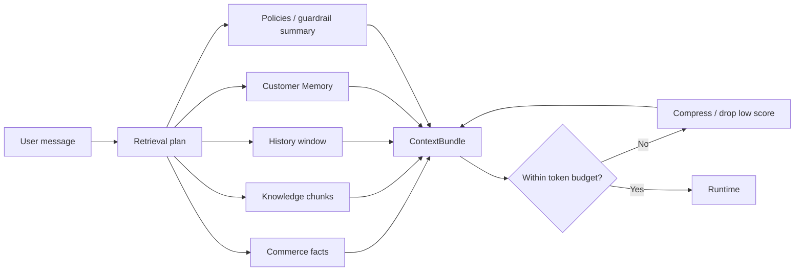

### Failure modes

| Failure | Behavior |
|---------|----------|
| Vector DB timeout | Fall back to keyword/FAQ exact match if available; else escalate |
| Commerce read failure | Mark section failed; Runtime fail-safe |
| Over-budget context | Drop lowest-relevance chunks first; keep hard facts (price/stock) |

### Scaling considerations

- Parallelize commerce + RAG + memory fetches with a single deadline budget (e.g. 200–400ms retrieval SLO target, tune in implementation).
- Cache hot product/policy snippets per tenant with short TTL keyed by sync version.
- Avoid embedding every turn when classifier/rules suffice (Cost Layer).

### Security considerations

- Tenant id on every retrieval; integration tests for cross-tenant leakage.
- Strip secrets and raw credential material from bundles.
- Minimize PII in bundled history when not required for the turn.

### Observability

`context.build` latency breakdown, chunk counts, cache hits, sync_health flags, token estimates, empty-retrieval rate.

### Related components

Commerce Core, Knowledge System, Memory, Conversation Engine, Runtime, Cost Optimization Layer, Audit Store.

---

# 9. Knowledge System

### Purpose

Store, index, and retrieve merchant Knowledge that sync alone cannot cover: FAQ/policy overrides, uploaded documents, and brand/policy text — with **source attribution** for Transparent AI.

### Responsibilities

1. CRUD for FAQ/policy overrides (Workspace).
2. Accept basic document uploads (PDF/text) to Object Storage.
3. Chunk, embed (via AI Gateway), and index into tenant-scoped Vector DB.
4. Serve RAG retrieval to Context Engine with citations.
5. Reindex on Knowledge updates (`knowledge.updated` events).
6. Support merchant corrections feeding evaluation / quality loops.

### Inputs

| Input | Source |
|-------|--------|
| FAQ / policy text | Merchant Workspace |
| Uploads | Merchant |
| Synced policy seeds | Commerce Core (optional seed) |
| Query text | Context Engine |

### Outputs

| Output | Consumer |
|--------|----------|
| Ranked chunks + source ids | Context Engine / Audit |
| Index health | Workspace |
| Events | `knowledge.updated`, `knowledge.reindex_failed` |

### RAG pipeline

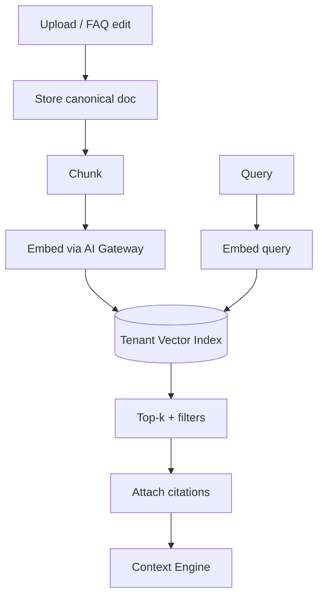

### Failure modes

| Failure | Behavior |
|---------|----------|
| Embed provider down | Queue reindex; serve last good index; alert |
| Corrupt upload | Reject with validation error |
| Empty retrieval | Runtime prefers escalate / “I don’t know” over inventing policy |

### Scaling considerations

- Batch embeddings; incremental indexing for FAQ edits.
- Per-tenant indexes or hard tenant filters — never shared undeclared corpora.
- Async reindex workers separate from interactive turns.

### Security considerations

- Malware scanning on uploads; size limits.
- Tenant isolation on vector filters and collection naming.
- Access control: only Workspace members of tenant can read/write KB.

### Observability

Index lag, embed queue depth, retrieval hit rate, citation coverage on grounded answers.

### Related components

AI Gateway (embeddings), Object Storage, Context Engine, Workspace KB UI, Event Bus, Runtime audit.

---

# 10. Conversation Engine

### Purpose

Own conversation threads as **commerce events** (not tickets): persistence, message ordering, AI vs human ownership, cross-channel continuity when identity is resolvable, and delivery orchestration to Channel Adapters.

### Responsibilities

1. Create/update Conversations and Messages with idempotent ingest.
2. Maintain ownership state: `ai_active` | `human_owned` | `paused`.
3. Resolve Customer Profile links across Website / Telegram / Bale when possible.
4. Provide history windows and summaries to Context Engine / Memory.
5. Route OutboundMessages to the correct adapter.
6. Emit lifecycle events: `conversation.started`, `conversation.message`, `conversation.escalated`, `conversation.ended`.

### Inputs

| Input | Source |
|-------|--------|
| Normalized inbound | Channel Adapters |
| Outbound from Runtime / Human | Runtime, Inbox APIs |
| Identity hints | Adapter (user ids), optional shopper auth |

### Outputs

| Output | Consumer |
|--------|----------|
| Persisted thread | Workspace Inbox, Analytics |
| Turn execution requests | Runtime |
| Delivery commands | Adapters |
| History / summary | Context / Memory |

### State machine (ownership)

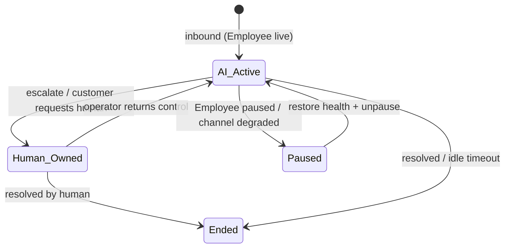

### Failure modes

| Failure | Behavior |
|---------|----------|
| Duplicate webhook | Idempotency key prevents double Runtime execution |
| Adapter delivery failure | Retry with backoff; mark message `delivery_failed`; alert |
| Identity collision risk | Prefer no merge over wrong merge; keep channel-local context |

### Scaling considerations

- Partition conversations by tenant_id.
- Hot conversation cache in Redis for active threads.
- Archive cold history per retention policy.

### Security considerations

- Authorization on inbox reads/writes.
- Encryption in transit; encryption at rest for message bodies.
- Retention and deletion aligned with privacy policy.

### Observability

Ingest lag, delivery success rate, handoff count, cross-channel link rate, idle conversation counts.

### Related components

Channel Adapters, Runtime, Human Handoff, Memory, Analytics, Workspace Inbox.

---

# 11. Channel Adapters

### Purpose

Translate between external channel APIs and DeloRey’s normalized Conversation model. **Adapters format and deliver; they do not own catalog truth, discount policy, or escalation rules.**

### MVP adapters

| Adapter | Responsibilities | Explicit non-goals |
|---------|------------------|--------------------|
| **Website Chat** | Widget session, page/cart context when available, handoff UI states, brand-basic styling | Theme designer, checkout owner |
| **Telegram** | Bot auth, webhooks/polling, text + product/link flows, escalation notify | Broadcast campaigns, Mini App storefront |
| **Bale** | Bot presence per API constraints; parity where possible | Channel-forked business logic |

### Responsibilities (all adapters)

1. Authenticate channel credentials (tenant-scoped).
2. Verify webhook signatures where applicable.
3. Normalize inbound → `NormalizedInboundMessage`.
4. Render outbound → channel-specific payload.
5. Report channel health (connected, degraded, disconnected).
6. Never implement Skills, pricing rules, or Knowledge forks.

### Inputs / Outputs

| Direction | Contract |
|-----------|----------|
| In | Channel webhook / widget POST |
| Out to platform | `NormalizedInboundMessage` |
| In from platform | `OutboundMessage` |
| Out to channel | Channel API send |

### Adapter isolation diagram

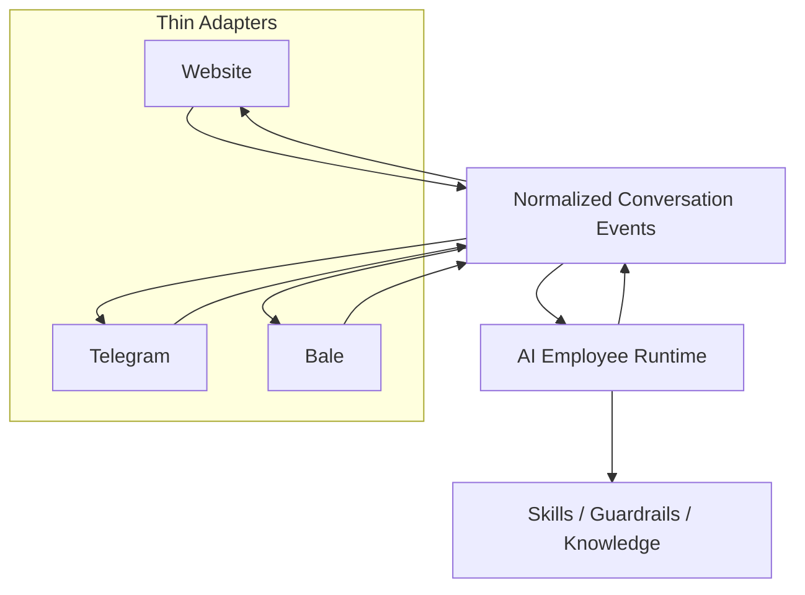

### Failure modes

| Failure | Behavior |
|---------|----------|
| Invalid token / webhook | Mark channel disconnected; Workspace recovery instructions |
| Partial API parity (Bale) | Feature-detect; degrade rich cards to links/text; same brain |
| Widget CSP / embed errors | Frontend diagnostics; no Runtime assumption of identity |

### Scaling considerations

- Independent horizontal scale for webhook ingress.
- Backpressure to Conversation Engine under flood.
- Per-channel rate limits respecting Telegram/Bale API quotas.

### Security considerations

- Verify signatures; reject replay outside skew window.
- Store bot tokens encrypted.
- Widget origin allowlists per merchant domain.

### Observability

Webhook success/fail, delivery latency, disconnect counts, quota errors.

### Related components

Conversation Engine, Runtime, Workspace channel setup, secrets manager.

---

# 12. Cost Optimization Layer

### Purpose

Make **token cost a first-class architectural concern**. Prefer deterministic and cheap paths before premium LLM calls while preserving Context Before Intelligence and fail-safe behavior.

### Responsibilities

1. **Semantic / response cache** for repeated FAQs within TTL and sync version.
2. **Intent classification** with small/cheap models or rules.
3. **Rule Engine** for deterministic answers (business hours message, exact FAQ id hit).
4. **Retrieval-first** — answer from Knowledge/Commerce tools without generative fluff when structured result suffices.
5. **Model routing** — cheap vs premium via AI Gateway.
6. **Prompt optimization** and **context compression** / conversation summaries.
7. **Smart Memory** selection (not full dump).
8. **Batch embeddings** and **incremental indexing** coordination with Knowledge.
9. **Token tracking** and **cost monitoring** per tenant/turn.
10. Skip unnecessary LLM calls when Skills return complete structured answers that only need light templating.

### Cost optimization flow

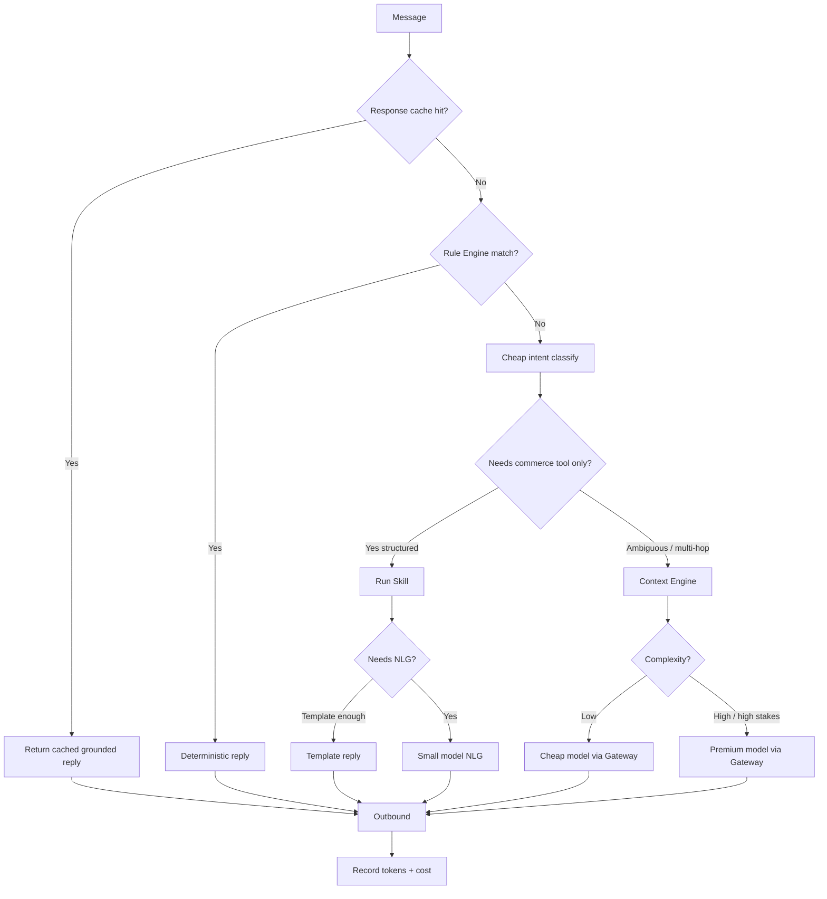

### Inputs / Outputs

| Inputs | Outputs |
|--------|---------|
| Message, tenant plan, sync version, prior embeddings | Cache decision, route plan, compressed context directives, cost ledger entries |

### Dependencies

AI Gateway, Redis cache, Rule/FAQ store, Context Engine, Runtime, metrics.

### Failure modes

| Failure | Behavior |
|---------|----------|
| Cache serves stale after catalog change | Cache keys include sync version / content hash; invalidate on `catalog.updated` / `knowledge.updated` |
| Classifier error | Prefer safer path (retrieve + escalate) over wrong deterministic answer |
| Over-aggressive cheap model | Quality gates / eval samples; route factual commerce to grounded tool path |

### Scaling considerations

- Cache sharded by tenant.
- Classifier model pool sized for bursty messaging.
- Cost budgets and hard caps per tenant plan (align with Pricing Strategy metering later).

### Security considerations

- Do not cache PII-heavy personalized replies across shoppers.
- Cache keys must include tenant_id.

### Observability

Cache hit rate, % turns with zero premium calls, cost/turn, cost/tenant/day, classifier distribution, compression ratio.

### Related components

AI Gateway, Runtime, Knowledge, Commerce Core (invalidation), Analytics / billing metering.

---

# 13. Event Architecture

### Purpose

Decouple sync, Knowledge indexing, conversation lifecycle, and analytics **where reliability and fan-out matter** — without turning the whole product into an event fashion project.

### Principles

- Events are facts that already happened (past tense names).
- Consumers are idempotent.
- Critical user turns are **request/response** on the Runtime path; events notify side effects.
- Not every DB write emits an event.

### MVP event catalog (illustrative)

| Event | When | Typical consumers |
|-------|------|-------------------|
| `tenant.provisioned` | Signup | Index bootstrap, default Employee |
| `store.connected` | OAuth success | Kickoff sync |
| `sync.succeeded` / `sync.failed` | Sync workers | Workspace health, Runtime gates |
| `catalog.updated` | Catalog ingest | Cache invalidation, search reindex |
| `order.updated` | Order sync/webhook | Optional notifications later |
| `knowledge.updated` | FAQ/upload | Reembed / reindex |
| `employee.updated` | Config change | Runtime config cache bust |
| `conversation.started` | First message | Analytics |
| `conversation.message` | Each message | Analytics, optional streams |
| `conversation.escalated` | Handoff | Inbox notify, metrics |
| `conversation.ended` | Close/idle | Attribution window |
| `conversion.attributed` | Conservative attribution | Revenue dashboard |

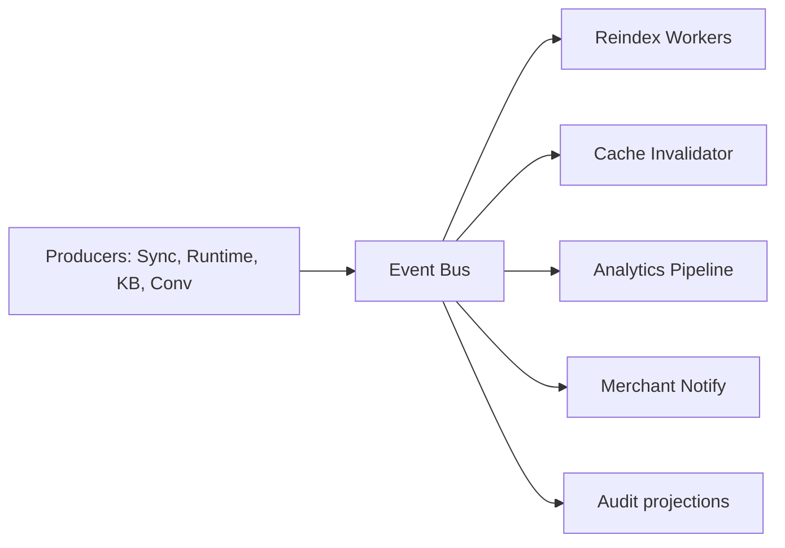

### Failure modes

At-least-once delivery → idempotent handlers. Dead-letter queue for poison messages. Replay tools for analytics rebuild (tenant-scoped).

### Security considerations

Events carry tenant_id; consumers must filter. No secrets in payloads. PII minimized.

### Related components

Queues, Analytics, Knowledge workers, Cost cache, Workspace notifications.

---

# 14. Data Architecture

### Logical stores

| Store | Role | Tenancy |
|-------|------|---------|
| **PostgreSQL** | System of record: tenants, users, employees, conversations, messages, commerce entities, audit metadata, attributions | `tenant_id` on all rows; RLS or equivalent enforcement |
| **Redis** | Sessions, rate limits, turn locks, caches, circuit breakers | Key prefix `t:{tenant_id}:` |
| **Vector DB** | Knowledge embeddings | Per-tenant collection or mandatory tenant filter |
| **Object Storage** | Uploads, export artifacts | Prefix `tenants/{id}/` |
| **Queue** | Sync, embed, notify | Tenant-aware jobs + isolation quotas |
| **Analytics store** | Aggregates / rollups (may start as Postgres + materialized views) | Tenant-scoped |

### Core entities (conceptual)

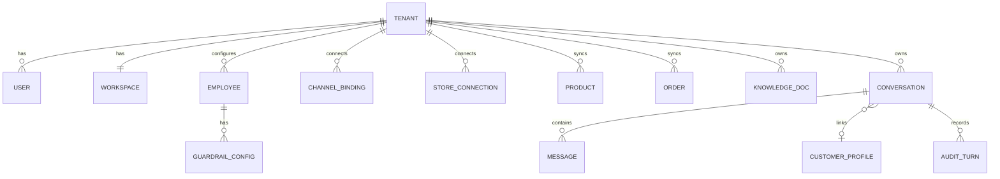

### Data flow — turn

Shopper message → Adapter → Conversation write → Runtime → Context reads (commerce/KB/memory) → Gateway → Message write → Adapter delivery → Events → Analytics.

### Retention

- Hot conversations: online store.
- Cold: archive per policy.
- Audit: longer retention for trust/dispute.
- Embeddings: rebuildable from canonical Knowledge.

### Related components

All data-plane services; Tenant Manager; Security Architecture.

---

# 15. Multi Tenant Strategy

### Purpose

Guarantee **hard isolation**. One cross-tenant incident ends trust. Runtime may be shared; data must not be.

### Isolation matrix

| Resource | Isolation mechanism |
|----------|---------------------|
| PostgreSQL | `tenant_id` mandatory; RLS or repository-enforced predicates; integration tests |
| Redis | Prefixed keys; no shared unscoped keys for merchant data |
| Vector DB | Tenant collection or filter + tests for leakage |
| Object Storage | Tenant prefix + IAM policies |
| Queues / Jobs | Tenant metadata required; worker validates before side effects |
| Logs / Traces | Tenant attribute on every span/log; access control on log queries |
| Analytics | Tenant-scoped aggregates only |
| Memory / History / Embeddings | Tenant-bound |
| Channel credentials | Per-tenant secrets |

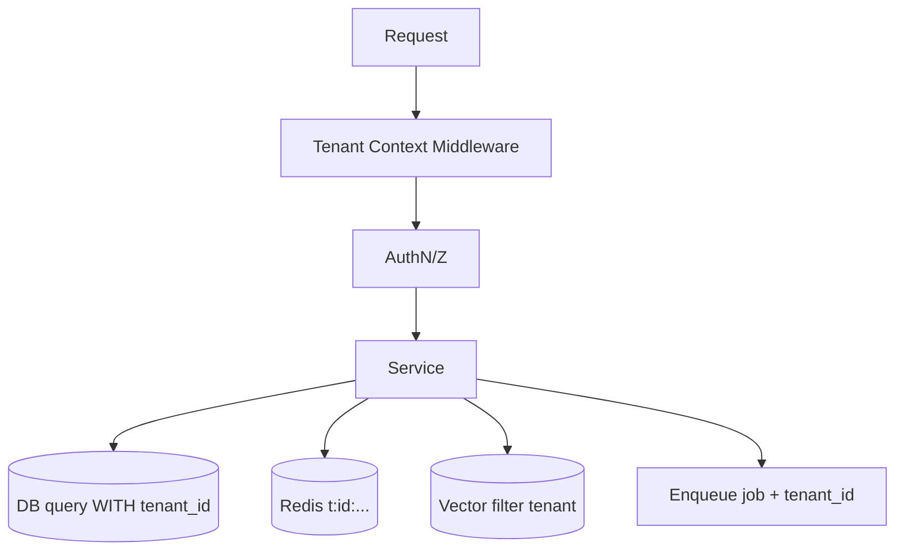

### Provisioning

On signup: create tenant, workspace, default Sales Employee skeleton (inactive until sync + channel), empty KB index namespace, quota defaults.

### Failure modes

Missing tenant context → **fail closed** (reject). Job without tenant → dead-letter + alert. Cache key without tenant → treat as bug.

### Security / testing

Mandatory automated cross-tenant isolation tests in CI. Chaos tests attempting IDOR across APIs.

### Related components

Auth, Tenant Manager, all stores, CI Testing Strategy.

---

# 16. Security Architecture

### Purpose

Protect merchant commerce data, shopper PII, and tool blast radius. Security is default, not an enterprise pack.

### Controls (MVP-oriented)

| Area | Requirement |
|------|-------------|
| **AuthN** | Merchant signup/login, secure sessions, password reset |
| **AuthZ** | Workspace-scoped permissions; least privilege |
| **Secrets** | Storefront and bot tokens in secrets manager / encrypted columns |
| **Transport** | TLS everywhere |
| **At rest** | Encrypt sensitive fields and storage buckets |
| **Tenant isolation** | See §15 |
| **Prompt safety** | Never place secrets in prompts; Guardrails for blocked topics |
| **Tool safety** | Scoped Skills; no unguarded refund/cancel in MVP |
| **PII** | Minimize in logs; redact; retention limits |
| **Webhook security** | Signature verification, replay protection |
| **Audit** | Immutable-ish audit trail of Employee actions |
| **Supply chain** | Dependency scanning, least privilege CI roles |

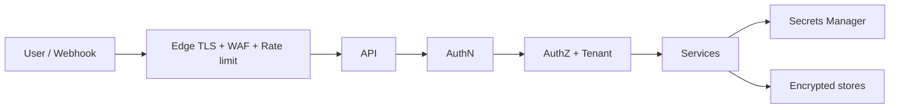

### Threat themes

| Threat | Mitigation |
|--------|------------|
| Cross-tenant data leak | Isolation tests, RLS, fail closed |
| Prompt injection → policy bypass | Guardrails hard stops; tool permission checks after model suggestions |
| Stolen bot token | Encrypted storage, rotation, health disconnect |
| Abuse / cost bomb | Per-tenant rate and budget limits |
| Insider access | Audit admin access; least privilege |

### Related components

Auth, Guardrails, AI Gateway, Adapters, Audit Store, DevOps.

---

# 17. Deployment Architecture

### Purpose

Run a multi-tenant cloud SaaS with separate control-plane and conversation data-plane scaling, suitable for Iran-first product truth with portable architecture (region choice is an ops decision, not a product fork).

### Reference deployment

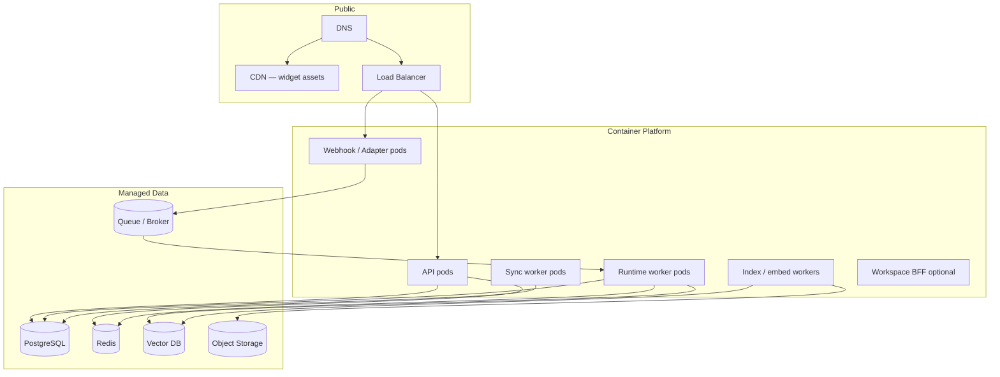

### Environments

| Env | Use |
|-----|-----|
| `dev` | Engineers |
| `staging` | Pre-prod, design-partner dry runs |
| `prod` | Paying / design-partner production |

### Deployment principles

- Immutable artifacts; progressive rollout.
- Separate deploy cadence for widget CDN vs API if needed.
- Config via environment + secret store; no secrets in images.
- Horizontal pod autoscaling on API, webhook, and Runtime workers independently.

### Related components

DevOps & Infrastructure doc (detail), Observability, DR.

---

# 18. Monitoring

### Purpose

Make Runtime, sync health, cost, and trust mechanics **visible**. Unmeasured systems violate *Measure Everything*.

### Pillars

| Pillar | What we watch |
|--------|----------------|
| **Metrics** | Latency, error rate, saturation; business: resolution, escalation, grounded rate, cost/turn |
| **Logs** | Structured JSON with tenant, conversation, decision |
| **Traces** | End-to-end turn: adapter → runtime → context → gateway → delivery |
| **Audits** | Merchant-visible Transparent AI trail |
| **Alerts** | Sync failed, Gateway down, isolation test fail, cost anomaly, error budget burn |

### Golden signals for conversation path

1. Ingest success rate  
2. Turn latency p95  
3. Delivery success rate  
4. Escalation rate (with reason breakdown)  
5. Grounded answer rate  
6. Cost per turn  
7. Sync lag  

### Merchant-visible vs internal

| Merchant Workspace | Internal ops |
|--------------------|--------------|
| Sync health, channel health, escalations, basic revenue metrics | Provider outages, queue depth, DB saturation, cost anomalies |

### Related components

Analytics, Audit, Event Bus, Runtime instrumentation.

---

# 19. Scaling Strategy

### Traffic shapes

- Bursty messaging (evening peaks, campaign spikes on merchant side).
- Sync storms after reconnect.
- Embed backlogs after bulk FAQ upload.

### Scale levers

| Component | Strategy |
|-----------|----------|
| API / Workspace | Horizontal pods; cache session/config |
| Adapters | Scale on webhook concurrency; respect external quotas |
| Runtime | Queue + worker autoscaling; per-tenant concurrency caps |
| Commerce sync | Tenant fair scheduling; backoff |
| Vector / embed | Async workers; batch |
| PostgreSQL | Indexes on tenant+time; read replicas for heavy read paths |
| Redis | Cluster if needed; careful memory TTLs |
| AI Gateway | Multi-provider; shed to cheap models under budget pressure |

### Backpressure

When Runtime queue depth exceeds threshold: slow ingest acknowledgements where safe, or return channel-appropriate “busy / slight delay” without inventing answers; never drop silently without operator visibility.

### Related components

Deployment, Cost Layer, Queues, Monitoring.

---

# 20. Disaster Recovery

### Objectives (targets to refine with DevOps)

| Objective | Initial posture |
|-----------|-----------------|
| **RPO** | Minutes for Postgres (continuous backup / PITR); rebuildable indexes for vectors |
| **RTO** | Prioritize control plane + conversation accept path; degrade AI generation via failover; sync can lag |

### Strategies

1. Automated Postgres backups + tested restore.
2. Multi-AZ for stateful managed services where available.
3. Redis: treat as ephemeral; rebuild caches.
4. Vector DB: reindex from canonical Knowledge/commerce text if corrupted.
5. Object Storage versioning for uploads.
6. Provider failover in AI Gateway.
7. Runbooks: region outage, provider outage, poison queue, credential leak rotation.

### Fail-safe product behavior during DR

Prefer Human Handoff and honest degradation over autonomous wrong commerce facts. Sync health must remain visible.

### Related components

DevOps, Security, Runtime fail-safe, Monitoring.

---

# 21. Future Evolution

Architecture must allow growth **without rewriting identity**. Expansion follows Product Scope layers.

| Horizon | Architectural readiness (without building early) |
|---------|--------------------------------------------------|
| **V1 / Beta** | Stronger attribution, billing metering hooks, inbox assignment — same Runtime |
| **Growth** | New Channel Adapters (WhatsApp, Instagram, email) only; Support Employee as config+Skills; cart recovery as guarded Automation — still one brain |
| **Platform** | Public versioned APIs, webhooks, certified connectors; multi-Employee orchestration under guardrails — not a generic agent IDE |
| **Providers** | Self-hosted / regional models via Gateway plugins |
| **Data** | Richer Commerce Context Graph edges from conversation outcomes (moat) |

### Evolution rules

1. New channels = new adapters, zero business-rule forks.  
2. New Employees = goals + Skills + metrics, same Runtime.  
3. Automations only after core quality — subordinate to Employee outcomes.  
4. Marketplace / third-party Skills only after first-party Skills are stable and reviewed.  
5. Never open visual flow builder as the extensibility story.

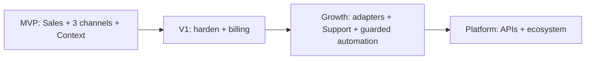

---

# Request Lifecycle (end-to-end)

### Merchant configuration path

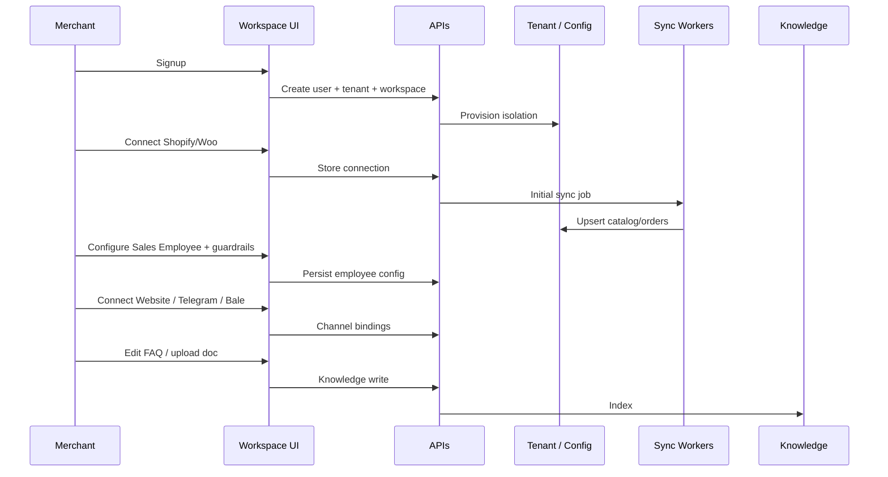

### Shopper message path (happy path)

See §5 sequence diagram. Summary:

**Adapter → Conversation Engine → Cost Layer → Context Engine → Skills → Guardrails → AI Gateway → Audit → Adapter.**

### Escalation path

```mermaid
sequenceDiagram
    participant RT as Runtime
    participant HH as Handoff
    participant IN as Inbox API
    participant OP as Operator
    participant AD as Adapter

    RT->>HH: Escalate(reason, context packet)
    HH->>IN: Create/open inbox item; pause AI
    IN->>OP: Notify
    OP->>IN: Reply
    IN->>AD: Deliver human message
    OP->>IN: Return to AI
    IN->>RT: Resume with memory
```

---

# Component Contract Template (summary table)

For implementation tickets, every service must document the fields used throughout this doc:

| Field | Meaning |
|-------|---------|
| Purpose | Why it exists in an AI Commerce Platform |
| Responsibilities | What it does |
| Inputs / Outputs | Contracts |
| Dependencies | Upstream/downstream |
| Failure Modes | Fail-safe behavior |
| Scaling | How it grows |
| Security | Isolation and abuse |
| Observability | Metrics/traces/logs |
| Related Components | Graph neighbors |

---

# Implementation Guidance for Teams

### Backend

- Start from tenant model, Commerce Core sync, Conversation ingest, and Runtime turn executor.
- Enforce tenant_id in repository layer; add isolation tests before channel polish.
- Keep adapters thin.

### Frontend

- Workspace optimizes operator jobs: sync health, inbox/handoff, KB edit, Employee settings, basic dashboard.
- Widget is a client of Conversation APIs; no business rules in the browser beyond UX.

### AI

- Invest in Context Engine + evaluation of groundedness; Gateway routing and cost layer early.
- Skills over prompt sprawl.

### DevOps

- Observability and backup/restore before fancy multi-region.
- Fair scheduling for sync/embed vs interactive turns.

---

# Summary

DeloRey AI’s system architecture is an **AI-first, context-first, multi-tenant Commerce Runtime** with thin Channel Adapters (Website, Telegram, Bale), a provider-agnostic **AI Gateway**, a **Cost Optimization Layer**, and merchant control via **Guardrails, Human Handoff, Audit, and Workspace**.

**Build:** Runtime, Context, Commerce Core, Knowledge/RAG, Conversation Engine, Adapters, Gateway, tenancy, events where valuable, measurement.  
**Do not build:** Chatbot builders, CRM/helpdesk cores, channel-forked logic, or autonomy that skips context and humans.

Downstream design docs deepen each component without changing this system shape — [AI Runtime Architecture](./ai-runtime-architecture.md), [Domain-Driven Design](./domain-driven-design.md), [Database Design](./database-design.md), [Backend Architecture](./backend-architecture.md), [Frontend Architecture](./frontend-architecture.md), [AI Gateway Design](./ai-gateway-design.md), [Context Engine Design](./context-engine-design.md), [Knowledge & RAG Design](./knowledge-rag-design.md), [Conversation Engine Design](./conversation-engine-design.md); then API Specification, Security, DevOps, Testing, etc.

---

*System Architecture v0.1. Changes require version bump and written rationale. Product Scope and Product Principles override architectural enthusiasm when they conflict.*
