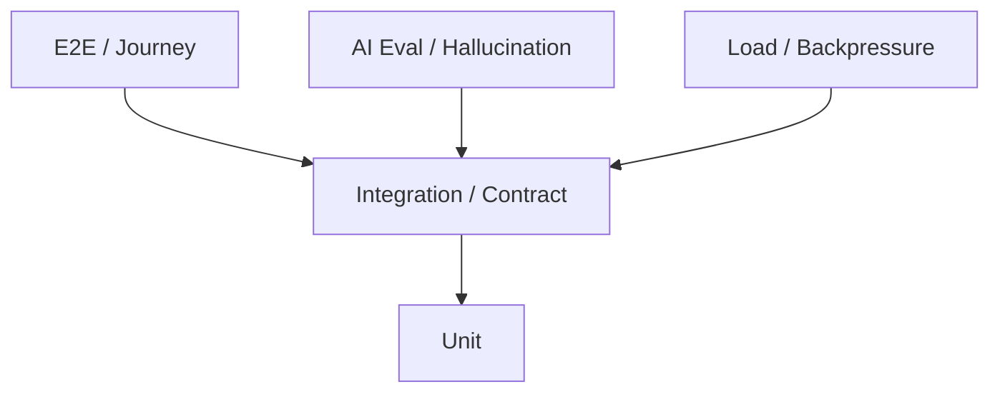
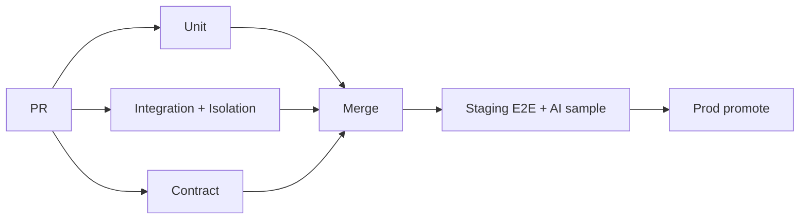

# Testing Strategy

## Metadata

| Field | Value |
|-------|-------|
| **Version** | 0.1 |
| **Status** | Active — quality gates for DeloRey AI MVP |
| **Owner** | Founder / QA / Backend / AI Platform / Frontend |
| **Last Updated** | July 25, 2026 |
| **Parent Documents** | [System Architecture](./system-architecture.md) · [Product Scope](../02-product/product-scope.md) · [Roadmap](../00-overview/roadmap.md) · [DevOps & Infrastructure](./devops-infrastructure.md) · [Security Architecture](./security-architecture.md) |
| **Related Documents** | [AI Runtime Architecture](./ai-runtime-architecture.md) · [Context Engine Design](./context-engine-design.md) · [Knowledge & RAG Design](./knowledge-rag-design.md) · [Conversation Engine Design](./conversation-engine-design.md) · [API Specification](./api-specification.md) · [Backend Architecture](./backend-architecture.md) · [Frontend Architecture](./frontend-architecture.md) · [AI Gateway Design](./ai-gateway-design.md) · [Product Principles](../02-product/product-principles.md) · [User Journey](../02-product/user-journey.md) |

**Audience:** QA, Backend, AI Platform, Frontend, DevOps (CI), anyone signing MVP exit.

**Authority:** Testing proves Product Scope exit criteria and architecture invariants. It does not invent OUT-OF-MVP features to “make tests interesting.” Wrong price/stock/policy is a **P0/P1 product bug**, not a model vibe issue ([Product Principles](../02-product/product-principles.md); [Product Scope](../02-product/product-scope.md)).

If conflict:

```
Product Scope exit criteria / Roadmap Phase 1 metrics
    ↓
Product Principles (Fail safe, Tenant Isolation, Transparent AI)
    ↓
Architecture test obligations
    ↓
This document
```

---

# 1. Purpose

Ensure DeloRey ships as a **grounded AI Commerce Platform**, not a fluent chatbot:

1. **Tenant isolation** verified in acceptance  
2. **Context Before Intelligence** and sync-health fail-safe  
3. **Idempotent** conversation ingest  
4. **Guardrails + handoff** trust mechanics  
5. **AI evaluation**: accuracy ≥ 90%, hallucination &lt; 5% on factual commerce (MVP bars)  
6. **Load/backpressure** without silent drops  
7. Journey path: store → Employee → channel → grounded conversation  

---

# 2. Quality Bars (MVP)

From [Product Scope](../02-product/product-scope.md) exit criteria and [Roadmap](../00-overview/roadmap.md) Phase 1:

| Bar | Target |
|-----|--------|
| Time to first live grounded conversation | &lt; 24 hours (standard path) |
| Resolution (routine product/policy) | ≥ 50% without human escalation |
| Factual accuracy (audited sample) | ≥ 90% on product/policy |
| Hallucination rate (factual commerce) | &lt; 5%; price/stock/policy wrong → P0/P1 |
| Tenant Isolation | Verified in acceptance tests |
| Stability | Core integrations ≥ 2 weeks without critical incidents |
| Attribution (design partners) | ≥ 1 conservative attributed conversion/recovery within 14 days where methodology allows |

**Non-exit:** “UI looks good,” “model sounds smart without store sync,” “we almost finished WhatsApp.”

V1/Beta raises bars later (e.g. resolution ≥ 60%, accuracy ≥ 93%) — same test harness, stricter thresholds.

---

# 3. Test Pyramid



| Layer | Owns | CI gate? |
|-------|------|----------|
| **Unit** | Pure domain logic | Yes — every PR |
| **Integration** | DB, queues, isolation, webhooks, sync upsert | Yes — every PR / main |
| **Contract** | API + adapter + Gateway plugin shapes | Yes |
| **E2E** | Critical merchant + widget journeys | Staging / pre-release |
| **AI Evaluation** | Groundedness, hallucination, escalation appropriateness | Scheduled + pre-release; sample in CI if cheap |
| **Load** | Queue depth, fair tenant scheduling, backpressure | Staging drills |
| **Security / Isolation** | Cross-tenant IDOR, secrets scrub | **Mandatory CI ship gate** |
| **DR restore** | Postgres backup restore | Periodic ops drill |

**Rule:** Isolation tests **before** channel polish ([System Architecture](./system-architecture.md) Backend guidance).

---

# 4. Unit Tests

| Area | Must cover |
|------|------------|
| Guardrails | Hard stops: blocked topics, discount cap, restricted mutations |
| Ownership transitions | `ai_active` ↔ `human_owned` ↔ `paused` ↔ `ended` |
| Cost route decisions | Cache/rule/template vs need LLM; cheap vs premium hint |
| Retrieval plan heuristics | Which Context sections for product vs policy vs order |
| Budget trim | Drop low-score chunks; **keep price/stock** |
| Gateway error mapping | Vendor errors → typed `timeout` / `rate_limit` / `content_filter` / `unavailable` |
| Idempotency key logic | Duplicate detection |

No provider SDKs in unit tests of Skills/Runtime — mock AI Gateway ([AI Gateway Design](./ai-gateway-design.md)).

---

# 5. Integration Tests

| Suite | Intent |
|-------|--------|
| **Tenant isolation** | Tenant A never reads Tenant B products, messages, vectors, Redis keys, objects |
| **IDOR chaos** | Guess UUIDs across tenants → 403/404 |
| **Webhook idempotency** | Same delivery → one message + one ExecuteTurn |
| **Sync upsert** | Idempotent by `(tenant, connection, external_id)` |
| **Sync health gate** | Unhealthy sync → Context commerce not `ok`; Runtime refuse confident facts |
| **Handoff resume** | Return to AI keeps history; no amnesia |
| **Knowledge reindex** | FAQ edit → searchable; provider down → last good index + `failed` status |
| **Vector leakage** | Mandatory filter/collection tests |
| **Upload reject** | Corrupt/malware path rejected |
| **Secrets scrub** | Logs, prompts, audit fixtures contain no tokens |
| **Tool scope** | Model-requested refund/cancel blocked in MVP |
| **Turn lock** | Concurrent jobs do not double-reply |
| **Outbox/events** | Idempotent consumers |

---

# 6. Contract Tests

| Contract | Check |
|----------|-------|
| [API Specification](./api-specification.md) | Handlers expose MVP resources; secrets never in GET channel/store |
| Widget origin | Bad origin → reject session |
| Adapter normalize/deliver | Thin adapters; no Skill forks |
| Gateway plugin interface | Maps to neutral Complete/Embed + typed errors |
| `ContextBundle` shape | Sections + sync flags + citations |
| `NormalizedInboundMessage` / `OutboundMessage` / `HandoffRequest` | Conversation Engine contracts |

---

# 7. E2E / Journey Tests

Map to [User Journey](../02-product/user-journey.md) stages 2–11 and [Frontend Architecture](./frontend-architecture.md):

| Journey | Assertions |
|---------|------------|
| Signup → Workspace | Tenant provisioned; checklist visible |
| Connect store | Pass/fail honest; not silent connected |
| Sync health | Stale/failed visible; retry path |
| Configure Employee + guardrails | Persisted; enforced (not decorative) |
| Connect Website (+ Telegram/Bale smoke) | Health + embed snippet |
| Test conversation | Grounded product/policy path; sources inspectable |
| Handoff | Takeover → human reply → return to AI with memory |
| Knowledge edit | Status indexing→active; improved answer on retest |
| Dashboard | Metrics endpoints return; no fake-precision requirement |

Widget E2E: boot → send message → receive reply → handoff/offline state.

A11y smoke: keyboard inbox, readable AI state ([Frontend Architecture](./frontend-architecture.md)).

---

# 8. AI Evaluation & Hallucination Tests

Runtime must expose **audit refs, decision, sources** for eval ([AI Runtime Architecture](./ai-runtime-architecture.md)).

### Eval sets (MVP)

| Set | Content | Pass criteria |
|-----|---------|---------------|
| **Product facts** | Stock, price, variant, availability against fixture catalog | ≥ 90% factual accuracy; no invented SKU/price/stock |
| **Policy / FAQ** | Shipping, returns, COD from Knowledge fixtures | Grounded in citations; empty KB → “I don’t know” / escalate — not invented policy |
| **Order status** | Known order ids | Correct status; no unguarded mutation |
| **Sync stale** | Unhealthy sync + factual ask | Refuse confident facts; escalate/safe refusal |
| **Escalation appropriateness** | Low confidence / blocked / customer requests human / refund | Handoff; handoff **not** disabled |
| **Recommendation** | Purchase intent | Inventory/price-aware; no out-of-stock push |
| **Cross-tenant** | Queries must never retrieve other tenant Knowledge | Zero leakage |
| **Cost path** | Repeated FAQ | Cache/rule may skip premium; still grounded |

### Hallucination definition (product)

A **hallucination incident** on factual commerce = confident wrong **price, stock, or policy** (or invented SKU). Rate on audited sample must be **&lt; 5%** for MVP exit; incidents are P0/P1.

### Methodology

1. Fixed fixture tenant(s) with known Commerce + Knowledge.  
2. Scripted messages (Persian-quality bar for Iran MVP).  
3. Score: grounded / refuse / escalate / hallucinate / wrong-but-unguarded.  
4. Compare audit `context_refs` + tool calls to expected sources (Transparent AI).  
5. Shadow eval of new models via Gateway **without** changing Runtime code ([AI Gateway Design](./ai-gateway-design.md)) — shadow not shown to shoppers.

### What eval must not do

- Optimize for fluent tone over factual bars  
- Disable handoff to inflate resolution  
- Count ungrounded “smart” answers as accuracy  

---

# 9. Load & Backpressure Tests

| Scenario | Expectation |
|----------|-------------|
| Burst inbound webhooks | Ingest success; idempotent; scale webhook/runtime |
| Sync storm | `batch.sync` fair schedule; interactive turns not starved |
| Bulk KB upload | `batch.embed` backlog; interactive SLO protected |
| Interactive queue overload | Slow acks / busy message; **never silent drop** |
| Per-tenant flood | Concurrency caps; other tenants serve |
| Gateway rate limit | Backoff/failover; typed errors → fail-safe |

Measure golden signals: ingest success, turn latency p95, delivery success, queue depth ([DevOps & Infrastructure](./devops-infrastructure.md)).

---

# 10. Security Test Suite (ship gate)

From [Security Architecture](./security-architecture.md):

| Test | Intent |
|------|--------|
| Cross-tenant read/write | Fail closed |
| IDOR chaos | |
| Webhook unsigned / bad signature | Reject |
| Replay outside skew | Reject |
| Widget bad origin | Reject |
| Secrets in logs/prompts/audit | None |
| Guardrail + tool scope | Refund blocked |
| Gateway unbounded calls | Rate/budget limited |
| Upload malware/corrupt | Rejected |

---

# 11. DR / Ops Drills

| Drill | Cadence |
|-------|---------|
| Postgres backup **restore** | Periodic; prove RPO posture |
| Vector reindex from canonical | After corruption simulation |
| Provider all-down | Runtime escalate path + alert |
| Poison queue | DLQ + recovery runbook |
| Credential rotation | Channel disconnect + reconnect |

Not every PR — ops calendar. Evidence kept for stability exit criterion.

---

# 12. CI Pipeline Placement



| Gate | Blocks merge? | Blocks prod? |
|------|---------------|--------------|
| Unit + isolation + contract | Yes | Yes |
| Dependency scan | Yes (policy) | Yes |
| Full AI eval suite | Soft on PR if slow; **hard** pre-release | Yes for MVP exit claim |
| Load | Staging | Before declaring scale-ready |
| E2E critical path | Staging | Yes |

---

# 13. Traceability: Architecture → Tests

| Document obligation | Test layer |
|---------------------|------------|
| System Architecture isolation | Integration + Security |
| Runtime acceptance (stock/price, stale sync, handoff, idempotent, isolation) | Integration + AI Eval + E2E |
| Context Engine testing table | Integration + Unit |
| Knowledge testing table | Integration |
| Conversation testing table | Integration + E2E |
| API contract testing | Contract |
| Frontend E2E / a11y | E2E |
| Gateway plugin / failover | Unit + Integration |
| DevOps golden signals | Load + Monitoring checks |
| Product Scope tenancy acceptance | Integration + E2E sign-off |

---

# 14. Roles

| Role | Responsibility |
|------|----------------|
| Backend | Isolation, sync, conversation, API contracts |
| AI Platform | Eval sets, groundedness scoring, shadow harness |
| Frontend | Journey E2E, widget, a11y smoke |
| DevOps | CI gates, load env, restore drills |
| QA / Founder | MVP exit sign-off against Scope bars |

Incomplete PRDs without principle checklist / kill criteria do not enter engineering ([Product Principles](../02-product/product-principles.md)) — tests for features outside Scope are rejected, not “nice to have.”

---

# 15. Explicit Non-Goals

| Non-goal | Why |
|----------|-----|
| Testing Instagram/WhatsApp flows in MVP | OUT OF MVP |
| Perfect causal attribution science tests | Directional honesty first |
| Visual flow builder test suites | Forbidden product |
| Vanity “messages sent” as primary quality metric | Grounded accuracy + revenue signals |
| Skipping isolation to ship a demo channel | Company-ending risk |

---

# 16. MVP Exit Test Evidence Pack

Before claiming MVP done, archive:

1. Isolation CI green (link/run ids)  
2. AI eval report: accuracy ≥ 90%, hallucination &lt; 5% on factual set  
3. E2E recording/notes: &lt; 24h path on staging/prod-like  
4. Handoff + return-to-AI proof  
5. Stale-sync refuse proof  
6. Sync + channel stability window (≥ 2 weeks without critical incidents)  
7. Dashboard metrics live; attribution methodology note  

---

# 17. Related Documents

| Document | Relationship |
|----------|--------------|
| [Product Scope](../02-product/product-scope.md) | Exit bars |
| [Roadmap](../00-overview/roadmap.md) | Phase metrics |
| [DevOps & Infrastructure](./devops-infrastructure.md) | CI/CD, load, DR |
| [Security Architecture](./security-architecture.md) | Ship-gate security tests |
| All component designs | Per-module Testing Obligations |
| Feature PRDs (next) | Per-feature acceptance criteria |

---

# Summary

DeloRey testing is a **ship gate system**: mandatory tenant isolation, sync-aware fail-safe, idempotent conversations, guardrailed tools, journey E2E, load without silent drops, and **AI eval that scores grounded commerce truth** — accuracy ≥ 90% and hallucination &lt; 5% on factual questions for MVP. Fluent wrong answers fail the suite even if the UI demos well.

---

*Testing Strategy v0.1. Changes require version bump and written rationale. Product Scope exit criteria and architecture invariants override testing enthusiasm when they conflict.*
