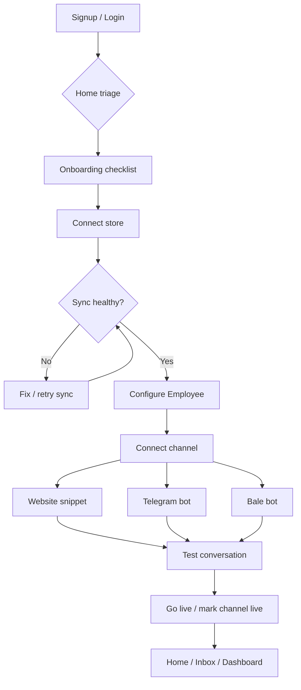
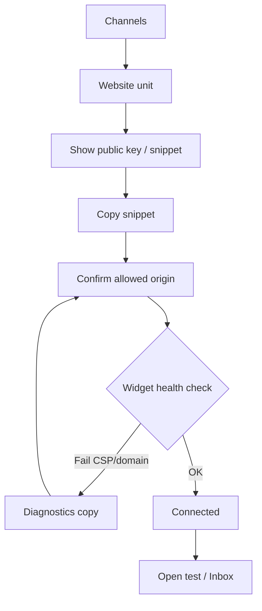
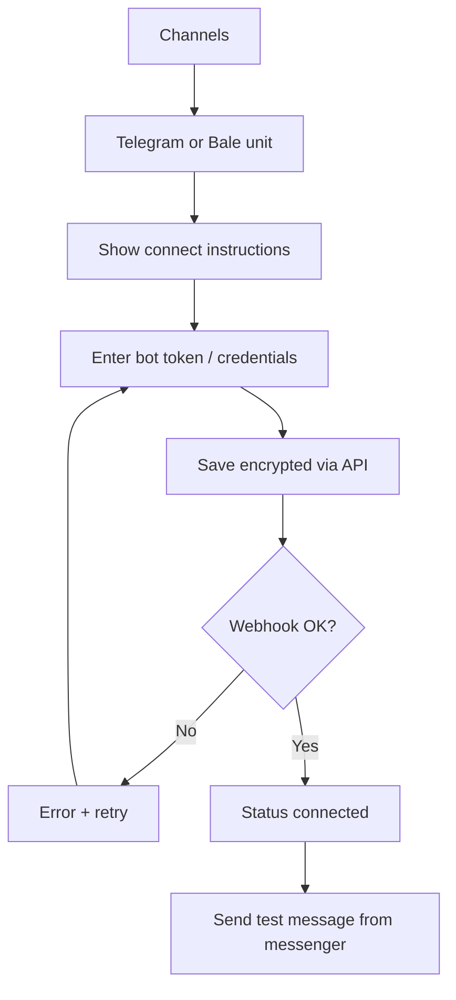
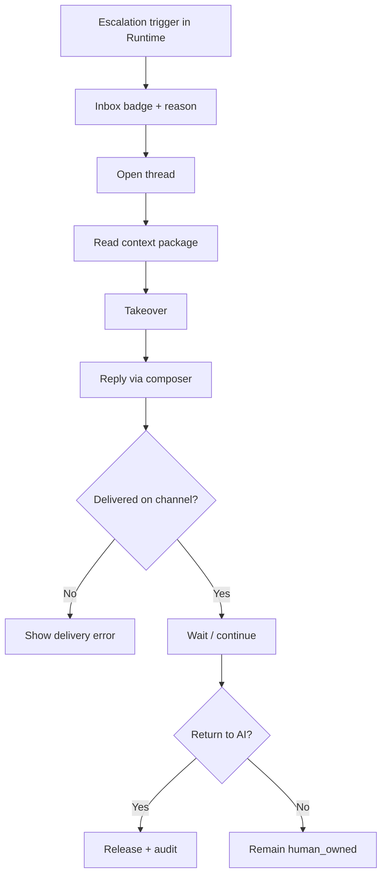
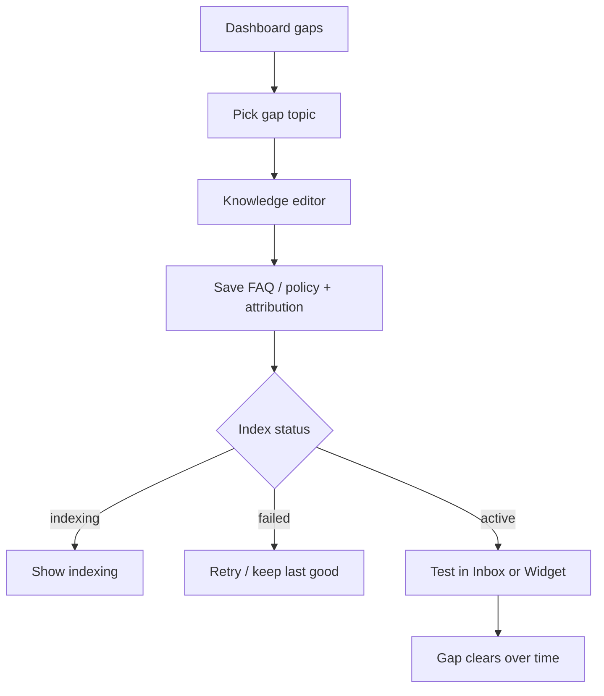
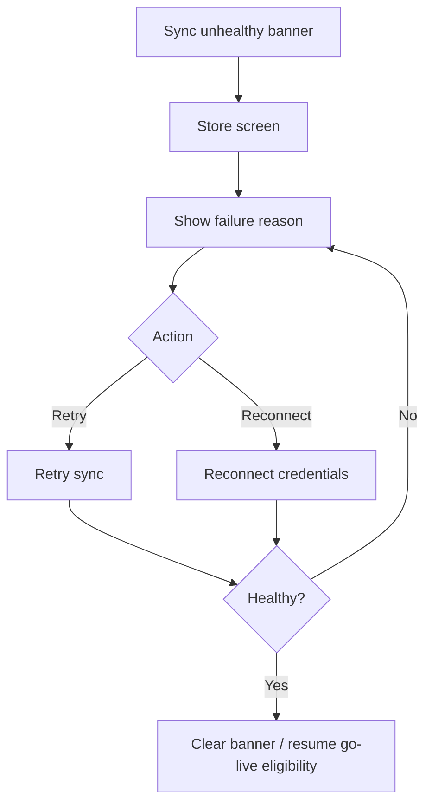
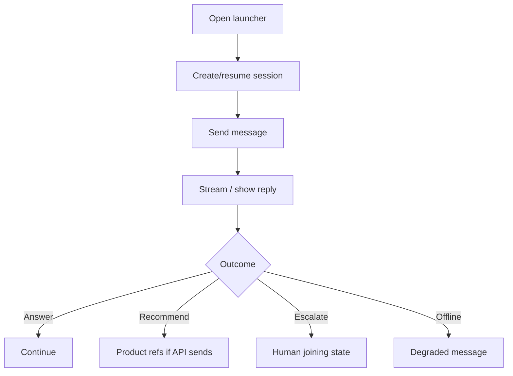

# UX Flows

## Metadata

| Field | Value |
|-------|-------|
| **Version** | 0.1 |
| **Status** | Active — MVP merchant & operator flows |
| **Last Updated** | July 25, 2026 |
| **Parent** | [User Journey](../02-product/user-journey.md) · [Information Architecture](./information-architecture.md) |
| **Related** | [Workspace Screens](./workspace-screens.md) · [Widget UX](./widget-ux.md) |

**Job:** Screen-level sequencing for critical paths. PRDs own requirements; these flows own taps and branches.

---

# 1. Happy path — Signup → first live grounded chat

Target: under 24 hours on standard path; UI should feel completable in one sitting when credentials ready.

**UI rules:**

- Checklist items link to the owning screen; status comes from API (not optimistic lies).  
- Do not nudge “Go live” while sync unhealthy or zero channels connected ([PRD-006](../04-prd/ai-sales-employee.md)).  
- After first successful test, Home primary CTA shifts away from onboarding.

---

# 2. Connect Website Chat

---

# 3. Connect Telegram / Bale

---

# 4. Human handoff (operator)

**UI rules:** Takeover is explicit; AI must not keep replying on `human_owned`. Release is intentional + audited ([PRD-011](../04-prd/human-handoff.md), [PRD-012](../04-prd/workspace-inbox.md)).

---

# 5. Knowledge gap → fix → verify

Never pretend upload = instantly learned.

---

# 6. Sync failure recovery

---

# 7. Shopper Widget session (summary)

Detail: [Widget UX](./widget-ux.md).

---

# 8. Flow non-goals

- Visual workflow builder between stages  
- Multi-brand workspace switcher  
- Ticket status Kanban as primary ops flow  
- Forced CRM contact merge UI
