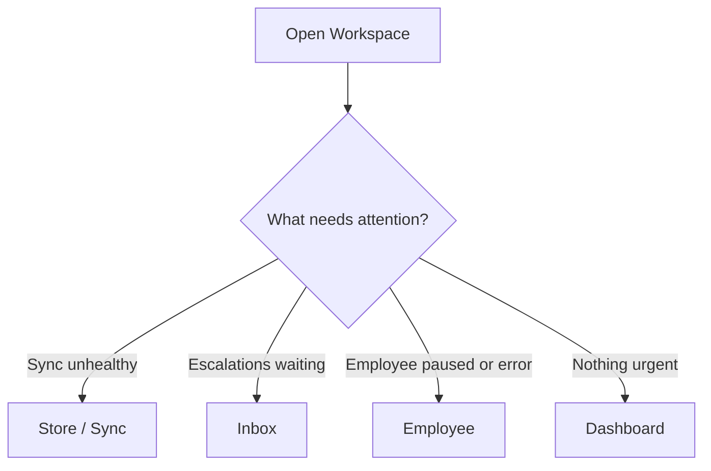

# UX Foundation

## Metadata

| Field | Value |
|-------|-------|
| **Version** | 0.1 |
| **Status** | Active — interaction patterns for MVP Workspace + Widget |
| **Last Updated** | July 25, 2026 |
| **Parent** | [Product Principles — UX](../02-product/product-principles.md) · [Frontend Architecture](../03-architecture/frontend-architecture.md) |
| **Related** | [Design System](./design-system.md) · [Copy & Tone](./copy-tone.md) · [User Journey](../02-product/user-journey.md) |

**Audience:** Design, Frontend, Product, QA.

**Job:** Translate UX Principles into reusable patterns. Screens implement these; they do not invent competing patterns.

---

# 1. Doctrine (recap)

| Principle | UI rule |
|-----------|---------|
| Low cognitive load | One primary job per screen |
| Few clicks | Shortest honest path for escalate, edit FAQ, enable channel |
| Fast onboarding | Checklist: store → sync → Employee → channel → test |
| Clear AI state | Always visible in shell + relevant screens |
| Explain AI actions | Why recommend / escalate / refuse — merchant language |
| Never hide uncertainty | Low confidence, missing Knowledge, sync risk visible |
| Progressive disclosure | Advanced (API keys, raw audit) behind clear entry |
| Responsive + accessible | Phone-usable ops; keyboard; contrast; labels |

Anti-goals: confident uncertainty · hide handoff · IDE-for-SMB · card-soup dashboards.

---

# 2. AI Employee states

Canonical states (ubiquitous language — not “bot online”):

| State | Meaning | Visual (see Design System) | Merchant action |
|-------|---------|----------------------------|-----------------|
| `inactive` | Not ready / not hired path complete | Neutral muted | Continue onboarding |
| `active` | Answering on connected channels | Success / calm positive | Monitor Inbox |
| `paused` | Intentionally stopped | Warning | Resume when ready |
| `syncing` | Catalog/knowledge index in progress | Info / progress | Wait or open Store/KB |
| `degraded` | Channel or sync unhealthy; answers may refuse | Danger / attention | Fix Store or Channel |
| `awaiting_human` | Escalated; AI paused on thread | Attention + Inbox badge | Take over |

**Rule:** Global shell shows Employee-level state; Inbox thread shows conversation ownership (`ai_owned` | `human_owned`).

---

# 3. Uncertainty & refusal patterns

| Situation | UI must | UI must not |
|-----------|---------|-------------|
| Low confidence | Show “نیاز به بررسی” / escalate path | Fake certainty badge |
| Missing Knowledge | Link to Knowledge gap / escalate | Invent policy copy in Workspace preview |
| Sync unhealthy + factual domain | Banner: cannot trust price/stock | Green “all good” |
| Guardrail block | Explain block reason | Silent no-op |

Shopper-facing (Widget): prefer calm “الان مطمئن نیستم؛ همکار انسانی کمک می‌کند” over fluent wrong facts ([Copy & Tone](./copy-tone.md)).

---

# 4. Handoff pattern

```
Trigger → AI pauses on thread → Inbox badge + reason
    → Operator opens context package
    → Takeover → reply
    → Optional release to AI (audited)
```

**Context package (always visible on escalated thread):**

- Reason code (customer ask / blocked topic / low confidence / over-cap / sync risk / Skill escalate)  
- Last messages  
- Intent / cart summary if known  
- Last Skill results + citations  
- Channel + timestamps  

Never remove handoff to inflate automation metrics.

---

# 5. Empty, loading, error

| Kind | Pattern |
|------|---------|
| **Empty** | One sentence + one CTA (e.g. empty Inbox: “هنوز گفتگویی نیست” → Test chat / Channels) |
| **Loading** | Skeleton or inline spinner; keep layout stable |
| **Error** | What failed + why (if known) + Retry / Reconnect; link to Journey failure recovery |
| **Partial** | Section status (`ok` / `stale` / `failed`) — e.g. Dashboard with missing GMV says so |

Silent failure is a defect ([Frontend Architecture](../03-architecture/frontend-architecture.md)).

---

# 6. Attention triage (Home)

When merchant opens Workspace:



Home surfaces **at most one primary CTA** for the highest-priority issue; secondary links stay quiet.

---

# 7. Progressive disclosure

| Surface | Default | Advanced (explicit) |
|---------|---------|---------------------|
| Employee | Name, tone, language, Skills toggles, key guardrails | Raw prompt / provider details — **out of MVP product UI** |
| Channels | Connect + health + snippet | CSP/domain diagnostics |
| Audit | Turn summary + citations refs | Full sensitive fields — RBAC |
| Dashboard | Volume, resolution, escalations, gaps | Custom report builder — **OUT** |

---

# 8. RTL & Persian

| Rule | Detail |
|------|--------|
| Direction | Workspace and Widget support `dir="rtl"` for Persian |
| Numbers | Prefer locale-aware formatting; keep SKUs/IDs LTR isolates when needed |
| Density | Comfortable tap targets on mobile (≥44px interactive) |
| Quality bar | Persian merchant copy is MVP quality criteria — not placeholder English |

---

# 9. Accessibility minimum

- Focus visible on all interactive controls  
- AI state and alerts not color-only (icon + text)  
- Inbox operable by keyboard (list → thread → composer)  
- Meaningful labels on connect forms and Skill toggles  
- Contrast meet readable Workspace bar (Design System)

---

# 10. Surfaces in scope

| Surface | Patterns apply |
|---------|----------------|
| Workspace web | Full foundation |
| Website Widget | States, uncertainty, handoff, a11y subset |
| Telegram / Bale | No custom app UI — connection + Inbox threads only |

---

# 11. Anti-pattern checklist (design review)

- [ ] Does every AI-touching screen show state or ownership?  
- [ ] Is uncertainty visible on failure paths?  
- [ ] Is handoff one click from escalation badge?  
- [ ] Does empty state teach the next Journey step?  
- [ ] Would removing chrome still leave one clear job?
